# Collection、Map等

## 集合

集合主要作用为保存多个数据，之前常用数组，但是数组长度指定不能更改，只能保存一种类型数据，使用数组进行增加元素的示意编码很麻烦。了解集合原理最重要的就是**写一节代码然后看源码**。Set部分，LinkedHashSet底层为LinkedHashMap。

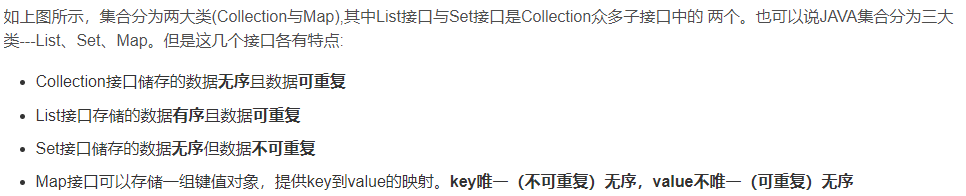

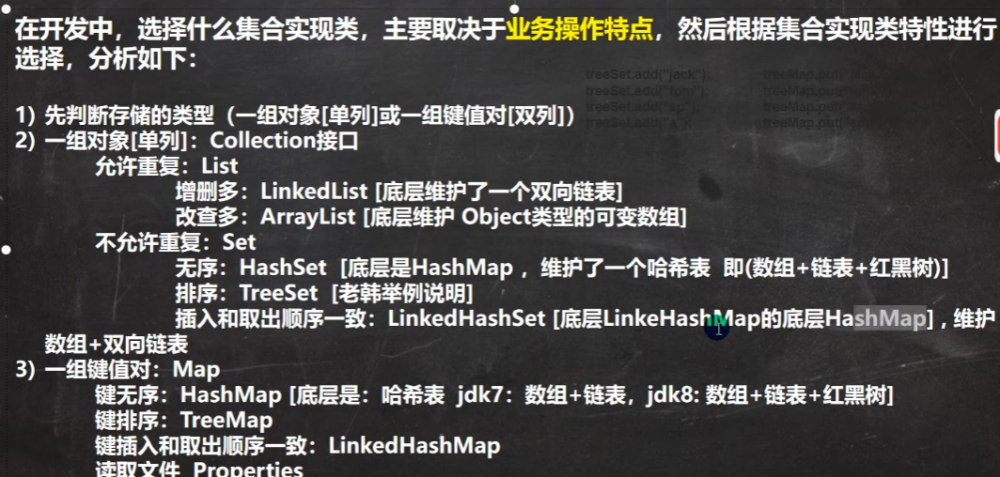

而集合能够动态保存任意多对象，并提供一系列方便的操作对象方法：add、remove、set、get，能够使用集合添加、删除新元素。

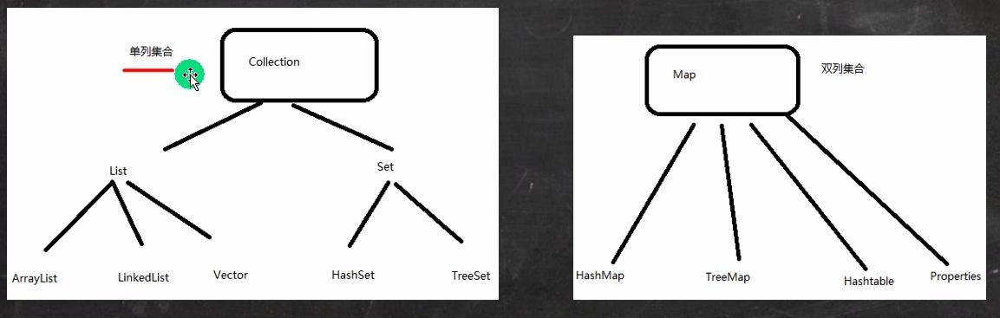

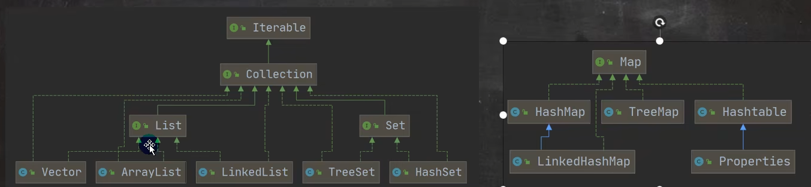

### Collection接口

collection接口可以存放多个元素。有些Collection实现类可以存放重复的元素，有些则不可以。Collection中List是有序的，Set是无序的。

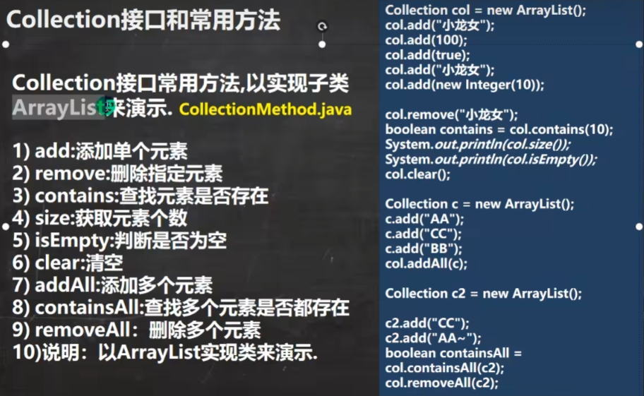

Collection遍历使用lterator对象称为迭代器，主要用于遍历Collection集合中的元素。所有实现Collection接口的集合类均有一个iterator方法，用于返回一个实现了Iterator接口的对象，即返回一个迭代器。Iterator仅能用于遍历。 

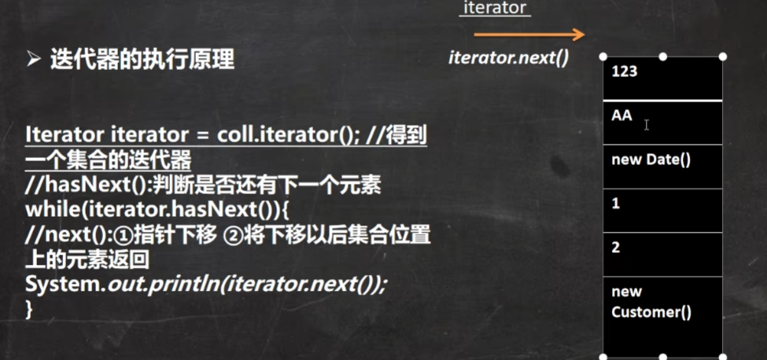

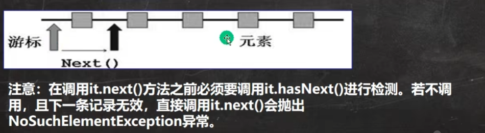

当Next（）遍历一次后， 指针会指向最后一处，如果想再遍历一次，就得重置迭代器。

```java
Iterator iterator = coll.iterator();//重新得到一个集合的迭代器
```

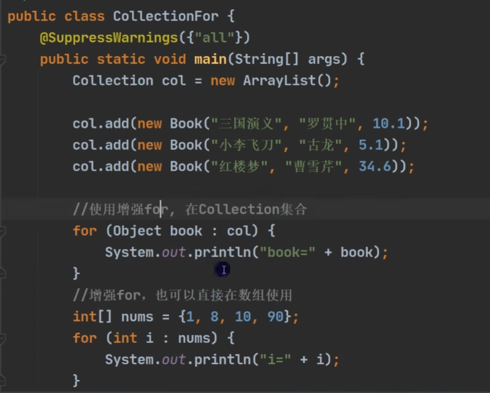

增强版的for可以理解为简化版的迭代器。

```java
for(元素类型(如Object) 元素名：集合名或者数组名){
    访问元素
}
for(int i : nums){
    
}//可以在数组使用
```

### List接口

```java
//虽然ArrayList在Collection接口和List接口下边但是下边是不同的
List list = new ArrayList();//使用List类型接口，使用的编译类型为List
Collection list = new ArrayList();
//(1)List集合类中的元素添加顺序与取出的顺序一致，且可重复
//(2)List集合中的每个元素都有其对应顺序索引，支持索引
//(3)List容器中的元素都对应一个整数型的序号记录位置，可以根据序号存取容器中的元素。
```

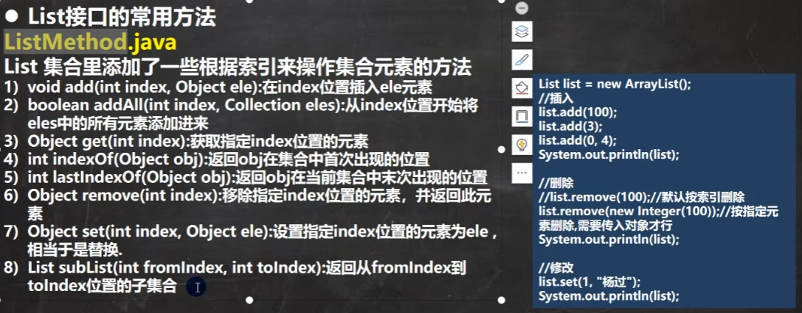

其中subList返回的子集合为左开右闭区间。

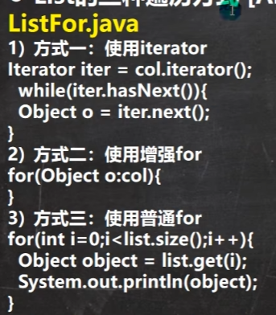

#### ArrayList

ArrayList使用数组进行储存数据，基本等同于Vector，除了ArrayList线程不安全，多线程情况下不建议用。Arrayist内部有一个elementData，为Object数据，作为顶级类可以存储所有类型。

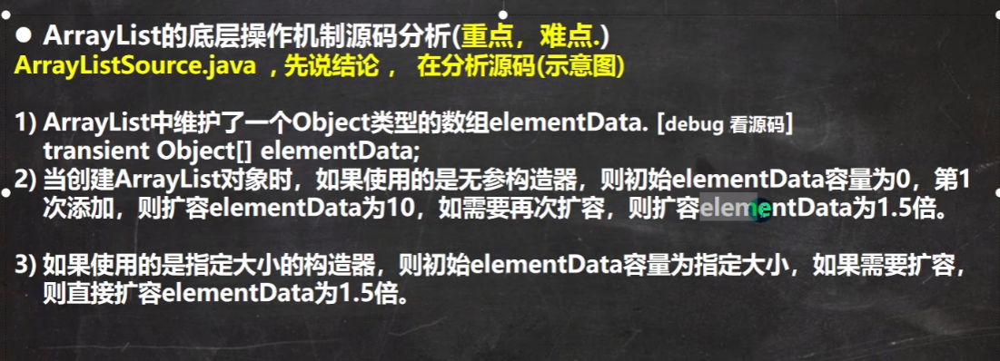

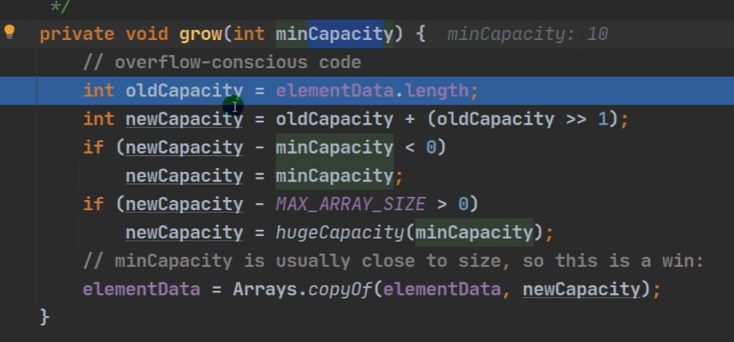

grow()代表了低层的扩容机制。其中minCapacity值为10.（可以直接打印）

#### Vector

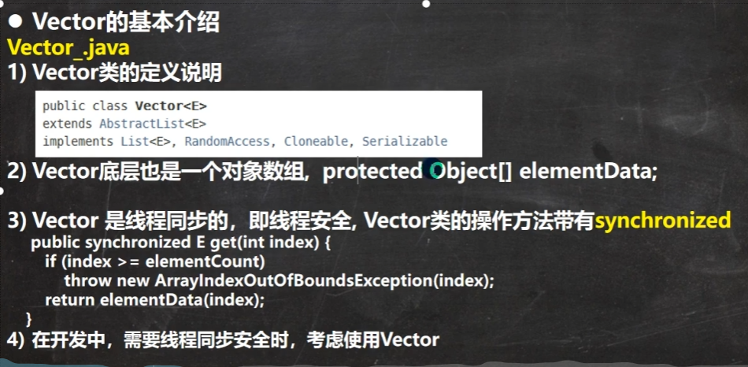

#### LinkedList

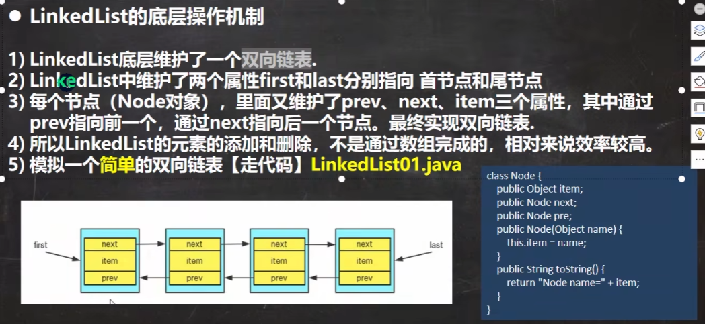

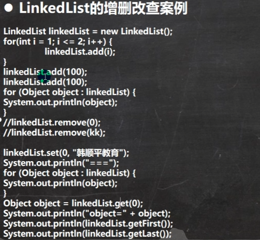、

LinkedList能够 增删指定内容，位置（尤其是首个元素和末尾元素）的元素
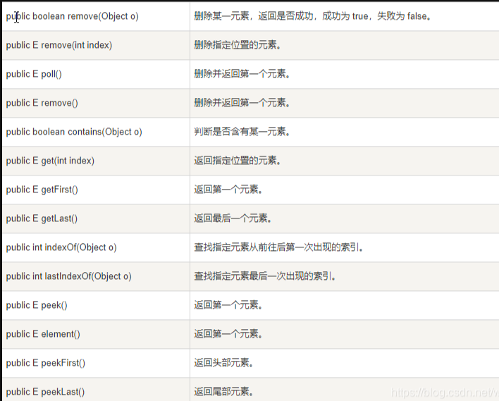

ArrayList与LinkedList根据实际情况使用

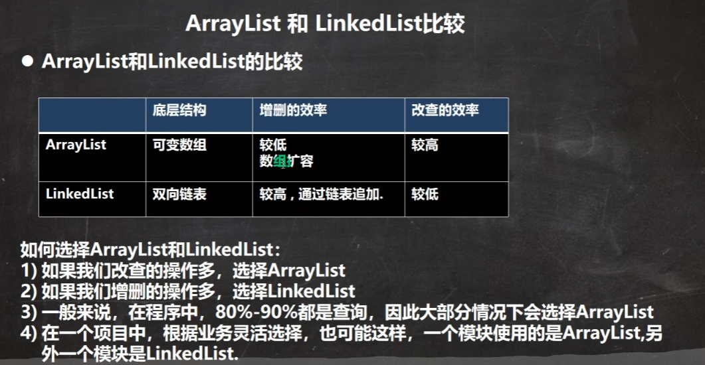

### Set接口

Set接口的特点：1.无序，添加与取出的顺序不一致，但是其取出的顺序是始终固定的；2.不允许重复元素，所以最多包含一个null。

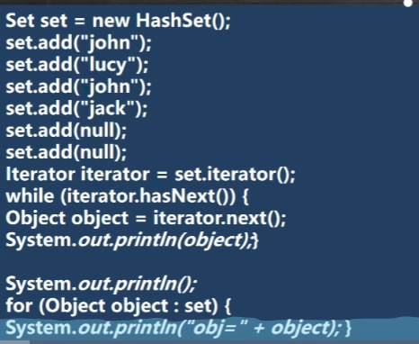

Set没有get方法，所以使用for循环进行索引遍历set是做不到的。

#### HashSet

HashSet实现了Set接口，其实际上是HashMap。Set同个元素不能反复存取，null也一样，只能存一个null。HashSet的输入和取出顺序不一致。

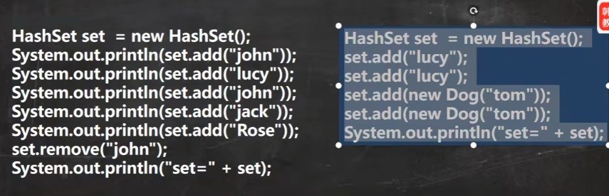

```java
set.add(new String("hhh"));
set.add(new String("hhh"));//这里是加不进去的，具体看HashMap源码
```

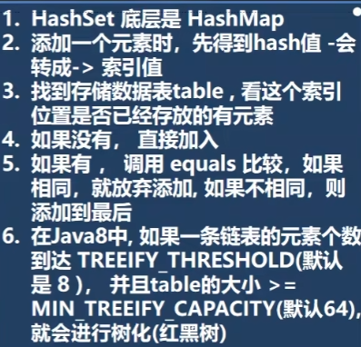

具体可以看源码（扩容机制和Map一样吧）。HashSet的add和remove都是先使用hashCode判断位置，然后equals则用于判断统一hash下要不要后边增加。

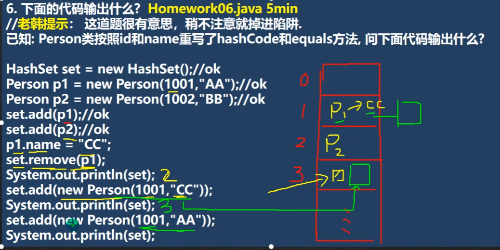

```java
public class HomeWork06 {
    public static void main(String[] args) {
        HashSet set = new HashSet();
        Persons p1 = new Persons(1001, "AA");
        Persons p2 = new Persons(1002, "BB");
        set.add(p1);
        set.add(p2);
        p1.name = "CC";
        set.remove(p1);//由于remove按照1001和“CC"定位hash值，因此找不到pq实际位置，找的是个空地址
        System.out.println(set);
        set.add(new Persons(1001, "CC"));//把之前找到的的空地址填上了
        System.out.println(set);
        set.add(new Persons(1001, "AA"));//哈希值和p1一样，但是
        System.out.println(set);
    }
}
class Persons{
    long id;
    String name;

    @Override
    public boolean equals(Object o) {
        if (this == o) return true;
        if (o == null || getClass() != o.getClass()) return false;
        Persons persons = (Persons) o;
        return id == persons.id && Objects.equals(name, persons.name);
    }

    public Persons(long id, String name) {
        this.id = id;
        this.name = name;
    }

    @Override
    public int hashCode() {
        return Objects.hash(id, name);//之后的判断hash就看id和name的值了
    }

    @Override
    public String toString() {
        return id + "-" +name + "";
    }
}
//[1002-BB, 1001-CC]
//[1002-BB, 1001-CC, 1001-CC]
//[1002-BB, 1001-CC, 1001-CC, 1001-AA]
```


#### LinkedHashSet

为HashSet子类，底层为LinkedHashMap，本质为维护一个数组加双向链表（HashSet是单向）。LinkedHashSet根据元素的hashCode()决定元素存储位置，使用链表维护元素的次序，这使得元素看起来是以插入顺序保存的。（可以直接打印）

```java
  LinkedHashSet linkedHashSet = new LinkedHashSet();
        linkedHashSet.add("hpx");
        linkedHashSet.add(new Integer(14));
        linkedHashSet.add(77749);
```

LinkedHashset能够保证插入顺序和遍历顺序一致（？）。其中，哈希表保证集合的唯一性，双向链表（双向链表可以记录）则保证其有序性。

#### TreeSet

TreeSet低层为TreeMap，能够实现数据排序。其数据结构是红黑树。

```java
    TreeSet tree = new TreeSet();
        tree.add("a");
        tree.add("bad");
        tree.add("fking");
        tree.add("dog");
        System.out.println(tree);
////////////////////////////////////////////////////
//如果要修改排序方法，则
   TreeSet tree = new TreeSet(new Comparator(){
            public int compare(Object o1, Object o2) {
                return ((String)o1).compareTo((String)o2);
            }
        });
///////根据源码，小于零放在左边，大于零放在右边，否则不放
       if (cmp < 0)
            parent.left = e;
        else
            parent.right = e;
//////////////////////////////////////值得注意的是，以下代码报错，因为源码中key == null会直接抛出异常
public class HomeWork05 {
    public static void main(String[] args) {
        TreeSet set = new TreeSet();
        set.add(new Person());
    }
}
class Person{

}
```

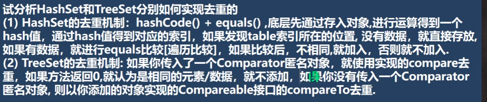

### Map接口

#### HashMap

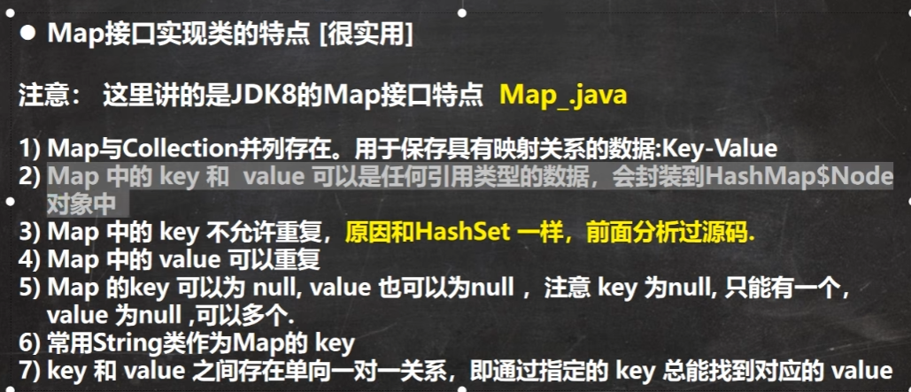

其中key为之前List和Set中add方法的输入参数部分，而value之前是个new Object()。可以直接打印。打印效果如下，key与value表现为一个键值对.其中，**keyset部分是可以单独取出的**。

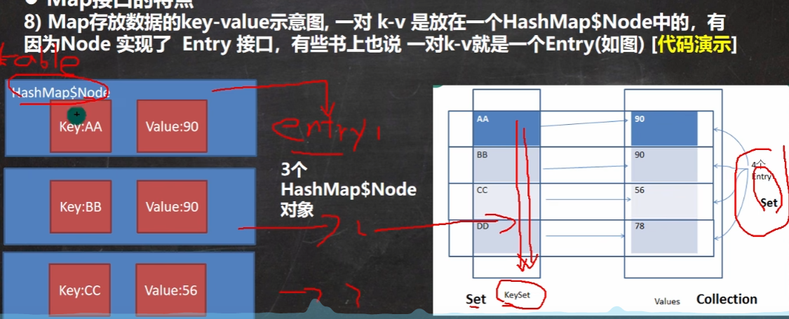

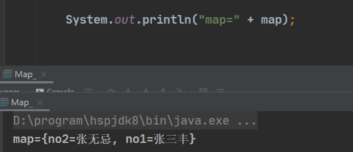

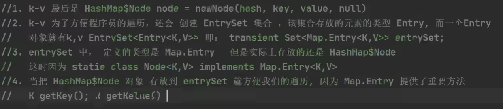

```java
Map map = new HashMap();
map.put(key1, value1);
map.put(key2, value2);
blic static void main(String[] args) {
        HashMap hashMap = new HashMap();
        hashMap.put("hpx", "hlj");
        hashMap.put("lyx", "ldx");
        hashMap.put("lyx", "gdd");
        System.out.println(hashMap);//{hpx=hlj, lyx=gdd}，key只有一个，但是value能够更新、
        Set set = hashMap.entrySet();//Node为entryset子类，这里面存放的还是Node，Node实现了Map.Entry
        System.out.println(set.getClass());//class java.util.HashMap$EntrySet
        for(Object obj:set){///////////////////这里用EntrySet
            Map.Entry entry = (Map.Entry) obj;//hpx-hlj
            System.out.println(entry.getKey() + "-" + entry.getValue());//lyx-gdd
        }
        set = hashMap.keySet();/////////////////将key部分单独拿出来，或者获取所有的键
    	 Iterator iterator = set.iterator();
        while (iterator.hasNext()) {
            Object next =  iterator.next();
            System.out.println(next + "-" + hashMap.get(next));
        }
        System.out.println(set);//[hpx, lyx],这个是class java.util.HashMap$KeySet
    	System.out.println(hashMap.values);//[hlj, gdd]，注意括号不是{} //////////////////////////////////////////////////////////////////////////////////除啦迭代器和entry遍历map，还有一种方法能够遍历map
    Collection values = hashMap.values();
    for(Object value: values){
        System.out.println(value);
    } ///////////////////////////////////////////////////////////////////////////////////////下边为在value/key为对象情况下
     HashMap hashMap = new HashMap();
        hashMap.put("001", new Employees("hpx", 25000));
        hashMap.put("002", new Employees("hlj", 250));
        hashMap.put("003", new Employees("xxx", 15000));
        hashMap.put("004", new Employees("mnj", 18000));

        Set keySet = hashMap.keySet();
        Iterator iterator = keySet.iterator();
        while (iterator.hasNext()) {
           Object next =  iterator.next();
           Employees value = (Employees) hashMap.get(next);
           if(value.getSalary() >= 18000){
               System.out.println(value);
           }
        }
        Set entry = hashMap.entrySet();
        for(Object o: entry){
            Map.Entry en = (Map.Entry) o;
            Employees em = (Employees)en.getValue();
            if(em.getSalary() >= 18000){//  或者，必须带括号if(((Employees)en.getValue()).getSalary() >= 18000)
                System.out.println(em);
            }
        }
```

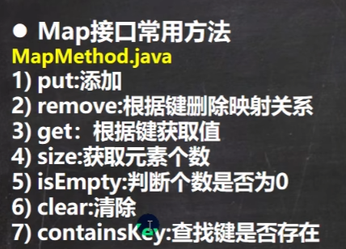

```java
   hashMap.remove("lyx");
        hashMap.put("gdg", "zl");
        System.out.println(hashMap);//{hpx=hlj, gdg=zl}
        hashMap.clear();
        System.out.println(hashMap);//{}
```

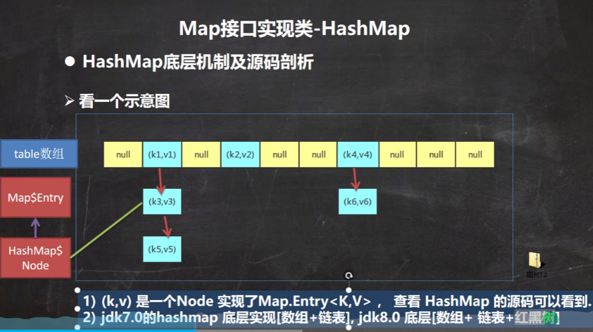

当创建map，数组长度为16，当链表超过8，会扩容，直到长度为64，超过64则树化。

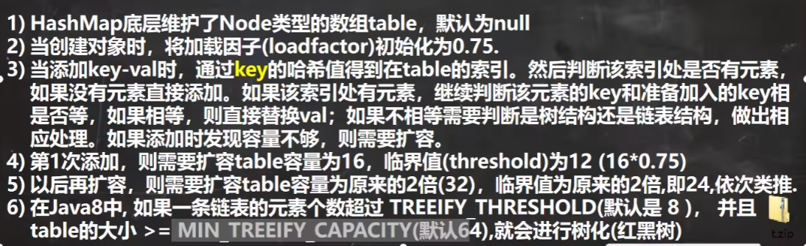

#### HashTable

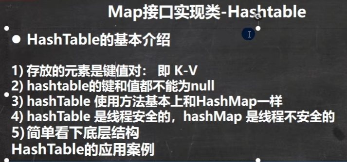

```java
//如果
table.put(null,"lucy");
table.put("lucy",null);//都会有NullPointerException抛出
//HashTable低层的数组大小和Map不大一样，最初是11.
```

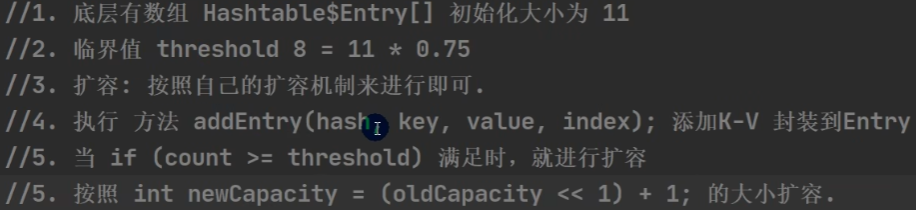

#### Properties

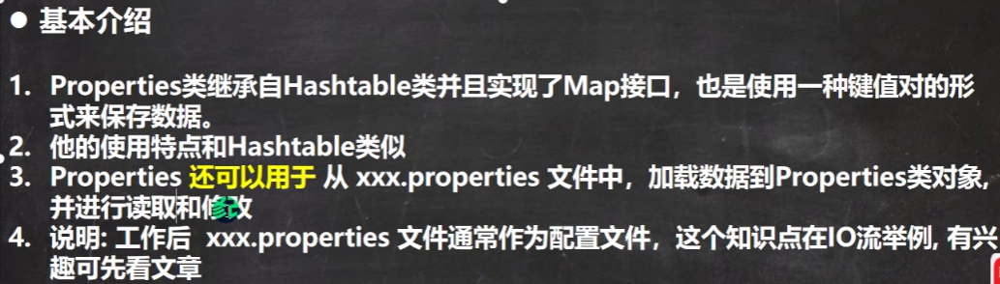

#### TreeMap

TreeMap是TreeSet低层，排序依照键排序。不同在于

```java
TreeMap tmp = new TreeMap();
tmp.add("str", 1322);
```

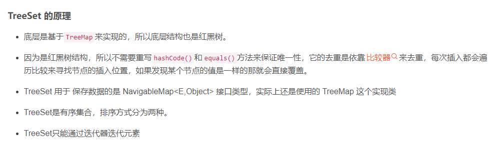

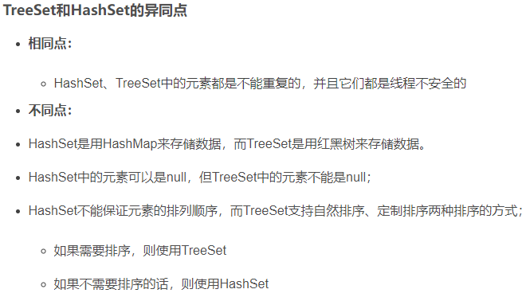

### Collection工具类

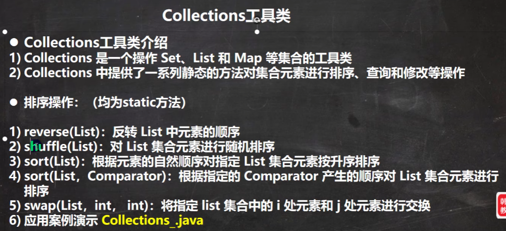

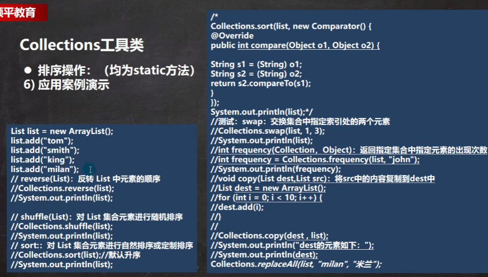

其中，图右上角部分为sort方法通过匿名内部类重写Comparator中的Compare自定义排序方法。

## 泛型Generic

泛型和集合相关，用ArrayList举例子

```java
ArrayList al = new ArrayList();
al.add(new Dog("aa", 10));
al.add(new Dog("bb", 1));
al.add(new Dog("cc", 3));
al.add(new Dog("ee", 17));
for(Object o : al){
    Dog dog = (Object) o;
    System.out.println(dog.getName());
}///以上是正常的ArrayList使用思路，但是如果ArrayList有很多不同的类型，就容易出问题：1.不能对加入到集合的数据类型进行约束；2.遍历时候需要进行类型转换，如果集合中数据量较大，对效率有影响。

```

传统方法问题如下：1.不能对加入到集合的数据类型进行约束；2.遍历时候需要进行类型转换，如果集合中数据量较大，对效率有影响。

```java
//一个简单的泛型如下,表示放在这里的只能是Dog类。如果不满足Dog类要求，就会报错。
ArrayList<Dog> arrayList = new ArrayList<Dog>();
//在使用泛型情况下，可以用for增强直接约束
for(Dog o : arrayList){//无泛型则只能用Object
    System.out.println(o);
}
```

泛型的主要目的是：（1）编译时，检查添加元素的类型，提高了安全性（2）减少了类型转换的次数，提高效率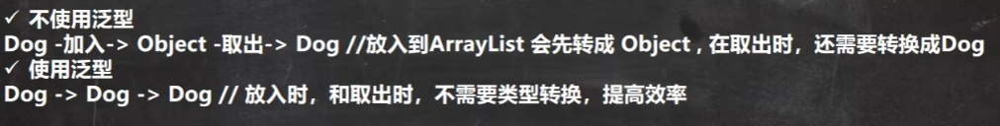

下边为泛型的具体介绍：

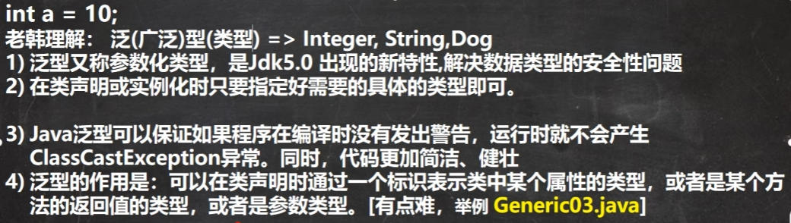

 作用1：在类声明时候通过一个标识表示类中某个属性的类型

```java
class Person<E>{
 E s;//当对象创建时，E的类型代表s类型，即在编译期间即确定E的类型
}
```

作用2（？）

### 泛型语法

```java
   HashSet<Student> set = new HashSet<Student>();//这里E变为Student，E只能替换其他类型。
        set.add(new Student("hpx", 21));
        set.add(new Student("hlj", 20));
        set.add(new Student("lzx", 19));

        for(Student s : set){
            System.out.println(s);
        }

        Iterator<Student> iterator = set.iterator();
        while (iterator.hasNext()) {
            Student next =  iterator.next();
            System.out.println(next);
        }

        HashMap<String , Student> hashMap = new HashMap<String , Student>();
        hashMap.put("hpx",new Student("hpx", 21) );
        hashMap.put("hlj",new Student("hlj", 20) );
        hashMap.put("lzx",new Student("lzx", 18) );
        Set<String> sets = hashMap.keySet();
        for(String str : sets){
            System.out.println(hashMap.get(str));
        }

        Set<Map.Entry<String , Student>> entries = hashMap.entrySet();//Set只能塞一个，而Map.Entry有两个参数
        Iterator<Map.Entry<String , Student>> iterators = entries.iterator();
        while (iterators.hasNext()) {
            Map.Entry<String, Student> next =  iterators.next();
            System.out.println(next);
        }
```

关于<E>, 如果是基本类型，不能放到E所在的位置，类型参数不能为基元类型。同时在给泛型指定具体类型后，可以传入该类型或者其子类类型。如果<>为空，那么其使用的泛型为Object，不是没有泛型，毕竟那个时候会出现add(Object o )。

```java
List<Interger> list1 = new ArrayList<Interger>();//OK
List<int> list2 = new ArrayList<int>();//错误

/////////////////////////////////////////////
Pig<A> aPig = new Pig<A>(new A());
Pig<A> aPig = new Pig<A>(new B());//B是A的子类

class A{};
class B extends A{};
class Pig<E>{
    E e;
    
    public Pig(E e){
        this.e =e;
    }
}
/////////////////////////////////////////////////推荐如下写法，编译器会自动进行类型推断
ArrayList<Integer> list = new ArrayList<>();
List<Integer> list = new ArrayList<>();
```

### 自定义泛型

基本语法

class 类名<T,R...>{//...表示可以有多个泛型

}

细节：
1.普通成员可以使用泛型，属性，方法等
2.使用泛型的数组，不能初始化
3.静态方法中不能使用类的泛型
4.泛型类的类型，会在创建对象时候确定
5.如果在创建对象时候没有指定类型，默认为Object
6.泛型数组不能初始化
7.静态的方法、属性不能用泛型，因为静态和类是相关的，在类加载时，对象还没创建,低层JVM无法完成初始化。 

```java
class Tiger<T , R, M>{
    String name;
    R r;
    M m;
    T t;
    T[] ts;//可以
    T[] ts = new T[8];// 不可以，因为没指定T类型
    public Tiger(String name, R r, M m, T t){
        this.name = name;
        this.r = r;
        this.m = m;
    }
}
////////////////////////////////////////////////////////////
Tiger<Double, String, Integer> g = new Tiger<>("john");
g.setT(10.9);//OK
g.setT("yy");//No
Tiger g2 = new Tiger("john");
g2.set("yy");//没指定，为Object，String是其子类
```

### 自定义泛型接口

基本语法

```java
interface 接口名<T, R...>{
    
}
interface IUsb<U, R>{
    R get(U u);
    void hi(R r);
    void run(R r1, R r2, U u1, U u2);
    default R method(U u){
        return null;
    }
}
class BB implements IUsb<Integer, Float>{//自动替换U,R

    @Override
    public Float get(Integer integer) {
        return null;
    }

    @Override
    public void hi(Float aFloat) {

    }
    @Override
    public void run(Float r1, Float r2, Integer u1, Integer u2) {

    }
}
```

注意：

1.接口中静态成员也不能使用泛型
2.泛型接口的类型，在继承接口或者实现接口时确定
3.没有指定类型就默认Object。

### 自定义泛型方法

基本语法

```java
//基本语法
修饰符<T,R..>返回类型 方法名（参数列表）{
    
}
```

注意细节：
1.泛型方法，可以被定义于普通类中，也可以定义在泛型类中
2.当泛型方法被调用，类型会被确定
3.public void eat(E e){},修饰符后没有<T,R..>eat方法不是泛型方法，而是使用了泛型

```java
class Car{
    public<T, R> void fly(T t, R r){
        //泛型方法
    }
}

class Fish<T ,R>{
    public <U, M> void eat(U u, M m){
        
    }
}
///////////////////////
    public void hi(T t){
        //为使用了类声明的泛型，不是泛型方法，void前没<>
    }
```

下边为一个小题

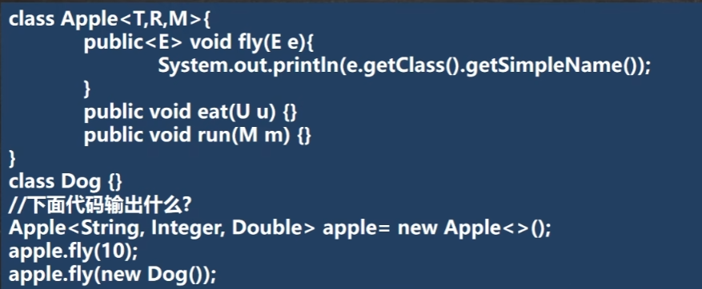

其中eat部分的参数没有泛型U，所以不成立，错误。

### 泛型的继承和通配符

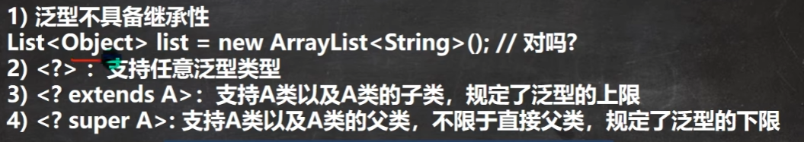

具体的有以下模版，通配主要在局部变量中

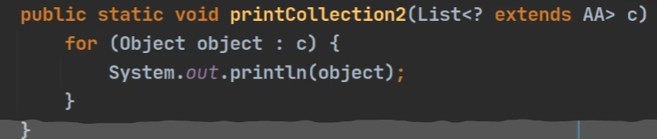

## JUnit测试框架

@Test下建立一个完整方法即可，也不用main

```java
 @Test
    public void testList(){
        Dao<User> dao = new Dao();
        dao.save("213", new User(13, "hpx"));
        dao.save("111", new User(18, "lsp"));
        dao.save("110", new User(25, "xdx"));


        dao.delete("111");
        dao.update("119", new User(18, "lsp"));
        System.out.println(dao.list());
    }//必须是完整的，不然报错
```

