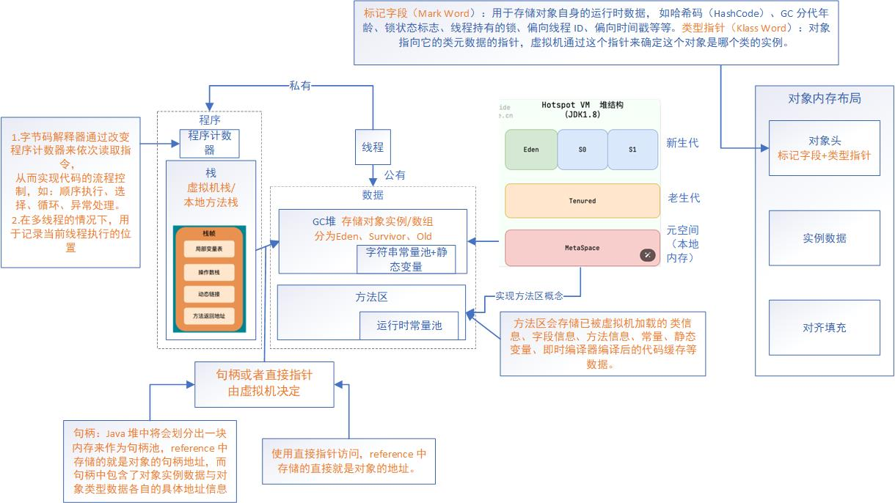
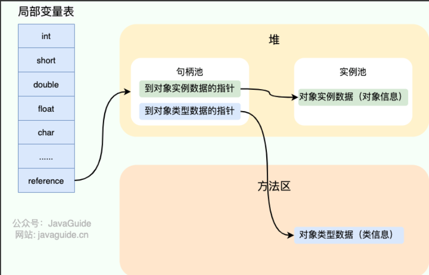
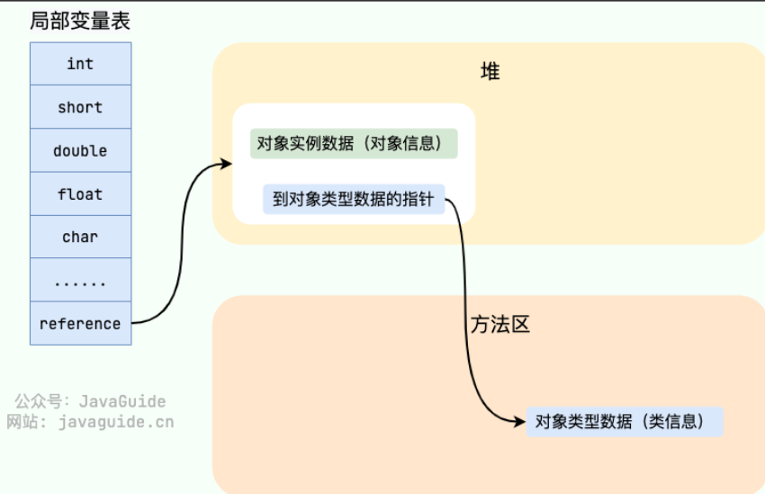
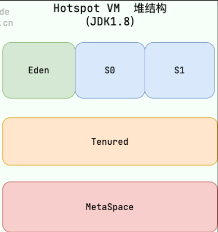

# JVM

参考博客：https://javaguide.cn/java/jvm/memory-area.html#java-%E8%99%9A%E6%8B%9F%E6%9C%BA%E6%A0%88

## JVM内存模型

1.为何元空间取代了永久区？元空间由于使用本地内存，溢出概率更低；可加载更多类；HotSpot和Jrocket合并时，后者没永久区这个东西；原永久区会给GC机制带来复杂度。

2.句柄原理如图：

​	直接指针原理：

​	优劣：使用句柄来访问的最大好处是 reference 中存储的是稳定的句柄地址，在对象被移动时只会改变句柄中的实例数据指针，而 reference 本身不需要修改。使用直接指针访问方式最大的好处就是速度快，它节省了一次指针定位的时间开销。

## JVM中对象的创建过程

1.类加载检查：在方法区检查常量池是否有能定位到该类的符号引用，

2.分配对象内存：**分配方式**有 **“指针碰撞”** 和 **“空闲列表”** 两种，**选择哪种分配方式由 Java 堆是否规整决定，而 Java 堆是否规整又由所采用的垃圾收集器是否带有压缩整理功能决定**。

**内存分配的两种方式** 

- 指针碰撞： 
  - 适用场合：堆内存规整（即没有内存碎片）的情况下。
  - 原理：用过的内存全部整合到一边，没有用过的内存放在另一边，中间有一个分界指针，只需要向着没用过的内存方向将该指针移动对象内存大小位置即可。
  - 使用该分配方式的 GC 收集器：Serial, ParNew
- 空闲列表： 
  - 适用场合：堆内存不规整的情况下。
  - 原理：虚拟机会维护一个列表，该列表中会记录哪些内存块是可用的，在分配的时候，找一块儿足够大的内存块儿来划分给对象实例，最后更新列表记录。
  - 使用该分配方式的 GC 收集器：CMS

​	选择以上两种方式中的哪一种，取决于 Java 堆内存是否规整。而 Java 堆内存是否规整，取决于 GC 收集器的算法是"标记-清除"，还是"标记-整理"（也称作"标记-压缩"），值得注意的是，复制算法内存也是规整的。

**内存分配并发问题（补充内容，需要掌握）**

​	在创建对象的时候有一个很重要的问题，就是线程安全，因为在实际开发过程中，创建对象是很频繁的事情，作为虚拟机来说，必须要保证线程是安全的，通常来讲，虚拟机采用两种方式来保证线程安全：

- **CAS+失败重试：** CAS 是乐观锁的一种实现方式。所谓乐观锁就是，每次不加锁而是假设没有冲突而去完成某项操作，如果因为冲突失败就重试，直到成功为止。**虚拟机采用 CAS 配上失败重试的方式保证更新操作的原子性。**
- **TLAB：** 为每一个线程预先在 Eden 区分配一块儿内存，JVM 在给线程中的对象分配内存时，首先在 TLAB 分配，当对象大于 TLAB 中的剩余内存或 TLAB 的内存已用尽时，再采用上述的 CAS 进行内存分配

3.零值初始化：内存分配完成后，虚拟机需要将分配到的内存空间都初始化为零值（不包括对象头），这一步操作保证了对象的实例字段在 Java 代码中可以不赋初始值就直接使用

4.设置对象头：初始化零值完成之后，**虚拟机要对对象进行必要的设置**，例如这个对象是哪个类的实例、如何才能找到类的元数据信息、对象的哈希码、对象的 GC 分代年龄等信息。 **这些信息存放在对象头中。**

5.执行init方法：执行 `<init>` 方法，把对象按照程序员的意愿进行初始化

## JVM垃圾回收详情

​	Eden，Surivivor的两个区S0，S1均属于新生代，中间一层属于老年代，最下一层元空间取代原永生代。

### 内存分配

多数情况下，新对象会在Eden区被分配。
	当Eden区没有足够空间进行分配时，虚拟机将发起一次Minor GC。如果Surivior区仍然存不住对象，就需要通过**分配担保****机制**将新生代的对象提前移步至老年代中去。老年代存储区很大的。

大对象直接进入老年代
	将字符串、数组等大对象直接塞进老年代能够减少新生代垃圾回收频率和成本。

长期存活对象会被放入老年代
	为识别什么是长期存活对象，虚拟机会给每个对象一个对象年龄计数器。大部分情况，对象都会首先在 Eden 区域分配。如果对象在 Eden 出生并经过第一次 Minor GC 后仍然能够存活，并且能被 Survivor 容纳的话，将被移动到 Survivor 空间（s0 或者 s1）中，并将对象年龄设为 1(Eden 区->Survivor 区后对象的初始年龄变为 1)。
	Hotspot 遍历所有对象时，按照年龄从小到大对其所占用的大小进行累积，当累积的某个年龄大小超过了 survivor 区的 50% 时（默认值是 50%，可以通过 `-XX:TargetSurvivorRatio=percent` 来设置，参见 [issue1199open in new window](https://github.com/Snailclimb/JavaGuide/issues/1199) ），取这个年龄和 MaxTenuringThreshold 中更小的一个值，作为新的晋升年龄阈值。

空间分配担保

《深入理解 Java 虚拟机》第三章对于空间分配担保的描述如下：

> JDK 6 Update 24 之前，在发生 Minor GC 之前，虚拟机必须先检查老年代最大可用的连续空间是否大于新生代所有对象总空间，如果这个条件成立，那这一次 Minor GC 可以确保是安全的。如果不成立，则虚拟机会先查看 `-XX:HandlePromotionFailure` 参数的设置值是否允许担保失败(Handle Promotion Failure);如果允许，那会继续检查老年代最大可用的连续空间是否大于历次晋升到老年代对象的平均大小，如果大于，将尝试进行一次 Minor GC，尽管这次 Minor GC 是有风险的;如果小于，或者 `-XX: HandlePromotionFailure` 设置不允许冒险，那这时就要改为进行一次 Full GC。
>
> JDK 6 Update 24 之后的规则变为只要老年代的连续空间大于新生代对象总大小或者历次晋升的平均大小，就会进行 Minor GC，否则将进行 Full GC。

在进行minor GC之前，jvm会检查当前老年代的最大连续内存能否容纳所有新生代对象总空间，能，则进行minor GC；不能，则检查参数设置是否允许担保失败，允许，则检查该连续空间是否大于历次晋升至老年代对象的平均大小（根据历史判断），大于，则进行一次Minor GC；不允许，则进行full GC。

### GC类型

针对 HotSpot VM 的实现，它里面的 GC 其实准确分类只有两大种：

部分收集 (Partial GC)：

- 新生代收集（Minor GC / Young GC）：只对新生代进行垃圾收集；
- 老年代收集（Major GC / Old GC）：只对老年代进行垃圾收集。需要注意的是 Major GC 在有的语境中也用于指代整堆收集；
- 混合收集（Mixed GC）：对整个新生代和部分老年代进行垃圾收集。

整堆收集 (Full GC)：收集整个 Java 堆和方法区。

### 死亡对象判断

对堆垃圾回收前的第一步就是要判断哪些对象已经死亡
有一种简单高效的**引用计数器法**，但是其难以解决对象之间循环引用问题，使得不能充分回收

或者用**可达性分析算法**，以GC Roots的对象为起点向下搜寻，搜寻过的链路被称为引用链。<u>*一个对象没有被任何引用链相连，那就是不可用的*。</u>

以下为GC Roots：

虚拟机栈(栈帧中的局部变量表)中引用的对象

本地方法栈(Native 方法)中引用的对象

方法区中类静态属性引用的对象

方法区中常量引用的对象

所有被同步锁持有的对象

JNI（Java Native Interface）引用的对象

要真正宣告一个对象死亡，至少要经历两次标记过程；可达性分析法中不可达的对象被第一次标记并且进行一次筛选，筛选的条件是此对象是否有必要执行 `finalize` 方法。当对象没有覆盖 `finalize` 方法，或 `finalize` 方法已经被虚拟机调用过时，虚拟机将这两种情况视为没有必要执行。

被判定为需要执行的对象将会被放在一个队列中进行第二次标记，除非这个对象与引用链上的任何一个对象建立关联，否则就会被真的回收。

### 引用类型总结

无论是通过引用计数法判断对象引用数量，还是通过可达性分析法判断对象的引用链是否可达，判定对象的存活都与“引用”有关

1.**强引用**：以前多数引用都是强引用。是**必不可少的**，垃圾回收器也不会回收，哪怕出现内存溢出错误

2.**软引用**：**可有可无**。软引用可用于实现内存敏感的高速缓存。如果内存空间足够，垃圾回收器就不会回收它，如果内存空间不足了，就会回收这些对象的内存。只要垃圾回收器没有回收它，该对象就可以被程序使用。

3.**弱引用**：**更可有可无**。只具有弱引用对象，无论空间是否足够，只要被发现，都会被回收。但是其垃圾回收机制优先级很低，不一定很快发现弱引用对象。

弱引用或者软引用可以和一个引用队列联合使用，当引用的对象被垃圾回收，Java寻迹会把这个引用加入到与之关联的引用队列中。

4．**虚引用**：形同虚设，与其他几种引用都不同，虚引用并**不会决定对象的生命周期**。如果一个对象仅持有虚引用，那么它就和没有任何引用一样，在任何时候都可能被垃圾回收。

**虚引用主要用来跟踪对象被垃圾回收的活动**。

**虚引用与软引用和弱引用的一个区别在于：** 虚引用必须和引用队列（ReferenceQueue）联合使用。当垃圾回收器准备回收一个对象时，如果发现它还有虚引用，就会在回收对象的内存之前，把这个虚引用加入到与之关联的引用队列中。程序可以通过判断引用队列中是否已经加入了虚引用，来了解被引用的对象是否将要被垃圾回收。程序如果发现某个虚引用已经被加入到引用队列，那么就可以在所引用的对象的内存被回收之前采取必要的行动。

特别注意，在程序设计中一般很少使用弱引用与虚引用，使用软引用的情况较多，这是因为**软引用可以加速 JVM 对垃圾内存的回收速度，可以维系统的运行安全，防止内存溢出（OutOfMemory）等问题的产生**

### 废弃常量与无用类

​	**JDK1.8 hotspot 移除了永久代用元空间(Metaspace)取而代之, 这时候字符串常量池还在堆, 运行时常量池还在方法区, 只不过方法区的实现从永久代变成了元空间(Metaspace)**

废弃常量：假如在字符串常量池中存在字符串 "abc"，如果当前没有任何 String 对象引用该字符串常量的话，就说明常量 "abc" 就是废弃常量，如果这时发生内存回收的话而且有必要的话，"abc" 就会被系统清理出常量池了

无用类：方法去主要回收的是无用类。判定一个类是否是无用类的条件则相对苛刻许多。类需要同时满足下面 3 个条件才能算是 **“无用的类”**：

- 该类所有的实例都已经被回收，也就是 Java 堆中不存在该类的任何实例。
- 加载该类的 `ClassLoader` 已经被回收。
- 该类对应的 `java.lang.Class` 对象没有在任何地方被引用，无法在任何地方通过反射访问该类的方法。

虚拟机可以对满足上述 3 个条件的无用类进行回收，这里说的仅仅是“可以”，而并不是和对象一样不使用了就会必然被回收。
