# JavaWeb

## JDBC

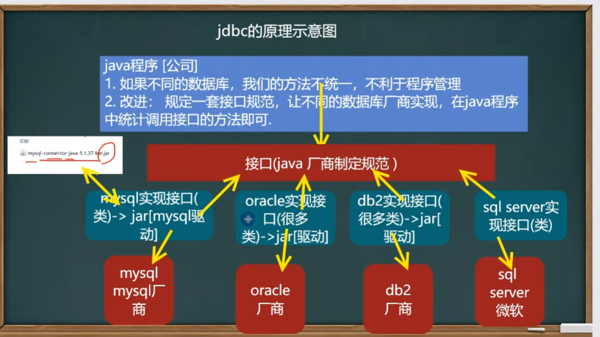

所谓jdbc，就是途中的java厂商指定的接口规范。

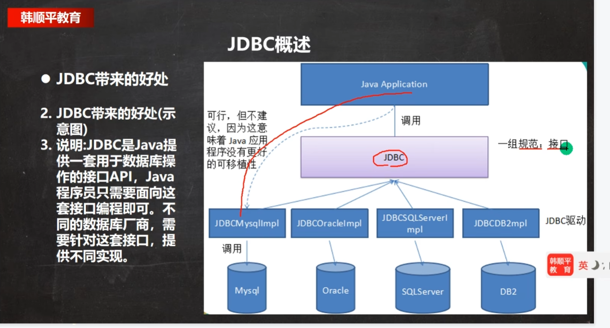

### 数据库链接方式

链接方式一，使用jdbc下边的Driver进行链接，属于静态加载，灵活性差，依赖强

```java
public class jdbc01 {
    public static void main(String[] args) throws SQLException {
        //1.注册驱动
        Driver driver = new Driver();
        //2.得到连接
        String url = "jdbc:mysql://localhost:3306/db02";
        Properties properties = new Properties();
        properties.setProperty("user", "root");//用户
        properties.setProperty("password", "123");//密码
        Connection connect = (Connection) driver.connect(url, properties);
        System.out.println(connect);//返回com.mysql.jdbc.JDBC4Connection@5cb0d902
        //3.执行sql
        //String sql = "insert into actor values(null,'刘德华','男','1970-11-11','110')";
        String sql = "update actor set name='周星驰' where id = 1";
        Statement statement = (Statement) connect.createStatement();
        int rows = statement.executeUpdate(sql);
        System.out.println(rows > 0?"成功":"失败");
        //关闭链接资源
        statement.close();
        connect.close();
    }
}
```

连接方式二，使用反射创建Driver对象


方式三，使用DriverManager替代Driver进行统一管理

```java
void connect03() throws ClassNotFoundException, InstantiationException, IllegalAccessException, SQLException {
        Class cls = Class.forName("com.mysql.jdbc.Driver");
        Driver driver = (Driver) cls.newInstance();

        String url = "jdbc:mysql://localhost:3306/db02";
        String user = "root";
        String password = "123";

        DriverManager.registerDriver(driver);//注册
        java.sql.Connection connection = DriverManager.getConnection(url, user, password);
        System.out.println("第三种方式" + connection);
    }
```

方式四，方式三的简化

虽然mysql驱动5.1.6不用class.forname,jdk1.5后使用jdbc4不需要在调用Class.forName注册驱动而是自动调用驱动

```java
void connect04() throws ClassNotFoundException, SQLException {
        Class.forName("com.mysql.jdbc.Driver");
        String url = "jdbc:mysql://localhost:3306/db02";
        String user = "root";
        String password = "123";
        Connection connection = (Connection) DriverManager.getConnection(url,user,password);
        System.out.println("第四种方式" + connection);
    }
```


方式五，直接用properties


整体链接方式为：


### 数据库链接实例

```java
public class JdbcWork01 {
    public static void main(String[] args) throws IOException, ClassNotFoundException, SQLException {
        Properties properties = new Properties();
        properties.load(new FileInputStream("src\\jdbc.properties"));
        String user = properties.getProperty("user");
        String password = properties.getProperty("password");
        String driver = properties.getProperty("driver");
        String url = properties.getProperty("url");

        Class.forName(driver);
        Connection connection = DriverManager.getConnection(url, user, password);

        Statement statement = connection.createStatement();
        String sql = "select id , name, sex,borndate from actor";
        ResultSet result = statement.executeQuery(sql);

        while(result.next()){
            int id = result.getInt(1);
            String name = result.getString(2);
            String sex = result.getString(3);
            Date date = result.getDate(4);
            System.out.println(id + "\t" + name + "\t" + sex + "\t" + date);
        }
    }
}

-----------------------------------------------------------------------
jdbc.properties
    
user=root
password=123
url=jdbc:mysql://localhost:3306/db04
driver=com.mysql.jdbc.Driver
    
-------------------------------------------------------------------------
 最后得到输出结果

```

### SQL注入与PreparedStatement


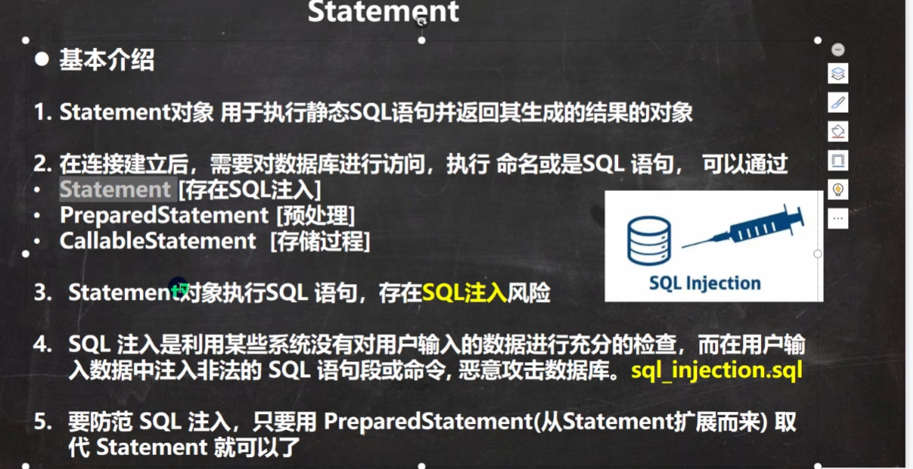

SQL为一个Web漏洞，为避免潜在风险，以后要多用PreparedStatement代替Statement了


```java
String sql = "select name, pwd, from admin where name = ? and pwd = ?";
PreparedStatement preparedstatement = connection.preparestatement(sql);
preparedstatement.setString(1,admin_name);//第一个问号位置
preparedstatement.set了String(2, admin_pwd);//第二个问号位置
ResultSet resultSet = preparedstatement.executeQuery();//，返回搜查结果这里不需要用sql进行赋值，因为前两行已经赋值过了

int row = preparedstatement.executeUpdate();//更新
```

### JDBC API

JDBC中主要类如下

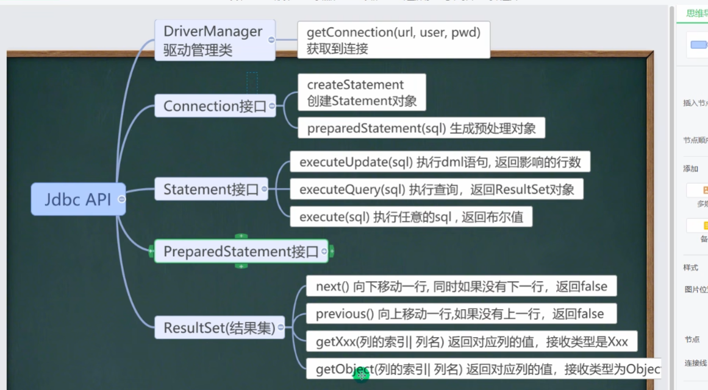

#### 封装通用方法

```java
public class JDBCUtils {

    private static String user;
    private static String password;
    private static String url;
    private static String driver;
    //初始化包装
    static {
        try{
            Properties properties = new Properties();
            properties.load(new FileInputStream("src\\jdbc.properties"));

            user = properties.getProperty("user");
            password = properties.getProperty("password");
            url = properties.getProperty("url");
            driver = properties.getProperty("driver");
        } catch (FileNotFoundException e) {
            throw new RuntimeException(e);
        } catch (IOException e) {
            throw new RuntimeException(e);
        }
    }
    //链接包装
    public static Connection getConnection(){
        try {
            return DriverManager.getConnection(url, user, password);
        } catch (SQLException e) {
            throw new RuntimeException(e);
        }
    }
    //链接、状态、结果集都会存在为空状态，为空，则没必要关闭
    public  static  void close(ResultSet resultSet, Statement statement, Connection connection){
        try {
            if(resultSet != null) resultSet.close();
            if(statement != null) statement.close();
            if(connection != null) connection.close();
        } catch (SQLException e) {
            throw new RuntimeException(e);
        }
    }
}
----------------------------
 
    public void testDML(){
        Connection connection = null;
        PreparedStatement preparedStatement = null;

        try {
            connection = JDBCUtils.getConnection();
            String sql = "update actor set NAME = ? where id = ?";
            preparedStatement = connection.prepareStatement(sql);
            preparedStatement.setString(1, "周冬雨");
            preparedStatement.setInt(2,2);
            int row = preparedStatement.executeUpdate();
            System.out.println(row >= 0?"成功":"失败");
        } catch (SQLException e) {
            throw new RuntimeException(e);
        }
    }
```

#### 事务处理

事务用于保证数据的一致性，他是由一组相关的dml的语句组成的，该组的dml语句要么全部是成功，要么全部失败。

事务和锁：
当执行事务操作时（dml语句），mysql会在表上加锁，防止其他用户改表的数据

如果转账，一人转给一人，转账中途出现问题，导致一方扣钱，另一方钱每提升。那么在catch语句下，就需要加东西：

```java
connection.rollback();
```

#### 批处理


实际操作为：

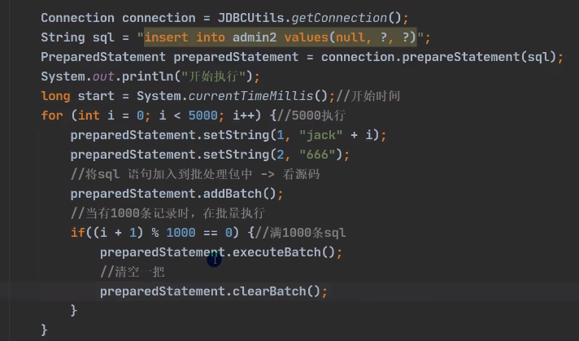

+


#### 数据库连接池


如果需要多次进行Connection操作，容易导致内存溢出

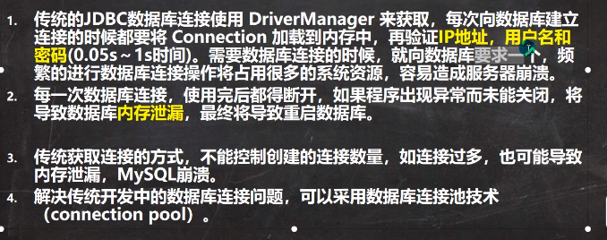

为解决这一问题，提出数据库连接池方法，该方法主要是预先在缓冲池中放入一定数量连接，每次建立数据库连接时，从池子中取出一个，然后再放回去。数据库链接池负责分配、管理和释放数据库连接，它允许应用程序重复使用一个数据库连接而不是重新创建一个。（取出放回过程中，连接好像不会断开）

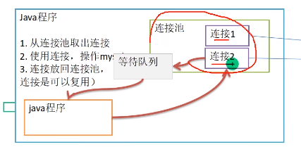

Java连接池需要通过javax.sql.DataSouce来表示


#### C3P0

以下为使用连接池的案例

```java
 public void testC3p0() throws IOException, PropertyVetoException, SQLException {
        ComboPooledDataSource comboPooledDataSource = new ComboPooledDataSource();
        Properties properties = new Properties();
        properties.load(new FileInputStream("src\\jdbc.properties"));
        String user = properties.getProperty("user");
        String password = properties.getProperty("password");
        String url = properties.getProperty("url");
        String driver = properties.getProperty("drivrer");
        //这次就用数据池
        comboPooledDataSource.setDriverClass(driver);
        comboPooledDataSource.setJdbcUrl(url);
        comboPooledDataSource.setUser(user);
        comboPooledDataSource.setPassword(password);
        //初始化连接数
        comboPooledDataSource.setInitialPoolSize(10);
        //设置最大连接数
        comboPooledDataSource.setMaxPoolSize(20);

        Connection connection = comboPooledDataSource.getConnection();
        System.out.println("连接完毕");
        connection.close();

    }

    public void C3P0_1() throws SQLException {
        ComboPooledDataSource comboPooledDataSource = new ComboPooledDataSource("  ");//c3p0-config.xml文件名字，不知道为啥一直失败
        Connection connection = comboPooledDataSource.getConnection();

    }
```

#### Druid

德鲁伊的properties是下面这个格式

```druid
# druid.properties文件的配置
driverClassName=com.mysql.jdbc.Driver
url=jdbc:mysql://localhost:3306/db04
username=root
password=123
# 初始化连接数量
initialSize=10
# 最大连接数
maxActive=50
# 最大超时时间
maxWait=5000
```

德鲁伊的应用实例

```java
public class Druid_ {
    public static void main(String[] args) throws Exception{
        // 1.项目中导入jar包
        // 2.加载配置文件
        Properties properties = new Properties();
        properties.load(new FileInputStream("src\\druid.properties"));
        // 获得一个连接池，使用DataSource类
        DataSource dataSource = DruidDataSourceFactory.createDataSource(properties);
        long start = System.currentTimeMillis();
        for (int i = 0; i < 500000; i++) {
            Connection connection = dataSource.getConnection();
           // PreparedStatement preparedStatement = connection.
            connection.close();
        }
        long end = System.currentTimeMillis();
        System.out.println("C3P0 所用时间：" + (end-start)); //685 相比于C3P0 效率大大提升
    }
}
----------------------------------------------------------------------------------------		Connection connection = dataSource.getConnection();//从连接池中取出链接方法
	//放回连接方法（和Mysql的close不同）
	connection.close();
```

德鲁伊工具类

```java
public class JDBCUtilsByDruid {
    private static DataSource ds;
    //在静态代码块完成 ds 初始化
    static {
        Properties properties = new Properties();
        try {
            properties.load(new FileInputStream("D:\\idea学习\\javaweb\\jdbc\\day01\\src\\druid.properties"));
            ds = DruidDataSourceFactory.createDataSource(properties);
        } catch (Exception e) {
            throw new RuntimeException(e);
        }
    }

    //编写getConnection方法
    public static Connection getConnection() throws SQLException {
        return ds.getConnection();
    }
    //关闭连接，强调：在数据库连接池技术中，close不是真的断掉连接
    //而是把使用的Connection对象放回连接池
    public static void close(ResultSet resultSet, Statement statement, Connection connection){
        try {
            if (resultSet != null){
                resultSet.close();
            }
            if (statement != null){
                statement.close();
            }
            if (connection  != null){
                connection.close();
            }
        } catch (Exception e) {
            throw new RuntimeException(e);
        }
    }
}
```

#### Apache-DBUtils

为何还要有Apache类？

1.关闭connnection后，resultSet结果集无法使用，结果集和链接是关联的。
2.结果集只能用一次，不利于数据管理。
3.返回信息使用不方便

但是如果java设定一个类，其属性和数据库表格组成一致，返回值就好对应，这一种类叫做JavaBean，PoJO，Domain.

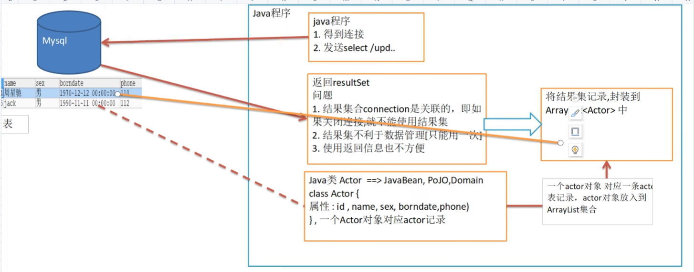

因此，码农带来Apache-DBUtils

```java
 public void testQueryMany() throws SQLException {
        Connection cn = JDBCUtilsByDruid.getConnection();
        QueryRunner qr = new QueryRunner();
        //String sql = "select * from actor where id = ?";//使用BeanHandler
        String sql = "select name from actor where id = ?";//使用ScalarHandler时，用这一句，返回数据库name参数对应的类
        //List<Actor> list = qr.query(cn,sql,new BeanListHandler<>(Actor.class),7);//输出的是list，零到多个信息
        Actor list = qr.query(cn,sql,new BeanHandler<>(Actor.class),2);//输出的是单个信息，0-1个信息：Actor{id=2, name='周冬雨', sex='女', borndate=1977-12-26, phone='35135135'}
        Object o = qr.query(cn,sql,new ScalarHandler(), 3);//返回id对应的name
        System.out.println(o);
//        for(Actor actor : list){
//            System.out.println(actor);
//        }
      String sql2 = "update actor set name = ? where id = ?";
        qr.update(cn,sql2,"狐狸精", 1);
        String sql3 = "insert into actor values(null, ?, ?, ?, ?)";
        int result = qr.update(cn,sql3, "林青霞", "女", "1966-10-10", "116");
        System.out.println(result > 0? "执行成功":"执行失败");
        JDBCUtilsByDruid.close(null,null,cn);//resultSet，statement，connection，三个参数
    }
```

#### BasicDao


由于像Actor这样的表，还有很多，为能用上各种表，引入BasicDao

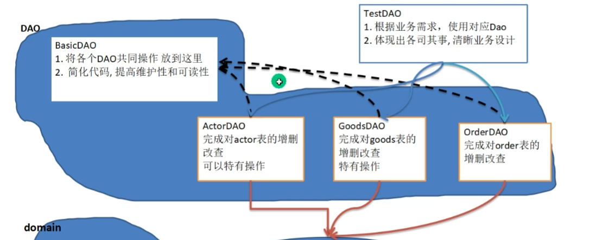

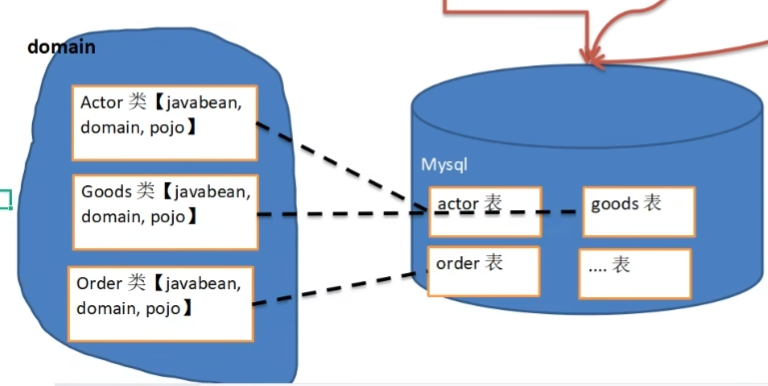

## Maven

Maven是专门用于管理和构建Java项目的工具，他提供一套标准化项目结构，标准化构建流程和依赖管理机制，主要是帮助着写代码的。

### 项目结构

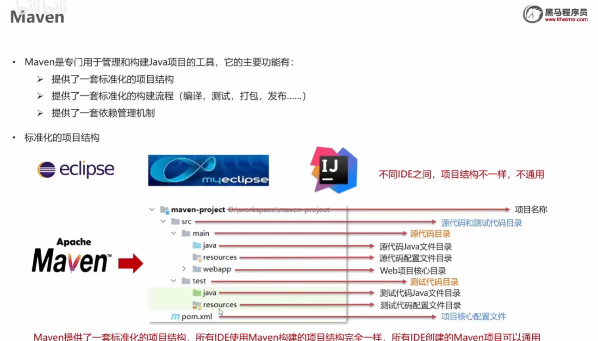

### 构建流程

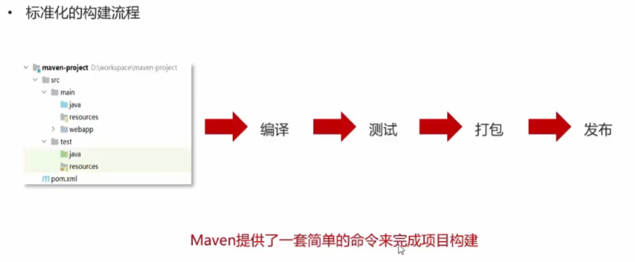

Maven的project提供一键编译、打包的功能

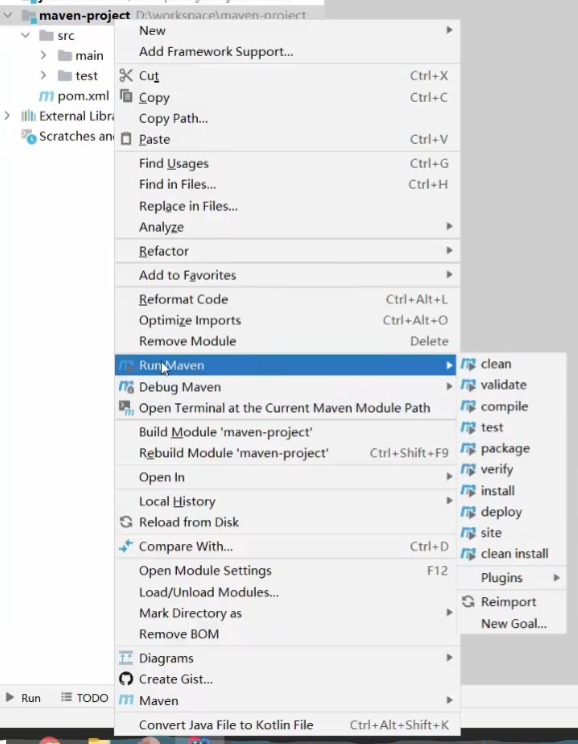

### 依赖管理

jar包老式导入当时是这么整的


Maven用这个就行


Maven架构下能有这么些仓库


往pom.xml导入依赖，上网搜就行。

### 依赖范围

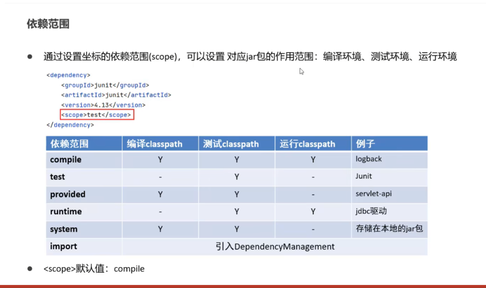

编译环境就是Maven项目的java文件夹下，测试就是在test目录下。

## MyBatics

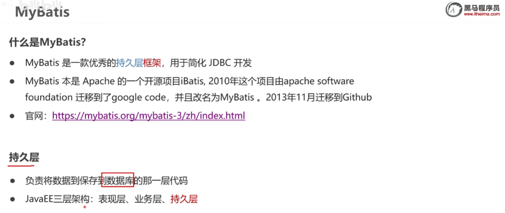

那为啥要用MyBatics简化，主要是JDBC硬编码多还不大好用

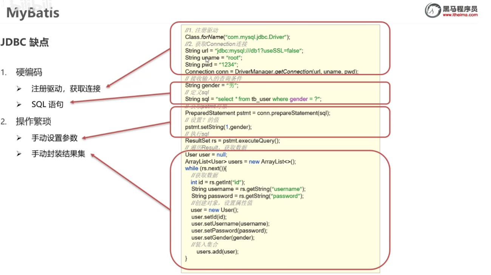

而对于MyBatics采用硬编码配置文件，自动完成一些繁琐的配置如设置参数啥的。

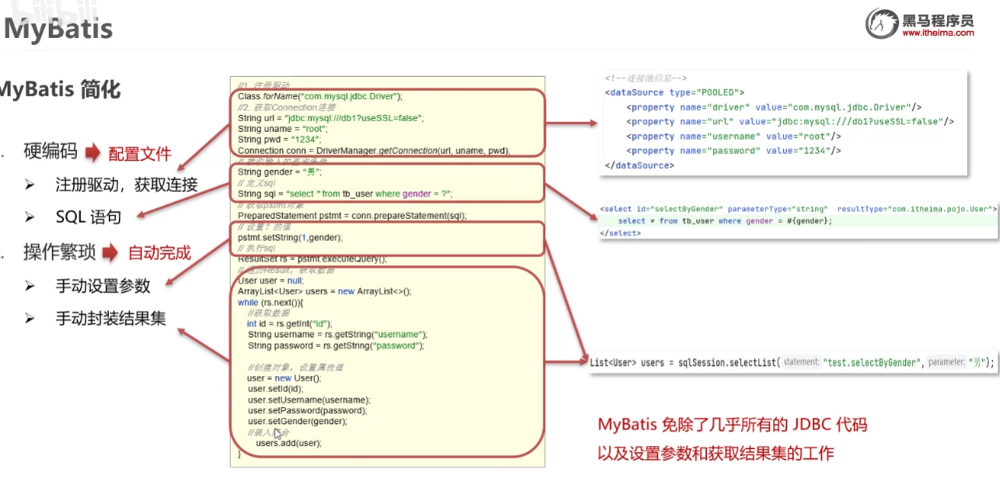

### 相关配置


别名


这样设定后这个包下的类名都能作为别名充当查询语句的返回值，不区分大小写。

## JavaWeb

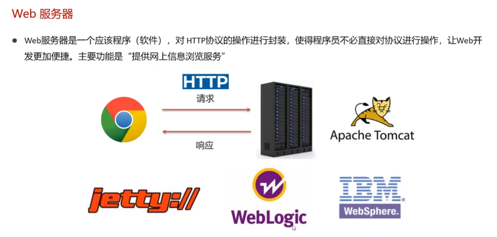 ........

## Servlet


执行流程


servelet声明周期，一个servlet对象只会被调用一次。

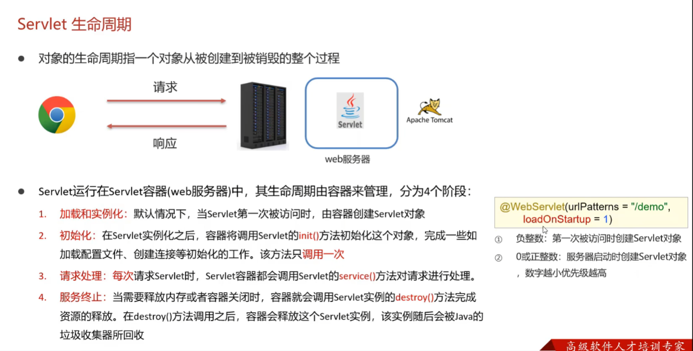

### Servlet体系结构

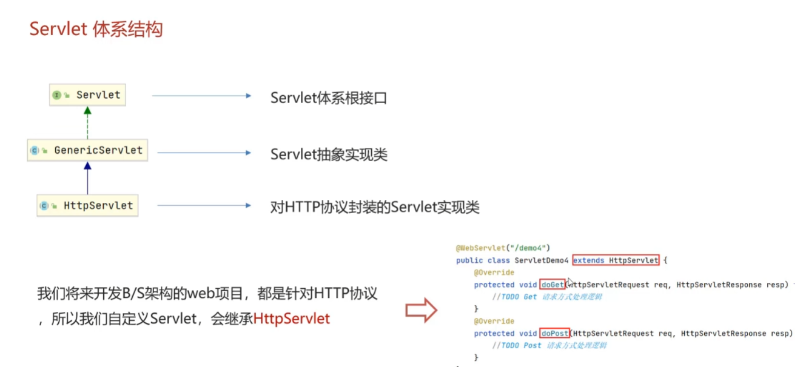

继承HttpServlet从而调用Get和Post。
