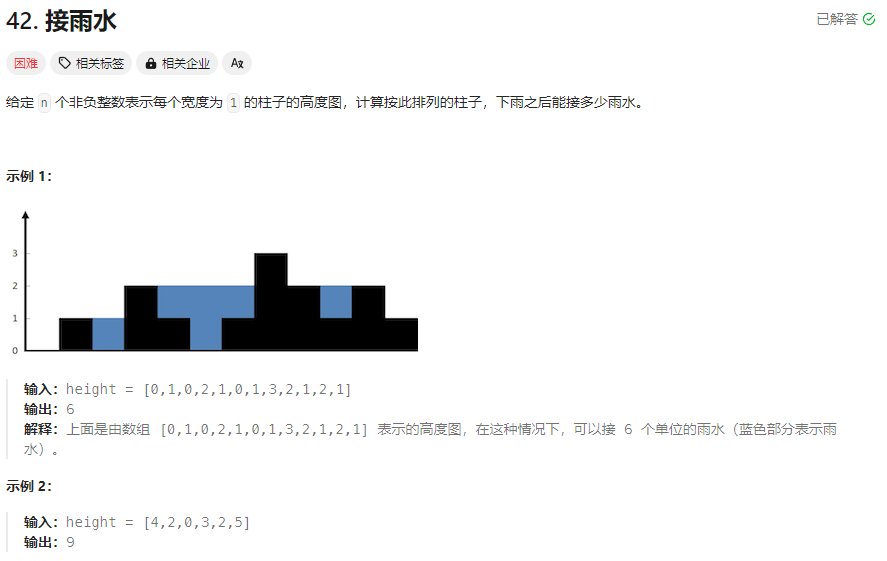

# LeetCode

2^32 ~= 2*10^10

## 数据结构知识

 顺序线性表：向量 Vector 

单链表 Singly Linked List 1. 双向链表 Double Linked Lists 2. 静态链表 Static List 3. 对称矩阵 Symmetric Matrix 4. 稀疏矩阵 Sparse Matrix 

哈希表 Hash Table 1. 散列函数 Hash Function 2. 解决碰撞/填充因⼦ Collision Resolution 

栈和队列 Stack & Queue 1. ⼴义表 Generalized List/GList 2. 双端队列 Deque 

队列Queue 1. 链表实现 Linked List Implementation 2. 循环数组实现 ArrayQueue 3. 双端队列 Deque 4. 优先队列 Priority Queue 5. 循环队列 Circular Queue 

字符串 String 1. KMP 算法 2. 有限状态⾃动机 3. 模式匹配有限状态⾃动机 4. BM 模式匹配算法 5. BM-KMP 算法 6. BF 算法 

树 Tree 1. ⼆叉树 Binary Tree 2. 并查集 Union-Find 3. Huffman 树 

数组实现的堆 Heap 1. 极⼤堆和极⼩堆 Max Heap and Min Heap 2. 极⼤极⼩堆 3. 双端堆 Deap 4. d 叉堆 

树实现的堆 Heap 1. 左堆 Leftist Tree/Leftist Heap 2. 扁堆 3. ⼆项式堆 4.斐波那契堆 Fibonacco Heap 5. 配对堆 Pairing Heap 

查找 Search 1. 哈希表 Hash 2. 跳跃表 Skip List 3. 排序⼆叉树 Binary Sort Tree 4. AVL 树 5. B 树 / B+ 树 / B* 树 6. AA 树 7. 红⿊树 Red Black Tree 8. 排序⼆叉堆 Binary Heap 9. Splay 树 10. 双链树 Double Chained Tree 11. Trie 树 12. R 树

## 1.判断数和是否为目标值（易）

给定一个整数数组 `nums` 和一个整数目标值 `target`，请你在该数组中找出 **和为目标值** *`target`* 的那 **两个** 整数，并返回它们的数组下标。

**示例 1：**

```
输入：nums = [2,7,11,15], target = 9
输出：[0,1]
解释：因为 nums[0] + nums[1] == 9 ，返回 [0, 1] 。
```

**示例 2：**

```
输入：nums = [3,2,4], target = 6
输出：[1,2]
```

**示例 3：**

```
输入：nums = [3,3], target = 6
输出：[0,1]
```

**提示：**

- `2 <= nums.length <= 104`
- `-109 <= nums[i] <= 109`
- `-109 <= target <= 109`
- **只会存在一个有效答案**

方法1.双指针，从数组两端往中间靠拢。执行时间26ms，beat38%。其本质是温和一点的暴力算法。本质为O(n^2)。

```java
class Solution {
    public int[] twoSum(int[] nums, int target) {
        int[] result = {0, 1};
        int temp ;
        for (int i = 0; i < nums.length ; i++) {
            temp = target - nums[i];//最初的版本，temp和result[0]都在循环的判断中，多次计算加减法会增加程序负担，因此在算法固定的情况下，尽可能缩减运算量
             result[0] = i;
            for(int j = i + 1 , k = nums.length - 1; j <= k; j++, k--){
                if( temp == nums[j]){
                    result[1] = j;
                    return result;
                }
                if(temp == nums[k]){
                    result[1] = k;
                    return result;
                }
            }
        }
        return null;
    }
}
```

方法2.哈希表。思路为降低查找target-x的时间复杂度，从O(n)降到O(1)。beat 99.83%。

```java
public int[] twoSum(int[] nums, int target) {
    HashMap<Integer, Integer> map  = new HashMap<Integer, Integer>();
    int temp;
    int x;
        for(int i = 0; i < nums.length; i++){
            temp =nums[i];
            x = target - temp;
            if(map.containsKey(x)){
                return new int[]{map.get(x), i};
            }
            map.put(temp, i);
        }
        return null;
    }
}
```

方法3. 1+2.为什么呢，因为方法二仍然有遍历，遍历就能用双指针。遥遥领先啊，beat 100%。

```java
public int[] twoSum(int[] nums, int target) {
    HashMap<Integer,Integer> map = new HashMap<>();
    Integer temp;
    Integer cha;
    for(int i=0,j=nums.length-1; i<=j; i++,j--) {
        temp = nums[i];
        cha = target - temp;
        if(!map.containsKey(cha)){
            map.put(temp, i);
        }else {
            return new int[]{map.get(cha), i};
        }
        temp = nums[j];
        cha = target - temp;
        if(!map.containsKey(target - temp)){
            map.put(temp, j);
        }
        else {
            return new int[]{map.get(cha), j};
        }
        }
    return null;
    }
```

## 2.链表实现多位数相加（中）

https://leetcode.cn/problems/add-two-numbers/description/

给你两个 **非空** 的链表，表示两个非负的整数。它们每位数字都是按照 **逆序** 的方式存储的，并且每个节点只能存储 **一位** 数字。

请你将两个数相加，并以相同形式返回一个表示和的链表。

你可以假设除了数字 0 之外，这两个数都不会以 0 开头。

 

**示例 1：**


```
输入：l1 = [2,4,3], l2 = [5,6,4]
输出：[7,0,8]
解释：342 + 465 = 807.
```

**示例 2：**

```
输入：l1 = [0], l2 = [0]
输出：[0]
```

**示例 3：**

```
输入：l1 = [9,9,9,9,9,9,9], l2 = [9,9,9,9]
输出：[8,9,9,9,0,0,0,1]
```

 

**提示：**

- 每个链表中的节点数在范围 `[1, 100]` 内
- `0 <= Node.val <= 9`
- 题目数据保证列表表示的数字不含前导零

方法1.直觉做法。复杂度O(n)。

```java
  public ListNode addTwoNumbers(ListNode l1, ListNode l2) {
        ListNode pl1  = new ListNode(0);
        ListNode pl2 = pl1;
        int jinwei = 0;
        int temp = 0;
        while(l1 != null || l2 != null){
           if(l1 == null ){
               temp = l2.val + jinwei;
               l2 = l2.next;
           }
           else if(l2 == null){
               temp = l1.val + jinwei;
               l1 = l1.next;
           }
           else {
               temp = l1.val + l2.val + jinwei;
               l1 = l1.next;
               l2 = l2.next;
           }
           jinwei = temp / 10;
           temp %= 10;
            pl2.val = temp;
            if(!(l1 == null && l2 == null && jinwei == 0)){
                pl2.next = new ListNode();
                pl2 = pl2.next;
            }
        }
        if(jinwei == 1) pl2.val += jinwei;
       return pl1;
    }

```

没了，这是个实现就是成功的题

## 3.无重复字符的最长子串（中）

https://leetcode.cn/problems/longest-substring-without-repeating-characters/description/?utm_source=LCUS&utm_medium=ip_redirect&utm_campaign=transfer2china

给定一个字符串 `s` ，请你找出其中不含有重复字符的最长子串的长度。

**示例 1:**

```
输入: s = "abcabcbb"
输出: 3 
解释: 因为无重复字符的最长子串是 "abc"，所以其长度为 3。
```

**示例 2:**

```
输入: s = "bbbbb"
输出: 1
解释: 因为无重复字符的最长子串是 "b"，所以其长度为 1。
```

**示例 3:**

```
输入: s = "pwwkew"
输出: 3
解释: 因为无重复字符的最长子串是 "wke"，所以其长度为 3。
     请注意，你的答案必须是 子串 的长度，"pwke" 是一个子序列，不是子串。
```

方法1.右边指针i一边走，一边用哈希表记录出现次数，如果有字符已经在哈希表里被右指针发现，则将左指针更新至上一次该字符位置后一位，这样范围内就不会有该字符重复出现。需要注意，重复字符上次出现位置有可能在左指针左侧，也有可能在右侧，要确保左指针数值不会降低，否则就会出现重复数字，增长长度

```java
class Solution {
    public int lengthOfLongestSubstring(String s) {
        if (s.length()==0) return 0;
        HashMap<Character, Integer> map = new HashMap<Character, Integer>();
        int len = 0;
        int left = 0;
        for(int i = 0; i < s.length(); i ++){
            if(map.containsKey(s.charAt(i))){
                left = Math.max(left,map.get(s.charAt(i)) + 1);
            }
            map.put(s.charAt(i),i);
            len = Math.max(len,i-left+1);
        }
        return len;
    }
}


```

方法2.有人拿数组当哈希表......因为字符只有128个。

```java
 public int lengthOfLongestSubstring(String s) {
        int len = 0;
        int[] window = new int[128];
        int left = 0;
        int right = 0;
        while (right < s.length()) {
            char cr = s.charAt(right);
            window[cr]++;
            right++; //right固定右移扩大窗口

            while (window[cr] > 1) {
                char cl = s.charAt(left);
                window[cl]--;
                left++; //什么时候收缩?存在重复字符
            }
            len = Math.max(len, right - left); //什么时候更新答案:保证没有重复字符的时候
        }
        return len;
    }
```

3题是典型的不定长度滑动窗口法，不定长度滑动窗口常常是右侧动，而左侧根据一定条件右移或者静止。与之相对的定长度滑动窗口题438，则是定长度窗口有限，虽然不定长度也行，但是也要配合长度固定条件才能快速解开，不好想出来。

## 4.寻找两个正序数组中位数（难）

https://leetcode.cn/problems/median-of-two-sorted-arrays/description/?utm_source=LCUS&utm_medium=ip_redirect&utm_campaign=transfer2china

给定两个大小分别为 `m` 和 `n` 的正序（从小到大）数组 `nums1` 和 `nums2`。请你找出并返回这两个正序数组的 **中位数** 。

算法的时间复杂度应该为 `O(log (m+n))` 。

**示例 1：**

```
输入：nums1 = [1,3], nums2 = [2]
输出：2.00000
解释：合并数组 = [1,2,3] ，中位数 2
```

**示例 2：**

```
输入：nums1 = [1,2], nums2 = [3,4]
输出：2.50000
解释：合并数组 = [1,2,3,4] ，中位数 (2 + 3) / 2 = 2.5
```

**提示：**

- `nums1.length == m`
- `nums2.length == n`
- `0 <= m <= 1000`
- `0 <= n <= 1000`
- `1 <= m + n <= 2000`
- `-106 <= nums1[i], nums2[i] <= 106`

方法1.找两个指针分别指向数组，然后用一个数记录每次执行的的相比较小值（或者比较两个数大小，取大的值）

```java
public double findMedianSortedArrays(int[] A, int[] B) {
    int m = A.length;
    int n = B.length;
    int len = m + n;
    int left = -1, right = -1;
    int aStart = 0, bStart = 0;
    for (int i = 0; i <= len / 2; i++) {
        left = right;
        if (aStart < m && (bStart >= n || A[aStart] < B[bStart])) {//这个判断很简洁好用
            right = A[aStart++];
        } else {
            right = B[bStart++];
        }
    }
    if ((len & 1) == 0)
        return (left + right) / 2.0;
    else
        return right;
}
```

方法2.二分法查找

有时候感觉递归写出来比循环有用，有时候只能用递归。这里要点名长度和坐标的转换关系，len = p2 - p1 + 1,p2 = p1 + len - 1。

```java
public double findMedianSortedArrays(int[] nums1, int[] nums2) {
    int n = nums1.length;
    int m = nums2.length;
    int left = (n + m + 1) / 2;
    int right = (n + m + 2) / 2;
    //将偶数和奇数的情况合并，如果是奇数，会求两次同样的 k 。
    return (getKth(nums1, 0, n - 1, nums2, 0, m - 1, left) + getKth(nums1, 0, n - 1, nums2, 0, m - 1, right)) * 0.5;  
}
    
    private int getKth(int[] nums1, int start1, int end1, int[] nums2, int start2, int end2, int k) {
        int len1 = end1 - start1 + 1;
        int len2 = end2 - start2 + 1;
        //让 len1 的长度小于 len2，这样就能保证如果有数组空了，一定是 len1 
        if (len1 > len2) return getKth(nums2, start2, end2, nums1, start1, end1, k);
        if (len1 == 0) return nums2[start2 + k - 1];

        if (k == 1) return Math.min(nums1[start1], nums2[start2]);

        int i = start1 + Math.min(len1, k / 2) - 1;
        int j = start2 + Math.min(len2, k / 2) - 1;

        if (nums1[i] > nums2[j]) {
            return getKth(nums1, start1, end1, nums2, j + 1, end2, k - (j - start2 + 1));
        }
        else {
            return getKth(nums1, i + 1, end1, nums2, start2, end2, k - (i - start1 + 1));
        }
    }
```

## 5.最长回文数字

如果字符串的反序与原始字符串相同，则该字符串称为回文字符串。

**示例 1：**

```
输入：s = "babad"
输出："bab"
解释："aba" 同样是符合题意的答案。
```

**示例 2：**

```
输入：s = "cbbd"
输出："bb"
```

**提示：**

- `1 <= s.length <= 1000`
- `s` 仅由数字和英文字母组成

方法1.中分，双指针囊括奇偶数，注意逻辑，有空再写一遍

```JAVA
 public String longestPalindrome(String s) {
        int[] max = new int[]{0, 0};//初始位置和长度
        int[] temp;
        if(s.length() == 1) return s;
        for(int i = 0; i < s.length() - 1; i++){
            temp = findPalindrome(s, i, i);
            if(temp[1] >= max[1]){
                max = temp;
            }
            temp = findPalindrome(s, i, i + 1);
            if(temp[1] >= max[1]){
                max = temp;
            }
        }

        return s.substring(max[0], max[1] + max[0] );
    }

    private static int[] findPalindrome(String s, int index1, int index2){
        while(index1 >= 0 && index2 <= s.length() - 1){
            if(s.charAt(index1) == s.charAt(index2)){
                index1--;
                index2++;
            }else{
                index1++;
                index2--;
                return new int[]{Math.min(index1, index2), index2 - index1  + 1};
            }

        }
        return new int[]{index1 + 1, index2 - index1 - 1};
    }

```

2.动态规划。要求题目有状态转移性质，本题中：一个长度严格大于 222 的回文去掉头尾字符以后，剩下的部分依然是回文。反之，如果一个字符串头尾两个字符都不相等，那么这个字符串一定不是回文。「动态规划」的方法根据这样的性质得到。该方法会枚举字符串左右界，因此，时间复杂度和空间复杂度为O（n^2）。他本质是个表格法。

填表过程中，需要先得到小字符串是否为回文的结果，然后大字串参考小字串的判断结果，因此填表顺序很重要。

```java
  public String longestPalindrome(String s) {
        int len = s.length();
        if(len <= 1) return s;
        boolean[][] dp = new boolean[len][len];
        int[] result = new int[]{0, 1};
        int temp = 0;
        for(int i = 0; i < len; i++){
            dp[i][i] = true;
        }
        for(int i = len - 2; i >= 0; i--){
            for(int j = i + 1; j < len; j++){
                if(s.charAt(i) == s.charAt(j)){
                    temp = j - i + 1;
                    if(temp <= 2){
                        dp[i][j] = true;
                    }else{
                     dp[i][j] = dp[i + 1][j - 1];
                    }
                }else{
                    dp[i][j] = false;
                }
                if(dp[i][j] == true){
                    if(temp >= result[1]){
                        result[1] = temp;
                        result[0] = i;
                    }
                }
            }
        }
        return s.substring(result[0], result[1] + result[0] );
    }//还不如方法1，beat 20%
```

## 6.Z字形变换

将一个给定字符串 `s` 根据给定的行数 `numRows` ，以从上往下、从左到右进行 Z 字形排列。

比如输入字符串为 `"PAYPALISHIRING"` 行数为 `3` 时，排列如下：

```
P   A   H   N
A P L S I I G
Y   I   R
```

之后，你的输出需要从左往右逐行读取，产生出一个新的字符串，比如：`"PAHNAPLSIIGYIR"`。

请你实现这个将字符串进行指定行数变换的函数：

```
string convert(string s, int numRows);
```

**示例 1：**

```
输入：s = "PAYPALISHIRING", numRows = 3
输出："PAHNAPLSIIGYIR"
```

**示例 2：**

```
输入：s = "PAYPALISHIRING", numRows = 4
输出："PINALSIGYAHRPI"
解释：
P     I    N
A   L S  I G
Y A   H R
P     I
```

**示例 3：**

```
输入：s = "A", numRows = 1
输出："A"
```

**提示：**

- `1 <= s.length <= 1000`
- `s` 由英文字母（小写和大写）、`','` 和 `'.'` 组成
- `1 <= numRows <= 1000`

下边是我自己写的，想多了

```java
public class Solution_6 {
    public String convert(String s, int numRows) {
        char[] arr = s.toCharArray();
        if(numRows == 1 || s.length() <= numRows) return s;
        String[] temp = new String[numRows];
        for(int i = 0; i < numRows; i++){
            temp[i] = "";
        }
        int len = 2 * numRows - 2;
        int num1 = s.length() / len;
        int num2 = s.length() % len;// 剩下的杂鱼
        if (num1 != 0) {// 先算前几个len内的z组成
            for (int i = 0; i < num1; i++) {
                for (int j = 0; j < numRows; j++) {
                    if (j == 0 || j == numRows - 1) {
                        temp[j] += arr[i * len + j];
                    }else temp[j] = temp[j] + arr[i * len + j] + arr[(i + 1) * len - j];
                }
            }
        }
        if(num2 <= numRows){
            for(int j = 0; j < num2; j++){
                temp[j] += arr[num1 * len + j];
            }
        }else{
            for(int j = 0; j < numRows; j++){
                temp[j] += arr[num1 * len + j];
            }
            for(int j = 1; j <= num2 - numRows; j++){
                temp[numRows - 1 - j ]  += arr[numRows + j + 1 + num1 * len];
            }
        }

        String result = "";
        for(int i = 0; i < numRows; i++){
            result += temp[i];
        }
        return result;

    }

    public static void main(String[] args) {
        System.out.println(new Solution_6().convert("ABCDE", 4));
    }
}
```


直接遍历一遍，然后数组依次反一下就好了，属事实往复杂写不知道找个优解

```java
public String convert(String s, int numRows) {
        if(numRows < 2) return s;
        List<StringBuilder> rows = new ArrayList<StringBuilder>();//
        for(int i = 0; i < numRows; i++) rows.add(new StringBuilder());
        int i = 0, flag = -1;
        for(char c : s.toCharArray()) {
            rows.get(i).append(c);
            if(i == 0 || i == numRows -1) flag = - flag;
            i += flag;
        }
        StringBuilder res = new StringBuilder();
        for(StringBuilder row : rows) res.append(row);
        return res.toString();
    }
```

## 7.整数反转

给你一个 32 位的有符号整数 `x` ，返回将 `x` 中的数字部分反转后的结果。

如果反转后整数超过 32 位的有符号整数的范围 `[−231, 231 − 1]` ，就返回 0。

**假设环境不允许存储 64 位整数（有符号或无符号）。**

**示例 1：**

```
输入：x = 123
输出：321
```

**示例 2：**

```
输入：x = -123
输出：-321
```

**示例 3：**

```
输入：x = 120
输出：21
```

**示例 4：**

```
输入：x = 0
输出：0
```

**提示：**

- `-231 <= x <= 231 - 1`

别傻乎乎的去转字符串就行，字符和整型还是很像的。

```java
public class Solution_7 {
    public int reverse(int x) {
        double low = -1 * Math.pow(2, 31);
        double high = Math.pow(2, 31) - 1;
        int key = 0;
        long result = 0;
        int temp = 0;
        if(-9 <= x && x <= 9) return x;
        while(x != 0){
            temp = x % 10;
            x /= 10;
            if(key == 0 && temp == 0) continue;
            else {
                key = 1;
                result = result * 10 + temp;
            }
        }
        if(result < low || result > high) return 0;
        return (int)result;
    }
}
```

## 8.字符串转整数

atoi接口

请你来实现一个 `myAtoi(string s)` 函数，使其能将字符串转换成一个 32 位有符号整数（类似 C/C++ 中的 `atoi` 函数）。

函数 `myAtoi(string s)` 的算法如下：

1. 读入字符串并丢弃无用的前导空格
2. 检查下一个字符（假设还未到字符末尾）为正还是负号，读取该字符（如果有）。 确定最终结果是负数还是正数。 如果两者都不存在，则假定结果为正。
3. 读入下一个字符，直到到达下一个非数字字符或到达输入的结尾。字符串的其余部分将被忽略。
4. 将前面步骤读入的这些数字转换为整数（即，"123" -> 123， "0032" -> 32）。如果没有读入数字，则整数为 `0` 。必要时更改符号（从步骤 2 开始）。
5. 如果整数数超过 32 位有符号整数范围 `[−231, 231 − 1]` ，需要截断这个整数，使其保持在这个范围内。具体来说，小于 `−231` 的整数应该被固定为 `−231` ，大于 `231 − 1` 的整数应该被固定为 `231 − 1` 。
6. 返回整数作为最终结果。

**注意：**

- 本题中的空白字符只包括空格字符 `' '` 。
- 除前导空格或数字后的其余字符串外，**请勿忽略** 任何其他字符。

**示例 1：**

```
输入：s = "42"
输出：42
解释：加粗的字符串为已经读入的字符，插入符号是当前读取的字符。
第 1 步："42"（当前没有读入字符，因为没有前导空格）
         ^
第 2 步："42"（当前没有读入字符，因为这里不存在 '-' 或者 '+'）
         ^
第 3 步："42"（读入 "42"）
           ^
解析得到整数 42 。
由于 "42" 在范围 [-231, 231 - 1] 内，最终结果为 42 。
```

**示例 2：**

```
输入：s = "   -42"
输出：-42
解释：
第 1 步："   -42"（读入前导空格，但忽视掉）
            ^
第 2 步："   -42"（读入 '-' 字符，所以结果应该是负数）
             ^
第 3 步："   -42"（读入 "42"）
               ^
解析得到整数 -42 。
由于 "-42" 在范围 [-231, 231 - 1] 内，最终结果为 -42 。
```

**示例 3：**

```
输入：s = "4193 with words"
输出：4193
解释：
第 1 步："4193 with words"（当前没有读入字符，因为没有前导空格）
         ^
第 2 步："4193 with words"（当前没有读入字符，因为这里不存在 '-' 或者 '+'）
         ^
第 3 步："4193 with words"（读入 "4193"；由于下一个字符不是一个数字，所以读入停止）
             ^
解析得到整数 4193 。
由于 "4193" 在范围 [-231, 231 - 1] 内，最终结果为 4193 。
```

**提示：**

- `0 <= s.length <= 200`
- `s` 由英文字母（大写和小写）、数字（`0-9`）、`' '`、`'+'`、`'-'` 和 `'.'` 组成

实现题，但是这题老刁了，而且要求不清楚。如果第一个非空字符不是数字，直接0；第一个正负号就是要找的数字的开头，如果正负号后跟的不是数字，0。beat 100%。没什么好说的，坑全过一遍就行。

注意， result = result * 10 + sign * (current - '0');这句命令本身就能剔除符号到1-9之间的0.

```java
public class Solution {
     public int myAtoi(String s) {
        int len = s.length();
        int max = Integer.MAX_VALUE;
        int min = Integer.MIN_VALUE ;
        int result = 0;
        boolean start = false;
        boolean end = false;
        int sign = 1;

        char current = ' ';
        int index = 0;
        if(len == 1){
            if(s.charAt(0) <= '9' && s.charAt(0) >= '0')
                return s.charAt(0) - '0';
            else return result;
        }
        for(int i = 0; i < len; i++){
            if(i == len - 1) return result;
            if(s.charAt(i)  == ' ') continue;
             else {
                index = i;
                break;
            }
            
        }
        for(int i = index; i < len; i++){
            if(end && start) break;
            current = s.charAt(i);
            if(current == '+' ){
                if(!start) {
                    sign = 1;
                    start = true;
                }
                else end = true;
            }else if (current == '-'){
                if(!start) {
                    sign = -1;
                    start = true;
                }
                else end = true;
            }else if(current <= '9' && current >= '0'){// '0' * 2 == 96
                start = true;
                if(result > max / 10 || (result == max / 10 && (current - '0') > max % 10))
                    return max;
                else if (result < min / 10|| (result == min / 10 && -1 * (current - '0') < min % 10)) {
                    return min;
                }
                result = result * 10 + sign * (current - '0');
            } else {
                return result;
            }
        }
        return result;
    }
}
```

## 9.回文数字

给你一个整数 `x` ，如果 `x` 是一个回文整数，返回 `true` ；否则，返回 `false` 。

回文数

是指正序（从左向右）和倒序（从右向左）读都是一样的整数。


- 例如，`121` 是回文，而 `123` 不是。

**示例 1：**

```
输入：x = 121
输出：true
```

**示例 2：**

```
输入：x = -121
输出：false
解释：从左向右读, 为 -121 。 从右向左读, 为 121- 。因此它不是一个回文数。
```

**示例 3：**

```
输入：x = 10
输出：false
解释：从右向左读, 为 01 。因此它不是一个回文数。
```

**提示：**

- `-2^31 <= x <= 2^31 - 1`

**进阶：**你能不将整数转为字符串来解决这个问题吗？

这道题能表明字符串和整型之间的一些共同点与不同点。解决字符串问题和整型问题都会碰到中位数，对于字符串而言，中位数在长度为奇偶数问题上可以使用双指针同时囊括奇偶情况，而整型并不能获取长度，查找其中间，可以使用数值反转的方法，每次取出最后一位，与上次取出一位 * 10的数值相加，如果长度为偶数且为回文数，那么会出现反转数值等于取出最后一位后的数值；如果长度为奇数且为回文数，那么反转数值不可能直接等于取出末位后的数值，需要让后者除以10（java 整型除整型结果整型）才能相等。

特殊情况，复数，不可为回文数；0-9，直接返回true；末尾为0的，一定不是回文数。

```java
public class Solution_9 {
    public boolean isPalindrome(int x) {
        if(x < 0) return false;
        if(0<= x && x <= 9) return true;
        if(x % 10 == 0) return false;
        int reverse = 0;
        int norme = x;
        int temp = 0;
        while (reverse <= norme){
            temp = norme % 10;
            reverse = temp + reverse * 10;
            norme /= 10;
            if(reverse == norme || reverse ==  norme / 10) return true;
        }
        return false;
    }
}

```

## 10.正则表达式匹配

给你一个字符串 `s` 和一个字符规律 `p`，请你来实现一个支持 `'.'` 和 `'*'` 的正则表达式匹配。

- `'.'` 匹配任意单个字符
- `'*'` 匹配零个或多个前面的那一个元素

所谓匹配，是要涵盖 **整个** 字符串 `s`的，而不是部分字符串。

**示例 1：**

```
输入：s = "aa", p = "a"
输出：false
解释："a" 无法匹配 "aa" 整个字符串。
```

**示例 2:**

```
输入：s = "aa", p = "a*"
输出：true
解释：因为 '*' 代表可以匹配零个或多个前面的那一个元素, 在这里前面的元素就是 'a'。因此，字符串 "aa" 可被视为 'a' 重复了一次。
```

**示例 3：**

```
输入：s = "ab", p = ".*"
输出：true
解释：".*" 表示可匹配零个或多个（'*'）任意字符（'.'）。
```

**提示：**

- `1 <= s.length <= 20`
- `1 <= p.length <= 20`
- `s` 只包含从 `a-z` 的小写字母。
- `p` 只包含从 `a-z` 的小写字母，以及字符 `.` 和 `*`。
- 保证每次出现字符 `*` 时，前面都匹配到有效的字符

动态对话，dp记录s前i个字符和p前j个字符是否匹配。关键是如何得出状态转移方程，这里就是分情况讨论解决的。

```java
class Solution {
    public boolean isMatch(String s, String p) {
        int m = s.length();
        int n = p.length();

        boolean[][] f = new boolean[m + 1][n + 1];
        f[0][0] = true;
        for (int i = 0; i <= m; ++i) {
            for (int j = 1; j <= n; ++j) {
                if (p.charAt(j - 1) == '*') {
                    f[i][j] = f[i][j - 2];
                    if (matches(s, p, i, j - 1)) {
                        f[i][j] = f[i][j] || f[i - 1][j];//如果是*，前一个字符匹配则削减s的一个字符看他前一个符不符合；削减完，代表x*匹配一个空字符，j就减去2去除那个带星的字符
                    }
                } else {
                    if (matches(s, p, i, j)) {//s第i字符和p第j字符
                        f[i][j] = f[i - 1][j - 1];
                    }
                }
            }
        }
        return f[m][n];
    }

    public boolean matches(String s, String p, int i, int j) {
        if (i == 0) {
            return false;
        }
        if (p.charAt(j - 1) == '.') {
            return true;
        }
        return s.charAt(i - 1) == p.charAt(j - 1);
    }
}

```


## 11.盛更多水的容器

给定一个长度为 `n` 的整数数组 `height` 。有 `n` 条垂线，第 `i` 条线的两个端点是 `(i, 0)` 和 `(i, height[i])` 。

找出其中的两条线，使得它们与 `x` 轴共同构成的容器可以容纳最多的水。

返回容器可以储存的最大水量。

**说明：**你不能倾斜容器。

**示例 1：**


```
输入：[1,8,6,2,5,4,8,3,7]
输出：49 
解释：图中垂直线代表输入数组 [1,8,6,2,5,4,8,3,7]。在此情况下，容器能够容纳水（表示为蓝色部分）的最大值为 49。
```

**示例 2：**

```
输入：height = [1,1]
输出：1
```

**提示：**

- `n == height.length`
- `2 <= n <= 105`
- `0 <= height[i] <= 104`

这道题为数组题，使用双指针（总不能是二分法吧，那是查找目标数的）。虽然想到了从两边往中间靠拢的方法，但是没有意识到靠拢过程并不是左指针动一下，右指针动一下，而是根据左右指针对应数值的高低，动低数值的指针对应的数值。**下次使用双指针要考虑，放置在哪里，动指针的条件是什么。**

```java
class Solution {
  public int maxArea(int[] height) {
       
        int max = 0;
        int p1 = 0;
        int p2 = height.length - 1;
        while (p1 <= p2) {
            max = Math.max(height[p1] > height[p2]?(p2 - p1) * height[p2--]:(p2 - p1) * height[p1++], max);
        }
        return max;
    }
}
```

## 12.整数转罗马数字

罗马数字包含以下七种字符： `I`， `V`， `X`， `L`，`C`，`D` 和 `M`。

```
字符          数值
I             1
V             5
X             10
L             50
C             100
D             500
M             1000
```

例如， 罗马数字 2 写做 `II` ，即为两个并列的 1。12 写做 `XII` ，即为 `X` + `II` 。 27 写做 `XXVII`, 即为 `XX` + `V` + `II` 。

通常情况下，罗马数字中小的数字在大的数字的右边。但也存在特例，例如 4 不写做 `IIII`，而是 `IV`。数字 1 在数字 5 的左边，所表示的数等于大数 5 减小数 1 得到的数值 4 。同样地，数字 9 表示为 `IX`。这个特殊的规则只适用于以下六种情况：

- `I` 可以放在 `V` (5) 和 `X` (10) 的左边，来表示 4 和 9。
- `X` 可以放在 `L` (50) 和 `C` (100) 的左边，来表示 40 和 90。 
- `C` 可以放在 `D` (500) 和 `M` (1000) 的左边，来表示 400 和 900。

给你一个整数，将其转为罗马数字。

**示例 1:**

```
输入: num = 3
输出: "III"
```

**示例 2:**

```
输入: num = 4
输出: "IV"
```

**示例 3:**

```
输入: num = 9
输出: "IX"
```

**示例 4:**

```
输入: num = 58
输出: "LVIII"
解释: L = 50, V = 5, III = 3.
```

**示例 5:**

```
输入: num = 1994
输出: "MCMXCIV"
解释: M = 1000, CM = 900, XC = 90, IV = 4.
```

**提示：**

- `1 <= num <= 3999`

这里需要使用贪心算法，从{1000, 900, 500, 400, 100, 90, 50, 40, 10, 9, 5, 4, 1}的顺序一个个对看匹不匹配，需要注意能用贪心是因为给的罗马数字适合当货币，**有的给的货币很不好就不适合使用贪心算法了，因为那个时候在每一步都尽量使用最大面值“货币”时，结果反而不如人意。能不能用贪心需要判断。**

```java
class Solution {
     public String intToRoman(int num) {
        int[] nums = {1000, 900, 500, 400, 100, 90, 50, 40, 10, 9, 5, 4, 1};
        String[] str = {"M", "CM", "D", "CD", "C", "XC", "L", "XL", "X", "IX", "V", "IV", "I"};
        StringBuilder sb = new StringBuilder();
        int temp;
        for(int i = 0; i < nums.length; i++){
            if(nums[i] > num) continue;
            temp = num / nums[i];
            num %= nums[i];
            while(temp-- > 0)sb.append(str[i]);
        }
        return sb.toString();
    }
}
```

## 13.罗马数字转整数

罗马数字包含以下七种字符: `I`， `V`， `X`， `L`，`C`，`D` 和 `M`。

```
字符          数值
I             1
V             5
X             10
L             50
C             100
D             500
M             1000
```

例如， 罗马数字 `2` 写做 `II` ，即为两个并列的 1 。`12` 写做 `XII` ，即为 `X` + `II` 。 `27` 写做 `XXVII`, 即为 `XX` + `V` + `II` 。

通常情况下，罗马数字中小的数字在大的数字的右边。但也存在特例，例如 4 不写做 `IIII`，而是 `IV`。数字 1 在数字 5 的左边，所表示的数等于大数 5 减小数 1 得到的数值 4 。同样地，数字 9 表示为 `IX`。这个特殊的规则只适用于以下六种情况：

- `I` 可以放在 `V` (5) 和 `X` (10) 的左边，来表示 4 和 9。
- `X` 可以放在 `L` (50) 和 `C` (100) 的左边，来表示 40 和 90。 
- `C` 可以放在 `D` (500) 和 `M` (1000) 的左边，来表示 400 和 900。

给定一个罗马数字，将其转换成整数。

**示例 1:**

```
输入: s = "III"
输出: 3
```

**示例 2:**

```
输入: s = "IV"
输出: 4
```

**示例 3:**

```
输入: s = "IX"
输出: 9
```

**示例 4:**

```
输入: s = "LVIII"
输出: 58
解释: L = 50, V= 5, III = 3.
```

**示例 5:**

```
输入: s = "MCMXCIV"
输出: 1994
解释: M = 1000, CM = 900, XC = 90, IV = 4.
```

**提示：**

- `1 <= s.length <= 15`
- `s` 仅含字符 `('I', 'V', 'X', 'L', 'C', 'D', 'M')`
- 题目数据保证 `s` 是一个有效的罗马数字，且表示整数在范围 `[1, 3999]` 内
- 题目所给测试用例皆符合罗马数字书写规则，不会出现跨位等情况。
- IL 和 IM 这样的例子并不符合题目要求，49 应该写作 XLIX，999 应该写作 CMXCIX 。
- 关于罗马数字的详尽书写规则，可以参考 [罗马数字 - Mathematics ](https://b2b.partcommunity.com/community/knowledge/zh_CN/detail/10753/罗马数字#knowledge_article)。

我最初是打算用哈希表记录罗马数进行匹配的，但是**哈希表的创建和调用还是没有switch快**。如果是锁定的查找选项，使用switch或者if进行判断就行，**如果在遍历过程中需要添加东西或者删除东西，可以使用哈希表**（如果删除的是字符，还能用字符当数组索引操作数组，6）

```java
class Solution {
    public int romanToInt(String s) {
      
        int len = s.length();
        int result = 0;
        if(len == 1) return getValue(s.charAt(0));
        for(int i = 0; i < len; i++){
            if(i == 0){
                result += getValue(s.charAt(0));
                continue;
            }
            if(getValue(s.charAt(i - 1)) >= getValue(s.charAt(i))) result += getValue(s.charAt(i));
            else result += (getValue(s.charAt(i)) - 2 * getValue(s.charAt(i - 1)));
        }
        return result;
    }

    private int getValue(char ch) {
        switch (ch) {
            case 'I':
                return 1;
            case 'V':
                return 5;
            case 'X':
                return 10;
            case 'L':
                return 50;
            case 'C':
                return 100;
            case 'D':
                return 500;
            case 'M':
                return 1000;
            default:
                return 0;
        }
    }
}
```

## 15.三数之和

给你一个整数数组 `nums` ，判断是否存在三元组 `[nums[i], nums[j], nums[k]]` 满足 `i != j`、`i != k` 且 `j != k` ，同时还满足 `nums[i] + nums[j] + nums[k] == 0` 。请

你返回所有和为 `0` 且不重复的三元组。

**注意：**答案中不可以包含重复的三元组。 

**示例 1：**

```
输入：nums = [-1,0,1,2,-1,-4]
输出：[[-1,-1,2],[-1,0,1]]
解释：
nums[0] + nums[1] + nums[2] = (-1) + 0 + 1 = 0 。
nums[1] + nums[2] + nums[4] = 0 + 1 + (-1) = 0 。
nums[0] + nums[3] + nums[4] = (-1) + 2 + (-1) = 0 。
不同的三元组是 [-1,0,1] 和 [-1,-1,2] 。
注意，输出的顺序和三元组的顺序并不重要。
```

**示例 2：**

```
输入：nums = [0,1,1]
输出：[]
解释：唯一可能的三元组和不为 0 。
```

**示例 3：**

```
输入：nums = [0,0,0]
输出：[[0,0,0]]
解释：唯一可能的三元组和为 0 。
```

**提示：**

- `3 <= nums.length <= 3000`
- `-105 <= nums[i] <= 105`

双指针玩出花了。后边还有个四数之和，感觉，不如跳河。

```java
class Solution {
     public List<List<Integer>> threeSum(int[] nums) {
     Arrays.sort(nums);
     List<List<Integer>> result = new ArrayList<List<Integer>>();
     int left;
     int right;
     int len = nums.length - 1;
     for(int i = 0; i < len - 1 ; i++){
         if(i > 0 && nums[i] == nums[i - 1]) continue;
         left = i + 1;
         right = len;
         while ( left < right) {
             if(-1 * nums[i] > nums[left] + nums[right]) while(left < right && nums[left] == nums[++left]);
             else if (-1 * nums[i] < nums[left] + nums[right]) while (left < right && nums[right] == nums[--right]);
             else{
                 result.add(new ArrayList<>(Arrays.asList(nums[i], nums[left], nums[right])));
                 while(left < right && nums[left] == nums[++left]);//左指针一直右移动到不同的第一个数
                 while (left < right && nums[right] == nums[--right]);//右指针同理
             }

         }
     }
     return result;
     }
}
```


## 17.电话号码数字组合

给定一个仅包含数字 `2-9` 的字符串，返回所有它能表示的字母组合。答案可以按 **任意顺序** 返回。

给出数字到字母的映射如下（与电话按键相同）。注意 1 不对应任何字母。


**示例 1：**

```
输入：digits = "23"
输出：["ad","ae","af","bd","be","bf","cd","ce","cf"]
```

**示例 2：**

```
输入：digits = ""
输出：[]
```

**示例 3：**

```
输入：digits = "2"
输出：["a","b","c"]
```

**提示：**

- `0 <= digits.length <= 4`
- `digits[i]` 是范围 `['2', '9']` 的一个数字。

这个题涉及到回溯算法，所谓回溯，就是一种思想，通过递归这个方法来进行表达。说白就是递归，但是递归本身也挺暴力，所以能解决问题，但是不代表就耗费就小。

```java
mport java.util.ArrayList;
import java.util.List;

/**
 * @author lyx
 * @version 1.0
 */
public class Solution_17 {
    String[] letter_map = {" ","*","abc","def","ghi","jkl","mno","pqrs","tuv","wxyz"};
    List<String> res = new ArrayList<>();
    public List<String> letterCombinations(String digits) {
        if(digits.length() == 0) return new ArrayList<>();
        iterStr(digits, new StringBuilder(), 0);
        return res;
    }

    void iterStr(String str, StringBuilder letter, int index){


        if(index == str.length() ){
            res.add(letter.toString());
            return;
        }
        char c = str.charAt(index);
        String map = letter_map[c - '0'];
        for(int i = 0; i < map.length(); i++){
            char ch = map.charAt(i);
            letter.append(ch);
            iterStr(str, letter, index + 1);
            letter.deleteCharAt(letter.length() - 1);//这一步使得index最后一个map后可以直接换map下一个位置
        }
    }
}

```

## 19.删除链表的倒数第N个节点

给你一个链表，删除链表的倒数第 `n` 个结点，并且返回链表的头结点。

**示例 1：**


```
输入：head = [1,2,3,4,5], n = 2
输出：[1,2,3,5]
```

**示例 2：**

```
输入：head = [1], n = 1
输出：[]
```

**示例 3：**

```
输入：head = [1,2], n = 1
输出：[1]
```

**提示：**

- 链表中结点的数目为 `sz`
- `1 <= sz <= 30`
- `0 <= Node.val <= 100`
- `1 <= n <= sz`

 链表的操作基本就是基于实现进行编程。需要注意，去除倒数第n个数字，需要把指针放在倒数第n + 1个数上。如用count计什么时候开始操作指向倒数第n个数的指针向下边移动，因为一旦到达即可，p1就会直接向下走，所以count还得加个1，这个还是要通过画图决定。

另一个点，需要确定特殊情况，如[1] n = 1，那么这个方法不大好使，因为他只能除去p1后边那个数，不能除去p1自己。因此特殊情况为，倒数第n个数就是第一个数，以及倒数第n + 1个数为第一个数，但是后者可以正常剔除。因此刻意对应第一种情况就行。

```java
class Solution {
     public ListNode removeNthFromEnd(ListNode head, int n) {
        ListNode p2 = head;
        ListNode p1 = head;
        int count = 0;
        while(p2.next != null) {
            p2 = p2.next;
            count++;
            if(count >= n + 1 ) p1 = p1.next;
        }
        if(++count == n){
            head = head.next;
            return head;
        }
        ListNode p3 = p1;
        p1 = p1.next;
        p3.next = p1.next;
        p1.next = null;
        return head;
    }
}
```

## 20.有效的括号

给定一个只包括 `'('`，`')'`，`'{'`，`'}'`，`'['`，`']'` 的字符串 `s` ，判断字符串是否有效。

有效字符串需满足：

1. 左括号必须用相同类型的右括号闭合。
2. 左括号必须以正确的顺序闭合。
3. 每个右括号都有一个对应的相同类型的左括号。

**示例 1：**

```
输入：s = "()"
输出：true
```

**示例 2：**

```
输入：s = "()[]{}"
输出：true
```

**示例 3：**

```
输入：s = "(]"
输出：false
```

**提示：**

- `1 <= s.length <= 104`
- `s` 仅由括号 `'()[]{}'` 组成

这里有用栈这个存储结构比较好，下边是我自己写的，懵头懵脑给通过了

```java
class Solution {
 public boolean isValid(String s) {
        Stack st = new Stack();
        int len = s.length();
        if(len == 0 || len % 2 != 0) return false;

            for(char ch : s.toCharArray()){
                if(ch == '(' || ch == '{' || ch == '['){
                    st.push(ch);
                }else {
                    if (!st.empty()) {
                        if(ch == ')'){
                            if((char)st.peek() != '(') return false;
                            else st.pop();
                        } else if (ch == '}') {
                            if((char)st.peek() != '{') return false;
                            else st.pop();
                        } else if (ch == ']') {
                            if((char)st.peek() != '[') return false;
                            else st.pop();
                        }
                    }else return false;
                }
            }
            return st.empty();
    }
}
```

下边是别人写的言简意赅的，你瞅这写的，

```java
class Solution {
    public boolean isValid(String s) {
        char[] stack = new char[s.length()];
        int top = 0;
        for (char ch : s.toCharArray()) {
            if (ch == '(') {
                stack[top++] = ')';
            } else if (ch == '[') {
                stack[top++] = ']';
            } else if (ch == '{') {
                stack[top++] = '}';
            } else if (top == 0 || ch != stack[--top]) {//走到判断这里，一边判断一边出栈
                return false;
            }
        }
        return top == 0;
    }
}
```

## 21.合并两个有序链表

将两个升序链表合并为一个新的 **升序** 链表并返回。新链表是通过拼接给定的两个链表的所有节点组成的。 

**示例 1：**


```
输入：l1 = [1,2,4], l2 = [1,3,4]
输出：[1,1,2,3,4,4]
```

**示例 2：**

```
输入：l1 = [], l2 = []
输出：[]
```

**示例 3：**

```
输入：l1 = [], l2 = [0]
输出：[0]
```

**提示：**

- 两个链表的节点数目范围是 `[0, 50]`
- `-100 <= Node.val <= 100`
- `l1` 和 `l2` 均按 **非递减顺序** 排列

我开始时候会把head指向List2，p指向head，然后有这么一句，p.next = list2,啥意思 List2.mext = list2，衔尾蛇了属于是。这也是为啥head开头要先new下然后往后边开始指向。以及最后返回的是head.next，因此头部只是为了防止衔尾蛇。

```java
class Solution {
 public ListNode mergeTwoLists(ListNode list1, ListNode list2) {

        ListNode head = new ListNode();

        ListNode p = head;
        while (list1 != null && list2 != null) {
                if (list1.val >= list2.val) {
                    p.next = list2;
                    list2 = list2.next;
                    p = p.next;

                } else {
                    p.next = list1;
                    list1 = list1.next;
                    p = p.next;
                }
            }
        p.next = list1 == null ? list2 : list1;
        return head.next;
    }
}
```

## 22.括号生成

数字 `n` 代表生成括号的对数，请你设计一个函数，用于能够生成所有可能的并且 **有效的** 括号组合。

**示例 1：**

```
输入：n = 3
输出：["((()))","(()())","(())()","()(())","()()()"]
```

**示例 2：**

```
输入：n = 1
输出：["()"]
```

**提示：**

- `1 <= n <= 8`

一看就是需要递归。出口条件是长度为2n，确保先生成左括号才有右括号就行，左括号够了就不加左括号。

```java
class Solution {
   public List<String> generateParenthesis(int n) {
        generate(n, 1, 1);
        return result;
    }
    char c1 = '(';
    char c2 = ')';
    List result = new ArrayList<>();
    StringBuilder temp = new StringBuilder("(");
    void generate(int n, int count, int num){
        if(temp.length() == 2 * n){
            result.add(temp.toString());
            return;
        }
        if(count < n) {
            temp.append(c1);
            generate(n, count + 1, num + 1);
            temp.deleteCharAt(temp.length() - 1);
        }
         if(num > 0){
            temp.append(c2);
            generate(n, count, num - 1);
            temp.deleteCharAt(temp.length() - 1);
        }
    }
}
```

## 24.两两交换链表中的节点

给你一个链表，两两交换其中相邻的节点，并返回交换后链表的头节点。你必须在不修改节点内部的值的情况下完成本题（即，只能进行节点交换）。 

**示例 1：**


```
输入：head = [1,2,3,4]
输出：[2,1,4,3]
```

**示例 2：**

```
输入：head = []
输出：[]
```

**示例 3：**

```
输入：head = [1]
输出：[1]
```

**提示：**

- 链表中节点的数目在范围 `[0, 100]` 内
- `0 <= Node.val <= 100`

在做这个题的时候，我整出了个衔尾蛇。为什么呢，我没有定义一个**哨兵节点**，而是直接把head定位lis1和list2第一个节点坐标，而且还是开始交换之前的。交换后显然head不在第一个位置。还不如直接定一个头节点等着把next接给处理后的链表。

```java
class Solution {
        public ListNode swapPairs(ListNode head) {
        int count = 0;
        ListNode p1 = head;
        ListNode p2 = head;
        ListNode temp ;
        ListNode p3 = null;
        head = new ListNode();//这可能就是所谓哨兵节点
        if(p1 != null)head.next = p1.next;
        while (p1 != null && p2 != null){
            if(++count == 3) p3 = head.next;
            else if(count > 3) p3 = p3.next;
            if( count % 2 == 0){
                p1.next = p2.next;
                p2.next = p1;
                temp = p1;
                p1 = p2;
                p2 = temp;
                if(p3 != null)p3.next = p1;
                p1 = p2.next;
            }else {
                p2 = p1.next;
            }
        }
        if(count == 0 || count == 1) return p1;
        else return head.next;//哨兵是个空值，记得给next
    }

}
```

## 29.两数相除

给你两个整数，被除数 `dividend` 和除数 `divisor`。将两数相除，要求 **不使用** 乘法、除法和取余运算。

整数除法应该向零截断，也就是截去（`truncate`）其小数部分。例如，`8.345` 将被截断为 `8` ，`-2.7335` 将被截断至 `-2` 。

返回被除数 `dividend` 除以除数 `divisor` 得到的 **商** 。

**注意：**假设我们的环境只能存储 **32 位** 有符号整数，其数值范围是 `[−231, 231 − 1]` 。本题中，如果商 **严格大于** `231 − 1` ，则返回 `231 − 1` ；如果商 **严格小于** `-231` ，则返回 `-231` 。

**示例 1:**

```
输入: dividend = 10, divisor = 3
输出: 3
解释: 10/3 = 3.33333.. ，向零截断后得到 3 。
```

**示例 2:**

```
输入: dividend = 7, divisor = -3
输出: -2
解释: 7/-3 = -2.33333.. ，向零截断后得到 -2 。
```

**提示：**

- `-231 <= dividend, divisor <= 231 - 1`
- `divisor != 0`

啊，回溯和迭代。这里需要注意，int下界绝对值是大于上界的，所以未方便，直接按照负数除以负数。返回值大于正数会通过int直接规范的。需要注意，因为会出现等于int下界的值，div方法中temp和count都要是double型，否则容易算不出来。

```java
class Solution {
 public int divide(int dividend, int divisor) {
        double shang = 0;
        int fuhao = (dividend > 0 && divisor > 0) || (dividend < 0 && divisor < 0) ? 1: -1;
        dividend = dividend < 0?  dividend : -1 * dividend;
        divisor = -1 * Math.abs(divisor);
        shang = div(dividend, divisor);
        if(shang >= Math.pow(2, 31)) shang = Math.pow(2, 31);
        return (int)(fuhao *shang);
    }
    double div(double dividend, int divisor){
        if(dividend > divisor) return 0;
        double temp = divisor;
        double count = 1;
        while(temp >= dividend && temp + temp >= dividend){
           temp += temp;
            count += count;
        }
        if(count == 1) return 1;
        return count + div(  dividend - temp, divisor) ;
    }
}
```

## 30.串联所有单词的子串

给定一个字符串 `s` 和一个字符串数组 `words`**。** `words` 中所有字符串 **长度相同**。

 `s` 中的 **串联子串** 是指一个包含 `words` 中所有字符串以任意顺序排列连接起来的子串。

- 例如，如果 `words = ["ab","cd","ef"]`， 那么 `"abcdef"`， `"abefcd"`，`"cdabef"`， `"cdefab"`，`"efabcd"`， 和 `"efcdab"` 都是串联子串。 `"acdbef"` 不是串联子串，因为他不是任何 `words` 排列的连接。

返回所有串联子串在 `s` 中的开始索引。你可以以 **任意顺序** 返回答案。

**示例 1：**

```
输入：s = "barfoothefoobarman", words = ["foo","bar"]
输出：[0,9]
解释：因为 words.length == 2 同时 words[i].length == 3，连接的子字符串的长度必须为 6。
子串 "barfoo" 开始位置是 0。它是 words 中以 ["bar","foo"] 顺序排列的连接。
子串 "foobar" 开始位置是 9。它是 words 中以 ["foo","bar"] 顺序排列的连接。
输出顺序无关紧要。返回 [9,0] 也是可以的。
```

**示例 2：**

```
输入：s = "wordgoodgoodgoodbestword", words = ["word","good","best","word"]
输出：[]
解释：因为 words.length == 4 并且 words[i].length == 4，所以串联子串的长度必须为 16。
s 中没有子串长度为 16 并且等于 words 的任何顺序排列的连接。
所以我们返回一个空数组。
```

**示例 3：**

```
输入：s = "barfoofoobarthefoobarman", words = ["bar","foo","the"]
输出：[6,9,12]
解释：因为 words.length == 3 并且 words[i].length == 3，所以串联子串的长度必须为 9。
子串 "foobarthe" 开始位置是 6。它是 words 中以 ["foo","bar","the"] 顺序排列的连接。
子串 "barthefoo" 开始位置是 9。它是 words 中以 ["bar","the","foo"] 顺序排列的连接。
子串 "thefoobar" 开始位置是 12。它是 words 中以 ["the","foo","bar"] 顺序排列的连接。
```

**提示：**

- `1 <= s.length <= 104`
- `1 <= words.length <= 5000`
- `1 <= words[i].length <= 30`
- `words[i]` 和 `s` 由小写英文字母组成

这个方法速度在40%附近，主要使用两个哈希表，一个哈希表记录words的string出现次数，另一个记录每一个和words全长相同的字符串中每个词出现次数，如果和前一个哈希表完全一致，证明出现次数完全对的上。使用hashmap的equal。

```java
class Solution {
   HashMap<String, Integer> map = new HashMap<>();
    public List<Integer> findSubstring(String s, String[] words) {
        int num = words.length;
        int len = words[0].length();
        int count = 0;
        ArrayList result = new ArrayList<Integer>();
        for(int j = 0; j < num; j++) map.put(words[j], map.getOrDefault(words[j], 0) + 1);
        for(int i = 0 ; i <= s.length() - num * len; i ++){
            if(isTarget(s.substring(i, i + num * len), len)){
                result.add(i);
            }
        }
        return result;
    }
    boolean isTarget(String s, int len){
        HashMap<String, Integer> m = new HashMap();
        int p1 = 0;
        int p2 = s.length();
        String s1 = null;
        String s2 = null;
        String s3 = null;
        while(p2 - p1 > len){
            s1 = s.substring(p1, p1 + len);
                m.put(s1, m.getOrDefault(s1, 0) + 1);
            s2 = s.substring(p2 - len, p2);
                m.put(s2, m.getOrDefault(s2, 0) + 1);
            p1 += len;
            p2 -= len;
        }
        if(p2 != p1) m.put(s.substring(p1, p2),m.getOrDefault(s.substring(p1, p2), 0) + 1);
        if(m.equals(map))return true;
            return false;
    }
}
```

## 32. 最长有效括号

给你一个只包含 `'('` 和 `')'` 的字符串，找出最长有效（格式正确且连续）括号子串的长度。

**示例 1：**

```
输入：s = "(()"
输出：2
解释：最长有效括号子串是 "()"
```

**示例 2：**

```
输入：s = ")()())"
输出：4
解释：最长有效括号子串是 "()()"
```

**示例 3：**

```
输入：s = ""
输出：0
```

**提示：**

- `0 <= s.length <= 3 * 104`
- `s[i]` 为 `'('` 或 `')'`

先来我自己的笨方法吧，尽力了，尽力了，还得是动态规划n，否则长度一上去，算个der

```java
class Solution {
public int longestValidParentheses(String s) {
        if(s.length() == 0 || s.length() == 1) return 0;
        int index = 0;
        int max = 0;
        int len = 0;
        while(index < s.length()){
            if(s.charAt(index) == ')') {
                index++;
                continue;
            }
            len = findLen(s,index);//返回这里开始的有效数组的长度
            max = Math.max(max, len);
            index += len == 0? 1: len;
        }
        return max;
    }
    int findLen(String s, int index){
        Stack stack = new Stack<Character>();
        char c;
        int count = 0;
        int temp = 0;
        while(index < s.length()){
            c = s.charAt(index);
            if(c == '('){
                if(stack.empty()) temp = count;
                stack.push(c);
            } else if(c == ')' && !stack.empty()){
                stack.pop();
                if(stack.empty()) temp = count + 1;
            }else if(c == ')' && stack.empty())return temp;
            count++;
            index++;
        }
        return temp;
    }
}
```

但是如果用动态规划和指针遍历，就很干脆。尤其是指针遍历，从左往右能记录右括号数量大于左括号数量的情况，记不住左括号大于右的情况，所有就从右往左来一遍，两个O(n)也是O(n)

第一个是动态规划，dp代表的是以第i个括号结尾的有效字符长度是多少，这使得dp[i]有有效字符长度意义。不这么设定，就没办法搞状态转移方程。

```java
class Solution {
    public int longestValidParentheses(String s) {
        int maxans = 0;
        int[] dp = new int[s.length()];
        for (int i = 1; i < s.length(); i++) {
            if (s.charAt(i) == ')') {
                if (s.charAt(i - 1) == '(') {
                    dp[i] = (i >= 2 ? dp[i - 2]: 0) + 2;//'()',在前前一个字符的数后加2
                } else if (i - dp[i - 1] > 0 && s.charAt(i - dp[i - 1] - 1) == '('){
                    //如果i-dp[i-1] == 0，代表i这边这个是多余的，还得是0
                    dp[i] = dp[i - 1] + ((i - dp[i - 1]) >= 2 ? dp[i - dp[i - 1] - 2]:0)+2;
                }
                maxans = Math.max(maxans, dp[i]);
            }
        }
        return maxans;
    }
}
```

第二个是遍历，有意思

```java
class Solution {
    public int longestValidParentheses(String s) {
        int l = 0;
        int r = 0;
        int max = 0;
        for(int i = 0; i < s.length(); i++){
            if(s.charAt(i) == '(') l++;
            else r++;
            if(l == r) max = Math.max(max, 2 * r);
            if(l < r){
                l = 0;
                r = 0;
            }
        }
        l = 0;
        r = 0;
        for(int i = s.length() - 1; i >= 0; i--){
            if(s.charAt(i) == ')') r++;
            else l++;
            if(l == r) max = Math.max(max, 2 * l);
            if(l > r){
                l = 0;
                r = 0;
            }
        }
        return max;
    }
}
```

## 31.下一个排列

整数数组的一个 **排列** 就是将其所有成员以序列或线性顺序排列。

- 例如，`arr = [1,2,3]` ，以下这些都可以视作 `arr` 的排列：`[1,2,3]`、`[1,3,2]`、`[3,1,2]`、`[2,3,1]` 。

整数数组的 **下一个排列** 是指其整数的下一个字典序更大的排列。更正式地，如果数组的所有排列根据其字典顺序从小到大排列在一个容器中，那么数组的 **下一个排列** 就是在这个有序容器中排在它后面的那个排列。如果不存在下一个更大的排列，那么这个数组必须重排为字典序最小的排列（即，其元素按升序排列）。

- 例如，`arr = [1,2,3]` 的下一个排列是 `[1,3,2]` 。
- 类似地，`arr = [2,3,1]` 的下一个排列是 `[3,1,2]` 。
- 而 `arr = [3,2,1]` 的下一个排列是 `[1,2,3]` ，因为 `[3,2,1]` 不存在一个字典序更大的排列。

给你一个整数数组 `nums` ，找出 `nums` 的下一个排列。

必须**[ 原地 ](https://baike.baidu.com/item/原地算法)**修改，只允许使用额外常数空间。 

**示例 1：**

```
输入：nums = [1,2,3]
输出：[1,3,2]
```

**示例 2：**

```
输入：nums = [3,2,1]
输出：[1,2,3]
```

**示例 3：**

```
输入：nums = [1,1,5]
输出：[1,5,1]
```

**提示：**

- `1 <= nums.length <= 100`
- `0 <= nums[i] <= 100`

乍一看这个题目不知道要的啥，其实就是要比这个数还大一点的数，但是不是大量点，就好比1243的下一个是1324而不是1342.我们要做的就从个位触发找到第一个比前一个小的数s，s后边比s大的就是n，然后从这个数开始往后找最后一个比s大的或者数组最后一个和s交换，再从n开始从小到大排序。

```java
class Solution {
        public void nextPermutation(int[] nums) {
        if(nums.length  < 2) return;
        int i ;
        boolean allsort = true;
        for( i = nums.length - 1; i > 0; i--){
            if(nums[i - 1] < nums[i]){
                allsort = false;
                int j = i-- + 1;
                while (j  < nums.length){
                    if(nums[j] <= nums[i]) {
                        break;
                    }
                    j++;
                }
                int temp = nums[i];
                nums[i] = nums[--j];//j这时候要么再第一个比i索引数小的位置，要么数值为nums.length()
                nums[j] = temp;
            }
            if(!allsort) break;
        }
        Arrays.sort(nums, allsort? i: i + 1,nums.length);
    }
}
```

## 32.最长有效括号

给你一个只包含 `'('` 和 `')'` 的字符串，找出最长有效（格式正确且连续）括号子串的长度。 

**示例 1：**

```
输入：s = "(()"
输出：2
解释：最长有效括号子串是 "()"
```

**示例 2：**

```
输入：s = ")()())"
输出：4
解释：最长有效括号子串是 "()()"
```

**示例 3：**

```
输入：s = ""
输出：0
```

**提示：**

- `0 <= s.length <= 3 * 104`
- `s[i]` 为 `'('` 或 `')'`

从左往右，右括号和左括号相等，记录一次，右大于左归零，该情况左括号大于右括号的情况没法记录；然后再从右往左一便，正好补足从左往右的缺失部分，天才。

```java
class Solution {
    public int longestValidParentheses(String s) {
        int l = 0;
        int r = 0;
        int max = 0;
        for(int i = 0; i < s.length(); i++){
            if(s.charAt(i) == '(') l++;
            else r++;
            if(l == r) max = Math.max(max, 2 * r);
            if(l < r){
                l = 0;
                r = 0;
            }
        }
        l = 0;
        r = 0;
        for(int i = s.length() - 1; i >= 0; i--){
            if(s.charAt(i) == ')') r++;
            else l++;
            if(l == r) max = Math.max(max, 2 * l);
            if(l > r){
                l = 0;
                r = 0;
            }
        }
        return max;
    }
}
```

然后是栈方法，栈底记录最初坐标0和有效节点前的')'。但是不怎么快。要快还得是双指针。

```java
class Solution {
    public int longestValidParentheses(String s) {
        int max = 0;
        Stack<Integer> stack = new Stack<>();
        stack.push(-1);
        char[] chars = s.toCharArray();
        for (int i=0; i < chars.length; i++) {
            if (chars[i] == '(') {
                stack.push(i);
            } else {
                int left = stack.pop();
                if (stack.isEmpty()) {
                    stack.push(i);//就是这里记录有效括号段前的')'所在坐标，到时候一减就是这一段有效括号的长度
                } else {
                    max = Math.max(max, i - stack.peek());
                }
            }
        }
        return max;
    }
}
```

## 34.在排序数组中查找元素的第一个和最后一个位置

给你一个按照非递减顺序排列的整数数组 `nums`，和一个目标值 `target`。请你找出给定目标值在数组中的开始位置和结束位置。

如果数组中不存在目标值 `target`，返回 `[-1, -1]`。

你必须设计并实现时间复杂度为 `O(log n)` 的算法解决此问题。

**示例 1：**

```
输入：nums = [5,7,7,8,8,10], target = 8
输出：[3,4]
```

**示例 2：**

```
输入：nums = [5,7,7,8,8,10], target = 6
输出：[-1,-1]
```

**示例 3：**

```
输入：nums = [], target = 0
输出：[-1,-1]
```

**提示：**

- `0 <= nums.length <= 105`
- `-109 <= nums[i] <= 109`
- `nums` 是一个非递减数组
- `-109 <= target <= 109`

```java
public class Solution_34 {
    public int[] searchRange(int[] nums, int target) {
        if(nums.length == 0) return new int[]{-1, -1};
       int l = 0;
       int r = nums.length - 1;
       int mid;
       while(l < r){
           mid = (l + r) / 2;//偶数时mid索引靠近l，而l = mid + 1，而不是mid，因此不会卡死
           if(nums[mid] >= target){
               r = mid;
           }else {
               l = mid + 1;
           }
       }
       if(nums[l] != target) return new int[]{-1, -1};
       int L = l;
       l = 0;
       r = nums.length - 1;
       while (l < r){
           mid = (l + r + 1) / 2;//mid要靠近r侧，向上取整，否则会出现 mid = （mid + r) / 2,循环不会结束。
           if(nums[mid] <= target){
               l = mid;
           }else {
               r = mid - 1;
           }
       }
       return new int[]{L,r};
    }
    public static void main(String[] args) {
        System.out.println(Arrays.toString(new Solution_34().searchRange(new int[]{}, 0)));
    }
}
```

这个题如果比[2,2]的长度大点，3到无穷大，还能这么写：

```java
class Solution {
  public int[] searchRange(int[] nums, int target) {
        if(nums.length == 0) return new int[]{-1, -1};
       int l = 0;
       int r = nums.length - 1;
       int mid;
       while(l + 1 < r ){
           mid = (l + r) / 2;//偶数时mid索引靠近l，而l = mid + 1，而不是mid，因此不会卡死
           if(nums[mid] >= target){
               r = mid;
           }else {
               l = mid ;
           }
       }
       if(nums[r] != target) return new int[]{-1, -1};
       int L = r;
       l = 0;
       r = nums.length - 1;
       while (l < r - 1){//一定要减去一，否则死循环
           mid = (l + r + 1) / 2;//mid要靠近r侧，向上取整，否则会出现 mid = （mid + r) / 2,循环不会结束。
           if(nums[mid] <= target){
               l = mid;
           }else {
               r = mid ;
           }
       }
       return new int[]{L,l};
    }
}
```

这个方法的最后l和r相邻，前一个是l和r重合，这就导致前者在面对[2,2]中始终是l = 0，r = 1，返回{1, 0}，这就有了问题。因此明白二分的前两个模式就能很多解决问题，需要用l和r不重合情况再用模式3.

## 42.接雨水



接雨水和11题找最大盛水容器思路极其接近，都需要指针从左右往中间夹。容器成立的条件包括：1.两侧数值已知且不能为0；2.容器盛水量取决于低侧，因此如果想要找寻新的盛水量，就需要动低侧，动高侧有可能无效，但是动低侧只要不是一致均有效。事实上hot100的双指针4道3道都适合从左右往中间来。

## 49. **字母异位词**

给你一个字符串数组，请你将 **字母异位词** 组合在一起。可以按任意顺序返回结果列表。

**字母异位词** 是由重新排列源单词的所有字母得到的一个新单词。

 

**示例 1:**

```
输入: strs = ["eat", "tea", "tan", "ate", "nat", "bat"]
输出: [["bat"],["nat","tan"],["ate","eat","tea"]]
```

**示例 2:**

```
输入: strs = [""]
输出: [[""]]
```

**示例 3:**

```
输入: strs = ["a"]
输出: [["a"]]
```

这道题在hot100的hash表下边。哈希表的查询效率为O(1)，根据题意，看key怎么设定的。为此做这道题时候有两种解法，第一种就是通过str重排后的值为键值，效率高点

```java
class Solution {
    public List<List<String>> groupAnagrams(String[] strs) {
        HashMap<String, List> map = new HashMap();
       for(String str : strs){
        char[] c = str.toCharArray();
        Arrays.sort(c);
        String s = new String(c);//这里toString 好像会出现乱码
        if(!map.containsKey(s)){
            map.put(s,new ArrayList());
        }
            map.get(s).add(str);
       }
       return new ArrayList(map.values());
    }
}
```

第二种利用一个HashMap去记录str的char出现次数，本质套路和第一种一样：

```java
class Solution {
    public List<List<String>> groupAnagrams(String[] strs) {
        HashMap<HashMap, List> map = new HashMap();
        for(String str : strs){
            HashMap hs = new HashMap<Character,Integer>();
            for(int i = 0; i <  str.length(); i++){
                hs.put(str.charAt(i),(int) hs.getOrDefault(str.charAt(i), 0) + 1);
            }
            if(!map.containsKey(hs)){
                map.put(hs,new ArrayList<String>());
            }
            map.get(hs).add(str);
        }
        return new ArrayList(map.values());
    }
}
```

## 53.最大子数组和

给你一个整数数组 `nums` ，请你找出一个具有最大和的连续子数组（子数组最少包含一个元素），返回其最大和。


**子数组**

是数组中的一个连续部分。


 

**示例 1：**

```
输入：nums = [-2,1,-3,4,-1,2,1,-5,4]
输出：6
解释：连续子数组 [4,-1,2,1] 的和最大，为 6 。
```

**示例 2：**

```
输入：nums = [1]
输出：1
```

**示例 3：**

```
输入：nums = [5,4,-1,7,8]
输出：23
```

 

**提示：**

- `1 <= nums.length <= 105`
- `-104 <= nums[i] <= 104`

 

```java
class Solution {
    public int maxSubArray(int[] nums) {
        int[] sum = new int[nums.length];
        int max = nums[0];
        int min = 0;
        for(int i = 0; i < nums.length; i++){
            if(i == 0) sum[i] = nums[i];
            else{
                sum[i] = sum[i - 1] + nums[i];
            }
            if(sum[i] - min >= max) max = sum[i] - min;
            if(sum[i] < min ) min = sum[i];
        }
        return max;


    }
}
```

由于子数组的元素和等于两个前缀和的差，所以求出 nums 的前缀和，问题就变成 121. 买卖股票的最佳时机 了。本题子数组不能为空，相当于一定要交易一次。

我们可以一边遍历数组计算前缀和，一边维护前缀和的最小值（相当于股票最低价格），用当前的前缀和（卖出价格）减去前缀和的最小值（买入价格），就得到了以当前元素结尾的子数组和的最大值（利润），用它来更新答案的最大值（最大利润）。

请注意，由于题目要求子数组不能为空，应当先计算前缀和-最小前缀和，再更新最小前缀和。相当于不能在同一天买入股票又卖出股票。

如果先更新最小前缀和，再计算前缀和-最小前缀和，就会把空数组的元素和 0 算入答案。


和121比。都是找右侧减左侧结果的最大值，但是呢，53不允许为空结果，也就是股票可以与0相减卖出，不一定要选数组中的一个，不选就是0，因此min = 0；121允许为0，必须买入，选择数组中的一个，min就是数组第一个。我们用从左往右查找，主要还是前缀和从左往右的。

作者：灵茶山艾府
链接：https://leetcode.cn/problems/maximum-subarray/solutions/2533977/qian-zhui-he-zuo-fa-ben-zhi-shi-mai-mai-abu71/
来源：力扣（LeetCode）
著作权归作者所有。商业转载请联系作者获得授权，非商业转载请注明出处。


## 121.买卖股票时机

给定一个数组 `prices` ，它的第 `i` 个元素 `prices[i]` 表示一支给定股票第 `i` 天的价格。

你只能选择 **某一天** 买入这只股票，并选择在 **未来的某一个不同的日子** 卖出该股票。设计一个算法来计算你所能获取的最大利润。

返回你可以从这笔交易中获取的最大利润。如果你不能获取任何利润，返回 `0` 。

 

**示例 1：**

```
输入：[7,1,5,3,6,4]
输出：5
解释：在第 2 天（股票价格 = 1）的时候买入，在第 5 天（股票价格 = 6）的时候卖出，最大利润 = 6-1 = 5 。
     注意利润不能是 7-1 = 6, 因为卖出价格需要大于买入价格；同时，你不能在买入前卖出股票。
```

**示例 2：**

```
输入：prices = [7,6,4,3,1]
输出：0
解释：在这种情况下, 没有交易完成, 所以最大利润为 0。
```

 

**提示：**

- `1 <= prices.length <= 105`
- `0 <= prices[i] <= 104`

从左往右，移动指针来找最大值，记录最小值

```java
    public int maxProfit(int[] prices) {
        int min = prices[0];
        int result = 0;
        for(int i = 0; i < prices.length; i++){
            result = Math.max(result, prices[i] - min);
            min = Math.min(prices[i] , min);
        }
        return result;
    }
}
```


从右往左，移动指针找最小值，记录最大值

```java
class Solution {
    public int maxProfit(int[] prices) {
        int max = prices[prices.length - 1];
        int ans = 0;
        for(int i = prices.length - 1; i >= 0; i--){
            ans = Math.max(max - prices[i], ans);
            max = Math.max(max, prices[i]);
        }
        return ans;
    }
}
```


## 128.最长连续序列

给定一个未排序的整数数组 `nums` ，找出数字连续的最长序列（不要求序列元素在原数组中连续）的长度。

请你设计并实现时间复杂度为 `O(n)` 的算法解决此问题。

 

**示例 1：**

```
输入：nums = [100,4,200,1,3,2]
输出：4
解释：最长数字连续序列是 [1, 2, 3, 4]。它的长度为 4。
```

**示例 2：**

```
输入：nums = [0,3,7,2,5,8,4,6,0,1]
输出：9
```

 

**提示：**

- `0 <= nums.length <= 105`
- `-109 <= nums[i] <= 109`


这个题的优解思路蛮精妙的，hot100 哈希表最后一题，隐藏规则是数据不重复（重复就用value记录一下就好了）。主要是想怎么去找出连续的数据，哈希表边填充边查找一遍是顾前不顾后的，可以先把东西都塞进哈希。然后再遍历一遍，根据遍历的数结合哈希表进行查找。

```java
class Solution {
    public int longestConsecutive(int[] nums) {
    
        int max= 0;
        HashSet<Integer> map = new HashSet<Integer>();
        for(int i = 0 ; i < nums.length; i++){
            map.add(nums[i]);
        }
       for(int num : map){
            if(!map.contains(num - 1)){//之前采用的是，从前往后找，但是这样基本不是开头的数都会来一下，容易变成O(n^2)级别的。
                int count = 1;
                while(map.contains(num + count)){
                    count++;
                }
                if(count > max) max = count;
            }
       }
        return max;

    }
}
```

## 283.移动零

让你移动零就只知道移动零？移动非零时也代表着零被被动位移了。

给定一个数组 `nums`，编写一个函数将所有 `0` 移动到数组的末尾，同时保持非零元素的相对顺序。

**请注意** ，必须在不复制数组的情况下原地对数组进行操作。

 

**示例 1:**

```
输入: nums = [0,1,0,3,12]
输出: [1,3,12,0,0]
```

**示例 2:**

```
输入: nums = [0]
输出: [0]
```

 

**提示**:

- `1 <= nums.length <= 104`
- `-231 <= nums[i] <= 231 - 1`

```java
class Solution {
    public void moveZeroes(int[] nums) {
        int l = 0;
        for(int r = 0; r < nums.length; r++){
            if(nums[r] != 0){
                int temp = nums[r];
                nums[r] = nums[l];
                nums[l++] = temp;
            }
        }
    }
}
```

双指针移动什么，从哪里开始，到哪里结束，怎么设置移动条件，都需要一定研究的。而且像这样需要在不复制情况下去。按情况，指针可以分为：单向移动，双向移动。单向就是从左往右，从右往左。双向如果没有可以从中间向两边的情况， 就从两边向中间。

## 438.找到字符串中所有字母异位词

https://leetcode.cn/problems/find-all-anagrams-in-a-string/description/?envType=study-plan-v2&envId=top-100-liked

给定两个字符串 `s` 和 `p`，找到 `s` 中所有 `p` 的 

**异位词**

 的子串，返回这些子串的起始索引。不考虑答案输出的顺序。

 **示例 1:**

```
输入: s = "cbaebabacd", p = "abc"
输出: [0,6]
解释:
起始索引等于 0 的子串是 "cba", 它是 "abc" 的异位词。
起始索引等于 6 的子串是 "bac", 它是 "abc" 的异位词。
```

 **示例 2:**

```
输入: s = "abab", p = "ab"
输出: [0,1,2]
解释:
起始索引等于 0 的子串是 "ab", 它是 "ab" 的异位词。
起始索引等于 1 的子串是 "ba", 它是 "ab" 的异位词。
起始索引等于 2 的子串是 "ab", 它是 "ab" 的异位词。
```

 

**提示:**

- `1 <= s.length, p.length <= 3 * 104`
- `s` 和 `p` 仅包含小写字母


```java
class Solution {
    public List<Integer> findAnagrams(String s, String p) {
        List<Integer> ans = new ArrayList<>();
        int[] cntP = new int[26]; // 统计 p 的每种字母的出现次数
        int[] cntS = new int[26]; // 统计 s 的长为 p.length() 的子串 s' 的每种字母的出现次数
        for (char c : p.toCharArray()) {
            cntP[c - 'a']++; // 统计 p 的字母
        }
        for (int right = 0; right < s.length(); right++) {
            cntS[s.charAt(right) - 'a']++; // 右端点字母进入窗口
            int left = right - p.length() + 1;
            if (left < 0) { // 窗口长度不足 p.length()
                continue;
            }
            if (Arrays.equals(cntS, cntP)) { // s' 和 p 的每种字母的出现次数都相同
                ans.add(left); // s' 左端点下标加入答案
            }
            cntS[s.charAt(left) - 'a']--; // 左端点字母离开窗口
        }
        return ans;
    }
}

```

定长滑动窗口是最好想出来的，其次如果用不定长的话，就成下边这样。那个判断条件确实不好想。

```java
class Solution {
    public List<Integer> findAnagrams(String s, String p) {
        List<Integer> ans = new ArrayList<>();
        int[] cnt = new int[26]; // 统计 p 的每种字母的出现次数
        for (char c : p.toCharArray()) {
            cnt[c - 'a']++;
        }
        int left = 0;
        for (int right = 0; right < s.length(); right++) {
            int c = s.charAt(right) - 'a';
            cnt[c]--; // 右端点字母进入窗口
            while (cnt[c] < 0) { // 字母 c 太多了
                cnt[s.charAt(left) - 'a']++; // 左端点字母离开窗口
                left++;
            }
            if (right - left + 1 == p.length()) { // 问：为什么只需判断字母 c 的出现次数？答：字母 c 进入窗口后，如果导致 cnt[c]<0，由于其余字母的出现次数没有变化，所以有且仅有字母 c 的个数比 p 的多。
                ans.add(left); // s' 左端点下标加入答案
            }
        }
        return ans;
    }
}
```

