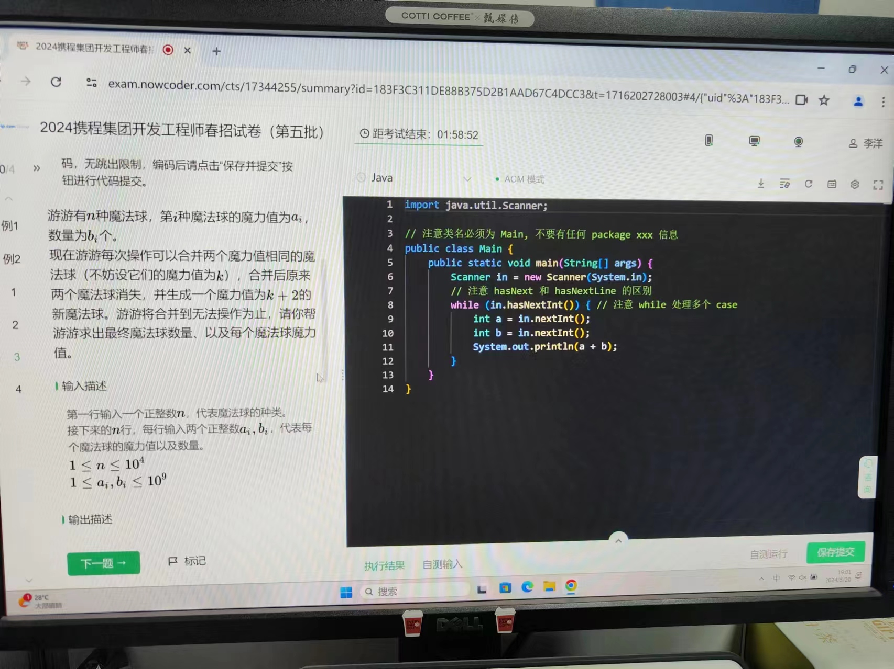
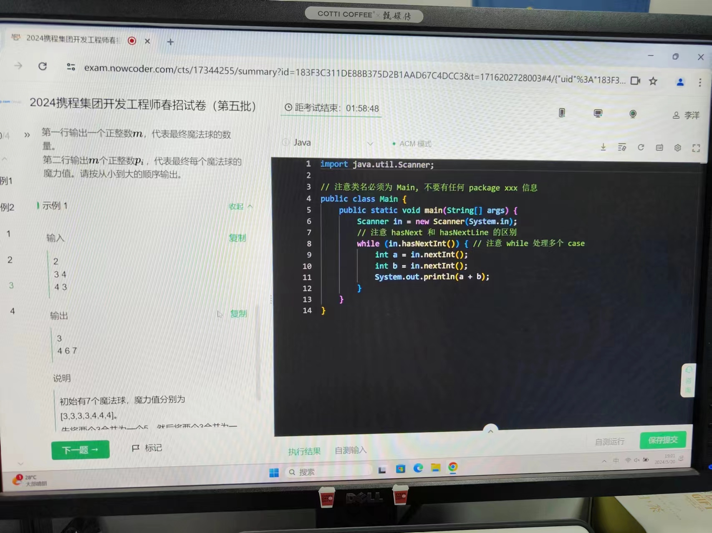
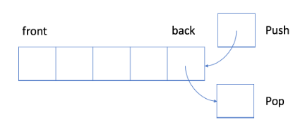
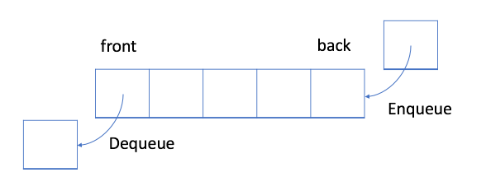
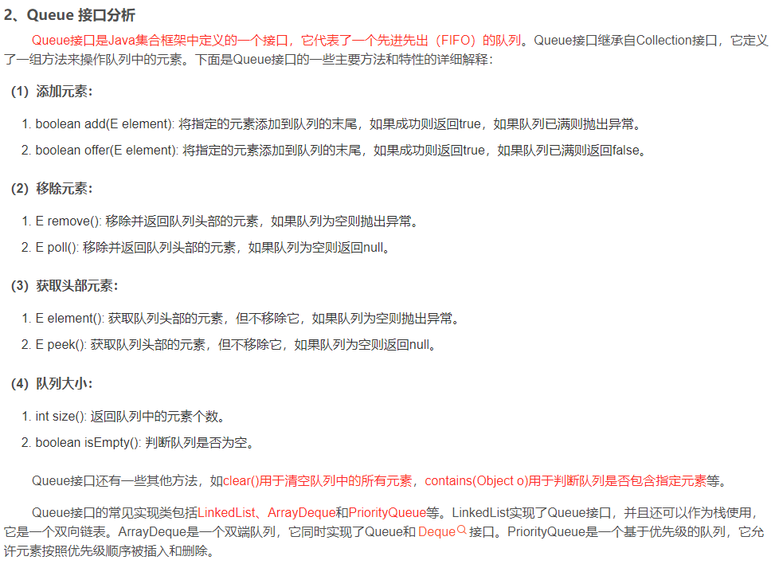
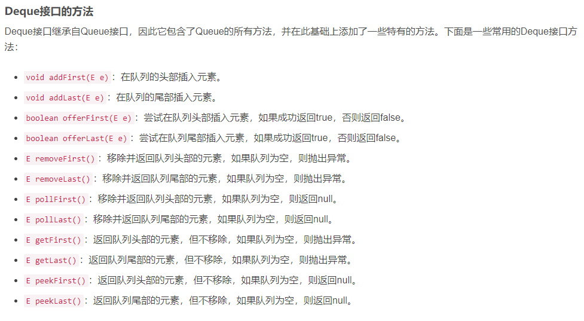
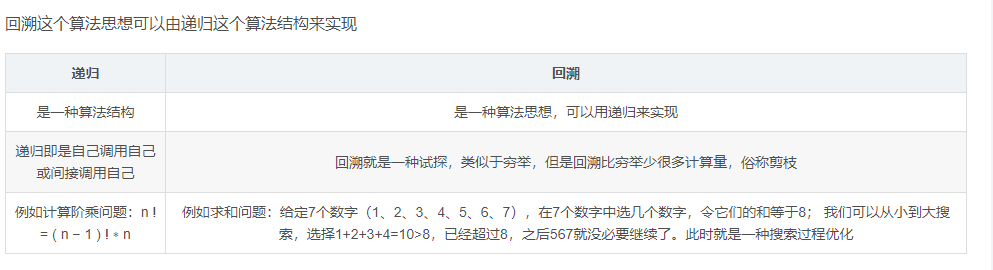
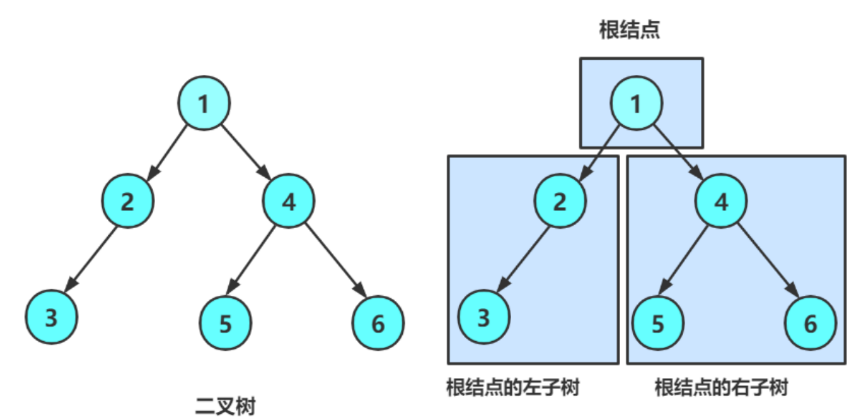

# 算法总结

## 1.数组

### 1.1双指针

双指针经常用于数组中。

1.两个指针从数组两端同时开始往中间走，提前结束遍历压缩时间，如第一题两数之和，从两端开始向中间查找并用哈希表记录走过的数，略微缩减所要用的时间；

2.双指针按照一定的规律改变指向的节点，能够精巧地解决一些问题，如第十一题，盛最多水的容器，我们需要意识到左右指针不是随随便便往中间移动的，否则无法解决问题；为尽可能找到较大的面积，需要每一次移动保留长的（总不能保留短的吧），然后动另一侧，使其尽可能逼近最大值。

3.如果感觉仅有双指针不好整，就遍历，常有的是O（nlogn）+O（n^2） = O（n^2）。好过n3。

### 1.2二分法

二分法可是和双指针相近，确切来说是形成一套解决思路的双指针（玩出花了）。二分查找，就是每次动指针之间一半的数，直到找到目标，这就导致复杂度为O（logn）。标准的二分查找如下：

```java
int binarySearch(int[] nums, int target){
  if(nums == null || nums.length == 0)
    return -1;

  int left = 0, right = nums.length - 1;
  while(left <= right){
    // Prevent (left + right) overflow
    int mid = left + (right - left) / 2;
    if(nums[mid] == target){ return mid; }
    else if(nums[mid] < target) { left = mid + 1; }
    else { right = mid - 1; }
  }

  // End Condition: left > right
  return -1;
}
```

二分思想可以不仅限于一个数组，比如找两个数组合并后的中位数，也就是找合并后从小到大的第（len1 + len2 + 1）/2，第（len1 + len2 + 2）/2个数，然后分别找出来这个数就行。

## 2.链表

## 3.哈希表

### 3.1TreeMap

Treemap，能够返回按顺序的entry





```java
import java.util.Map;
import java.util.Scanner;
import java.util.TreeMap;

public class MagicBalls {

    public static void main(String[] args) {
        Scanner scanner = new Scanner(System.in);
        int n = scanner.nextInt();

        // 使用 TreeMap 自动按键排序
        TreeMap<Long, Long> magicBalls = new TreeMap<>();

        // 读取输入
        for (int i = 0; i < n; i++) {
            long magicValue = scanner.nextLong();
            long count = scanner.nextLong();
            magicBalls.put(magicValue, magicBalls.getOrDefault(magicValue, 0L) + count);
        }
        scanner.close();

        // 处理合并过程
        while (true) {
            boolean merged = false;
            Map.Entry<Long, Long> entry = magicBalls.firstEntry();//返回key最小的键值对
            while (entry != null) {
                long value = entry.getKey();
                long count = entry.getValue();
                if (count > 1) {
                    long newCount = count / 2;
                    long remainder = count % 2;
                    magicBalls.put(value, remainder);
                    magicBalls.put(value + 2, magicBalls.getOrDefault(value + 2, 0L) + newCount);
                    merged = true;
                }
                entry = magicBalls.higherEntry(value);//返回比value值高的键所处的键值对
            }
            if (!merged) break;
        }

        // 输出结果
        StringBuilder result = new StringBuilder();
        int finalCount = 0;
        for (Map.Entry<Long, Long> entry : magicBalls.entrySet()) {
            long value = entry.getKey();
            long count = entry.getValue();
            for (long i = 0; i < count; i++) {
                result.append(value).append(" ");
                finalCount++;
            }
        }

        System.out.println(finalCount);
        System.out.println(result.toString().trim());
    }
}
```

正常情况下treemap遍历是升序，传入比较器变为降序

```java
@Test
    public void test1() {
        Map<Integer, String> treeMap = new TreeMap<>();
        treeMap.put(16, "a");
        treeMap.put(1, "b");
        treeMap.put(4, "c");
        treeMap.put(3, "d");
        treeMap.put(8, "e");
        // 遍历
        System.out.println("默认排序：");
        treeMap.forEach((key, value) -> {
            System.out.println("key: " + key + ", value: " + value);
        });//key值从1 3 4 8 16
 
        // 构造方法传入比较器
        Map<Integer, String> tree2Map = new TreeMap<>((o1, o2) -> o2 - o1);
        tree2Map.put(16, "a");
        tree2Map.put(1, "b");
        tree2Map.put(4, "c");
        tree2Map.put(3, "d");
        tree2Map.put(8, "e");
        // 遍历
        System.out.println("倒序排序：");
        tree2Map.forEach((key, value) -> {
            System.out.println("key: " + key + ", value: " + value);
        });// 16 8 4 3 1
    }
```


## 4.栈和队列

### 4.1栈

在 LIFO 数据结构中，将首先处理添加到队列中的最新元素。



​	与队列不同，栈是一个 LIFO 数据结构。通常，插入操作在栈中被称作入栈 push 。与队列类似，总是在堆栈的末尾添加一个新元素。但是，删除操作，退栈 pop ，将始终删除队列中相对于它的最后一个元素。

对于栈，我们能做得是，获取栈顶元素，入栈push，出栈pop，

### 4.2队列

#### 4.2.1Queue



​	单向队列Queue是典型的 FIFO 数据结构。插入（insert）操作也称作入队（enqueue），新元素始终被添加在队列的末尾。 删除（delete）操作也被称为出队（dequeue)。 你只能移除第一个元素。



#### 4.2.2其他队列


##### （1）PriorityQueue()

类似treemap，默认升序，在239题滑动窗口最大值中，用PriorityQueue()存储int[]，传入值不是int之类的类型，因此需要重写comparator()方法。

```java
class Solution {
    public int[] maxSlidingWindow(int[] nums, int k) {
        int n = nums.length;
        PriorityQueue<int[]> pq = new PriorityQueue(new Comparator<int[]>(){
            public int compare(int[] p1,int[] p2){
                return p1[0] == p2[0]?p2[1] - p1[1]:p2[0] - p1[0];
            }
        });
        for(int i = 0; i < k; i++){
            pq.offer(new int[]{nums[i], i});
        }
        int[] ans = new int[n - k + 1];
        ans[0] = pq.peek()[0];
        for(int i = k; i < n; i++){
            pq.offer(new int[]{nums[i], i});
            while(pq.peek()[1] <= i - k){
                pq.poll();
            }
            ans[i - k + 1] = pq.peek()[0]; 
        }
        return ans;
    }
}
```

##### （2）ArrayDeque

ArrayDeque是Deque接口方法的实现




## 5.回溯法



与for循环不同，递归是可以改变循环次数的，这也是递归能解决循环解决不了的问题的关键。


## 6.贪心算法

贪心算法的直觉来源是：尽可能优先使用较大数值对应的字符，最后转换得到的罗马数字的字符个数更少，字符更少更方便交流使用，这应该是设计罗马数字的人们的初衷。相关题目为第十二题整数转罗马数字。实际上，贪心算法是一种特别的动态规划，动态规划要考虑答案的叶节点所在分支，但是贪心不用，这也导致贪心算法有局限性。是否适合用贪心算法解决一个题，没有明确的解决方案，只能说菜就多练练。

事实上，有一个非常经典的贪心算法的问题，叫「找零钱问题」，就是在找零钱的时候，优先使用大的面值的纸币（或硬币）找给顾客，这样顾客得到的纸币的张数最少。这种贪心选择性质可以成立，是与可以使用的纸币（硬币）的面值有关。例如：
可选纸币（硬币）面值列表为 [1, 5, 10]，要找给顾客 15元时，给 10和 5是张数最少的。
可选纸币（硬币）面值列表为 [1, 5, 11]，要找给顾客 15 元时，就不能用贪心算法，15=1+1+1+1+10 用了 5张，最优解为 15=5+5+5 用了 3 张。
结论：可以贪心与可选硬币（纸币）的面值有关。


## 7.动态规划

动态规划，无非就是利用**历史记录**，来避免我们的重复计算。而这些**历史记录**，我们得需要一些**变量**来保存，一般是用**一维数组**或者**二维数组**来保存。下面我们先来讲下做动态规划题很重要的三个步骤，

**第一步骤**：定义**数组元素的含义**，上面说了，我们**会用一个数组，数组的长度是解析信息长度 + 1以表示实际意义，来保存历史数组**，假设用一维数组 dp[] 吧。这个时候有一个非常非常重要的点，就是规定你这个数组元素的含义，例如你的 dp[i] 是代表什么意思？

**第二步骤**：归纳，找出**数组元素之间的关系式**，我觉得动态规划，还是有一点类似于我们高中学习时的**归纳法**的，当我们要计算 dp[n] 时，是可以利用 dp[n-1]，dp[n-2]…..dp[1]，来推出 dp[n] 的，也就是可以利用**历史数据**来推出新的元素值，所以我们要找出数组元素之间的关系式，例如 dp[n] = dp[n-1] + dp[n-2]，这个就是他们的关系式了。而这一步，也是最难的一步，后面我会讲几种类型的题来说。

**第三步骤**：找出**初始值**。学过**数学归纳法**的都知道，虽然我们知道了数组元素之间的关系式，例如 dp[n] = dp[n-1] + dp[n-2]，我们可以通过 dp[n-1] 和 dp[n-2] 来计算 dp[n]，但是，我们得知道初始值啊，例如一直推下去的话，会由 dp[3] = dp[2] + dp[1]。而 dp[2] 和 dp[1] 是不能再分解的了，所以我们必须要能够直接获得 dp[2] 和 dp[1] 的值，而这，就是**所谓的初始值**。

一维的DP数组，一只青蛙一次可以跳上1级台阶，也可以跳上2级。求该青蛙跳上一个n级的台阶总共有多少种跳法。

根据题目要求，先确定dp数组包含的含义，既然问第n个台阶有几种跳法，就设定dp的值为几种跳法，即dp[n]。

第二步，明确数组数据之间的关系，青蛙的跳法有一次1格，一次2格，那么到n台阶，可以从台阶n-1跳，也可以从台阶n-2跳，因此dp[n] = dp[n-1] + dp[n - 2]。

第三步，明确初始值。这点和递归很像，递归不断向出口逼近，出口的值定义好就行。而贪心算法则是从基础开始的，从给定值后一个项目往目标值那里推进。因此呢，确定dp[0] = 0,dp[1] = 1,那么dp[2] = dp[0] + dp[1] = 1？显然不是，dp[2]也是特别的，dp[2] = 2。所以计算从三开始。

## 8.二叉树



```java
class TreeNode {
    public char val;
    public TreeNode left;  // 左子节引用
    public TreeNode right; // 右子节引用

    public TreeNode(char val) {
        this.val = val;
    }
}
```

如果想要生成如下二叉树，需要的操作就是：

```java
     A
    / \
   B   C
  / \   \
 D   E   F
------------------------------
TreeNode root = new TreeNode('A');
root.left = new TreeNode('B');
root.right = new TreeNode('C');
root.left.left = new TreeNode('D');
root.left.right = new TreeNode('E');
root.right.right = new TreeNode('F');
```

### 8.1二叉树遍历：

前序遍历（Preorder Traversal）：先访问根节点，然后按照左子树、右子树的顺序递归遍历子树。

遍历结果：A -> B -> D -> E -> C -> F

中序遍历（Inorder Traversal）：先按照左子树、根节点、右子树的顺序递归遍历子树。

遍历结果：D -> B -> E -> A -> C -> F

后序遍历（Postorder Traversal）：先按照左子树、右子树的顺序递归遍历子树，最后访问根节点。

遍历结果：D -> E -> B -> F -> C -> A

层序遍历（Level Order Traversal）：从上到下逐层遍历二叉树的节点。

遍历结果：A -> B -> C -> D -> E -> F

```java
public class BinaryTreeTraversal {
    public static void preorderTraversal(TreeNode root) {//前序遍历
        if (root == null) {
            return;
        }
        System.out.print(root.val + " ");
        preorderTraversal(root.left);
        preorderTraversal(root.right);
    }

    public static void inorderTraversal(TreeNode root) {//中序遍历
        if (root == null) {
            return;
        }
        inorderTraversal(root.left);
        System.out.print(root.val + " ");
        inorderTraversal(root.right);
    }

    public static void postorderTraversal(TreeNode root) {//后序遍历
        if (root == null) {
            return;
        }
        postorderTraversal(root.left);
        postorderTraversal(root.right);
        System.out.print(root.val + " ");
    }

    public static void levelOrderTraversal(TreeNode root) {//层序遍历，不递归，需要队列储存数据
        if (root == null) {
            return;
        }
        Queue<TreeNode> queue = new LinkedList<>();
        queue.offer(root);
        while (!queue.isEmpty()) {
            TreeNode node = queue.poll();
            System.out.print(node.val + " ");
            if (node.left != null) {
                queue.offer(node.left);
            }
            if (node.right != null) {
                queue.offer(node.right);
            }
        }
    }
```

### 8.2常见操作

```java
// 获取树中节点的个数
    public static int nodeSize = 0;

    public int size(TreeNode root) {
        if (root == null) {
            return 0;
        }
        nodeSize++;
        size(root.left);
        size(root.right);

        return nodeSize;
    }

    public int size2(TreeNode root) {
        if (root == null)
            return 0;
        return size2(root.left) + size2((root.right)) + 1;
    }

    // 获取叶子节点的个数
    public int getLeafNodeCount(TreeNode root) {
        if (root == null)
            return 0;
        if (root.left == null && root.right == null)
            return 1;

        return getLeafNodeCount(root.left) + getLeafNodeCount(root.right);
    }

    // 获取第K层节点的个数
    // 相对于根节点，就是获取左数的第K-1层 + 右数的第K-1层
    int getKLevelNodeCount(TreeNode root, int K) {
        if (root == null || K <= 0)
            return 0;

        if (K == 1) {
            return 1;
        }

        return getKLevelNodeCount(root.left, K - 1) + getKLevelNodeCount(root.right, K - 1);
    }

    // 获取二叉树的高度
    int getHeight(TreeNode root) {
        if (root == null) {
            return 0;
        }
        return Math.max(getHeight(root.left), getHeight(root.right)) + 1;
    }

    // 检测值为value的元素是否存在
    public TreeNode find(TreeNode root, int val) {
        if (root == null)
            return null;

        if (root.val == val) {
            return root;
        }

        TreeNode ret1 = find(root.left, val);
        if (ret1 != null) {
            return ret1;
        }
        TreeNode ret2 = find(root.right, val);
        if (ret2 != null) {
            return ret2;
        }
        return null;
    }
    // 判断一棵树是不是完全二叉树
    public boolean isCompleteTree(TreeNode root) {
        Queue<TreeNode> queue = new LinkedList<>();
        if (root == null) {
            return true;
        }
        queue.offer(root);
        while (!queue.isEmpty()) {
            TreeNode node = queue.poll();
            if (node != null) {
                queue.offer(node.left);
                queue.offer(node.right);
            } else {
                break;
            }
        }
        // 判断剩下的值是否有不为空的
        while (!queue.isEmpty()){
            if(queue.poll() != null){
                return false;
            }
        }
        return true;
    }
```

## 9.数学

你觉得算法都是自己没学过的深奥玩意？那是没遇见过纯数学题。该返璞还是要归真。


