# MySQL

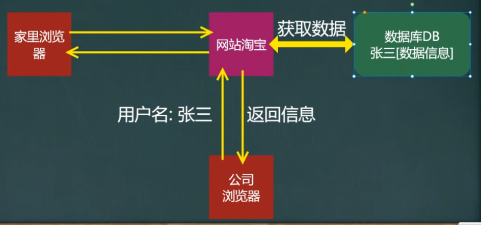

在安装MySQL后配置相关文件，随后连接到MySQL。

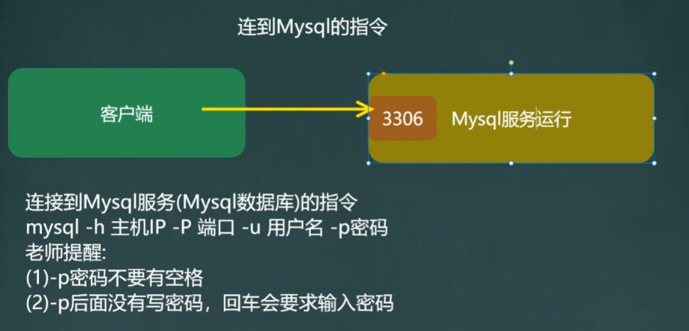

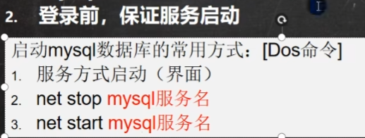

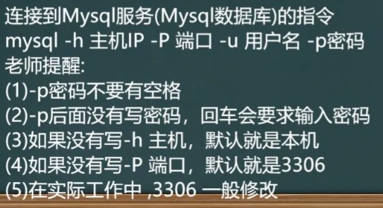

## MySQL三层结构

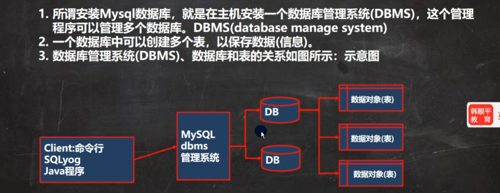

换成windows下的视角就变成了

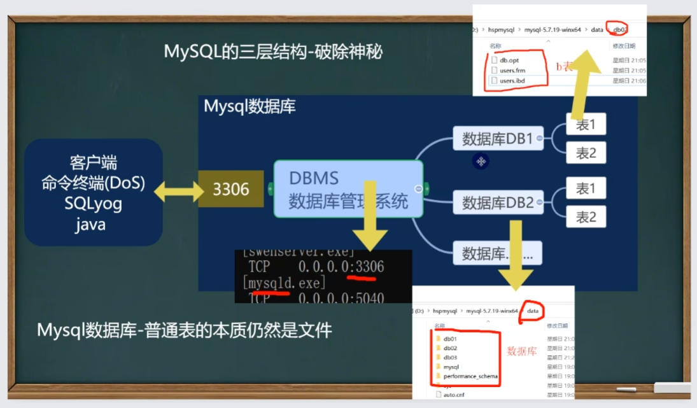

## 创建数据库

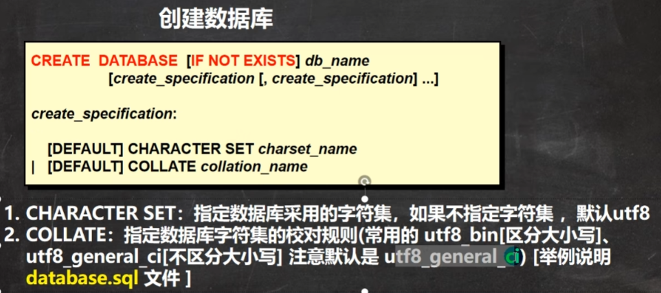

```mysql
#使用指令创建数据库
CREATE DATABASE db02 CHARACTER SET utf8 COLLATE utf8_general_ci;
DROP DATABASE db02;

#创造一个使用utf8的字符集db02数据库
CREATE DATABASE db02 CHARACTER SET utf8;
#创建一个使用utf8的字符集，并且带有校对规则的db04数据库
CREATE DATABASE db03 CHARACTER SET utf8 COLLATE utf8_bin;
#校对规则 utf8_bin 区分大小写 默认utf8_general_ci 不区分大小写

#下面是一条查询的sql
SELECT * FROM t1 WHERE NAME = 'tom';
```

## 查看、删除、备份数据库

备份数据库具体操作


```mysql
mysqldump -u root -p -B db02 db03 > d:\\bak.sql
source d:\\bak.sql#这个命令需要在命令提示符里执行
```

## 创建表

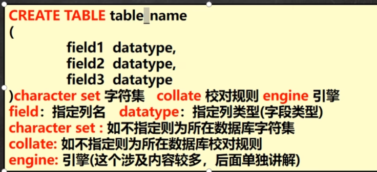

```mysql
CREATE TABLE ‘user’(
id INT,
‘name’ VARCHAR(255),
‘password’ VARCHAR(255),
‘birthday’ DATE)
CHARACTER SET utf8 COLLATE utf8_bin ENGINE INNODB;
```

## 修改表

```mysql
ALTER TABLE t11 
	ADD image VARCHAR(32)
	AFTER ‘salary’;#在salary后插入表格

DESC t11 -- 显示表结构

ALTER TABLE t13
	DROP content2;-- 删除content2列

RENAME TABLE ‘emp’ TO t08; -- 重命名

ALTER TABLE t08 CHARACTER SET utf8; -- 重新编写字符集

ALTER TABLE t08 ‘user_name’ ‘name’ VARCHAR(64) NOT NULL DEFAULT ''; -- 修改表中列名

ALTER TABLE t08
	MODIFY job VARCHAR(60) NOT NULL DEFAULT '';-- 修改job长度
```


## MySQL列类型/数据类型

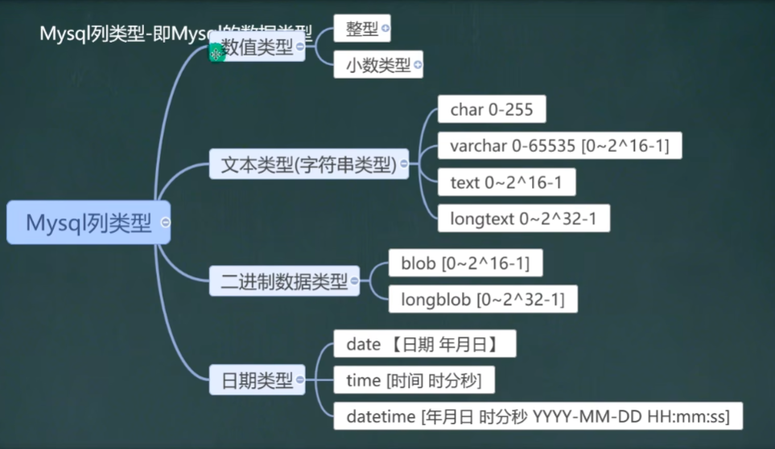


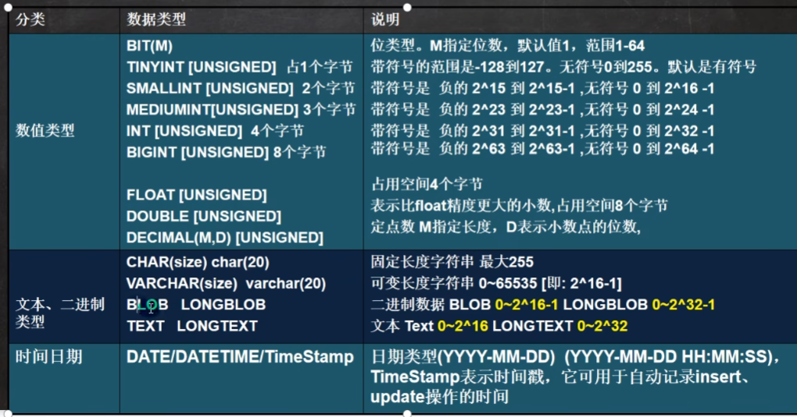

其中，整型类型常用的是INT[4个字节]，小数类型double[双精度 8 个字节], char 0-255 ,varchar 0-65535[0 - 2^16 - 1],text[0 - 2^16 - 1], 日期类型datetime。

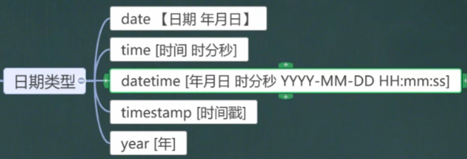

### 数值型

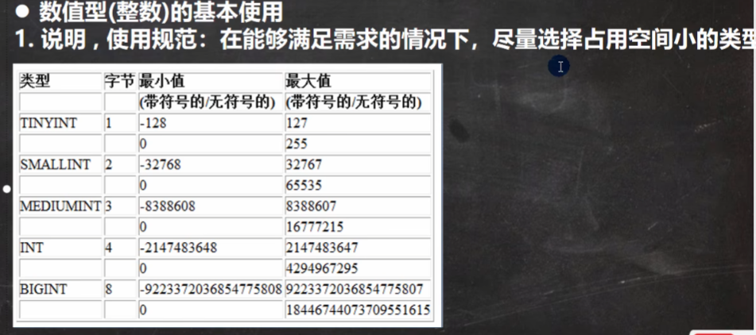

### bit型

```mysql
CREATE TABLE t05 (num BIT(8));#后边那个8代表bit位数，也就是0-255
INSERT INTO t05 VALUES(255);
SELECT * FROM t05;
```

返回值大体如下：

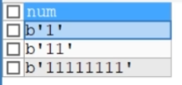

### 小数型

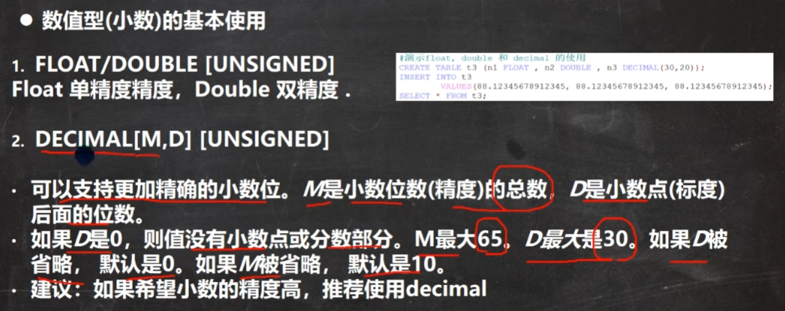

decimal能存下bigint无法存下的数据

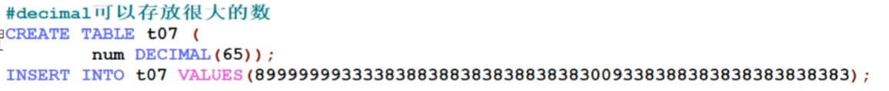

### 字符串

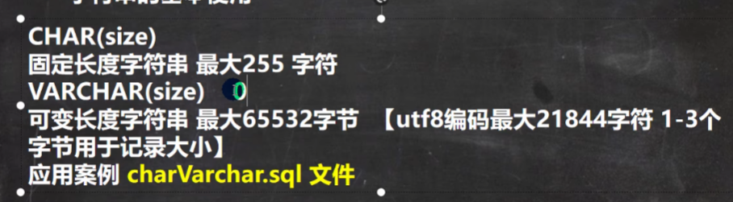

```mysql
CREATE TABLE t09(
‘name’ CHAR(255));
#默认为utf8，varchar(size) size = (65535 - 3)/3 = 21844
#使用gbk,varchar(size) size = (65535 - 3)/2 = 32766
CREATE TABLE t09(
‘name’ VARCHAR(21844));
```


```mysql
CREATE TABLE t11(
‘name’ CHAR(4));
INSERT INTO t11 VALUES('abcd');
CREATE TABLE t12(
’name‘ VARCHAR(4));
INSERT INTO t12 VALUES('hanpp');
```


### 日期类型

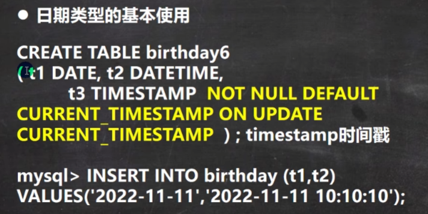

```mysql
CREATE TABLE t14(
birthday DATE, -- 生日
job_time DATETIME,-- 记录年月日
login_time TIMESTAMP 
	NOT NULL DEFAULT CURRENT_TIMESTAMP 
	ON UPDATE CURRENT_TIMESTAMP); -- 登录时间，如果希望login_time列自动更新，需要进行配置

INSERT INTO t14 (birthday, job_time)
	VALUES('2022-11-11','2022-11-11 10:10:10');
SELECT * FROM t14;
```

下方为创建日期类性的表的事例：

```mysql
CREATE TABLE ‘emp’(
	id INT,
	‘name’ VARCHAR(32),
	sex CHAR(1),
	birthday DATE,
	entry_date DATETIME,
	job VARCHAR(32),
	salary DOUBLE,
	‘resume’ TEXT) CHARSET utf8 COLLATE utf8_bin ENGINE INNODB;
	
INSERT INTO ‘emp’
	VALUES(100,'LDX','男','2001-11-11','2010-11-11','ggl',3000,'wsxsl,hnxsl');

SELECT * FROM ‘emp’;
```

## CRUD语句

增删改查，也就是Insert Update Delete Select

### INSERT

insert用于给表格插入数据

```mysql
INSERT INTO t15 (id, good_name, price)
	VALUES(10, 'hpx', 2000);#此时可以不加字段，因为输入数等于列数
	
INSERT INTO t15 (id, price)
	VALUES(5, 1500);-- 允许空，但是如果某个列没指定not null 当添加数据没有给定值，默认null
	
```

### UPDATE

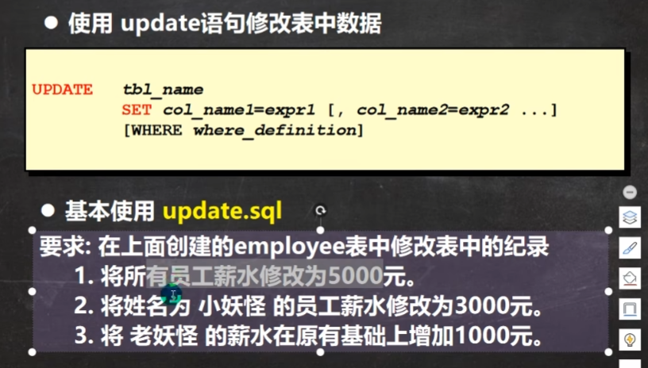

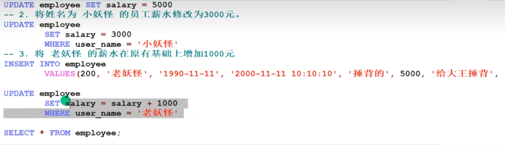

其中，UPDATE语法可以用于新值更新原有表行中的格列；SET子句指示要改哪一列；WHERE子句表示更新哪些行，注意，如果WHERE没有，更新所有行；如果更新多个字段，可以用 set 字段1 = 值1， 字段2 = 值2.

### DELETE


```mysql
DELETE FROM t11
	WHERE ‘name’ = 'abcd';#在没有WHERE的情况下信息会被全部删去，相比drop，delete仅仅删除记录
	#delete无法删除某一列的的值，一般用update转为null或者''。
```

### SELECT

数据库能力标准

#### （1）基本语法

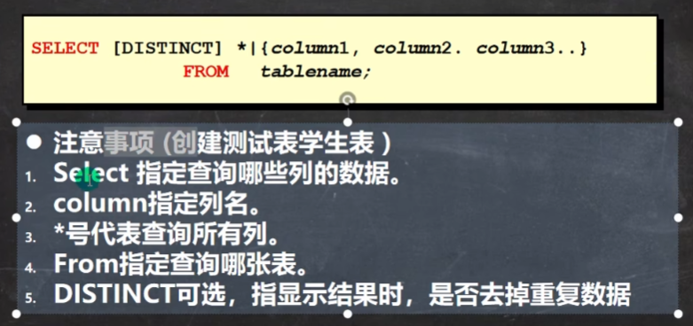

```mysql
INSERT INTO student VALUES(1, 'hpx', 12.2, 45.0, 89.6);
INSERT INTO student VALUES(2, 'hlj', 78.5, 12.9, 88.8);
INSERT INTO student VALUES(3, 'soyo', 99.9, 99.9, 100.1);
INSERT INTO student VALUES(4, 'gdg', 11.1, 111.1, 11.1);
INSERT INTO student VALUES(5, 'ann', 85.2, 78.3, 66.6);
INSERT INTO student VALUES(6, 'naco', 0.6, 4.7, 66.6);
#查询所有学生成绩
SELECT * FROM student;
#查询表中所有学生姓名与对应英语成绩
SELECT ‘name’, english FROM student;
#要查询的记录。每个字段都相同才会去重
SELECT math FROM student;
SELECT DISTINCT math FROM student;-- 这里会少一个66.6
#如果同时选了id和math，则不会去重，因为不完全相同
```

#### （2）对列值取别名


#### （3）对列值进行运算


方法（2）和（3）涉及到的代码都在下边：

```mysql
#获取id与对应总分+10的情况
SELECT id, (chinese + math + english + 10) FROM student;
#取出姓名与总分，并用别名表示总分
SELECT ‘name’ AS '姓名', (chinese + math +english) AS total_score FROM student;
```

#### （4）对列值使用运算符

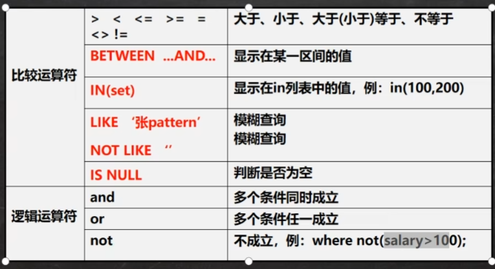

```mysql
#根据条件进行查找
SELECT * FROM student WHERE english > 50.0;
#结合运算语句
SELECT ‘name’ AS '名字', (chinese + math + english) AS total_score 
	FROM student WHERE id >= 2;
#使用and添加多个查询限制条件
SELECT * FROM student WHERE math > 40.0 AND id < 5;

#模糊查询，如'韩%'表示名字用韩开头的,这里表示name为~o，o为最后一位的
SELECT * FROM student WHERE ‘name’ LIKE '%o' OR '%o%' OR 'o%';
#使用区间查询
SELECT id , math AS result FROM student WHERE math BETWEEN 50.0 AND 99.0;
#使用in查询，类似枚举
SELECT id, ‘name’ FROM student WHERE id IN (4, 3, 8);
```

#### （5）对列值进行排序

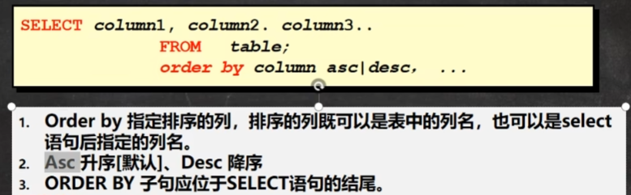

```mysql
#从数学降序排列学生
SELECT * FROM student ORDER BY math DESC;
#从总成绩降序排列
SELECT ‘name’ AS '名字', (chinese + math + english) AS total_score FROM student
	ORDER BY total_score DESC;
SELECT ‘name’ AS '名字', (chinese + math + english) AS total_score FROM student 
	ORDER BY total_score ASC;
#首先按照deptno进行排序，在排完后于各自内部再按照sal排序
SELECT * FROM emp ORDER BY deptno ASC, sal DESC;
```

#### （6）合计/统计函数


```mysql
-- 统计一个班级有多少学生
SELECT COUNT(*) FROM student;
-- 统计数学成绩大于90的学生有多少个
SELECT COUNT(*) FROM student WHERE math > 40.0;
CREATE TABLE test(
	‘name’ VARCHAR(20));
INSERT INTO test VALUES('saki');
INSERT INTO test VALUES(NULL);
SELECT COUNT(‘name’) FROM 
SELECT COUNT(‘name’) FROM test;-- 返回1
-- sum使用
SELECT SUM(math) FROM student;
-- 统计一个班各科成绩综合
SELECT SUM(math) AS total_math, SUM(english) AS total_english, SUM(chinese) AS total_chinese FROM student;
-- 统计english平均分
SELECT SUM(english) / COUNT(*) FROM student;
-- avg使用
SELECT AVG(math) FROM student;
SELECT AVG(english + chinese) FROM student;
-- max/min使用
SELECT MAX(math) AS '数学最高分', MIN(english + chinese) AS '语外最低分' FROM student;
```

#### （7）对列值进行分组

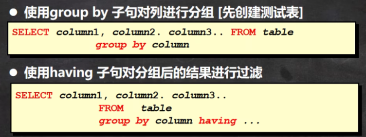

```mysql
# 演示group by + having
SELECT AVG(sal), MAX(sal), deptno FROM emp GROUP BY deptno;#不加group by不行,因为返回被改写的sal
#使用having作为约束条件进行过滤
SELECT deptno, AVG(sal), MIN(sal) FROM emp GROUP BY deptno HAVING AVG(sal) < 2000 ;
```

#### （8）字符串函数

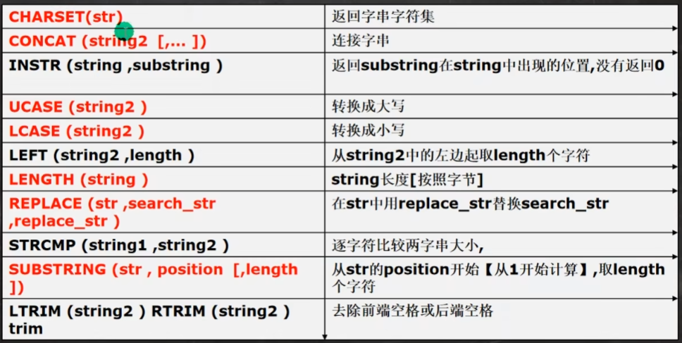

```mysql
-- CHARSET(str) 返回字串字符集
SELECT CHARSET(ename) FROM emp;
-- CONCAT(string2) 连接字串
SELECT CONCAT(ename, '‘s job is ', job) FROM emp;
-- INSTR (string, substring) fanhui substring 在 string 中出现的位置，没有返回0
SELECT INSTR('hanpanxing','xing') FROM DUAL;
-- UCASE (string2) 转成大写
SELECT UCASE(ename) FROM emp;
-- LCASE(string2) 转成小写
SELECT LCASE(ename) FROM emp;
-- LEFT (string2, length) 从string2左边起去length个字符
SELECT RIGHT(ename, 2) FROM emp; 
-- LENGTH(string) 返回length长度
SELECT LENGTH(ename) FROM emp;
-- REPLACE (str, search_str, replace_str) 
-- 在str中用replace_str替换 search_str
-- 如果是manager就替换成经理
SELECT ename, REPLACE(job, 'MANNAGER', '经理') FROM emp;

-- STRCMP(string1, string2) 根据字符比较字符串大小
SELECT STRCMP ('hsp', 'jsp') FROM DUAL;
-- SUBSTRING (str, position [,length])
-- 从str的position开始【从1开始计算】, 取length个字符
-- 从ename列的第一个位置开始取2个字符
SELECT SUBSTRING (ename, 1, 2) FROM emp;
-- 去除前后端空格
SELECT LTRIM(' 韩顺平教育') FROM DUAL;
SELECT RTRIM('韩顺平教育 ') FROM DUAL; 
-- 通过首字母小写方式显示所有员工姓名
SELECT CONCAT (LCASE(LEFT(ename,1)), SUBSTRING(ename, 2)) FROM emp;
```

#### （9）数学函数

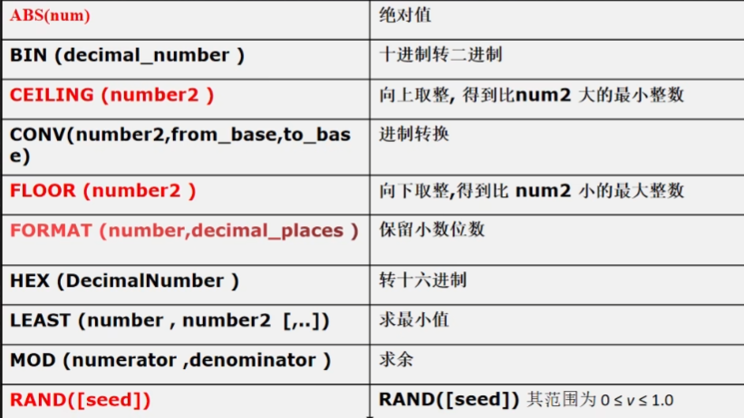

```mysql
SELECT ABS(10) FROM DUAL;-- 绝对值
SELECT BIN(127) FROM DUAL;-- 十进制转二进制
SELECT CEILING(73.8) FROM DUAL;-- 向上取整
SELECT CONV(127, 10, 16) FROM DUAL;-- 进制转换
SELECT FLOOR(73.8) FROM DUAL;-- 向下取整
SELECT FORMAT(12.589151, 1) FROM DUAL;-- 保留给定位数小数
SELECT HEX(127) FROM DUAL;-- 转十六进制
SELECT LEAST(sal) FROM emp;-- 求最小值
SELECT MOD(7, 3) FROM DUAL;-- 求余
SELECT RAND(3) FROM DUAL;-- 随机值
SELECT RAND() FROM DUAL;
```

#### （10）日期函数

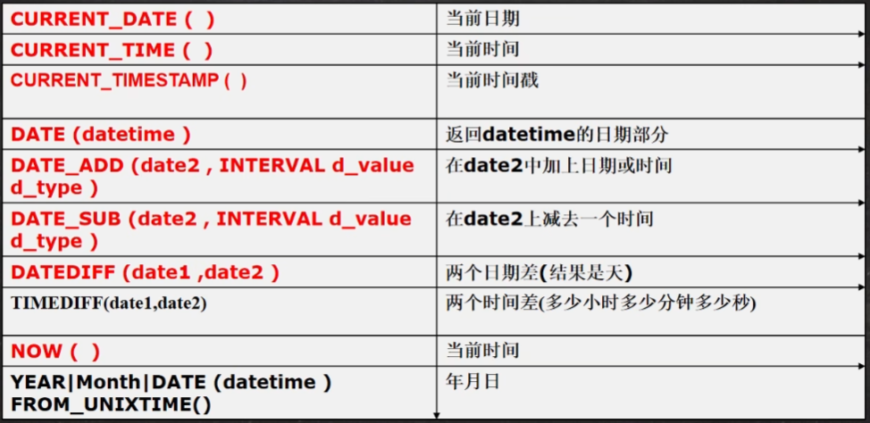


具体的时间

```mysql
-- 返还日期
SELECT CURRENT_DATE() FROM DUAL;
-- 返还时间
SELECT CURRENT_TIME() FROM DUAL;
-- 当前时间戳
SELECT CURRENT_TIMESTAMP() FROM DUAL;

CREATE TABLE mes (id INT, 
	content VARCHAR(30),
	send_time DATETIME);
	
INSERT INTO mes VALUES(1, '北京新闻', CURRENT_TIMESTAMP());
INSERT INTO mes VALUES(2, '上海新闻', NOW());
INSERT INTO mes VALUES(3, '北京新闻', CURRENT_TIMESTAMP());
INSERT INTO mes VALUES(4, '上海新闻', NOW());

SELECT * FROM mes;
SELECT NOW() FROM DUAL;
-- 显示所有新闻信息，发布时间日期只显示日期，不用显示时间
SELECT id, content,DATE(send_time) FROM mes;
-- 查询10分钟内发布的新闻
SELECT * FROM mes WHERE DATE_ADD(send_time, INTERVAL 10 MINUTE) >= NOW();
-- 求相差多少天
SELECT DATEDIFF('2012-12-26', '1990-01-01') FROM DUAL;
SELECT TIMEDIFF('10:11:11', '06:10:10') FROM DUAL;
-- 取出对应的年月等
SELECT YEAR(NOW()) FROM DUAL;
SELECT MONTH(NOW()) FROM DUAL;
SELECT MONTH('2013-11-10') FROM DUAL;
-- 返回1970-1-1到现在的秒数
SELECT UNIX_TIMESTAMP() / (24*3600*365) FROM DUAL;
-- FROM_UNIXTIME(): 可以吧unix_timestamp 秒数[时间戳]，转成指定格式日期
SELECT FROM_UNIXTIME(1618483484, '%Y-%m-%d') FROM DUAL;
SELECT FROM_UNIXTIME(1618483484, '%Y-%m-%d %H:%i:%s') FROM DUAL;
```

关于%Y 和 %y具体代表什么可以见：https://blog.csdn.net/weixin_53370274/article/details/128301241?ops_request_misc=%257B%2522request%255Fid%2522%253A%2522171360989116800185816259%2522%252C%2522scm%2522%253A%252220140713.130102334..%2522%257D&request_id=171360989116800185816259&biz_id=0&utm_medium=distribute.pc_search_result.none-task-blog-2~all~top_click~default-2-128301241-null-null.142^v100^pc_search_result_base5&utm_term=mysql%E6%97%A5%E6%9C%9F%E6%A0%BC%E5%BC%8F&spm=1018.2226.3001.4187

#### （11）加密函数

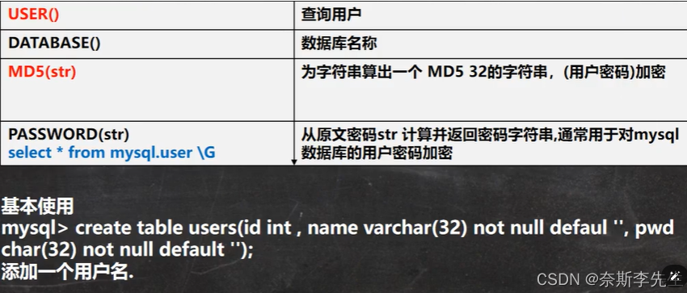

```mysql
-- USER()	查询用户
-- 可以查看登录到mysql的有哪些用户，以及登录的IP
SELECT USER() FROM DUAL; -- 用户@IP地址
-- DATABASE()	查询当前使用数据库名称
SELECT DATABASE();
 
-- MD5(str)	为字符串算出一个 MD5 32的字符串，常用(用户密码)加密
-- root 密码是 hsp -> 加密md5 -> 在数据库中存放的是加密后的密码
SELECT MD5('hsp') FROM DUAL;-- 返回加密
SELECT LENGTH(MD5('hsp')) FROM DUAL;-- 32
 
-- 演示用户表，存放密码时，是md5
CREATE TABLE hsp_user
	(id INT , 
	`name` VARCHAR(32) NOT NULL DEFAULT '', 
	pwd CHAR(32) NOT NULL DEFAULT '');
INSERT INTO hsp_user 
	VALUES(100, '韩顺平', MD5('hsp'));
SELECT * FROM hsp_user; 
 
SELECT * FROM hsp_user  
	WHERE `name`='韩顺平' AND pwd = MD5('hsp')  
-- PASSWORD(str) -- 密码加密函数, MySQL数据库的用户密码就是 PASSWORD函数加密，加密是单向不可逆的，加密后的密码保存到用户权限表中
SELECT PASSWORD('hsp') FROM DUAL; -- 数据库的 *81220D972A52D4C51BB1C37518A2613706220DAC
-- 从原文密码str 计算并返回密码字符串
-- 通常用于对mysql数据库的用户密码加密
-- mysql.user 表示 数据库.表 
SELECT * FROM mysql.user
```

#### （12）流程控制方法

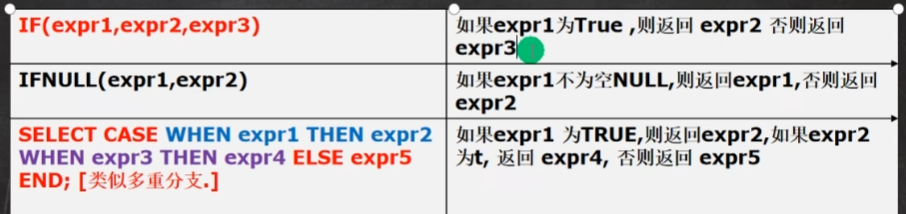

```mysql
# IFNULL(expr1,expr2)	如果expr1不为空NULL,则返回expr1,否则返回expr2
SELECT IFNULL( NULL, '韩顺平教育') FROM DUAL;
# SELECT CASE WHEN expr1 THEN expr2 WHEN expr3 THEN expr4 ELSE expr5 END; [类似多重分支.]
# 如果expr1 为TRUE,则返回expr2,如果expr2 为t, 返回 expr4, 否则返回 expr5
 
SELECT CASE 
	WHEN TRUE THEN 'jack'  -- jack
	WHEN FALSE THEN 'tom' 
	ELSE 'mary' END
 
-- 1. 查询emp 表, 如果 comm 是null , 则显示0.0
--    老师说明，判断是否为null 要使用 is null, 判断不为空 使用 is not
SELECT ename, IF(comm IS NULL , 0.0, comm)
	FROM emp;
SELECT ename, IFNULL(comm, 0.0)-- 用comm判断是否为null，等同于上一个命令
	FROM emp;
-- 2. 如果emp 表的 job 是 CLERK 则显示 职员， 如果是 MANAGER 则显示经理
--     如果是 SALESMAN 则显示 销售人员，其它正常显示
 
SELECT ename, (SELECT CASE 
		WHEN job = 'CLERK' THEN '职员' 
		WHEN job = 'MANAGER' THEN '经理'
		WHEN job = 'SALESMAN' THEN '销售人员'
		ELSE job END) AS 'job'
	FROM emp; 
```

