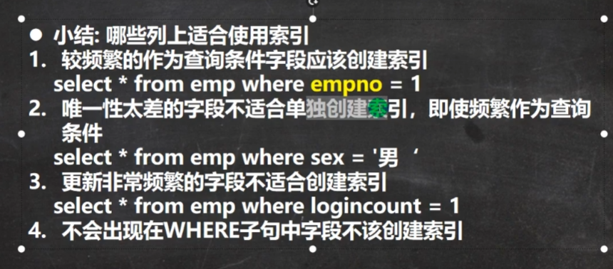
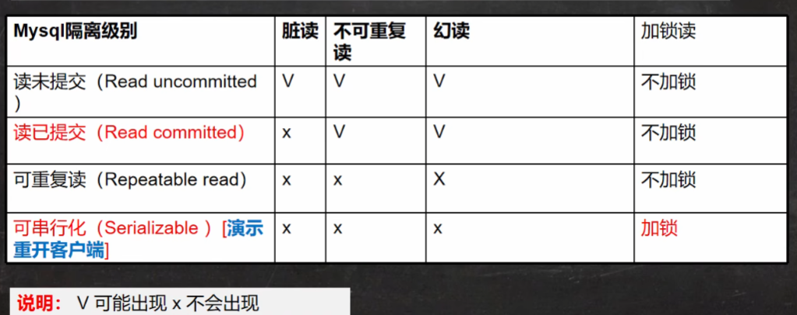
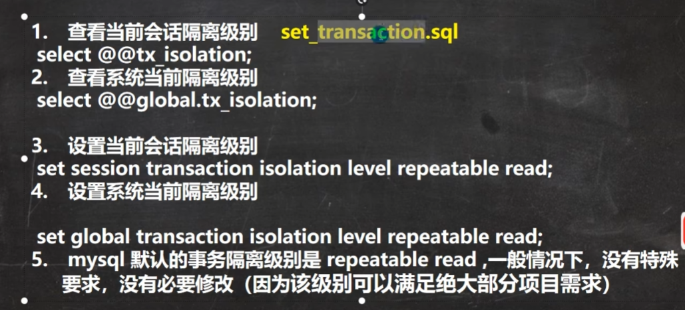

# MySQL2

## 增强查询

### 分页查询


```mysql
#按照雇员的id号升序取出，每页显示3条记录，请分别显示 第1页， 第2页， 第3页
-- 第1页
SELECT * FROM emp ORDER BY empno LIMIT 0, 3;
-- 第2页
SELECT * FROM emp ORDER BY empno LIMIT 3, 3;
-- 第3页
SELECT * FROM emp ORDER BY empno LIMIT 6, 3;
-- 对应公式，每页显示记录数 * （第几页 - 1）， 每页显示记录数
```

### 分组增强

```mysql
# 显示每种岗位的雇员总数、平均工资
SELECT COUNT(*), AVG(sal), job FROM emp GROUP BY job;
# 显示雇员综述，以及获取补助的雇员数
SELECT COUNT(*), COUNT(comm) FROM emp;
# 显示管理者的总人数
SELECT * FROM emp WHERE job = 'MANAGER';
#统计没有获得补助的雇员数量,返回非空就代表comm是空值
SELECT COUNT(*) ,COUNT(IF(comm IS NULL, 1, NULL)) FROM emp;
SELECT COUNT(*), COUNT(*) - COUNT(comm) FROM emp;

# 显示管理者的总人数
SELECT COUNT(mgr) FROM emp;
# 显示雇员工资的最大差额
SELECT * FROM emp;
```

### 多子句查询


```mysql
SELECT deptno, AVG(sal) AS average_sal 
	FROM emp
	GROUP BY deptno
	HAVING average_sal > 1000
	ORDER BY average_sal DESC
	LIMIT 0, 2 ;
```

## 多表查询

多表查询是指基于两个和两个以上的表进行查询。在实际的应用中，答询单个表可能不能满足需求。在不加条件的情况下，查询两个列含义不同，行数不同的表会进行如下操作：
1.从第一表中取出一行，和第二张表的每一行进行组合，返回组合结果[含有两张表的所有列]
2.一共返回的记录数为第一张表的行数*第二张表的行数
3.这样多表查询默认处理返回的结果，被称为笛卡尔集
4.解决多表查询问题的关键为写出正确的过滤条件where

```mysql
#如果在select后加上dept，会因为两个表都有dept而返回两列相同的dept
#多表查询的条件不能小于表的个数减一，否则就会出现笛卡尔集
SELECT ename, job, mgr, emp.deptno FROM emp, dept 
	WHERE emp.deptno = dept.deptno AND emp.deptno = 10;


-- 显示各个员工的姓名，工资，及其工资级别
SELECT ename, sal, grade FROM emp, salgrade WHERE sal BETWEEN losal AND sal ;

-- 显示雇员名， 雇员工资及所在部门名字，并降序排序
SELECT ename, sal, dname FROM emp, dept WHERE emp.deptno = dept.deptno ORDER BY emp.deptno DESC;
```

## 自连接

直接看代码

```mysql
#通过给一个表取不同的名字，让其成为两张表,随后加表-1个限制条件
-- 1.把同一张表当作两张表使用 2.需要给表取别名 表名 表别名 3.列名不正确，可以指定列的别名
SELECT worker.ename AS '职员名', boss.ename AS '上级名' 
	FROM emp worker, emp boss WHERE worker.mgr = boss.empno;

```

## 表子查询

### 多行子查询

就是查询的限制条件里面加个查询了

```mysql
#获得和smith处在同一部门的所有人的信息
SELECT * FROM emp WHERE deptno = (
	SELECT deptno
	FROM emp
	WHERE ename = 'SMITH'	);
SELECT * FROM emp WHERE job IN (
	SELECT job FROM emp WHERE deptno = 10)
	HAVING deptno != 10;-- 或者 deptno <> 10
	
	 SELECT * FROM emp WHERE LAST_DAY(hiredate) - 2 = hiredate;-- 有个last_day()函数，返回该日期所在月份最后一天
	 SELECT * FROM emp WHERE DATE_ADD(hiredate, INTERVAL 12 YEAR) < NOW();-- 早于12年，interval是间隔的意思
	 SELECT ename, CONCAT(YEAR(hiredate),'-',MONTH(hiredate)) FROM emp ORDER BY MONTH(hiredate),YEAR(hiredate) ASC;-- 先按照month排，再按照year排.用YEAR(),MONTH(),DAY()找出
	 SELECT ename, FLOOR(DATEDIFF(NOW(), hiredate) / 365) AS '工作年',FLOOR((DATEDIFF(NOW(), hiredate) % 365) / 31) AS '工作月', DATEDIFF(NOW(), hiredate) % 31 AS '工作天' FROM emp;-- 以年月日方式显示所有员工服务年限如果多行子查询是在限制条件加，那么临时表就是在from中使用临时构建的子表
```

```mysql
-- 查询 ecshop 中各个类别中，价格最高的商品 
		-- 查询 商品表 
		-- 先得到 各个类别中，价格最高的商品 max + group by cat_id, 当做临时表 
		-- 把子查询当做一张临时表可以解决很多很多复杂的查询
SELECT  goods_id, ecs_goods.cat_id, goods_name, shop_price
			FROM (SELECT cat_id , MAX(shop_price) AS max_price
			FROM ecs_goods 
			GROUP BY cat_id
			) AS temp, ecs_goods
			WHERE temp.cat_id = ecs_goods.cat_id
			AND temp.max_price = ecs_goods.shop_price;
```

### all和any

```mysql
-- 查询比所有30部门人工资都高得
SELECT ename, sal, deptno 
	FROM emp
	WHERE sal > ALL(
			SELECT sal
			FROM emp
			WHERE deptno = 30);
-- 查询比至少比30部门人至少一人的工资高得
SELECT ename, sal, deptno
	FROM emp
	WHERE sal > ANY(
	SELECT sal
	FROM emp
	WHERE deptno = 30);
```

### 多列子查询

说白了就是一次多看几个列

```mysql
-- 使用多列子查询语法进行匹配
SELECT * FROM emp 
	WHERE (deptno, job) = (
		SELECT deptno, job
		FROM emp
		WHERE ename = 'ALLEN')
		AND ename != 'ALLEN';
```

### 子查询练习

```mysql
-- 表.*表示将该表所有列都显示出来
SELECT tmp.*, dname FROM dept, (
		SELECT COUNT(*) AS per_num, deptno
		FROM emp
		GROUP BY deptno
	)tmp
	WHERE tmp.deptno = dept.deptno;
```

## 表复制和去重

```mysql
-- 1.先把emp表记录复制到my_tab01
INSERT INTO my_tab01 (id,‘name’, sal, job, deptno)
SELECT empno, ename, sal, job, deptno FROM emp;

-- 接下来进行去除操作，使用distince操作,也就是用一个表记录去重后的tab02
-- 然后清除tab02内容，最后将tab02塞入my_tmp;
CREATE TABLE my_tmp LIKE my_tab02;
INSERT INTO my_tmp SELECT DISTINCT * FROM my_tab02;

DELETE FROM my_tab02;
INSERT INTO my_tab02 SELECT * FROM my_tmp;

DROP TABLE my_tmp;
SELECT * FROM my_tab02;
```

## 合并查询

```mysql
-- union all 合并两个查询结果，但是不会去重
SELECT ename, sal, job FROM emp WHERE sal > 2500
UNION ALL
SELECT ename, sal, job FROM emp WHERE job = 'MANAGER';

-- union 合并两个查询结果，并去重
SELECT ename, sal, job FROM emp WHERE sal > 2500
UNION 
SELECT ename, sal, job FROM emp WHERE job = 'MANAGER';
```

## 左外连和右外连

```mysql
-- 这是普通连接
SELECT ‘name’, stu.id, grade
	FROM stu, exam
	WHERE stu.id = exam.id;
-- 改成左外连接(左侧的表完全显示，exam没stu的部分用null表示)
SELECT ‘name’, stu.id, grade
	FROM stu LEFT JOIN exam
	ON stu.id = exam.id;
-- 右外连接，左右外连和抽取的表的位置有关，如果想全部显示左侧表stu没有匹配的所有内容，用左连，否则用右连。
SELECT ‘name’, stu.id, grade
	FROM stu RIGHT JOIN exam
	ON stu.id = exam.id;
```

## 主键

主键是在创建表时候设定的，用于存储关键的不能重复的信息

```mysql
CREATE TABLE t17
	(id INT PRIMARY KEY, -- 表示id列是主键
	‘name’ VARCHAR(32),
	email VARCHAR(32));
-- 主键列的值是不可以重复的
INSERT INTO t17 
VALUES(1 , 'jack', 'jack@163.com');

INSERT INTO t17
VALUES(1, 'hpx', 'hpx@163.com');-- 主键位置不可以重复
INSERT INTO t17
VALUES(NULL, 'hpx', 'hpx@163.com');-- 主键不能为空


-- 复合主键
CREATE TABLE t18(
	id INT , 
	‘name’ VARCHAR(32),
	email VARCHAR(32),
	PRIMARY KEY (id, ‘name’));-- 复合主键，两个都相同才认为是主键重复
	
INSERT INTO t18 VALUES(1, 'tm', '123@163.com');

INSERT INTO t18 VALUES(2, 'tm', '123@163.com');
```

## mysql约束

```mysql
-- not null 约束，定义列时加入，插入数据时该列必有数值
-- unique ，插入数值之间均为null， 插入数值时该列值不能重复。即该列值的null可以是多个，在没制定not null的情况下
CREATE TABLE t21(
	id INT UNIQUE, 
	‘name’ VARCHAR(32),
	email VARCHAR(32),);
INSERT INTO t21 VALUES(1, 'jack', 'jack@163.com');
INSERT INTO t21 VALUES(1, 'tom', 'tom@163.com'); -- 本行出错
INSERT INTO t21 VALUES(NULL, 'tom', 'tom@163.com');

```

## 外键


```mysql
CREATE TABLE my_class(
	id INT PRIMARY KEY,
	‘name’ VARCHAR(32) NOT NULL DEFAULT '');
	
CREATE TABLE my_stu(
	id INT PRIMARY KEY, -- 学生编号
	‘name’ VARCHAR(32) NOT NULL DEFAULT '',
	class_id INT,
	FOREIGN KEY (class_id) REFERENCES my_class(id));-- 指定外键关系，这里
							-- id必须是主键或者unique
	
INSERT INTO my_class VALUES (100, 'java'),(200, 'web');

SELECT * FROM my_class;
INSERT INTO my_stu VALUES(1, 'tom', 100);

INSERT INTO my_stu VALUES(2, 'jarry', 200);

INSERT INTO my_stu VALUES(3, 'jarry', 300);-- 由于班级300不存在，所以失败
INSERT INTO my_stu VALUES(3, 'jarry', NULL);-- 外键允许not null

DELETE FROM my_class WHERE id = 100; -- 这个删除不了，已经有数据指向id 100了。
```

其细节如下：


## check


不生效学他干嘛？面试官会问倒是真的。


## 自增长

总有一些时候，我们希望添加数值时，那个id可以自动增加。然后就有了自增长功能


```mysql
CREATE TABLE t25
	(id INT PRIMARY KEY AUTO_INCREMENT,
	email VARCHAR(32) NOT NULL DEFAULT '',
	‘name’ VARCHAR(32) NOT NULL DEFAULT '');
INSERT INTO t25 VALUES (NULL, 'tom@qq.com', 'tom');
ALTER TABLE t25 AUTO_INCREMENT = 100;
INSERT INTO t25 VALUES (666, 'hsp@qq.com', 'hsp');
INSERT INTO t25 VALUES (NULL, 'tmd@qq.com', 'tmd');
SELECT * FROM t25;
```

## 索引

所以能够极大提高获取信息速度，尤其是在海量数据的情况下。如果原数据文件有500M+，一个巨量数字，直接select会用4、5s。则在使用创见索引后 ，该文件会变大

```mysql
CREATE INDEX empno_index ON emp(empno); -- 创建索引，在emp的empno列创建索引
SELECT * FROM emp WHERE empno = 1234568;-- 这里使用0.003s即可实现。
SELECT * FROM emp WHERE ename = 'afs';-- 这一列没有创建索引，所以会特别慢
```

索引会有一定开销，如磁盘占用和对dml(update delete insert )语句的效率影响。

索引的原理：没索引之前，select会进行全表扫描，遍历，所以很慢。如果要找id = 1的，哪怕第一行就是id为1的，程序也会看到底后边是否有id为1的。


```mysql
CREATE TABLE t25(
	id INT,
	‘name’ VARCHAR(32));
	
SHOW INDEXES FROM t25;

CREATE UNIQUE INDEX id_idnex ON t25(id);-- 添加唯一索引

CREATE INDEX id_index ON t25(id);
-- 如果某列的值不会重复，有限使用unique索引，否则使用普通索引
-- 添加普通索引方式2
ALTER TABLE t25 ADD INDEX id_index(id);

-- 添加主键索引
CREATE TABLE t26 (
	id INT,
	‘name’ VARCHAR(32));
ALTER TABLE t26 ADD PRIMARY KEY (id);

SHOW INDEX FROM t26;
-- 删除索引
DROP INDEX id_index ON t25;
-- 删除主键索引，一张表只有一个索引
ALTER TABLE t26 DROP PRIMARY KEY; -- 主键也是索引

-- 查询索引
SHOW INDEX FROM t25;

SHOW INDEXES FROM t25;

SHOW KEYS FROM t25;

DESC t25;
```

下边是一些限制：



## 事务

事务用于保证数据的一致性，他是由一组相关的dml的语句组成的，该组的dml语句要么全部是成功，要么全部失败。

事务和锁：
当执行事务操作时（dml语句），mysql会在表上加锁，防止其他用户改表的数据


```mysql
CREATE TABLE t27
	(id INT,
	‘name’ VARCHAR(32));
-- 开启事务
START TRANSACTION;
-- 设置保存点
SAVEPOINT a;
-- 执行dml操作
INSERT INTO t27 VALUES(100, 'tom');
SELECT * FROM t27;

SAVEPOINT b; -- 这里在9行命令执行之后
-- 执行dml操作
INSERT INTO t27 VALUES(100, 'jack');

ROLLBACK TO b;
-- 提交事务，会删除所有保存点
```


如果a点的逻辑顺序在b点之前，那么回退到a点时，b点就直接被删除了。


```mysql
-- 如果不开始事务，默认情况下，dml操作时自动提交的不能回滚。
INSERT INTO t27 VALUES(300, 'milan');

SELECT * FROM t27;

START TRANSACTION;
INSERT INTO t27 VALUES(400, 'king');
INSERT INTO t27 VALUES(500, 'scott');

ROLLBACK;-- 表示直接回退到事务开始的状态
```

### 隔离级别


 

如果是可重复读权限的一个事务中，第一次读可以读到才完成提交的表，但是下一次读，无论表被提交成啥样，都会和第一次读保持一致。
加锁，指的是当有别的程序在改表没提交，

### 设置隔离



修改默认隔离级别


### ACID特性


## 存储引擎


```mysql
-- 不同的表可以用不同的存储引擎
CREATE TABLE t28(
	id INT,
	‘name’ VARCHAR(32)) ENGINE MYISAM;
-- memory 存储引擎。1.数据存储在内存汇总；2.执行速度快；3.默认支持索引 hash表

CREATE TABLE t29(
	id INT,
	‘name’ VARCHAR(32)) ENGINE MEMORY;
	
ALTER TABLE ‘表名’ ENGINE = 存储引擎;
```

## 视图

保证查询能查询到非关键信息，避免重要信息泄漏。视图本身是虚拟表，其内容由查询定义。 


```mysql
-- 创建视图
CREATE VIEW emp_view01 AS SELECT empno, ename, job , deptno FROM emp;
-- 查看视图
DESC emp_view01;
SELECT * FROM emp_view01;

-- 查看创建视图的指令
SHOW CREATE VIEW emp_view01;
-- 删除视图
DROP VIEW emp_view01;

-- 视图细节
-- 1.创建视图后，到数据库看，对应视图只有一个视图结构文件，形式为视图名.frm
-- 2.视图数据改变会影响到基表，反之依然。
UPDATE emp_view01 SET job = 'MANAGER' WHERE empno = 7369;

SELECT 8 FROM emp;
-- 视图中仍然可以使用视图，数据仍旧来自基表
CREATE VIEW emp_view02 AS SELECT empno, ename FROM emp_view01;
```


如果创建的视图和三张表都有联系呢？

```mysql
-- 如果只是三表联合查找
CREATE VIEW emp_view03
	AS
	SELECT empno, ename, dname, grade
	FROM emp, dept ,salgrade 
	WHERE emp.deptno = dept.deptno AND
	(sal BETWEEN losal AND hisal) ;
SELECT * FROM emp_view03;
```

## 用户管理


当我们做项目开发时，需要根据不同的开发人员赋予其对应的mysql操作权利，所以mysql数据库管理人员root可根据需要创建不同的用户，赋给相应的权利，供人员使用。以下为创建和删除用户方法。


```mysql
-- 1.创建新用户
-- 解读（1）'hsp_edu'@'localhost'表示用户的完整信息'hsp_edu'用户名'localhost'登录的IP
-- （2）123456 密码，但是注意存放到mysql.user表时，是password('123456')加密后的密码。
CREATE USER 'hpx'@'localhost' IDENTIFIED BY '123456';

SELECT ‘host’, ‘user’ , authentication_string  FROM mysql.user;
-- 删除用户
DROP USER 'hsp_edu'@'localhost';
```

重连时候可以使用创建的用户进行登录。


### 修改密码


```mysql
-- 修改自己密码，权限足够
SET PASSWORD = PASSWORD('abcdef');
-- root用户修改hpx密码，权限足够
SET PASSWORD FOR 'hpx'@'localhost' = PASSWORD('123456');
```

### 权限管理


给用户授权的操作


回收用户权限的操作


```mysql
GRANT SELECT , INSERT
	ON testdb.news
	TO 'panxing'@'localhost';

REVOKE SELECT, UPDATE, INSERT ON testdb.news FROM 'panxing'@'localhost';
```

还有一些细节


```mysql
-- 创建用户不指定host时，则为%，%代表所有IP会有连接权限
CREATE USER jack;

SELECT ‘host’, ‘user’ FROM mysql.user;

CREATE USER 'smith'@'192.168.1.%';-- '192.168'
```

