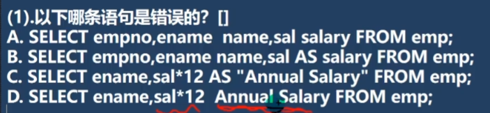
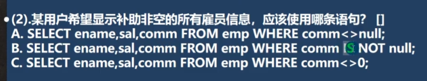

# MySQL作业

该部分作为补充

## 1.AS 可舍去



答案为D，因为D的名字不规范。D会认为别名为Annual，后边这个Salary为一个新的列。这个问题加不加AS都会有，因此中间有间隔，名字有中文的，都用双引号。

## 2.判断空，非空使用IS，IS NOT



<>在mysql为不等号，应该多用于比较数值，而不能用于null。

## 3.查询计算含null

使用IFNULL()来解决。

```java
SELECT ename, (sal + IFNULL(comm, 0) ) * 13  '年收入' FROM emp;
```

## 4.比较日期时间

要使用 ' ' 来引住日期时间

```mysql
SELECT ename, job, hiredate FROM emp WHERE hiredate BETWEEN '1991-02-01' 
	AND '1991-05-01' ORDER BY hiredate DESC;
```

## 5.查询条件离散

就是有好几个不同的查询组合

```mysql
SELECT * FROM emp WHERE (deptno = 10 AND job = 'MANAGER') 
OR (deptno = 30 AND job = 'CLERK')
OR (job != 'MANAGER' AND job != 'CLERK' AND sal >= 2000);
```

## 6.时间运算

找出个月份倒数第三天受雇员工，

早于12年前受雇员工，

按受雇月份排序，月份相同则将最早年份的员工排在前。

```mysql
SELECT * FROM emp WHERE LAST_DAY(hiredate) - 2 = hiredate;
-- 有个last_day()函数，返回该日期所在月份最后一天
SELECT * FROM emp WHERE DATE_ADD(hiredate, INTERVAL 12 YEAR) < NOW();
-- 早于12年，interval是间隔的意思
SELECT ename, CONCAT(YEAR(hiredate),'-',MONTH(hiredate)) 
FROM emp ORDER BY MONTH(hiredate),YEAR(hiredate) ASC;
-- 先按照month排，再按照year排.用YEAR(),MONTH(),DAY()找出

SELECT ename, FLOOR(DATEDIFF(NOW(), hiredate) / 365) AS '工作年',
	      FLOOR((DATEDIFF(NOW(), hiredate) % 365) / 31) AS '工作月',
	      DATEDIFF(NOW(), hiredate) % 31 AS '工作天'
	      FROM emp;
-- 以年月日方式显示所有员工服务年限


```
