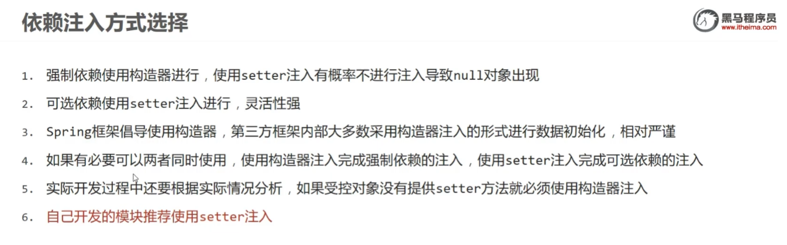
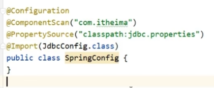
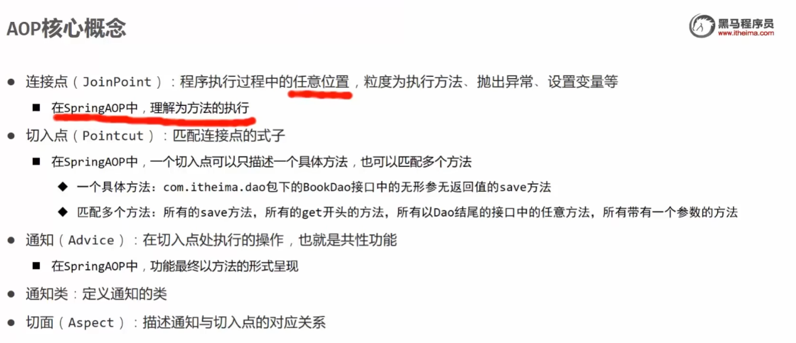
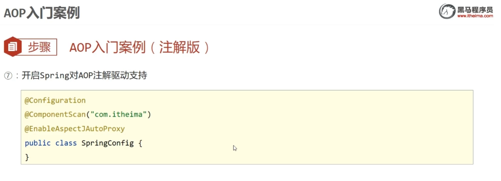
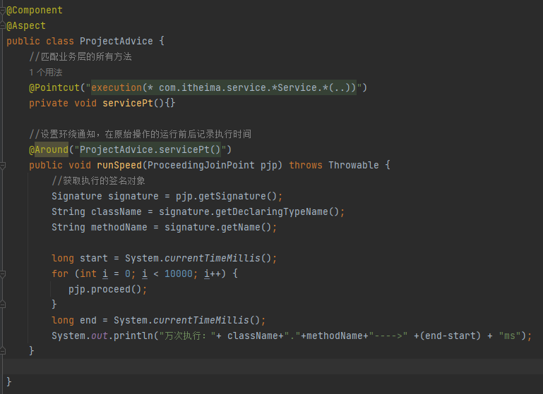

# SSM学习1

主要学习Spring Framework（低层框架），Spring Boot（提高开发速度）， Spring Cloud（实现分布式）

## Spring Framework

Spring Framework系统架构，是Spring生态圈中最基础的项目，也是其他项目的根基。Spring Framework4的结构情况和学习路线。框架中顶层依赖于底层。

学习路线详细如下，其中AOP为较顶层内容，学习过程并不是由下逐步向上的。

### 容器核心概念（IoC.DI）

**IoC**：主要为实现程序解耦，否则一个类想用另一个类的实例，一般是在内部new一个。现在不new，把实例创建权利放给外部，到时候直接拿。**IoC：Inversion of control**，使用对象时，由主动new产生对象由程序创建改为外部创建，这种创建权转移到外部，成为**控制反转**。

Spring实现了Ioc思想，提供一个IoC容器，或者Spring容器，用于充当所谓外部控制对象实现权。IoC容器负责对象创建，初始化等一系列工作，被创建或者管理的对象在IoC容器中被称为Bean。

**DI**：实现解耦另一步。Bean和Bean之间是有依赖关系的，比如上图中的Service和dao对象，为保证程序正常运行，引入DI思想。**DI：dependency Injection**，构建Bean和Bean之间的依赖关系，成为**依赖注入**

通过IoC和DI的合并运用，实现类之间依赖关系的解耦，降低程序复杂度和对象实例加载成本。

### IoC使用

#### 1.导包

找到pom.xml文件，在dependencies节点下新建dependency节点，随后补充至如下图所示。

随后在Maven那里刷新，确保里面有spring这个东西。

#### 2.配置文件

在src下的resource新建一个xml格式，spring配置文件，文件名为applicationContext.xml，里面放入bean和property。

#### 3.获取IoC容器和导入xml坐标

#### 4.实现DI

在需要用到其他类实例的类里用setter方法，该方法使用快捷生成即可。

配置文件添加property，其中name来自bookService里面的属性名字，而ref则是给属性的对应实例。

### bean配置

bean允许使用name给自己增加多个名字，通过id或者name里任意一个名字进行对于bean的引用，如ref引用，IoC容器找Bean的引用。

但还是建议用id引用。

默认情况下，用同一个id引用， IoC返回的对象地址是不变的,如果想要每次返回的对象不同，那么可以用 scope进行调整，改为prototype。

bean大部分情况下是适合使用的，但是有些情况还是不行，以下是作用范围：

### Bean实例生成

spring框架里报的错是从下向上看的。

#### 1.构造方法实例化

很遗憾这方式下spring只能构造无参构造器。 

#### 2.静态工厂实例化

这些年用的少了些。其中，工厂类是一个内部有完成配置并返回某一对象的类，对应方法一般是静态方法。因此不仅仅要指定类，还要告知spring工厂方法是哪个，即factory-method。

#### 3.实例化工厂实例化

上一个静态工厂使用的是静态方法实现实例化，实例工厂就是需要实例化才能进行的工厂操作。

#### 4.使用FactoryBean实例化

最重要的，经常使用的。此时返回对象是否单例则需要在类里加一个is single方法。

### Bean生命周期

如果要destroy生效，如果使用close方法关闭最好不要用ApplicationContext作静态类型，直接用Class...Context。

如果使用钩子，钩子方法可以放在任何位置，相当于一个先注册，到时候就关闭。

然后是另一种控制生命周期方式

bean的初始化和关闭流程如下：

### 依赖注入

#### 1.setter注入

使用spring的依赖注入包括类里面有属性对应的set方法，随后xml内部即识别到未注入的属性，按照如下图方式注入即可，其中，ref后加的是bean的id，value后就是数值。**setter注入应该是和set方法名匹配的。**

#### 2.构造器注入

如果属性需要靠构造器注入，需要另一种注入方式。简单的构造器注入代码耦合度很高，他name后跟着的是构造器的形参名字！比如下面name后那个bookDao，形参名字改成bookDao1，他就成bookDao1了。

为应对name耦合度高的情况，出现很多补救措施，比如通过类识别，通过index识别等。不过还是有耦合的。

对于不同的场景，使用setter或者construct也有讲究。自己整就直接setter就行。

### 依赖自动装配

装配可以按类型或者按名称（不建议，且名称程序耦合度强，报错返回null指针）。

具体使用像下面这样，保证名字和bookService里面的相近就行。

### 注入集合~

也就是特殊一些的setter了。除啦vaule=后边跟着的字符串有""，value节点中间好像都没有

**array：**

**list：**

**set：**

**map：**

**property：**

### 第三方数据源对象管理案例

导入阿里的德鲁伊，在pom.xml文件中导入druid并确保Maven里面有这个东西。之后就管理spring的xml文件，从中配置druid的bean相关配置，比如driver、url、username、password。

### 加载properties文件

因为很多mysql操作都是会借助properties文件进行的，所以联动properties也是spring应涉及到的功能。

对于多个properties文件，可以使用以下方法进行兼并，其中系统属性会和文件名称相冲突，默认是系统属性优先级高把自己的变量

### 容器

创建容器的方式

获取bean的方式：

BeanFactory是容器类顶层接口，同时也是spring最开始的容器，其使用的是延迟加载bean，就算跑完了也不一定会调用道构造函数。当然，bean也可以在后边通过lazy_init设置为true达到类似效果。

spring容器是从上往下开始发展的，每每遇到需要添加更改的功能，就会新开一个接口，然后丰富里面的功能。

### 注解开发

注解开发定义bean。如果Component后面跟着的是bookDao之类的名称字符串，那么在从容器取出来时候一般用那个名字id，如果没有，那就只能用类型xxx.class

除啦Component，还给了三个异名但是同功能的，主要用于区分类的作用。

### 纯注解开发

让配置文件配置注解改为类配置注解，我们需要特定的类，和新的容器获取bean方法。下图总SpringConfig为自己设定的配置类，使用@Configuration进行设定，然后利用ComponentScan加类包数组即可代替scan

#### 1.生命周期

scope后是单或者每次返回新的对象。PostConstruct代表构造器之后，PreDestroy则表示之前。

#### 2.依赖注入

简单类型注入

自动注入，set和constructor。

bean注入。没有下面qualifer默认类型注入，不能出现两个以上BookDao子类。

通过properities文件加载

#### 3.第三方bean管理

第三方bean不能改人家代码的。

或者把上述内容导入到JdbcConfig里面，然后在主config里面导入。

或者使用扫描式，这种会要求多个类前面有Config注解，而且隐蔽性过多，还得找注入了啥

#### 4.第三方bean依赖注入

需要一些方法去实例化出bean然后返回。跟工厂模式相近，都是创建一个实例然后返回。

![image-20241221110422733](./笔记用图/image-20241221110422733.png

自动装配提供形参就行，根据形参类型自动被bean找导入的对象，使用的类查找方式。当然也要满足类查找相关要求与限制。

### Spring整合MyBatis

下面先回顾下MyBatis（这啥呀这）

整合的本质是把mybatis里的东西转成注解和类。整合进入，pom.xml除了mysql、mybatis之外，还要加入以下用于链接的库。

进行注解开发整合spring和mybatis

spring和mybats的链接库提供这个工厂类，用于返回sqlSession，mybatics本身就需要一个SqlSession对象进行实现，我们用的是spring-mybatics整合包提供的SqlSessionFactoryBean类，使用的类型别名就是domain下的所有类，根据返回值拿取。到时候存储就是创建domain对象存储数据库信息，用toStirng方法直接对信息打印。同时最后的mapper涉及到另一个类，关系到初始化映射配置。

具体的用法就是在Service层面调用Dao这个mapper代理，用里面的方法包装成service层方法拿来用。到时候就直接用service层的方法了。其中Dao里面情况如下：

这是调用Dao的Service层。也就是用DI填成AccountService接口作对象名，再调用transfer

### Spring整合junit

junit使用专门的注解方式。该注解放在需要测试的类前，这样就能同时使用spring的依赖注入和junit的test

### 容器总结

设置依赖注入里，@Value专用于简单类型，自动注入兼容setter和constructor

## Aop

### Aop相关概念

面向切面编程，构建通知与切入点之间的联系，即在某一切入点执行某个通知。使用通知类中定义共性方法通知，

具体操作如下：

### Aop工作流程

以BookDaoImp为例，如果未匹配，那么创建的是一个 BookDaoImp对象

如果匹配成功，那就是另一回事，类是一个代理类型。

### 切入点表达式

也就是切面前面那一串字母。根据描述方式，可以分为接口类描述方式和实现类描述方式。

我们不能每个切入点都写一个表达式，这样效率低。因此可以有通配符方式描述切入点：

最后那个是任意返回值的业务层接口的。下面有一堆社么玩意，如果看不懂通配符，就从右往左看，第一个一定是方法。

切入点不是乱写的，大概有以下这么几种书写技巧：

### Aop通知类型

最常用的是环绕通知。值得注意的是，如果环绕通知要环绕的切入点方法是有返回值的，你得吧方法返回值输出出去，也就是ret，不然返回值就是负提升。当然，通知的返回值类型应该是Object

然后就是前置通知、后置通知、返回后通知（无报错才出现）、抛出异常通知（有报错才出现）

### 案例：执行万次代码

执行端

切入点及其依赖

切面和通知

如果测试多个的情况下，我们不好知道到底测到那个。就通过形参pjp获取一些方法好获取接口名、方法名。

### Aop获取数据

不是指简单的数据，是所有类型，包括参数、返回值、异常。按类型不同，分为以下几种情况：

以以下切入点为例

这是切点前后通知

这是无敌的around，不仅仅能获取，还能改：

这是特别的返回值接受，要在注解加参数，其中形参必须是jp在前，不然报错，形参0号位置异常

catch thorw也是挺特别的，了解即可

## 事务

事务，transaction。业务层组合了多个数据层参数，在业务层搞事务能一次性保证事务层执行完成。

### 使用事务方法 

那么如何使用事务方法

1.在相关**接口或者接口内部的方法**声明上加上事务管理注解

2.设置事务管理器，**一般放在JDBConfig下，跟DataSource挨着**，同时，事务管理器用的datasource也是。

3.开启事务注解

**注意**：Dao下的增删改操作默认会开启事务，保证操作原子性，也就是两条指令对应两个事务，单调语句是不可拆分的。

案例中就是用一个大的事务管理员去整合两个事务协调员。

### 事务精细化配置

事务并不在所有出问题的情况下都会回滚的，一般的error和运行时异常except才会回滚，如果事务方法里出问题抛出的异常不是runningtime，那么就不会回滚。

设置只读、事务超时时间

设置可进行rollback操作的类型，如

### 追加日志

其中，日志接口和实现类如下。其中log接口上方里就是使用事务传播行为，设定了事务协调员对于已建事务采取自己新建事务的措施，这样就不会加入事务管理员的事务。

现在我们有一个问题，相关方法使用的是事务，在内部即使使用try+finally，一旦出问题回滚，还是无法打出日志（成功失败都要输出日志）。为解决这一问题，需要利用事务传播行为：

对于事务传播行为的相关属性接口如下，REQUIRES_NEW代表需要新的事务支持；SUPPORTS表示是否支持事务；MANDATORY代表想要用到协调员，一定要带事务，NEVER相反，千万不要带事务。

