# SSM3

## SpringBoot


### 创建工程

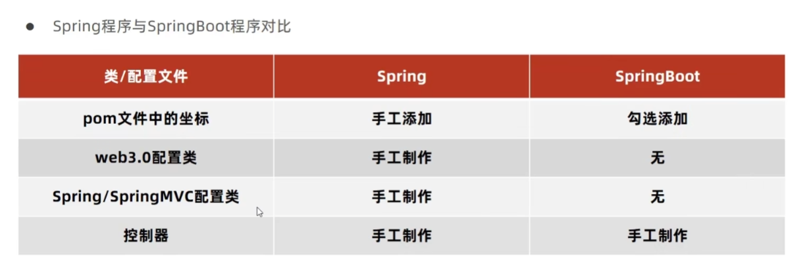

他给的太多了。

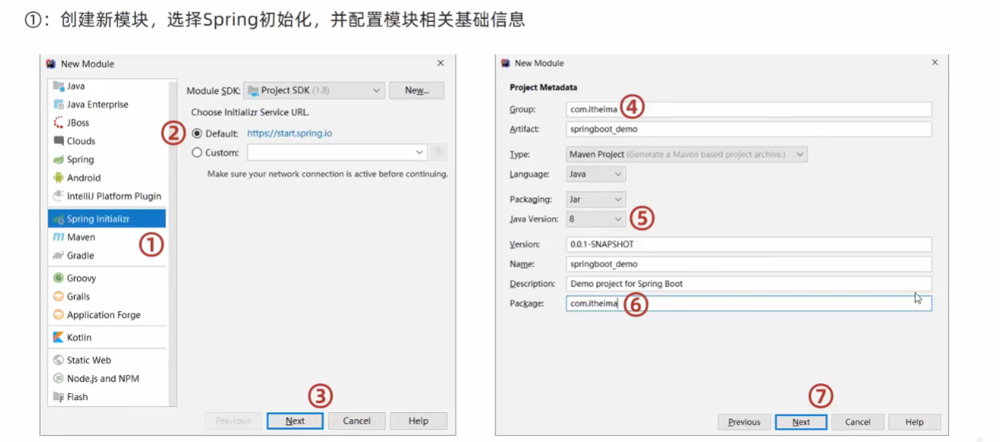

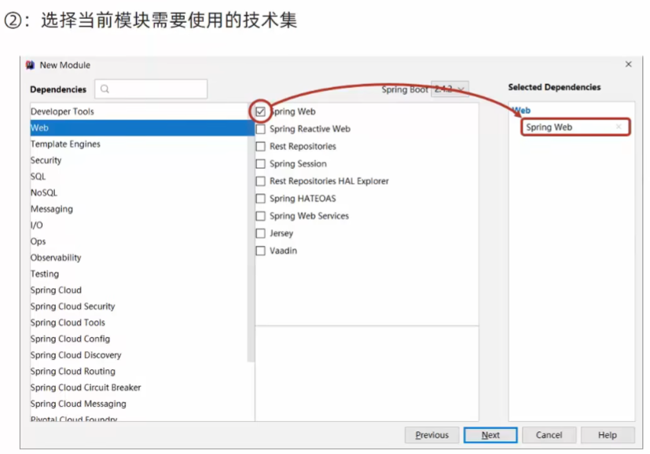

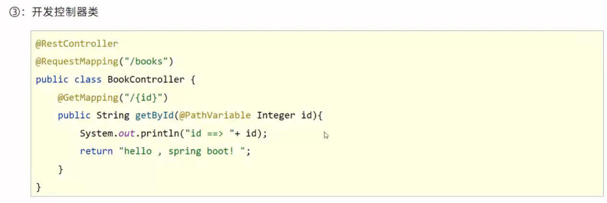

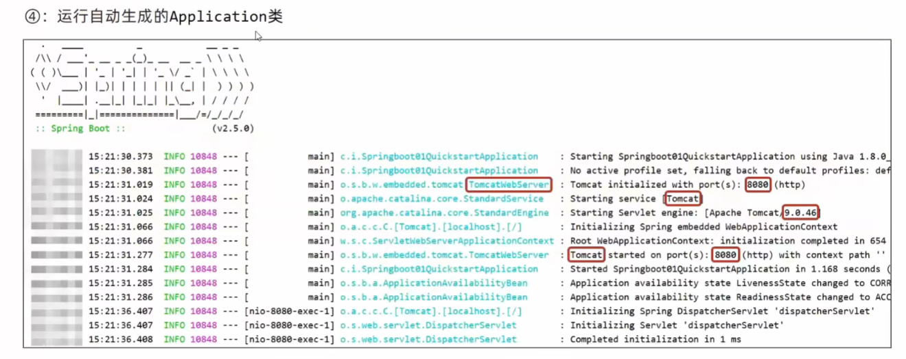

当然也可以选择去官网创建，因此idea创建boot项目就是用的线上方式。去官网下拉就行，流程接近。

### 快速启动

在生命周期里package下，获得一个jar包。在jar包路径cmd然后执行java命令就行

```java
java -jar springboot.jar
```

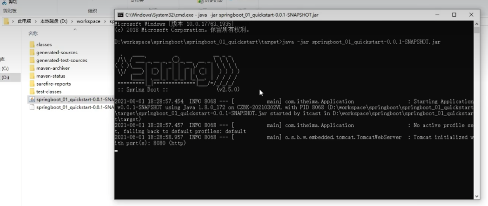 

### 介绍

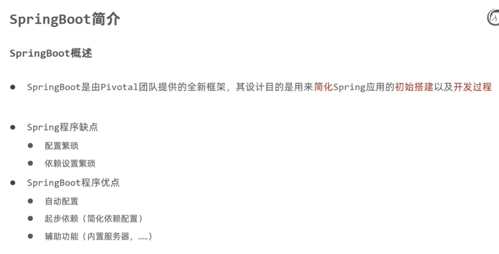

更换服务器也很方便。吧原来的服务器屏蔽了，然后转成jetty。

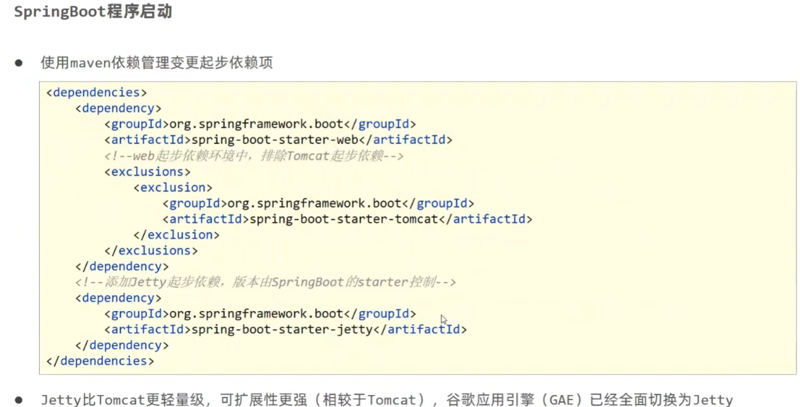

### 配置文件

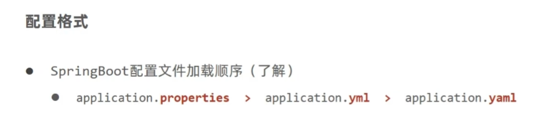

xxxxxxxxxx SELECT * FROM emp WHERE LAST_DAY(hiredate) - 2 = hiredate;-- 有个last_day()函数，返回该日期所在月份最后一天SELECT * FROM emp WHERE DATE_ADD(hiredate, INTERVAL 12 YEAR) < NOW();-- 早于12年，interval是间隔的意思SELECT ename, CONCAT(YEAR(hiredate),'-',MONTH(hiredate)) FROM emp ORDER BY MONTH(hiredate),YEAR(hiredate) ASC;-- 先按照month排，再按照year排.用YEAR(),MONTH(),DAY()找出​SELECT ename, FLOOR(DATEDIFF(NOW(), hiredate) / 365) AS '工作年',          FLOOR((DATEDIFF(NOW(), hiredate) % 365) / 31) AS '工作月',          DATEDIFF(NOW(), hiredate) % 31 AS '工作天'          FROM emp;-- 以年月日方式显示所有员工服务年限​​mysql

```java
server:
  port: 82//

logging:
  level:
    root: info//根路径级别，默认info级别信息，清爽点就改成warn级别

likes:
  - music
  - game
  - PE
```

这里我们遇到了yaml格式，这里介绍一下

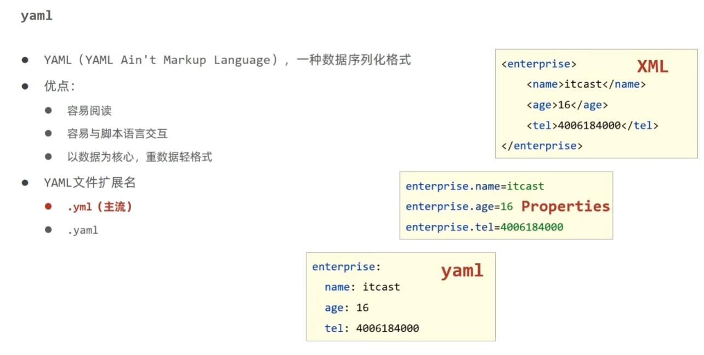

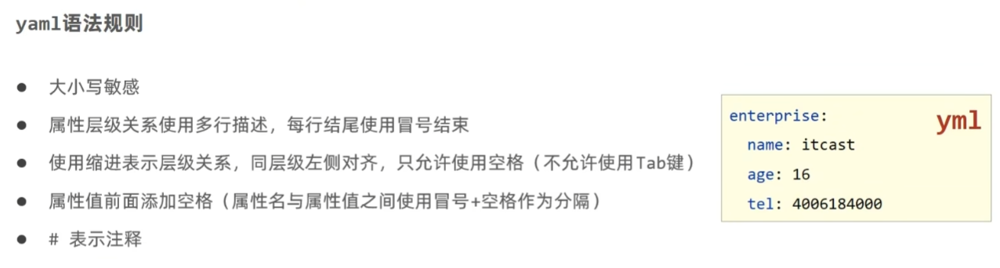

### yaml读取

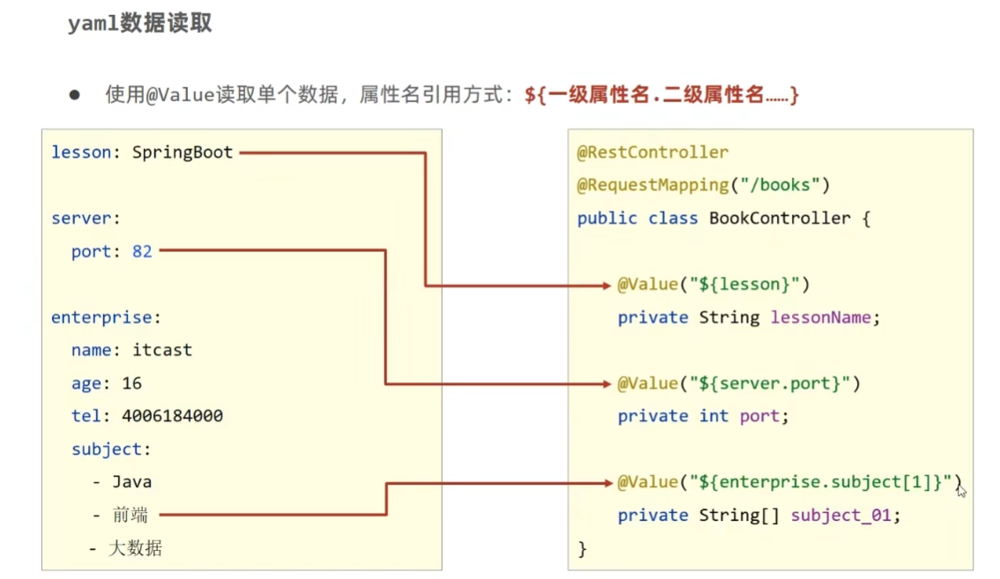

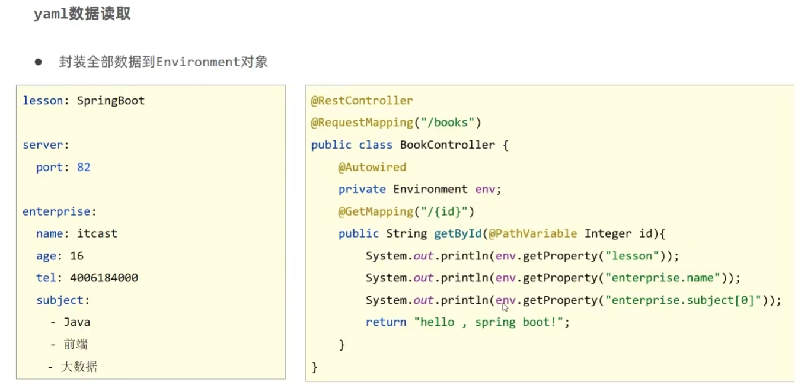

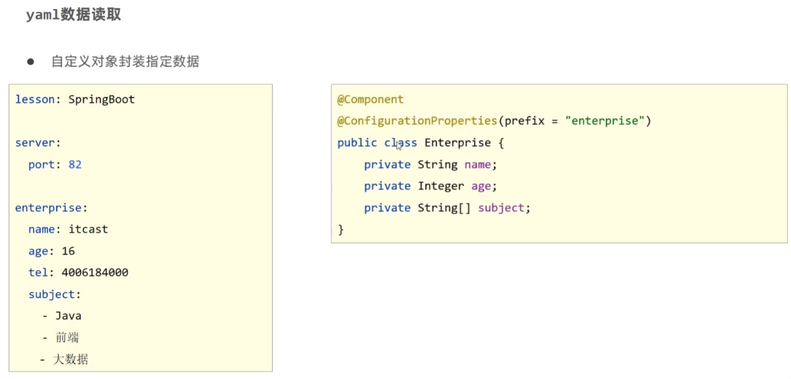
