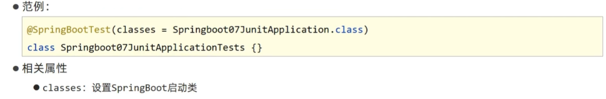
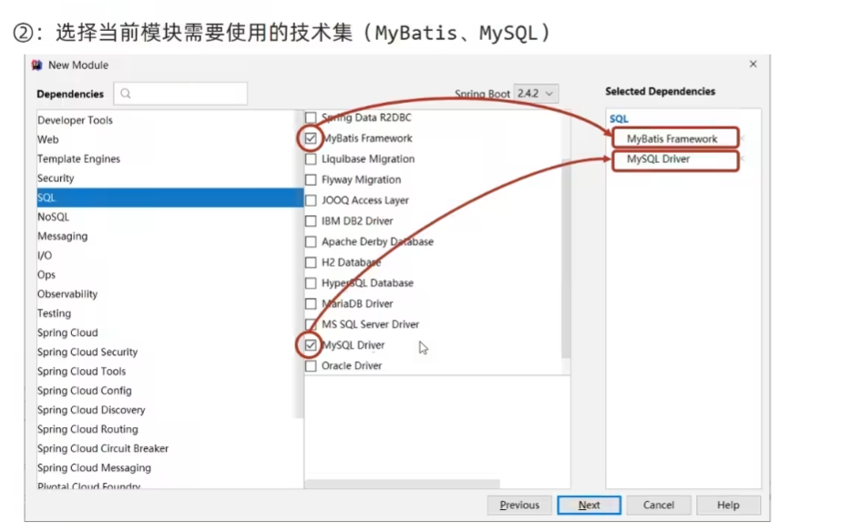

# SSM3

## SpringBoot


### 创建工程


他给的太多了。


当然也可以选择去官网创建，因此idea创建boot项目就是用的线上方式。去官网下拉就行，流程接近。

### 快速启动

在生命周期里package下，获得一个jar包。在jar包路径cmd然后执行java命令就行

```java
java -jar springboot.jar
```

 

### 介绍


更换服务器也很方便。吧原来的服务器屏蔽了，然后转成jetty。


### 配置文件


yml和yaml配置文件情况如下

```java
server:
  port: 82//

logging:
  level:
    root: info//根路径级别，默认info级别信息，清爽点就改成warn级别

likes:
  - music
  - game
  - PE
```

这里我们遇到了yaml格式，这里介绍一下


### yaml读取


### 设置多环境

设置多环境主要是在application.yml里面作修改

如果是用yaml文件，就是下面两种


还有这种


使用Properties区分环境则根据文件进行区分。


带参数启动SpringBoot就用下面这种方式


选择配置文件的优先级按照下面这个顺序考虑。


### Maven与SpringBoot的多环境兼容


然后就可以打包了。SpringBoot关联的事yaml，而Maven和xml文件关联，要两者关联，就要在xml里加入插件


### 配置文件层级


### 整合第三方技术

只要是SpringBoot主类所在文件夹及其子文件夹，SpringBoot都会扫描的。

#### 整合junit


注解也提供一些参数，用于设定启动类



#### 整合MyBatics

整个ssm里只有MyBatics需要整合。

正常的MyBatics需要这么设置


但是SpringBoot里只需要配置好之后改一改相关文件即可。




或者在xml文件里这么加依赖

```java
<dependency>
   <groupId>org.mybatis.spring.boot</groupId>
   <artifactId>mybatis-spring-boot-starter</artifactId>
   <version>2.2.0</version>
</dependency>

<dependency>
   <groupId>mysql</groupId>
   <artifactId>mysql-connector-java</artifactId>
   <scope>runtime</scope>
</dependency>
<dependency>
    <groupId>com.alibaba</groupId>
    <artifactId>druid</artifactId>
    <version>1.1.16</version>
</dependency>
```

然后springboot的设置数据源

```java
spring:
  profiles:
    active: dev
        
---
        
#开发
spring:
  config:
    activate:
      on-profile: dev
          
server:
  port: 80
      
---
      //上面是示例，下面是配置drudi的dataSource的。
spring:
  datasource:
    type: com.alibaba.druid.pool.DruidDataSource
    driver-class-name: com.mysql.cj.jdbc.Driver
    url: jdbc:mysql://localhost:3306/ssm_db #?servierTimezone=UTC
    username: root
    password: root
```


有了数据源，就快能使用mybatics了，但是映射还没做，所以直接做Dao前面加上Mapper（也就是MyBaticsConfig.class里干的事）


