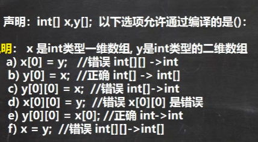

## 基本数据类型

### 整型

java的整型**常量**默认为int，如果声明long型**常量**，后边加上"l"或者"L"。

### 浮点型

​	浮点型中float为4字节，double为8字节；浮点型常量默认为double，如果声明float型常量，后边要加上"f"或者"F"。
​	浮点型常量表示方法：十进制，有5.12,5.12f，.512（0.512舍去0）；科学计数法5.12e2(即512.0),5.12E-2(10^-2)。
​	通常情况下应该使用***double***。
​	***浮点型使用陷阱***:判断2.7==8.1/3时，会出现false，因为右侧实际为2.6999997。因此为在结果为小数情况下应该这么写：Math.abs（2.7-8.1/3）<0.0001。

### 字符类型

​	char 如'a'，只可使用单引号并包括一个字符（转义字符一整个算一个字符）。
​	char本质为整数，为unicode码对应字符，输出使用强制类型转换可以查看对应字符；因此用整型赋值会输出该码对应的字符；char也可以和整型计算。
​	utf-8编码，字符一个字节，汉字三个字节。gbk字符一个字节，汉字两个字节。

### 布尔型

​	布尔型只能用true和false，c语言倒是可以用非0和0。

### 类型装换

#### 	自动类型转换

​	byte-short-int-long-float-double  
​	char-int-long-float-double
​	自动转换只会从左向右，由小到大发生。
​	当***多类数据混合运算***，系统会先将其转换为其中容量最大的一类数据再进行计算。char+char->int。

注意，该转换为一部分一部分转换。如5/9x6.0=0，但是5/9.0x6=3.3333

​	byte，short和char不会发生自动转换，否则报错。他们一起算时候，该计算式为***整型***，无法再赋值给byte，short和char。

```java
byte a = 1；
short b = 2；  
byte c1 = 2+1；//右侧算式为单类型，且为整数。
byte c3=a+1；//error
```

​	将int**变量**赋值给byte**变量**会报错，自动转换无法由大转小。
​	布尔型不参与转换，直接报错。
​	**整数常量可以给布尔之外的类型赋值**，有小数点常量只能给d。小数点常量加f可以两个都赋值。**char类型可以用'a' + 1等表达式赋值**
​	注意，哪怕算式默认以int起步，但是单纯的**赋值**命令，只要在变量数据类型允许范围即可。

#### 强制类型转换

​	强制类型转换符号遵循就近原则，如果想将算式完全转换，需要为算式加上括号。

```java
int x = (int)1+2.0;//error
int y = (int)(1+2.0)
```

​	注意，强制转换会造成精度溢出，甚至正负转换问题（内存第一位变号）。

## String类型

String类型不是基本类型，是引用类型。
基本类型转字符串

```java
double b = 100.0;
String s1 = b+"";//基础类型+""
```

字符串转基本类型，要用到parsexxx方法，并确保字符串数值有效

```java
double b1 = Double.parseDouble(s1);//parse转换意思
```

字符串转字符，则取出字符串第一个字符

```java
str.atChar(0);
```

字符串比较时候，使用String类的方法equals。（equals只能判断引用类型
用于判断值）

```java
String user = "dingzhen"
user.euqals("dingzhen")
//但是最好是使用下边这种方法判断
"dingzhen".euqals(user)//可以避免空指针有问题
```

关于String一些细节：

```java
public void test8(){
    String test="javalanguagespecification";
    String str="java";
    String str1="language";
    String str2="specification";
    System.out.println("===========test8============");
    System.out.println(test == "java" + "language" + "specification");//结果true，在编译阶段就已经确定
    System.out.println(test == str + str1 + str2);//结果为false，中间会创建对象放在堆中，需要运行阶段才能确定
//字符串字面量拼接操作是在Java编译器编译期间就执行了，也就是说编译器编译时，直接把"java"、"language"和"specification"这三个字面量进行"+"操作得到一个"javalanguagespecification" 常量，并且直接将这个常量放入字符串池中，这样做实际上是一种优化，将3个字面量合成一个，避免了创建多余的字符串对象。而字符串引用的"+"运算是在Java运行期间执行的，即str + str2 + str3在程序执行期间才会进行计算，它会在堆内存中重新创建一个拼接后的字符串对象。总结来说就是：字面量"+"拼接是在编译期间进行的，拼接后的字符串存放在字符串池中；而字符串引用的"+"拼接运算实在运行时进行的，新创建的字符串存放在堆中。
    //相似的还有下面的
    public void test9(){
    String s0 = "ab"; 
    final String s1 = "b"; 
    String s2 = "a" + s1;  
    System.out.println("===========test9============");
    System.out.println((s0 == s2)); //result = true
}
public void test10(){
    String s0 = "ab"; 
    final String s1 = getS1(); 
    String s2 = "a" + s1; 
    System.out.println("===========test10============");
    System.out.println((s0 == s2)); //result = false ，同样是因为编译期间无法确定s2，而s2必须在运行时候确定，用堆接收拼接好的对象
    
}
 
private static String getS1() {  
    return "b";   
}
     
```


## 赋值方式

基本数据类型，赋值方式为值拷贝，如：

```java
int n1 = 10;
int n2 = n1;//这里只是将n1的值给n2，当本质上n1和n2两个内存格没关联
```

数组则在默认情况下为引用传递，赋值方式为引用拷贝

```java
int[] arr1 = new int[5];
int[] arr2 = arr1;//当arr1发生改变，arr2也发生改变
```

赋值时，基本变量的值放在栈，数组的一大块区域在堆中，指向数组的指针在栈中。

## 运算符

### 算术运算符

自增自减++与--的实际原理
以及在有浮点数情况下使用%的具体情况
***<u>我讨厌除法</u>***

```java
byte i = 1;i = i++;//此时i值为1
byte i = 1;i = ++i;//此时i值为2
temp = i;i = （byte）（i + 1）;return temp;//i++原理，低层会强制类型转换
i = （byte）（i+1）;temp = i;return temp;//++i原理
-10.5 % 3 = -1.5//-10.5-（int）-10.5/3*3，此时算的是近似值
```

### 关系运算符

大于小于等于不等于和instanceof

其中==：
1.可以判断基本类型，又可以判断引用类型
2.如果是基本类型，判断值是否相等
3.如果判断引用类型，则是判断地址。 

### 逻辑运算符

短路与&&，左侧为false就不判断右侧，效率高

```java
if(a < 1 & ++b < 100)//左侧默认false，b加一
if(a < 1 && ++b < 100)//左侧默认false，b不加一  
```

同理，短路或||之于逻辑|为左侧为true则不算右侧。效率高。

还有取反！和异或^

```java
boolean x = true;
boolean y = false;
short z = 46;
if((z++ == 46)&&(y = true)) z++;
if((x = false)||(++z == 49))Z++;//z值为50；
```

面试题
==和equals的对比

对于==，它是一个比较运算符
1.可以判断基本类型和引用类型
2.如果判断基本类型，判断值是否相等
3.如果判断引用类型，判断地址是否相等，即判断是不是同一个对象

对于equals，只能判断引用类型
1.Object类情况下，equals一般只会查看地址，直接用==
2.在String类中，equals被重写，用于判断两句字符串是否一致。

### 赋值运算符

```java
int x = a+b+c;//右侧顺序从右往左  ？？？？
byte b=3；
b+=3；//和b = b + 3；不同，该赋值运算符有 强制类型转换
```

### 三元运算符

```java
条件表达式？表达式1：表达式2；
result= a > b ? a++ : b--;//false，result 获得b初始值 
```

### 位运算符

& | ^ ~ >> << >>> 
a&b,先获得a，b的原码，**转换为补码**，然后进行与操作，获得的结果为一个补码。如果第一位为0，补码等于原码，如果第一位为1，补码减一，获得反码，并除第一位取反获得原码。

原码-反码-补码-运算结果（补码）-反码-原码

~2=-3
原码0010   对应取反（不是反码）对应未知数的补码1101   未知数反码1100   除首位反转1011 -3

算术左移<<：符号位不变，低位补0
算数右移>>：低位溢出，符号位不变，用符号位补溢出高位。
无符号右移/逻辑右移>>>:低位溢出，高位补0

### 运算符优先级

1.（）｛｝

2.单目运算符 ++ --  ^  !

3.算数运算符

4.位移运算符

5.逻辑运算符

6.三元运算符

7.赋值运算符 = +=等

## 键盘输入

使用Scanner类，具体如下：

```java
Scanner sca = new Scanner(System.in);
System.out.println("输入姓名");
String name = sca.nextLine();
System.out.println("输入年龄");
int age = sca.nextInt();
System.out.println("输入工资");
double salary = sca.nextDouble();//将键盘输入转为指定数据类型

String str1 = sca.next();//next方法得不到带有空格的字符串，因为他会提出有效字符前的空格，然后以空格结束 sca.nextLine();//以回车作为结束标志，可以获得空白
String str2 = sca.next();
System.out.println(str1+str2);//连续输入需要顾及中间的回车，不过试了后要不要捕获回车都行

char user = sca.next().charAt(0);//在next情况下获取字符
String key = sca.nextLine();//则这里会直接接收到回车导致无法输入key
//所以改用下边这个方式
char user = sca.nextLine().charAt(0)//可以吃掉回车避免连续输入出问题
```

## 条件语句

```java
if（）{
}else if(){
}else{
}//多分支结构中，只会执行其中一个，这些条件语句的按顺序执行，有一个为true就执行{}内的内容，然后退出条件判断
```

​	并且嵌套if不要超过**三层**

​	switch 判断语句的表达式和常量应保持类型一致，但如果**可以自动转换**也可以，如输入是字符，常量是整数。
​	如果中间没break，就会顺序执行，直接执行到低或者遇到break。这个特点使得switch内同类结果可以贯通到底使用一次break。
​	其中，switch表达式的常量有（byte，short，int，char，enum，String），没有double或者float。
​	default可以不使用。
​	switch某些表达式可以达到类似if分支的结果而不是单纯的枚举数字。

## 循环语句

​	和for和while语句相比，do...while会先执行一遍在进行循环中的判断。
​	使用break语句可以在后边加入指定标签，表明要终止的循环语句，默认退出最近的循环。但是尽量不要使用，会降低代码可读性。

```java
label:
for(int i = 0; i < 10; i++){
	break label;
}
```

continue和break一样都可以使用标签.
return 和continue、break是跳转控制语句，但是是用于跳出方法和主程序
return 也可以直接返回String型

## 数组

```java
数据类型[] 数组名 = new 数据类型[大小];//数组动态初始化
如 int[] arr = new int[5];//没有new的情况下，数组只是声明
int[] arr = {2, 5, 9, 0.56, 85};//静态初始化
//数组在创建后如果没有赋值，会给予默认值，即0或者false
String[] strs = new String[]{"a", "b", "c"};//[]内部不能有数字
arr.length //可以返回arr数组的长度（前提是arr是数组类型）
```

​	数组中的元素可以是任何数据类型，包括基本类型和引用型，但是两者不能混用。
​	在java中顺序查找可以分为顺序查找、二分查找。

### 数组冒泡算法：

```java
public static void main(String[] args) {
            int[] arr = {24, 60, 80, 57, 13};
            for(int i = 0; i < arr.length - 1; i++){
                for(int j = i; j < arr.length - 1 ; j++){
                    if(arr[i] > arr[j + 1]){
                        int temp = arr[j + 1];
                        arr[j + 1] = arr[i];
                        arr[i] = temp;
                    }
                }
            }
            System.out.println(arr);
    }
```

### 	二维数组

​	栈里面的arr包含一个指向堆里连续内存格的地址指针，然后连续内存格里面每一个格里还是地址指针。

```java
int[] arr = new int[4][5];//二维数组初始化方法1
int[][] arr;
arr = new int[2][3];//二维数组初始化方法2
arr = new int[2][];//也可以不整列数
arr[i] = new int[x];//这可以使得每一列的个数不同
```

### 数组赋值



即，同类型高维数组不能赋值低维，，甚至零维，如一个int变量.只有同纬度可以互相赋值。 

### 顺序数组插入

​	将一个正序数组arr = [10, 12, 45, 90]中插入整型23
方法一：先找准23所需要插入的位置，然后进行数组扩容

```java
		int[] arr ={10, 12, 45, 90};//另一种解法
        int newer = 23;
        int ind = -1;
        for(int i = 0; i < arr.length; i++){
            if(arr[i] > newer) {
                ind = i;
                break;
            }
            else ind = arr.length;
        }//确定23要插入的位置的索引
        int[] copyer = new int[arr.length + 1];
                for(int i = 0, j = 0; i < copyer.length; i++){
                    if(i != ind){
                        copyer[i] = arr[j];
                        j++;
                    }else copyer[i] = newer;
                }
       arr = copyer;
```

方法二：用一个变量更新最大值，然后扩容

```java
		int[] arr = new int[]{10, 12, 45, 90};//排序加插入
        int[] copyer = new int[arr.length + 1];
        int theInsert = 3;
        for(int i = 0; i < copyer.length; i++) {
            if (i < copyer.length - 1) {
                if (theInsert >= arr[i]) {
                    copyer[i] = arr[i];
                } else {
                    copyer[i] = theInsert;
                    theInsert = arr[i];//有比23大的就把23换下，然后不断更新
                }
            }else copyer[i] = theInsert;
        }
        arr = copyer;
```