## java异常处理与常用类

​	正常程序中，如果有一个不致命问题程序就会崩溃，这样的程序健壮性很差。

​	正确的做法是使用异常处理机制，如果认为一段代码可能出现异常，可以使用try-catch异常处理机制解决问题.可以选中一段代码（不是所有代码都可以），然后ctrl + alt + t ——>选中try catch。这样这段程序出现异常，程序也可以继续执行。

```java
try{
    int res = num1 / num2;
}catch (Exception e){
    System.out.println(e.getMessage());//使用e.getMessage(),能打印问题，并且输出框不见红色警报
}
```

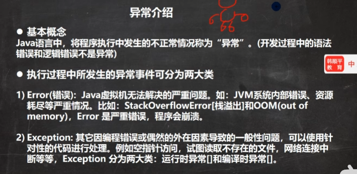

Exception分为两大类：运行时异常[程序运行时，发生的异常]和编译时异常[编程时，编译器检查出异常]。

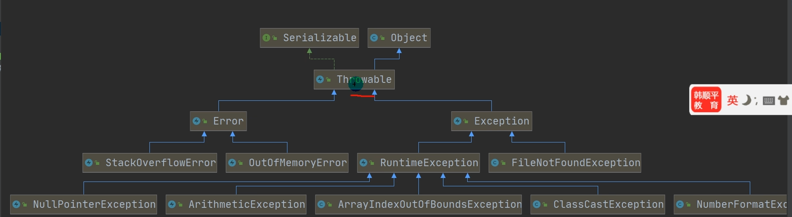

一般程序员应**避免编译异常**，运行异常好说。

### 运行异常

常见的运行异常有

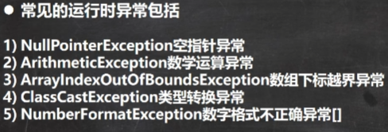

#### 空指针异常

NullPointerException空指针异常，当应用程序试图在需要对象的地方使用null时，抛出该异常。

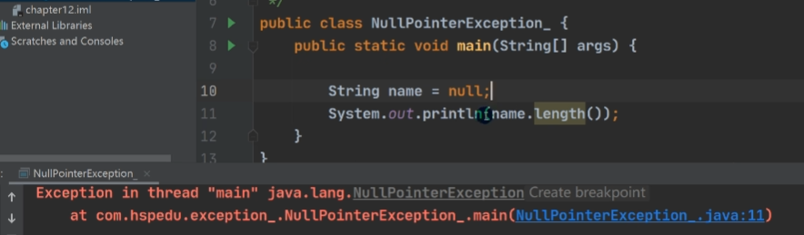

#### 运行时异常

ArithmeticException数学运算异常，当出现异常的运算条件时，例如一个整数“除以0”。

#### 数组下标越界异常

ArrayIndexOutOfBoundsException数组下标越界异常，用非法索引访问数组时抛出异常。如果所因为负或大于等于数组大小，则该索引为非法索引。

#### 类型转换异常

ClassCastException类型转换异常，当将对象强制转换为不是实例的子类时，抛出异常。

```java
A b = new B();
B b2 = (B)b;//正常向下转型
C c2 = (C)b;//抛出类型转换异常
```

#### 数字格式不正确异常

NumberFormatException数字格式不正确异常，当应用程序试图将字符串换成一种数值类型，但是该类型不能转换为适当格式时，抛出该异常=》使用异常我们可以确保输入是满足条件数字。

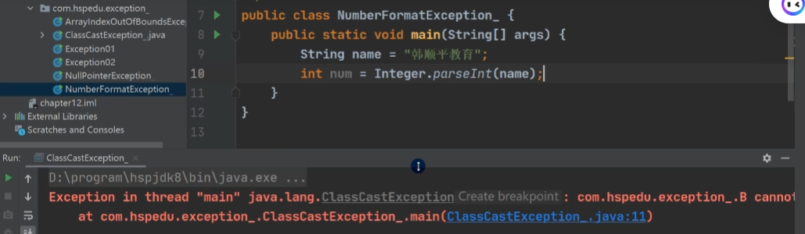

## 编译异常

​	编译异常是指在编译期间，就必须处理的异常，否则代码不能通过编译。
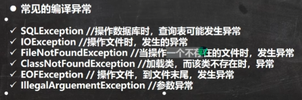

## 异常处理方式

### try-catch-finally

程序员在代码中捕获发生的异常，自行处理

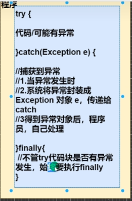

如果没有发生异常catch代码块不执行的。

程序会有一个默认向上扔的指令在，没有try-catch-finally指令在就用throw。

try-catch可以有多个catch，用于接受不同的。而当try块内不某个语句发生异常，将不执行剩下语句，而执行catch中的语句。

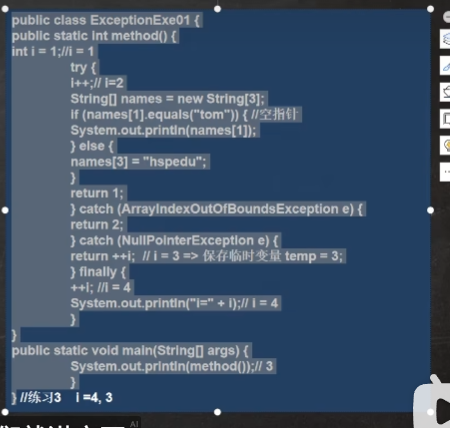 

注意：在有finally情况下，哪怕出错并在catch里面执行到return，finally里的语句还是要执行的。catch那里存一个临时变量3，如果finally里没有return，在finally结束后，return。如果finally里有return，则temp换成finally里return值再最后输出。

### throw

throws将发生的异常抛出，交给调用者（方法）处理，最顶级的处理者为JVM。

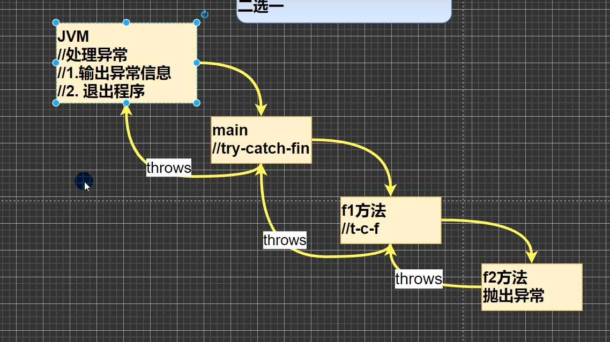

使用情况：
1.如果一个方法（中的语句执行时）可能生成某种异常，但是并不能确定如何处理这种异常，则此方法应显示地声明抛出异常，表明该方法将不对这些异常进行处理，而由该**方法调用者**负责处理
2.在方法声明中用throws语句可以声明抛出异常的列表，throws后面的异常类型可以是方法中产生的异常类型，也可以是它的父类（Exception）。

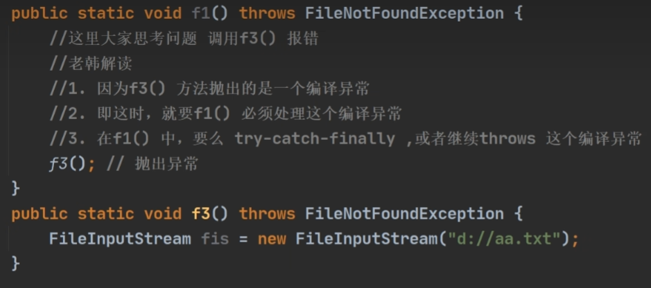

如果一个方法开抛，调用这个方法的，要么接着抛，要么把这事接下来解决了。如果抛的事编译异常，一定要处理。

### 自定义异常

步骤：

1.定义类：自定义异常类名，继承Exception或RuntimeException
2.如果继承Exception，属于编译异常
3.如果继承RuntimeException，属于运行异常（一般是继承RuntimeException）

```java
public class CustomException {
    public static void main(String[] args) {
        int age = 80;
        if(!(age >= 18 && age <= 120)){
            throw new AgeException("你的年龄需要在18~80之间");
        }
        System.out.println("你的年龄输入正确");
    }
}
class AgeException extends RuntimeException{//继承这个使用默认的处理
    public AgeException(String message){
        super(message);
    }
}

```

### throws

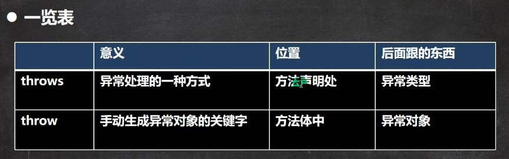

​	throw用于方法体内，后边跟一个具体的方法对象，就像thorw new AgeException，这个后边就是一个具体的异常对象。

```java
public class ReturnExceptionDemo {
    static void methodA(){
        try{
            System.out.println("进入方法A");
            throw new RuntimeException("制造异常");
        }finally {
            System.out.println("用A方法的finally");
        }
    }

    static void methodB(){
        try{
            System.out.println("进入方法B");
            return;
        }finally {
            System.out.println("调用B方法的finally");
        }
    }

    public static void main(String[] args) {
        try{
         ReturnExceptionDemo.methodA();
        }catch (Exception e){
            System.out.println(e.getMessage());
        }
        ReturnExceptionDemo.methodB();
    }
}

//实际的输出为，先进入方法A，随后Afinally，然后制造异常，然后是B那俩。
//在throw有点像return，要等finally搞完，再真正的throw出去到外圈代码里面，被catch掉。
```

## 常用类

### 包装类Wrapper

包装类和基本类数据在jdk5之前是需要通过手动进行装箱和拆箱的，装箱：基本类型->包装类型，反之为拆箱
jdk5之后即可自动拆装，自动装箱低层调用valueOf方法,拆箱用的是xxxValue，如int类，为integer.intValue()。

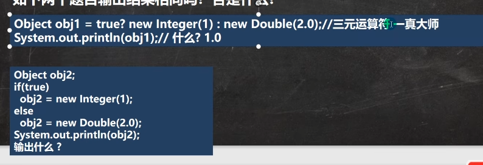

这里面涉及自动转型，二元三元运算符中取最高级的数值类型进行返回。所以上边那个是1.0，下边那个是1。

下图为包装类型和String类型的相互转换。还有个方式3 Inter j = Integer.parseInt

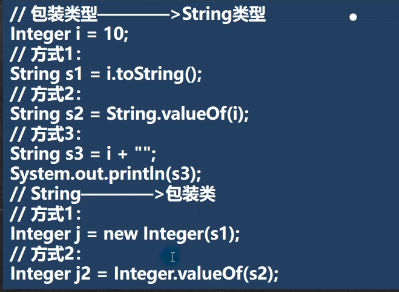

### Integer

如果不是new，看范围，超出-128-127，则为不同的对象

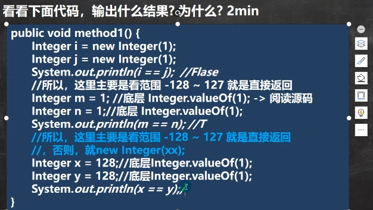

再看下边

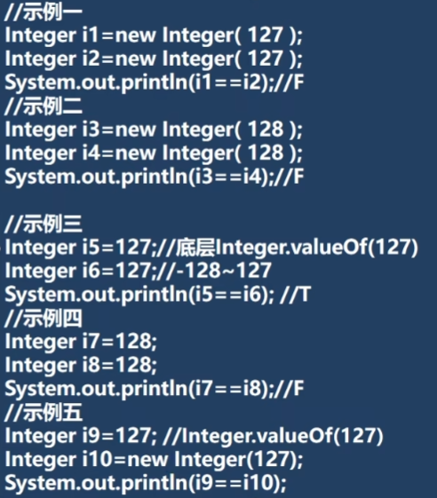

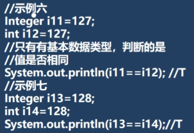

如果直接用new的方式，则一定为不同的对象而不是比较value，如果是示例三那种用等号，或者valueof，则范围内认为是整型，比较值，范围外是Interger对象，比较哈希表？。只要是例六例七的那种有整型在==两边的，一定比较值。

### String

字符串中一个字符，不论是字母还是汉字均占两个字节。
String类实现了接口Serializable，因此String对象是可以串行化的（可以查找String的继承关系图），可以在网络上传输。
String实现Compareable，则代表可以进行比较，String对象可以进行比较。
String是final类，一旦创建就是常量无法更改地址，但是数组内部可以改，本质是char数组final char value[]，即value的地址无法更改。

```java
String name = "jack";//字符串常量均用“”双引号括起来。
//以下为常用构造器
Stirng();
String(String);
String(char[]);
String(byte[], int, int);
//a.equals(b)，则是将数组a的值和b的值拿出来一个个比较，无论是对象还是常量在池中地址一样，那就一样。
```

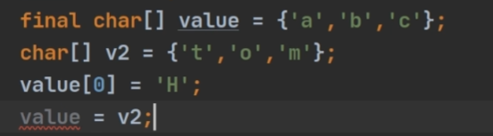

final数组是不能更改指向的数组地址，可以更改里面的单个元素。

#### 创建String对象

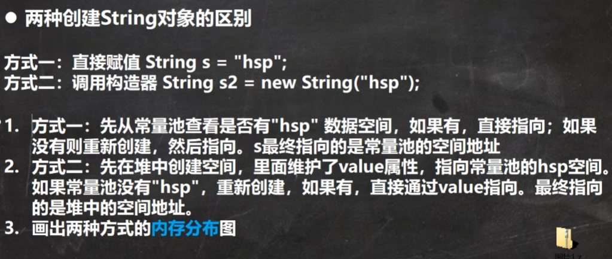

String类创建对象的方法主要有两种，直接赋值，调用构造器。下图为两种方式在内存中的区别。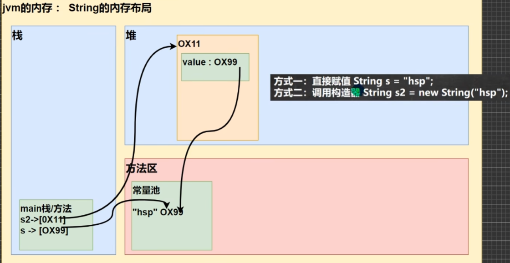

#### String使用细节

```java
String a = "hsp";
String b = new String("hsp")
a.equals(b)//t
a == b//f  a指向常量池，b是堆中对象
a == b.intern()//t。b.intern()返回b指向的池中的对象
b == b.intern()//f。b指向对象，不能和b.intern()相提并论。
    
///////////////////////////////////////////////////////
    
String s1 = "hello";
s1 = "hahaha";//这里是在常量池创建了两个字符串对象。

String a = "hello" + "abc";//这里的优化了，相当于等价"helloabc"，否则太蠢了。

String a = "asf";
String b = "fghj";
String c = a + b;//这里只会生成a b两个字符串对象
//StringBuilder sb = StringBuilder()
//sb.append("hello")
//sb.append("abc")
String c = sb.toString()//注意，此时c不是指向池中的，而是指向堆中对象！
```

下方图中，由于方法change内的str是局部变量，只是和成员str长得一样，并且接收了成员str的值。因此，change改变的是局部变量str的值，并没有改变成员变量str的值。

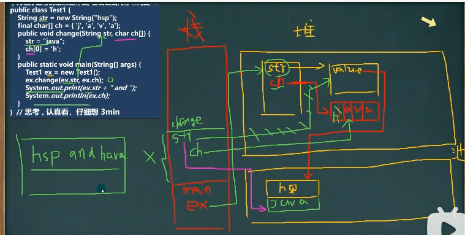

需要认清，final char[] ch的数组并不在方法区常量池。同时使用方式时栈会开辟新的空间，给ex，str，ch。

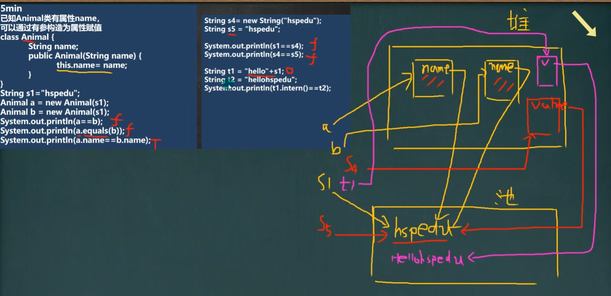

t1部分的原理为先创建一个StringBuilder.append（hello）再加上s1，最后在堆中创建一个String给t1，t1并不直接指向常量池中的字符串。主要原因是t1的+中有一个变量，如果都是常量就不是这样。

#### String常见方法

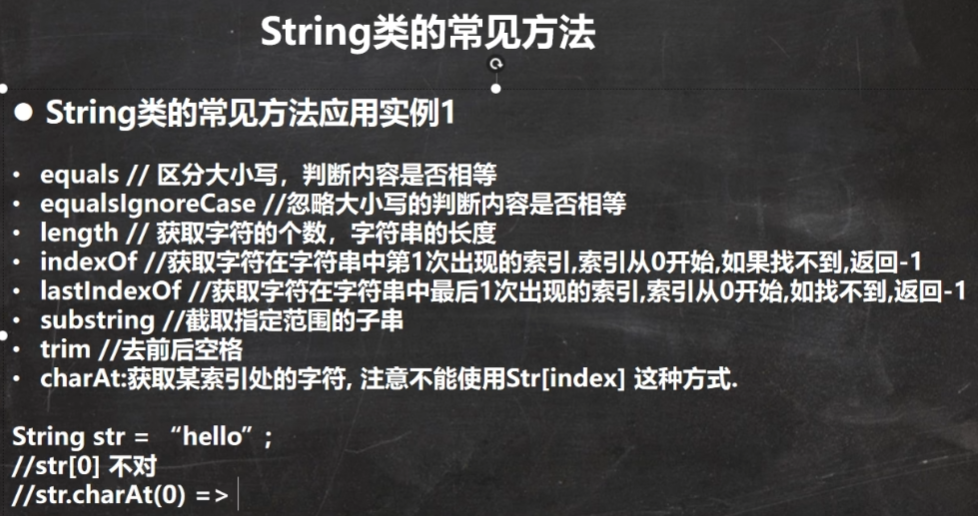

```java
String name = "hafshflwafl@";
name.substring(6);//从截取后边部分，包括索引6
name.substring(0, 5);//截取到五之前的位置不包括五

String.indexOf(str)//可以查找字符串，但是是找字符串第一个字符
```

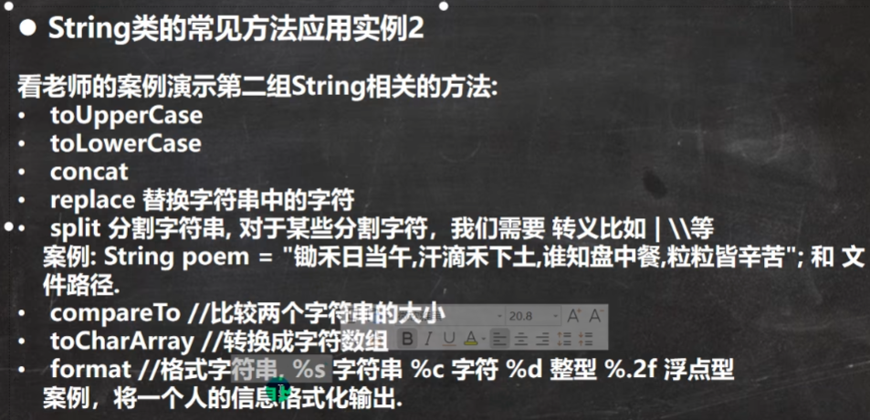

```java
str.concat(str1).concat(str2).concat(str3);//类似 + 机制
str.replace(str1, str2);//将所有str1改成str2
//用split进行分割时候
str.split("\\\\");//接受分割后的字符串使用String[]，二维数组，并且如果有特殊字符，要用转义字符."\\\\" == "\\" + "\\", "\ + "\"

str1.compareTo(str2);//如果两个str前面部分都相同，返回str1长度减去str2；如果前面有字符不同，无论长度一不一样，都做ascii减法。

//format 格式字符串,占位符%s字符串,%c字符，%d整型，%.2f浮点型,保留两位小数并且四舍五入。
String name = "john";
int age = 10;
double score = 98.3 / 3;
formatStr = "我的名字%s， 成绩%.2f"
String info = String.format(formatStr, name,score);
```

例题，交换String中的部分字符

```java
    public static String rever(String str, int start, int end){
        if(start < 0 || end > str.length() || str.length() == 0){//！（str != null && start >= 0 && end > start && end，这是一个技巧，找错误的，就对正确取反
            throw new RuntimeException("输入异常");
        }
        char[] result = str.toCharArray();
        char temp;
       for(int i = start, j = end; i < j; i++, j--){
           temp = result[i];
           result[i] = result[j];
           result[j] = temp;
       }
       return new String(result);
    }
    public static void main(String[] args) {
        try{
            String str  = "abced";
            System.out.println(rever(str, -1, 3));
        }catch (Exception e){
            System.out.println(e.getMessage());
        }
```


#### StringBuffer

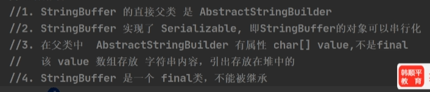

StringBuffer类和String类最大区别是，String类保存的是字符串常量，每次更改需要更换地址；StringBuffer保存字符串变量，可以更新内容，其char[] value不在常量池，在堆中。如果StringBuffer空间大小不够，才会改地址进行扩展。StringBuffer可以**多线程使用**。

其构造器如下：其中第四个是输入字符串的长度str.length + 16字符（见第一个构造器）

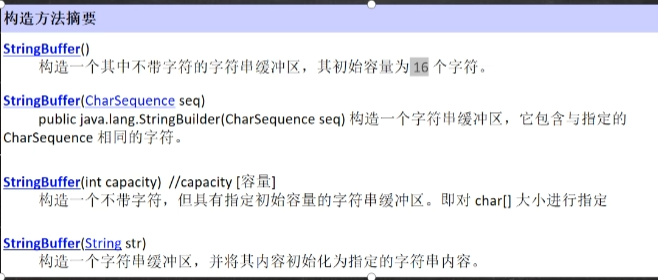

##### StringBuffer与String转换

```java
String -> StringBuffer
(1)StringBuffer sb = new StringBuffer(str);
(2)sb = sb.append(str);

StringBuffer -> String
StringBuffer sb = new StringBuffer("hpx");
(1)String s = sb.toString();
(2)String s1 = new String(sb);//StringBuffer对象
```

##### 常用方法

```java
StringBuffer s = new StringBuffer("hello");
s.append(",").append("?").append("!");//如果append一个空数组，在其内部会自动加一个字符串，具体为“null”。
s.delete(start, end);//start<=  <end
s.replace(start, end ,str);//将start到end这个范围字符替换为str
s.indexOf(str);//索引str第一次出现时的位置，没有范围-1
s.insert(9, str);//在索引处插入str
s.length();
```

```java
String price = "1234.56";
StringBuffer sb = new StringBuffer(price);
for(int i = sb.lastIndexOf(".") - 3; i > 0; i -= 3){
    sb.insert(i, ",");//在.前三位插入“，”。
}
```

#### StringBuilder

StringBuilder 是StringBuffer的简易替换，用于在字符串缓冲区被单个线程使用时候，其速度快于StringBuffer，但是不能保证线程安全。StringBuilder没有互斥处理，即**没有synchronized关键字**。

StringBuilder的字符串和StringBuffer一样都在堆中。以下是三种String相关类使用原则。

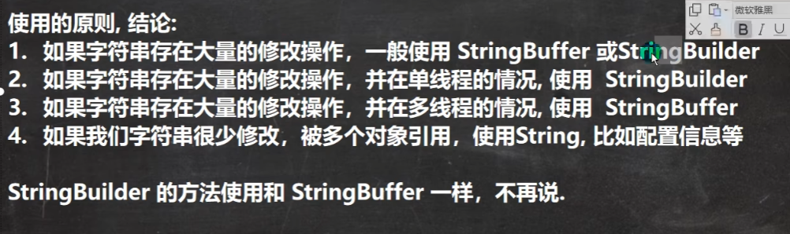

### Math

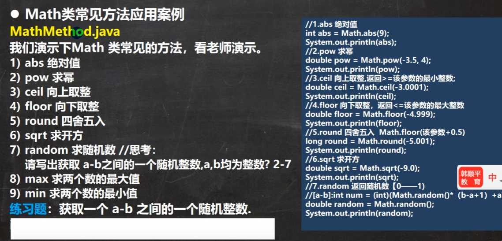

注意，random的范围为[0, 1)，为实现整数2-7，应该用random*(b - a +1)。以上方法均为静态方法。

### Arrays

```java
Interger[] i = {1, 20, 90};
result = Arrays.toString(i);//返回一个字符串，"[1, 20, 90]"
//一般输出数组时候用下

sorts = Arrays.sort(i);//排序，从小到大
//sort中的一个参数可以通过匿名内部类等方法重写，通过传入接口Comparator实现定制排序
Arrays.sort(arr, new Comparator({
    @Override
    public int compare(Object o1, Object o2){
       int i1 = (Integer) o1;
       int i2 = (Integer) o2;
        return i1 - i2;
    }//i1 - i2会导致顺序从小到大，i2 - i1会使得顺序从大到小。
}))//底层会使用Comparator方法返回的正负决定排序顺序。
    
return Arrays.binarySearch(array, num);//要求array是排序好的，num为要查找的数。使用binarySearch需要保证顺序，找不到返回应该在的位置加一的复数，返回-6，证明该数应该处在的索引是5。
Interger[] newArr = Arrays.copyOf(arr, arr.length - 1);//拷贝arr.length长度的数组，数组来源于arr，除最后一个均拷贝。如果长度超过，加一个null。如果长度小于0，会抛出异常。

Arrays.fill(arr, 99);//将arr中所有元素替换为99。
Arrays.equals(arr1, arr2);//比较两个数组之间的差别，
List asList = Arrays.asList(2,3,4,5,6);
System.out.println("asList" + asList);
```

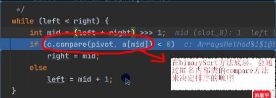

### System

```java
//System类常见方法

exit();//退出当前程序
System.exit(0);//表示程序退出状态


arraycopy();//复制数组元素，比较适合底层调用，一般用Arrays.copyOf()完成复制数组
int[] src = {1, 2, 3};
int[] dest = new int[3];
System.arraycopy(src, 0, dest, 0, 3);//这里一共有五个参数，分别为 （源数组， 源数组开始拷贝的位置， 目标数组， 目标数组开始拷贝的位置， 从源数组拷贝到目标数组的数目int型）

currentTimeMillens();//返回当前时间距离1970-1-1，毫秒数
gc();//运行垃圾回收机制
```

### BigInterger和BigDecimal

BigInterger适合保存比较大的整型， BigDecimal适合保存精度更高的浮点型。

```java
//BigInterger的加减乘除参数均是本类对象，bi1和bi2是本类对象 
BigInterger bi1 = new BigInterger("151551613");//输入是String?
BigInterger bi2 = new BigInterger("1515");
bi1.add(bi2);//使用“+”没有用,并且这四个命令不会改变bi1，要输出结果只能用东西接着这个代码的返回值。估计一般的大的数值类型，都挺重要，不能随便覆盖
bi1.subtract(bi2);
bi1.multiply(bi2);
bi1.divide(bi2);

// BigDecimal的加减乘除参数均是本类对象，bd1和bd2是本类对象 
bd1.add(bd2);//使用“+”没有用
bd1.subtract(bd2);
bd1.multiply(bd2);
bd1.divide(bd2);//有可能抛异常，小数除以小数存在死循环，即除不尽。解决方法，指定精度，
System.out.println(bd1.divide(bd2, BigDecimal.ROUNDCEILING));//后边这个就是精度，保留小数点两位
```

### Date

第一代日期类Date

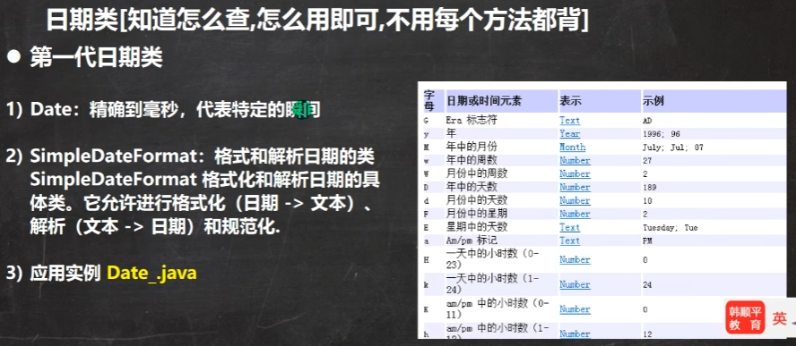

```java
 Date d = new Date();                                    Date d2 = new Date(15151);//通过指定毫秒数得到时间
 System.out.println(d);//输出为Wed Jan 10 17:15:28 CST 2024，为外国所用方式                    
 SimpleDateFormat sdf = new SimpleDateFormat("yyyy年MM月dd日 hh:mm:ss E");//这个格式见图     
 String format = sdf.format(d);                                                     
  System.out.println(format); //2024年01月10日 05:19:13 星期三                                                      
String s = "1996年01月01月 10:20:30 星期一"
Date parse = sdf.parse(s);
```

### Calendar

第二代日期类Calendar，是一个抽象类，并且构造器为private

```java
Calendar c = Calendar.getInstance();//获取日历类对象
//返回日历对象某个日历字段
c.get(Calendar.YEAR);
(c.get(Calendar.MONTH) + 1)
C.get(Calendar.DAY_OF_MONTH)
c.get(Calendar.HOUR)
c.get(Calendar.MINUTE)
c.get(Calendar.SECOND)
```

LocalXXX

第三代日期类

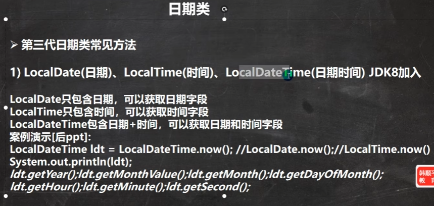

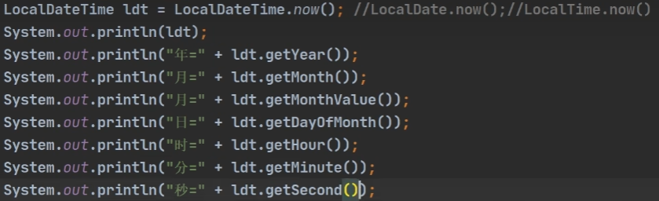

以上是在LocalDateTime的情况下，如果使用LocalDate.now();可以获取年月日；LocalTime.now()，获取到时分秒。
