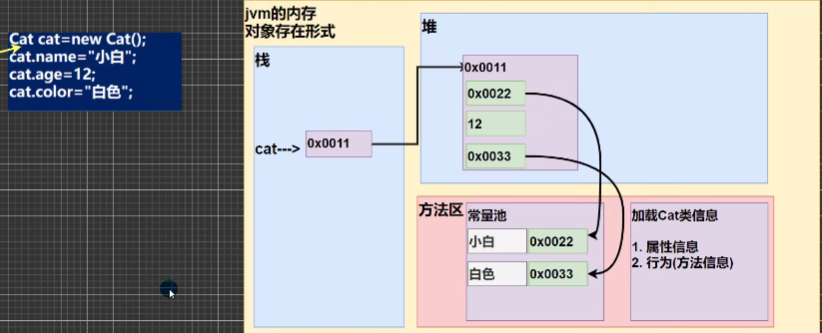
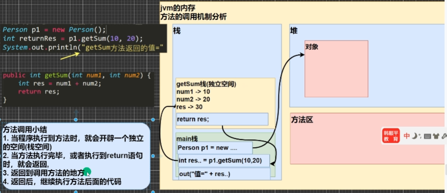
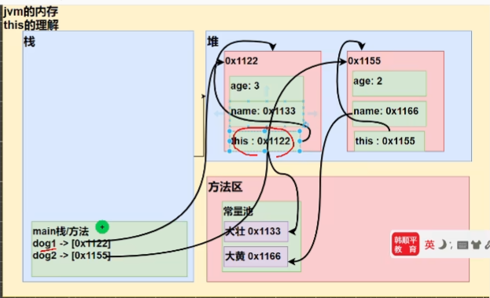
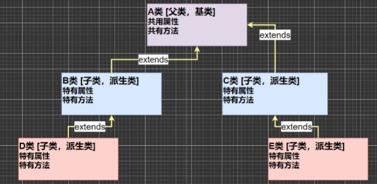
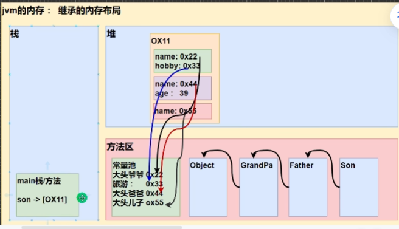
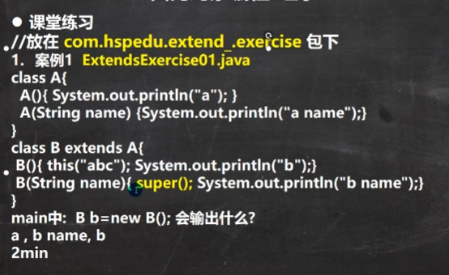
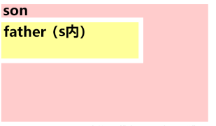

##  java面向对象（初级）

对象是class类的实例化，是类的一个实体，具体的实例化方法为：

```java
(类名) 对象名 = new (类名)();
```

### 对象和方法于内存中的布局

​	jvm java虚拟机中，对象名代表的内存在栈中，包含着指向堆中一串内存的地址指针。一串内存中如果有内存是字符串名，则其地址会指向方法区的常量池；如果是基本数据类型，就在堆中放着。方法区也会加载类的方法和属性信息。**真正的对象是堆中的那一块**。因此对象和数组在传递时效果很像，指针。



对象的属性有其默认值，规则和数组一样 ，基本类型是0，0.0，false啥的。

### 创建对象

```java
Cat cat;//先声明
cat = new Cat();//再创建
Cat cat = new Cat();//直接创建
```

### 方法 

​	而方法在被调用时遵守以下规则：首先开辟一个栈空间；执行完毕或者执行到return语句则会返回到调用方法的位置；返回后按顺序继续走程序。



​	而当方法在遇到返回值要返回多个数时，可以使用  **int[] 方法名**  使得该方法返回值改为数组。其返回类型包括基本类型和引用类型（一维二维三维）。
但是方法不能嵌套定义方法。

```java
public int[] getSumAndSub(int i, int j){
    int[] resArr = new int[2];
    resArr[0] = i + j;
    resArr[1] = i - j;
    return resArr;//这里直接返回数组名
}
```

```java
B p = new B();
p.age = 100;
p.test();
（p.age == 100;）//结果
 
class B{
test(){
    p = null;//形参指向空指针，原p不影响。即形参能改变p但是不能令p指向空指针。
}}//？我写的啥
```

### 递归

​	递归是方法自己调用自己的一种情况。注意，递归的方法中的每一环都会执行到它单独执行时应该执行到的地方，不会因为递归影响自己执行程序。

```java
 if( n == 1 || n == 2){
            return 1;
        }else {
            return fbnq(n - 1) + fbnq(n - 2);
        }//斐波纳洛数
```

```java
 if(n == 10){
            return 1;
        }else if(n > 0 && n <10){
            return (peach(n + 1) + 1) * 2;
        }else{
            System.out.println("error");
            return -1;
        }//第十天剩一个peach
```

1.找出最终情况；2.确定中间的递归关系；3.确定return位置

示例，八皇后

```java
        int[] map = new int[8];
        put(map, 0);
    }
    public static void put(int[] map, int i){
        if(i == 8){
            for(int k = 0; k < 8; k++){
                System.out.println(map[k]);
            }
            return;
        }
            for(int j = 0; j < 8; j++){
                map[i] = j;
                if(judge(map, i)){
                    put(map, i + 1);//为啥我有时候会在下一行加return
                }
            }
    }
    public static boolean judge(int[] map, int i){
        for(int m = 0; m < i; m++){
            if(map[m] == map[i] || Math.abs(map[i] - map[m]) == Math.abs(i - m)){
                return false;
            }
        }
        return true;
    }     
```

### 方法重载

重载的核心在于保持方法名不变而其他部分，如返回值，形参都改变

### 可变参数

具体表现代码如下：

```java
 int m(int...integer){
        int count = 0;
        for(int i = 0; i < integer.length; i++){
            count += integer[i];
        }
        return count;
    }

可变参数的实参可以为0-多个，实参也可以直接当数组（本质就是可变数组）。
可变参数可以和普通参数放一起，但是可变参数必须放在一行形参的最后一个。
```

### 作用域

```java
class Method{
    int fubc;//全局变量，有默认值，即属性
    {
        int num = 0;//局部变量，没有默认值，初始化必须赋值。属性之外都局部。
}
}//属性和局部可以重名，使用时遵循就近原则
```

### 构造器

constructor，用于对对象的初始化。

构造器的修饰符可以默认
必须没有返回值
构造器名和类名必须一样
参数列表和成员方法一样的规则
构造器是完成对象的初始化，不是创建对象。当创建对象时，系统自动调用该类构造方法。
一旦定义了自己的构造器，默认构造器就会被覆盖，无法再使用默认无参构造器，但是可以自定义一个。

```java
class Person{
    String name;
    int age;
    public Person(String pname, int page){
        name = pname;
        age = page;
    }
}
```

因此，对象创建流程为：
1.加载类class信息，只会加载一次；
2.于堆中分配空间地址
3.完成对象初始化（先默认初始化，再显示初始化，最后构造器初始化）
4.将对象在堆中的地址，返回给对象名所在栈。

构造器可以调用重载的构造器，也可以使用同类的成员，包括属性和方法。

### this关键字

java虚拟机会给每个对象分配this关键字，代表当前对象。

```java
class Dog{
    
    String name;
    int age;
    public Dog(String name, int age){
        this.name = name;
        this.age = age;
    }
}
```



this本质为指向自己这个类空间的属性，是没一个类的隐藏属性。具体细节：
1.this属性可以访问本累的属性、方法、构造器；
2.区分当前类的属性于局部变量；
3.访问成员方法的语法：this.方法名（参数列表）；
4.访问构造器语法：this（参数列表），但是该方法只能在构造器中使用，只可用于一个构造器访问另一个构造器；（如果有这情况，this语句必须放于构造器中的第一条语句）
5.this不能在类定义外部使用。

### 包

包的本质是创建不同的文件夹保存文件。 在同类不同包的情况下，一般做这么个处理：

```java
import com.xiaoqiang.Dog;
.
.
.
    Dog dog = new Dog();
	com.xiaoming.Dog dog2 = new com.xiaoming.Dog();这是引入另一个包中Dog类方法，注意，如果是使用import导入com.xiaoqiang.Dog报错，之后就不知道那个Dog是哪个了。
```

包的命名规则：只可包括数字，字母，下划线，小圆点"."。但是不能用**数字开头**，不可谓关键字或者保留字。一般包名全是小写英文字母。

目前常用的包有java.lang.*（常用包，也是默认包），java.util. *    （系统提供的工具包，使用Scanner）， java.net.*  （网络包，用于网络开发）， java.awt.* (用于java页面开发，GUI)

给程序打包的命令符为package，后边加上包的名字。package必须放在import字符上方，类的最上面，一个类中只最多一行package。

一个包里的类名不能重，不同包可以重名。

### 访问修饰符

1.修饰符可以用来修饰类中的属性，成员方法以及类；
2.只有默认和public才能修饰类。
3.子类访问权限？
4.成员方法的访问规则和类的属性保持一致。

### 封装

封装，意为将抽象出的数据【属性】和对数据操作的【方法】封装在一起，数据会被保护在内部，无法直接访问，只用通过方法对数据进行操作。

封装实现步骤：
1.令属性私有化；
2.提供公共的set方法用于为属性赋值；
3.提供公共的get方法，用于获取属性的值；

### 继承

继承主要解决代码复用的问题，避免源码有过多重复部分，显得笨重。A类还有一个名字--超类



1.子类继承所有属性和方法，但是不是都能直接用的，**私有属性private不能在子类直接访问**，只能通过**父类公共方法**去访问。

2.子类在初始化时候一定会先完成父类初始化。

3.子类使用构造器前一定会先使用父类的构造器，默认使用父类无参构造器。如果父类无参构造器没有，则一定要在子类里面用super去指向。不指向就报错。

4.调用（父类super或者this）构造器，构造器必须为子类构造器的程序中第一行代码，因此构造器要么用super，要么用this，不能同时使用。

5.java所有类都是Object类的子类，是左右类的基类

6.父类构造器调用不仅限于直接父类，因此可以一直追溯到顶级父类，即先加载Object类。因此除自己定义的类之外，自定义类的父类构造器均没有输出。

7.子类最多只能继承一个父类，即单继承机制，如果想让A类同继承B和C类，则可让A继承B，B继承C。

8.不能随便继承，保证父类和子类为is - a的关系。



继承的情况，会在方法区进行，然后是堆里开辟内存，初始化类，生成对象名。

#### this关键字

根据查找关系返回信息（“属性”或者“this.属 性”或“super.属性”一词换成“方法”同理）：
1.查找子类是否具有该属性；
2.子类有且可以访问则返回信息
3.如果没有，查找其父类。如果不能直接访问，调用父类公共方法访问私有属性。否则哪怕父父类有该属性且为public，也报错，说不能访问。**只要是构造器，都会有super()**
4.父类没有则重复（3）直至找到。



this会把super顶掉，但是this调用的构造器最终还是要有super的，因此父类构造器还是先于子类运行。

#### super关键字

1.调用父类构造器能够使父类和子类分工明确，父类属性由父类初始化，子类属性由子类初始化。
2.若子类和父类成员重名，则根据就近原则，为访问父类，必须使用super。而如果没有重名，super、this和直接访问的效果一样。

#### 方法重写/重载

重写

如果子类的方法和父类的方法定义形式一样，包括名称，返回类型和形参，判为重写

1.子类方法的参数，方法名称要和父类参数，方法名称一致；
2.子类方法返回类型要么和父类返回类型一致，要么就是父类返回类型的子类；
3.子类方法不能缩小父类方法的访问权限。(父类public子类只能public)

```java
//如果父类为String，子类同名同参使用Object，更高级的子类，那么报错,正确操作如下
public String father(){
    return null;
}
//子类这么写
public String father(){
    return null;
}
```

重载

重载只会发生在<u>本类</u>中。重载<u>要求方法名保持一直</u>，但是**形参中个数，类型，顺序至少有一个不同**（否则认为是重写，然后返回类型有要求，修饰符有要求）。<u>返回类型无要求。修饰符无要求。</u>

#### 继承的细节

继承时，子类拥有父类所有权限范围内的属性和方法，但实际上子类在分配空间时，开辟的内存已经包括了父类所有方法和属性，甚至包括用不到的private。



假设有方法getClass()，使用this.getClass == super.getClass()，返回true。因此super和this都逃不过子类的内存范围，只不过super和this相比管理的地方小，只能**管理子类从父类继承的那一块**。

重写则是**子类给自己添加了新的东西**。假设子类重写父类cry()方法，那么父类cry()方法虽然不会被清除出内存，但是会被子类重写的cry()方法覆盖，导致父类cry()被隐藏，没法被调用。   **当JVM在编译时执行，就会隐藏掉父类方法。**

**子类如果想使用被隐藏的变量和方法，必须使用super。**

### 多态

​	多态：方法或对象具有多种形态，为OOP第三大特征，是建立在封装和继承基础之上。体现在：
(1)方法多态：重载重写
(2)对象多态：一个对象的编译类型和运行类型可以不一致，向上转型
​							运行类型是可以变化的/编译类型看定义时 = 号的左边， 运行类型看 = 号右边

​	**多态**的目的是进一步提高代码复用性，便于代码维护。建立在封装和继承基础上的。
多态的前提是两个对象存在继承关系
多态的向上转型：**父类（直接或者间接）指向子类对象，如2（1）。**

1.重载与重写体现多态。
2.对象的多态性：
（1）一个对象的编译类型和运行类型可以不一致，向上转型；

```java
Animal animal = new Dog();//编译类型是Animal，运行类型时Dog
//编译阶段能调用那些成员是由编译类型决定的，因此Dog的受保护类型无法被animal用。调用方法 时，则是由运行类型决定的，从子类开始查找的方法。
```

（2）编译类型在定义对象时，就确定了，（编译类型）不能改变；

```java
Animal animal = new Dog();//编译类型是Animal，运行类型时Dog
animal = new Cat();//编译类型不变，运行类型改为cat
```

（3）运行类型是可以变化的，使用getClass()可以看懂；
（4）编译类型看定义时 = 号的左边， 运行类型看 = 号右边。

多态本质是父类引用指向了子类对象，语法就如 上方代码所说。
特点：**编译类型看左边，运行类型看右边。** 可以调用父类的所有成员，不可调用子类的特有成员（方法，属性，构造器，内部类，初始化块）。

**因为编译阶段（javac）看能调用哪些成员由编译类型决定；运行时候看运行类型（java类）。向上转型情况下父类只能调用子类继承过去的方法和属性。**

```java
animal.catchMousu();//假如说方法为子类Cat的专有类,animal自己的类是没有的
Cat cat = (Cat) animal;//强制转换引用名，cat接上animal指向的对象堆
((Cat)animal).catchMousu;//要俩括号
Dog dog = (Dog) animal;//由于原本animal指向cat对象，如果用dog来接就会报错，毕竟猫和狗不一样的。而且
```

4.属性

属性无法被重写。**属性主要看编译类型。**方法在哪里，其属性就从哪里开始找。
instanceof比较操作符，用于判断对象类型是否为XX类型或者XX类型子类型。

5.动态绑定机制

**方法有动态绑定机制**：当调用对象方法时候，该**方法会对对象的运行类型/内存地址  绑定**；

```java
A a = new B();//B继承A
a.sum();//编译类型为a，但是运行类型为B，因此，sum是B的sum，除非B没有sum，那么找a。如果sum里面调用的方法子类有，也是优先子类再找父类。
//如果父类和子类均有方法say，如果say内部调用了方法，那么一定是从子类开始找；如果子类的say被删除了，调用父类say的时候依然是从子类开始找。
```

**当调用对象属性时，没有动态绑定机制，哪里声明，哪里使用**

6.多态数组

```java
Person[] persons = new Person[5];//创建类型数组
persons[0] = new Person();//为每个数组赋点值
persons[1] = new Student();
```

7.多态参数

方法定义的形参为父类类型，实参允许为子类类型。其实就是将向上转型和向下转型带入到方法参数中

```java
public void showEmpAnnual(Employee e){
        if(e instanceof Worker) {
            System.out.println("工人" + e.getName() + e.getAnnual());
        } else{
                System.out.println("经理" +  e.getName() + e.getAnnual());
            }
    }
```

### toString方法

默认的toString方法为返回全类名（包名加类名）+hashcode的十六进制。如果输出的参数是对象引用名，默认输出对象.toString.

而右键快捷toString则是默认输出对象的属性值。
当输出一个对象，默认调用toString方法。

### finalize方法

当对象被回收时，系统自动调用finalize方法。该方法可以被重写。
当一个对象没有任何引用，则jvm认为对象是一个垃圾对象，就会先调用finalize再销毁他

垃圾回收机制调用，由系统决定，也可以通过System.gc( )主动触发垃圾回收。

写代码时候，建议一段代码完成一个小功能。保证代码块之间耦合性低。如，一般用if写不正确情况能提升代码可读性。

