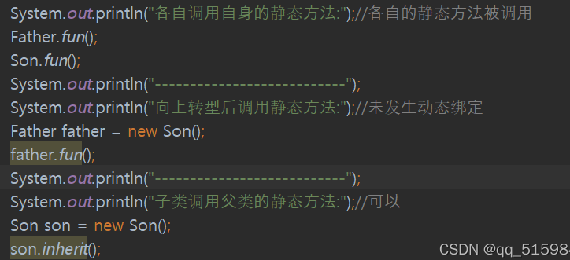
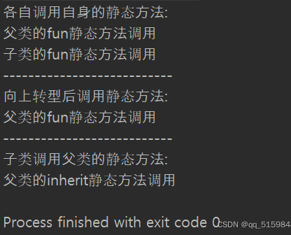
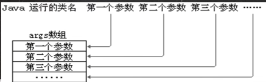
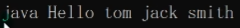
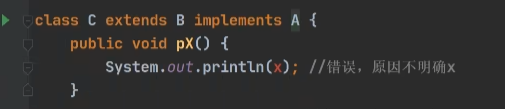
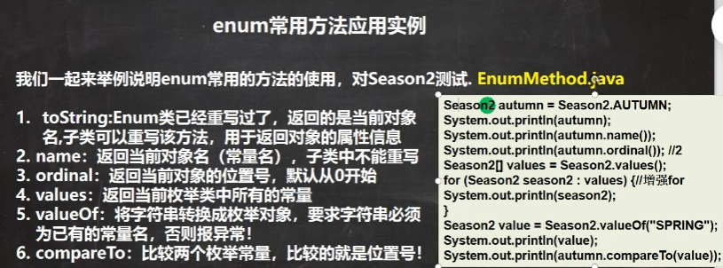
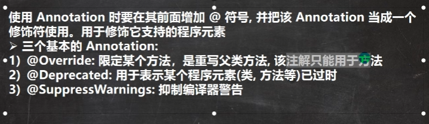

# java面向对象（高级）

## 类变量

类变量，即静态变量，使用前缀static。（无static为成员变量，普通变量）

```java
//Child为类，child1, child2为对象，其中Child类中有
static int count;

//在外调用时，可以child1.count调用，也可以使用Chlid.count调用，推荐类名.类变量名方式访问。
```

类变量:

1.静态变量被对象共享；
2.静态变量可能在堆里面，也可能在方法区里面。看jdk版本情况:jdk8 之前，类变量放在方法区里面；jdk 8 之后，类变量在堆里面；
3.static变量在类加载时候就生成了；

格式:

访问修饰符 static 数据类型 变量名;

当需要让所有对象共同使用一个变量时，可以使用类变量。

注：当方法 **使用 static 修饰**后，该方法就是一个静态方法。

## 类方法

类方法也叫静态方法，**静态方法只可以访问静态属性成员，不能访问非静态成员**；**非静态方法可以访问静态成员和非静态成员**：

类方法和普通方法都是随着类的加载而加载，将结构信息储存在方法区；

访问修饰符 static 数据返回类型 方法名(){}【推荐】

类方法调用：类名.类方法名      /       对象名.类方法名

当**方法不涉及任何和对象有关的成员**时，即可使用静态方法，提升开发效率，将其当作工具来使用

注：类方法中不允许放和对象相关的关键字，比如**this和super**。（访问自己的静态属性把this换成类名,感觉如果能使用this和super的前提是类成员全部初始化完毕，否则this和super就没的指了）

java类中子类无法重写父类的类方法，只能继承。

静态的方法和变量都是属于类的，该类的字节码文件被加载到内存就分配了相应的内存空间。那么，哪怕子类中有个和父类的类方法名一样的方法，也只是在子类空间中多加入了一个静态方法而没有实现覆盖父类的方法。
**类方法属于静态绑定，在类加载时便与该类捆绑，不受其他类影响，不会有动态绑定机制，不绑定实例对象**。而重写的功能是：重写后子类优先级优于父类，而静态成员和非静态属性是被隐藏的，隐藏条件下没有优先级，使用父类类名可以直接调用父类静态对象而不发生动态绑定如：

​	**父子类静态方法同名时，用哪个方法，调哪个类。父类有而子类没有，调用子类可以找到父类的静态方法。**重写后的子类方法优于父类，但是静态方法没法被重写，因此没有优先级，只有是否被隐藏。





## main方法

1.main方法由java虚拟机调用
2.虚拟机调用类的main()方法，所以该方法权限必须为public
3.虚拟机执行main()时不比创建对象，因此方法必须为static
4.该方法接受String类型的数组参数，该数组中保存执行java命令时传递给所有运行的类的参数；
5.java执行的程序，参数1， 参数2， 参数3





即将'tom', 'jack', 'smith' 

(1)在main()方法中，我们可以直接调用main方法所在类的静态方法和静态属性；
(2)但是main不能直接访问本类的非静态成员，必须创建该类的一个实例对象后才能通过对象.方法()的方式调用非静态成员。

## 代码块

代码块又称为**初始化块**，为类中的一员，类似方法，将逻辑语句封装在方法体中，通过{}包裹起来。

类似另一种形式的构造器，因此可以当作对构造器的补充机制。如果多个构造器中都有重复语句，可以将重复部分抽取到初始化块中，提高代重用性。**因为无论创建对象用哪个构造器，都会先调用代码块内容，代码块使用优先级高于构造器。**

代码块没有**方法名，没有返回值，没有参数，只有方法体**/而且代码块不能通过对象或类显式调用， 而是**加载类或者创建对象时**隐式调用。

基本语法

[修饰符]{

​	代码

};

注意：
1.修饰符可选，要写的话，只能写static

2.使用static修饰的为静态代码块，没有static的为普通代码块

3.用static修饰的代码块为静态代码块，**作用为对类进行初始化，使其随着类的加载而执行，并只执行一次**；**普通码块每创建一个对象就执行一次**

4.逻辑语句可以为任何逻辑语句（正常的输入、输出、方法调用、循环、判断等）

5.;可以写，也可以省略

**<u>代码块细节</u>**

类被加载的情况：

1.创建对象实例，使用new时
2.创建子类对象实例，父类也会被加载，先运行父类码块，再运行子类码块。(如果没创建对象只是调用类的成员，那么普通码块不会被用)
3.使用类静态成员，如静态属性，静态方法 

4.**创建一个对象时，一个类具体的调用顺序**：
	(1)调用静态代码块和静态属性，两者初始化优先级一样，如果有多个静态码块和静态变量，则按照其定义的顺序进行调用。
	(2)调用普通代码块和普通属性的初始化，这两者初始化优先级一样
	(3)调用构造方法

```java
private static int i = getN1();
private static int getN1(){
    return 100;//static必须修饰getN1否则报错
}
```

5.构造器前不只是包含super()，也包括了普通代码块。而静态代码块与静态属性的初始化，在类加载时就执行完毕了。

6.在有继承关系情况下，一个子类各部分调用顺序如下：
**父类静态代码和静态属性->子类静态代码和静态属性->父类普通代码块和普通属性->父类构造器->本类普通代码块和普通属性->本类构造器**

7.静态代码块只能直接调用静态成员（静态属性和静态方法），普通代码块可以调用任意成员。

## 单例设计模式

设计模式是静态方法和属性的经典使用；在大量实践中的总结和理论后的优选代码结构，编程风格，解决问题思考模式。

单例模式，即采取一定的方法保证在整个软件系统中，对某一个类只能存在一个对象实例，并且该类只提供一个取得其对象实例的方法。该模式分为**饿汉式**和**懒汉式**

### 饿汉式

(1)构造器私有化 ->防止直接new
(2)类的内部创建对象，加上static
(3)向外暴露一个静态的公共方法
(4)代码实现

```java
class GirlFriend{
    private String name;
    private static GirlFriend gf = new GirlFriend('hpx')
    private GirlFriend(String name){//只能类内创建对象
        this.name = name;
    }
    public static GirlFriend getInstance(){
        return gf;
    }
}
```

```java
GirlFriend instance = GirlFriend.getinstance();
GirlFriend instance2 = GirlFriend.getinstance();
```

饿汉式的变量极为重要，并存在就是用一次就不用造成资源浪费情况。

### 懒汉式

在饿汉式基础上改进，确保使用方法才会生成对象，将类加载时创建对象改为使用时创建对象，但是懒汉式会存在线程风险 ：


```java
class GirlFriend{
    private String name;
    private static GirlFriend gf;
    private GirlFriend(String name){//只能类内创建对象
        this.name = name;
    }
    public static GirlFriend getInstance(){
       if(gf == null){
           gf = new GirlFriend("hpx");
       }//使用该方法才会创建GirlFriend对象，再次创建时会返回上次创建的对象
        return gf;
    }
}
```

## final关键字

final可用于修饰类，属性，方法，局部变量,final修饰的必须有值

**目前final的可在定义/构造器/代码块中进行赋值**。
**而当final修饰的属性是静态属性，则初始化只能在定义和静态代码块中**

一下情况会使用final：
1.当不希望类被继承时，可以使用final修饰
2.当不希望父类某个方法被子类覆盖/重写时，使用final关键字，如
【访问修饰符 final 返回类型 关键字】
3.当不希望类的某个属性值被修改，可以用final修饰
4.当不希望某个局部变量被修改，也可以使用final修饰

细节：
1.如果一个类已经写成final类，则没必要将方法也修修饰为final
2.**final不能用于修饰构造器**
3.final 和 static往往搭配使用，其效率更高，用final  static修饰一个属性，调用该属性类不会被加载。
4.包装类和String都是final类，保证其不会被继承

## 抽象类

​	1.当父类的一些方法不能确定时，可以使用abstract关键字来修饰方法，该方法就是抽象方法，使用abstract来修饰该类为抽象类。
​	2.**当一个类中存在抽象方法时，该类就需要被声明为抽象类**。但是抽象类中可以非抽象方法，有构造器，有静态属性。所以抽象类本质还是类。
​	3.抽象类的价值更多的是在于设计，而设计者设计好后，**让子类继承并实现**。
​	4.抽象类知识点被问的较多，框架和设计模式使用较多
​	5.抽象方法不能有主体，即不能实现，不能在方法名后加{}.一旦加{}，方法就已经算被实现了。
​	6.如果一个类继承了抽象类，那他必须**实现抽象类的所有抽象方法**。除非它自己也变的抽象
​	7.抽象方法能使用**private，final和static**来修饰，因为在这些关键字修饰的情况下，子类没法重写父类方法

## 模版设计模式

如果多个类需要用到重复的代码，而需要在代码中间部分进行自定义，则选择创建一个抽象类，其代码如下：

```java
abstract class Template{
    public abstract void code();
    public void calculateTime(){
    long start = System.currentTimeMillis();//获取时间
    code();//抽象类没有实体但仍可以直接用
    long end = System.currentTimeMillis();
    System.out.println("耗时" + (end-start));
    }
}//选择抽象类是因为类的一些方法体不确定，而子类必须给他完善
```

​	如果code已经在Template子类中被重写，那么根据**动态绑定机制**，在运行已继承的父类Template的currentTimeMillis方法时，该方法中的code就会和子类的运行类型所绑定。

## 接口

接口在IDEA中为interface.接口就是给出一些**没有实现的方法**，封装到一起，到某个类要使用时候，根据具体情况将这些方法写出来。具体的接口体为：

```java
public interface name{
    int face = 1;//属性，为public static final修饰符
    public void start();//方法，接口中的抽象方法可以省略						//abstract。主要有抽象方法，默认实现方法，静态方法
    default public void ok{
         }
    
}
```

接口使用方法：

```java
class 类名 implements 接口{
    //本类属性
    //本类方法
    //必须要实现的接口的抽象方法
}
```

JDK7.0前，接口里所有方法都是抽象方法；
JDK8.0后可以放入静态方法，默认方法（使用default），接口中的方法有方法体。
如果一个类implements实现接口，则需要将该接口所有抽象方法都是实现。

​	由于不同人定义方法，属性名容易不规范，不用接口统一规范方法名容易出乱子。接口能够用于确保方法名规范统一化。

总结下接口要点细节：
1.接口不能被实例化，也没有构造方法和代码块（因为不会被实例化）
2.接口**所有方法默认是public方法**（protected 和 默认好歹子类或者同包类可以用一用然后增加一下适用范围），接口中抽象方法可以不用abstract修饰。接口中方法可以为抽象方法，默认方法default（仅在jdk8，使用default之后方法可以有方法体），静态方法和私有方法（供默认方法）。default可以被子类继承，如果继承的两个接口都有同名default方法，会出错。如果继承一个类继承一个接口，有同样的方法名（接口部分为default），类优于方法。
3.一个普通类实现接口，就必须将该接口的所有方法都实现。
4.用抽象类实现接口中的方法，哪怕没有把抽象方法都实现，也不会报错。因此**接口和抽象类很接近**
5.**一个类可以同时<u>实现</u>多个接口**

```java
class IA implement IB, IC{}//类和接口是实现的关系
```

6.接口中的属性**只会是final**，具体为public static final 修饰符，因为final的存在属性必须初始化。
7.由于接口的属性名都是固定的，因此属性是和类属性一样通过接口访问，**接口名.类名**。
8.**接口不能继承 extends 其他类，但是能extends<u>继承</u>其他多个接口**。
interface  ID  extends IB, IC（这是接口继承接口）

```java
class LittleMonkey extends Monkey implements Fishable, Birdable{}
```

其中Little Monkey和Monkey为类， Fishable,Birdable为接口。
9.和**类的修饰符**一样，接口修饰符只能为 默认 和 public

继承的价值在与解决代码的复用性和可维护性
接口则是用于增加设计好各种方法，让其他类去实现这些方法，即更加的灵活。

接口在一定程度上能实现代码解耦【即：接口规范性 + 动态绑定机制】

### 接口多态性

当形参或者对象名为接口类名时，可以传入已实现该接口的类名。某种程度上可认为接口均为父类。 



如果继承的类和实现的接口有相同属性名，方法也同名同型同形参，这就像同时继承两个类一样发生同名对冲。报错，ambigious。**访问接口的x就是用A.x，访问B父类接口使用super.x。**很好的解决方法。
同时可知implement来的方法等不在一个对象的父类区域中super指针指的范围内不包括。

## 内部类

内部类为一个类内部完整嵌套的另一个类接口。包含该类的类又称为外部类。**内部类可以访问私有属性**。其他四个类注意的东西为属性，方法，构造器，代码块。
分类情况：
定义在外部类局部位置上（比如方法内）
1.局部内部类
2.**匿名内部类**

定义在外部类的成员位置上：
1.成员内部类（不用static修饰）
2.静态内部类（用static修饰）

### 局部内部类

1.可以直接访问外部类所有成员
2.不能用访问修饰符修饰，因为局部内部类地位为一个局部变量，而局部变量不能使用修饰符，所以内部类也不能用修饰符。但是它和局部变量一样能用final。
3.作用范围为定义它的方法和代码块中。

```java
class Outer{
    public void m1(){
        class Inner{//Inner
            public void f1(){}
        }
    Inner inner = new Inner();//方法创建一个对象
    inner.f1();//调用类内方法与外部类方法
    }
```

外部类使用就需要先创建对象再进行调用。
在方法内部变量名和外部属性名一致时，默认调用更近的方法内部变量名。这时如果想用外部类的属性，使用外部类名.this.属性名  以实现访问。（类名.this返回对象，）

### xxxxxxxxxx         int[] arr = new int[]{10, 12, 45, 90};//排序加插入        int[] copyer = new int[arr.length + 1];        int theInsert = 3;        for(int i = 0; i < copyer.length; i++) {            if (i < copyer.length - 1) {                if (theInsert >= arr[i]) {                    copyer[i] = arr[i];                } else {                    copyer[i] = theInsert;                    theInsert = arr[i];//有比23大的就把23换下，然后不断更新                }            }else copyer[i] = theInsert;        }        arr = copyer;java

有三要点：是类，为内部类，无名字

基本语法

```java
方法名{
    new 类或接口(参数列表){}
}
```

如果想要一个类实现一个接口并实例化对象，但是这对象只会用一次。
这个时候可以使用 匿名内部类

基于接口的匿名内部类

```java
class Outer{
    IA  tiger = new IA(){//编译类型是接口类型IA ，运行类型则是实现接口IA的类，就是匿名内部类，类名无，并不是接口IA本身
        public void cry(){
        }
    }
}
interface IA{
    public void cry();
}


//可以通过输出tiger.getCalss()输出tiger的真正类名，为系统分配。
```

**匿名内部类使用一次就不能再使用了**，tiger可以一直用，但是new IA()以及之后的方法部分只能用一次。

基于类的匿名内部类

```java
Father father = new Father("jack");//这是方法中正常创建类的代码
Father father = new Father("jack"){
    //这里可以在匿名内部类中进行重写重载等操作，为类的内部操作
}//加了{}后，该对象的运行类型不是Father,而是成为一种匿名内部类
//注意{}.方法  是可行的，因为匿名内部类本身也返回对象
```

如果有一个接口，有一个方法想要使用实例化的接口，但是该方法只使用一次，那么有以下几种选择：

1.找个类实现一下接口，然后把这个类的对象传入方法
2.使用匿名内部类，在类的内部写方法体，然后把整个类当作形参。

```java
interface AA{
    public void cry();
}

public static void show(AA a){
    a.cry();
}

//main中
show(new AA(){
   public void cry(){
       System.out.prinntln("AA cry");
   } 
});//这个只能用一次，而先写个类再输入或者new 类名()输入方便多个，但是一改也会影响多个。
```

### 成员内部类

定义在外部类的成员位置，并且不能有static修饰。可以直接访问外部类的所有成员，包括私有的。 

```java
class Outer{
    private int n1 = 10;
    public String name = "张三";
    class Inner{//这里Inner可以用所有访问修饰符，因为这里Inner现在是成员，成员能用所有访问修饰符。
        public void say();
        System.out.println("balabala");
    }
    
    void t1(){
        new Inner().say;//外部类使用内部类需要将类实例化
    }
}
```

如果想在外获得成员内部类对象，使用的命令如下：

```java
Outer outerP = new Outer();
//方法一，直接创建一个
Outer.Inner inner = new outerP.Inner();//不能直接写new Inner(),编译会表示不知道什么东西，把外部类加上才能告诉电脑该类所在位置。此外，这里new后边是 对象名.内部类

//方法二，编写一个方法，该方法返回Inner对象
Outer.Inner innerInstance = outerP.getInner();//该方法返回Inner对象
```

### 静态成员内部类

静态内部类定义于外部类的成员位置，并且有static修饰。该类有以下特点：
1.可以直接访问外部类的所有静态成员，并且有static修饰，直接创建一个但是不能直接访问的非静态成员。
2.也可以添加任意访问修饰符
3.作用域：同其他成员一样，作用域为整个类体。

```java
//方式一：在访问权限满足的情况下，可以通过类名直接访问
Outer.Inner inner = new Outer.Inner();//这里new后面是类名.内部类。
//方法二：用方法返回静态内部类实例。非静态方法可以访问静态成员。
```

## **枚举类**

​	把具体的对象一个个列举，这些对象一个不能多，一个不能少。如四季，性别。这就是枚举

枚举方法：
1.自定义枚举
2.系统提供的枚举关键字

### 自定义枚举

```java
1.类的构造器私有化，不能创建新对象
2.去掉setxxx方法，只读
3.类内部直接创建对象
public class Season {
    private String name;
    private String feature;

    private Season(String name, String feature){
        this.name = name;
        this.feature = feature;
    }

    public String getName() {
        return name;
    }

    public String getFeature() {
        return feature;
    }

    static Season Spring = new Season("Spring","温暖");
    static Season Summer = new Season("Summer","炎热");
    static Season Autumn = new Season("Summer","凉爽");
    static Season Winter = new Season("Winter","寒冷");

    @Override
    public String toString() {
        return this.name + " " + this.feature;
    }
}
```

### 枚举关键字

```java
1.使用enum关键字替代class
2.使用Spirng("xxx","xxx")   //常量名加构造器参数列表
3.多个常量（对象），使用逗号
4.常量对象写在类最前面
    public enum enumSeason {//实例化类型无法枚举，该作用和构造器实例化
    SPRING ("Spring", "温暖"), SUMMER("Summer", "炎热"),Winter;//必须第一行,默认使用static，类名加对象就能用,在有无参构造器时，可以用Winter，()都不要了。

    final String name;//一定加final
    final String feature;
    enumSeason(String name, String feature) {
        this.name = name;
        this.feature = feature;
    }
    enumSeason(){
        
    }

    @Override
    public String toString() {
        return  name + ' ' +
                feature;
    }
}

//在其它地方使用方法
enumSeason.SPRING
```

虽然enumSeason不能实例化，但是可以生成编译类型变量：

```java
enumSeason en = SPRING;//en为enumSeason枚举类性
```

同时，除了类内部自定义变量，有enum固有的变量，如ordinal，返回该枚举常量次序（真正的常量需要把类成员变量加final，否则还是能改）

values，返回当前枚举类中的所有常量
valueOf：字符串转换为枚举对象，字符串必须对应常量名
compareTo：比较两个枚举常量位置号（enum本质为数组）



使用关键字enum时，本质为继承Enum类，

## 增强for循环

```java
for(int i = 0; i < nums.length; i++){
    System.out.println(nums[i]);
}
//下边是增强
for(int i : nums){
    System.out.println(i)
}


//具体的，如
 for(enumSeason en : enumSeason.values()){
           System.out.println(en);
       }
```

## 注解

注解Annotation也被称为元数据，用于解释包，类、方法、属性、构造器、局部变量等。

注解不会影响程序逻辑，但是可以被编译运行，相当于嵌入代码中的补充信息。



其中@Deprecated的作用为修饰某个对于版本而言过时的元素，要自己标注到类，方法，字段，属性上。

```java
//举例 ，作用范围取决于注解位置，如放在main里，就是抑制main里的警告//
@SuppressWarning({"rawtypes","unchecked","unused"})

all，抑制所有警告
boxing，抑制与封装/拆装作业相关的警告
cast，抑制与强制转型作业相关的警告
dep-ann，抑制与淘汰注释相关的警告
deprecation，抑制与淘汰的相关警告
fallthrough，抑制与switch陈述式中遗漏break相关的警告
finally，抑制与未传回finally区块相关的警告
hiding，抑制与隐藏变数的区域变数相关的警告
incomplete-switch，抑制与switch陈述式(enum case)中遗漏项目相关的警告
javadoc，抑制与javadoc相关的警告
nls，抑制与非nls字串文字相关的警告
null，抑制与空值分析相关的警告
rawtypes，抑制与使用raw类型相关的警告
resource，抑制与使用Closeable类型的资源相关的警告
restriction，抑制与使用不建议或禁止参照相关的警告
serial，抑制与可序列化的类别遗漏serialVersionUID栏位相关的警告
static-access，抑制与静态存取不正确相关的警告
static-method，抑制与可能宣告为static的方法相关的警告
super，抑制与置换方法相关但不含super呼叫的警告
synthetic-access，抑制与内部类别的存取未最佳化相关的警告
sync-override，抑制因为置换同步方法而遗漏同步化的警告
unchecked，抑制与未检查的作业相关的警告
unqualified-field-access，抑制与栏位存取不合格相关的警告
unused，抑制与未用的程式码及停用的程式码相关的警告
```

## 元注解

元注解是注解其他注解的注解。总共有四个，@Target，@Retention，@Documented，@Inherited。

### @Target

　@Target说明了Annotation所修饰的对象范围：Annotation可被用于 packages、types（类、接口、枚举、Annotation类型）、类型成员（方法、构造方法、成员变量、枚举值）、方法参数和本地变量（如循环变量、catch参数）。在Annotation类型的声明中使用了target可更加明晰其修饰的目标。


取值(ElementType)有：

　　　　1.CONSTRUCTOR:用于描述构造器
　　　　2.FIELD:用于描述域
　　　　3.LOCAL_VARIABLE:用于描述局部变量
　　　　4.METHOD:用于描述方法
　　　　5.PACKAGE:用于描述包
　　　　6.PARAMETER:用于描述参数
　　　　7.TYPE:用于描述类、接口(包括注解类型) 或enum声明

### @Rentention

@Retention定义了该Annotation被保留的时间长短：某些Annotation仅出现在源代码中，而被编译器丢弃；而另一些却被编译在class文件中；编译在class文件中的Annotation可能会被虚拟机忽略，而另一些在class被装载时将被读取（请注意并不影响class的执行，因为Annotation与class在使用上是被分离的）。使用这个meta-Annotation可以对 Annotation的“生命周期”限制。


**取值（RetentionPoicy）有：**

　　　　1.SOURCE:在源文件中有效（即源文件保留）
　　　　2.CLASS:在class文件中有效（即class保留）
　　　　3.RUNTIME:在运行时有效（即运行时保留）

### @Documented

***\*@\****Documented用于描述其它类型的annotation应该被作为被标注的程序成员的公共API，因此可以被例如javadoc此类的工具文档化。Documented是一个标记注解，没有成员。

### @Inherited

@Inherited 元注解是一个标记注解，@Inherited修饰的标注类型将具有继承性。如果一个使用了@Inherited修饰的annotation类型被用于一个class，则这个annotation将被用于该class的子类。

　　注意：@Inherited annotation类型是被标注过的class的子类所继承。类并不从它所实现的接口继承annotation，方法并不从它所重载的方法继承annotation。
