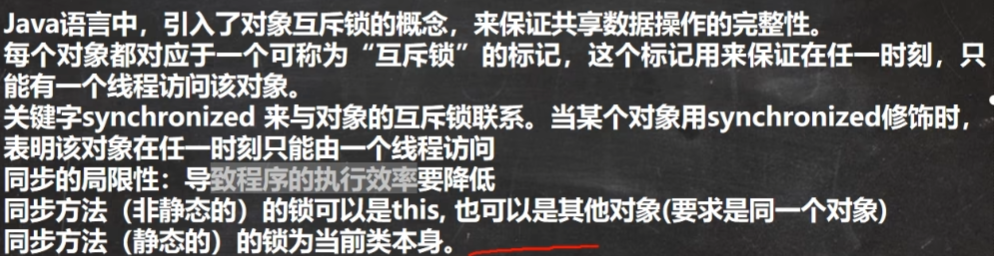

# 线程与IO流

## java绘图

需要画框，画板，画笔

```java
public class DrawCircle extends JFrame{//Frame，是一个画框
    private MyPanel mp = null;
    public static void main(String[] args) {
        new DrawCircle();
        System.out.println("退出程序");
    }

    public DrawCircle(){
        mp = new MyPanel();//初始化面板
        this.add(mp);//把画板放进画框里
        this.setSize(400, 300);//画框大小
        this.setDefaultCloseOperation(JFrame.EXIT_ON_CLOSE);//确定点击X后程序退出
        this.setVisible(true);//可见，当组件第一次在屏幕显示，程序会自动调用paint()；同时窗口最小再最大化/窗口大小发生变化/repaint函数被调用
    }

}
class MyPanel extends JPanel {//面板，在画板上画。Compponent类提供了两个和绘图相关的重要方法1.paint(Graphics g)绘制组建外观2.repaint()刷新组件外观
    @Override
    public void paint(Graphics g) {//Graphics代表画笔，提供很多方法
       super.paint(g);
        System.out.println("嘻嘻");//调用一次输出一次，被嘲讽了
        g.drawOval(10, 10, 100, 100);//画出一个圆形
    }
}
```

paint函数通过repaint可以实现while一样的操作。

Graphics类


其中，画图前两个是坐标点，后两个参数依据所画图形而定

```java
 Image image = Toolkit.getDefaultToolkit().getImage(Panel.class.getResource("/tt.png"));
        g.drawImage(image , 10, 10, 142, 190, this);//其中，tt.png要放在out下边的根目录
//设置字体
g.setFont(new Font("隶书", Font.BOLD, 50));
        g.drawString("北京你好", 100, 100);
```

## 事件处理机制

监听键盘事件需要对应的类 implement  KeyListener接口


相关代码具体如下：

```java
class  MyPanel0 extends JPanel implements KeyListener {//监听键盘发生的事件
   int x = 10;
   int y = 10;
    @Override
    public void paint(Graphics g) {
        super.paint(g);
        g.fillOval(x,y, 20,20);
    }
    //监听是否有字符输入
    @Override
    public void keyTyped(KeyEvent e) {

    }
    //当某个键按下，该方法触发
    @Override
    public void keyPressed(KeyEvent e) {
//        System.out.println((char)e.getKeyCode() + "被按下");
        if(e.getKeyCode() == KeyEvent.VK_DOWN){
            y = y + 10;
        } else if (e.getKeyCode() == KeyEvent.VK_RIGHT) {
            x = x + 10;
        }else if (e.getKeyCode() == KeyEvent.VK_LEFT){
            x = x - 10;
        } else if (e.getKeyCode() == KeyEvent.VK_UP) {
            y = y - 10;
        }
        this.repaint();
    }


    //当键松开，该方法触发
    @Override
    public void keyReleased(KeyEvent e) {

    }//该接口总共三个待实现方法，都得写上去
}
```


## 线程（基础）


线程由进程创建的，是进程的一个实体。线程也可以创建线程。一个进程可以拥有多个线程。


查看自己电脑的cpu数量

```java
public class CpuNum {
    public static void main(String[] args) {
        Runtime runtime = Runtime.getRuntime();
        //获取当前cpu个数
        int cpunum = runtime.availableProcessors();
        System.out.println(cpunum);
    }
}
```

### 线程常用方法


这里的优先级范围为1-10，正常优先级为5.

### thread类

用一段代码粗略体现下thread的用法。

```java
public class Thread01 {
    public static void main(String[] args) {
        Cat cat = new Cat();
        cat.start();//可以开始线程 ，因为cat继承了thread类
    }
}
//1.当一个类继承了Thread类，该类可以当作线程使用
//2.重写run方法
//3.run Thread类 实现了 Runnable 接口的运行方法。
class Cat extends Thread {
    int times;
    @Override
    public void run() {
        while (true) {
            System.out.println("miao" + (times++)+ Thread.currentThread().getName());//获得线程名称为Thread0，当main线程启动一个子线程，主线程不出现阻塞。
            try {//快捷键ctrl + alt + t
                Thread.sleep(1000);
            } catch (InterruptedException e) {
                throw new RuntimeException(e);
            }
            if(times == 8){
                break;//times到80，退出while循环
            }
        }

    }
}

//输出
miao1Thread-0
miao2Thread-0
miao3Thread-0
miao4Thread-0
miao5Thread-0
miao6Thread-0
miao7Thread-0
miao8Thread-0

进程已结束,退出代码0
//注意，如果不用cat.start()，直接使用cat.run()，会导致执行run完毕才会向下执行。之后才会执行输出“主线程xxx”。即串行化。
```

实际中是start内部的start0开启多线程，调用run程序，并不是run开启线程。


主线程结束了，不代表应用程序结束，子线程在进行，程序就在进行。


### Runnable接口

下方为单个子线程代码

```java
public class Thread02 {
    public static void main(String[] args) {
        Dog dog = new Dog();
        Thread thread = new Thread(dog);//接口没有start，嘻嘻。dog后可以加一个字符串表示对该线程的命名
        thread.start();//低层设计模式为代理模式（静态代理），调用start进行run，run 代理类中target指向的一个变量。那个变量就是dog
    }
}
class Animal{}
class Dog extends Animal implements Runnable{
    int count = 0;

    @Override
    public void run() {
        while (true){//线程不自带循环，要一直跑，就要一直循环
            System.out.println("hihi" + (++count) + Thread.currentThread().getName());

            try {
                Thread.sleep(1000);
            } catch (InterruptedException e) {
                throw new RuntimeException(e);
            }
        }
    }
}
```

下边为main里面启动两个子线程

```java
public class Thread03 {
    public static void main(String[] args) {
        T1 t1 = new T1();
        T2 t2 = new T2();
        Thread thread1 = new Thread(t1);
        Thread thread2 = new Thread(t2);
        thread1.start();//Thread-0
        thread2.start();//Thread-1
    }
}

class T1 implements Runnable{
    int count = 0;

    @Override
    public void run() {
        do {
            try {
                Thread.sleep(1000);
                System.out.println("hello world" + (++count) + Thread.currentThread().getName());
            } catch (InterruptedException e) {
                throw new RuntimeException(e);
            }
            if(count == 100) break;
        } while (true);
    }
}

class T2 implements Runnable{
    int count = 0;

    @Override
    public void run() {
        do {
            try {
                Thread.sleep(1000);
                System.out.println("hi" + (++count) + Thread.currentThread().getName());
            } catch (InterruptedException e) {
                throw new RuntimeException(e);
            }
            if(count == 40) break;
        } while (true);
    }
}
```

双线程的情况大致如图所示


### 多线程

多个窗口售票代码：

```java
public class SellTicket {
    public static void main(String[] args) {
       ST01 st01 = new ST01();
        ST01 st02 = new ST01();
       ST01 st03 = new ST01();

        st01.start();//Runnable同理，多个Thread开多个start
        st02.start();
        st03.start();
    }
}

class ST01 extends Thread {
    private static int ticketNum = 100;

    @Override
    public void run() {
        super.run();
        while (true) {
            if (ticketNum <= 0) {
                System.out.println("售票结束");
                break;
            }
            try {
                Thread.sleep(5);
            } catch (InterruptedException e) {
                throw new RuntimeException(e);
            }

           System.out.println("窗口" + Thread.currentThread().getName() + "售出一张票" + "剩余票数=" + (--ticketNum));
        }
    }
}
```

当开启多个线程，共同处理一个静态变量，如多个窗口买票，容易出现超卖现象


同时也有如下情况：

```java
class ThreadUnsafe {
	ArrayList<String> list = new ArrayList<>();
	public void method1(int loopNumber) {
		for (int i = 0; i < loopNumber; i++) {
			// { 临界区, 会产生竞态条件
			method2();
			method3();
			// } 临界区
		}
	}
	private void method2() {
		list.add("1");
	}
	private void method3() {
		list.remove(0);
	}
}
```

如果用同一对象生成多个线程，每个线程如果操作对象的某一成员属性，则会出现错误：

```java
static final int THREAD_NUMBER = 2;
static final int LOOP_NUMBER = 200;
public static void main(String[] args) {
	ThreadUnsafe test = new ThreadUnsafe();
	for (int i = 0; i < THREAD_NUMBER; i++) {
		new Thread(() -> {
			test.method1(LOOP_NUMBER);
		}, "Thread" + i).start();
	}
}//会出现remove时list内为空情况
```


因此需要有方法避免这种绝对不能出现的情况

### 线程终止

在主线程中控制变量从而终止子线程的循环：

```java
public class ThreadExit {
    public static void main(String[] args) {

        T t1 = new T();
        t1.start();
        try {
            Thread.sleep(5 * 1000);
        } catch (InterruptedException e) {
            throw new RuntimeException(e);
        }//主线程退出不代表子线程退出
        t1.setLoop(false);//控制子线程的情况
    }
}

class T extends Thread{
    private int count = 0;
    private boolean loop = true;
    @Override
    public void run() {
        super.run();

        while (loop) {
            try {
                Thread.sleep(50);
            } catch (InterruptedException e) {
                e.printStackTrace();
            }
            System.out.println("T 运行中..." + (++count));
        }

    }
    public void setLoop(boolean loop) {
        this.loop = loop;
    }
}
```

### 线程中断

```java
public class ThreadMethod {
    public static void main(String[] args) throws InterruptedException {
        T t = new T();
        t.setName("老毕等");
        t.setPriority(Thread.MIN_PRIORITY);//最低优先级

        t.start();
//下边为主线程
        for(int i = 0; i < 5; i++){
            Thread.sleep(1000);
            System.out.println("hi" + i);
        }
        t.interrupt();//这里t线程进入中断
    }
}

class T extends Thread{

    @Override
    public void run() {
        super.run();
        while(true){
            for(int i = 0; i < 100; i++){               System.out.println(Thread.currentThread().getName() + "解决事件1" + i);
            }
            try {               System.out.println(Thread.currentThread().getName() + "休眠中");
 Thread.sleep(20000);
            } catch (InterruptedException e) {            System.out.println(Thread.currentThread().getName() + "被 interrupt了");
                break;
            }
        }
/////////////////////////////////以下为输出
........
老毕等解决事件196
老毕等解决事件197
老毕等解决事件198
老毕等解决事件199
老毕等休眠中
hi0
hi1
hi2
hi3
hi4
老毕等被 interrupt了

进程已结束,退出代码0
```

### 线程插队

线程插队常用方法


以下为插队事例，插入为对应线程.join，礼让为Thread.yield()。

```java
public class ThreadMethod02 {
    public static void main(String[] args) throws InterruptedException {
        T2 t2 = new T2();
        t2.start();
        for(int i = 1 ;i <= 20; i++ ){
            Thread.sleep(1000);
            System.out.println("主线程---" + i);
            if(i == 5){
                System.out.println("主线程 让 子线程 先走");
                //t2.join();//相当于让t2执行完毕。t2.join(1500)表示插入的毫秒数
                Thread.yield();//该方法不一定成功
                System.out.println("主线程现在接着走");
            }
        }

    }
}
///////////////////////////////////接下来就是结果
.......
主线程---4
子线程---4
主线程---5
子线程---5
主线程 让 子线程 先走
主线程现在接着走
子线程---6
```

以及先主线程再启动子线程并插入，这次不会显示结果

```java
public class ThreadMethodExercise {
    public static void main(String[] args) throws InterruptedException {
        T3 t3 = new T3();
        Thread thread = new Thread(t3);
        for(int i = 1; i <= 10; i++){
            Thread.sleep(1000);
            System.out.println("hello---主线程");
            if(i == 5){
                System.out.println("主线退出");
                thread.start();//启动子线程
                thread.join();//立即插入主线阻止主线进行
                System.out.println("主线回归");
            }
        }
    }
}
```

### 守护线程


即线程守护不是让线程不受打断，而是让线程不一直占用内存

```java
ublic class ThreadMethod03 {
    public static void main(String[] args) throws InterruptedException {
        MyDaemonThread mdt = new MyDaemonThread();
        mdt.setDaemon(true);
        mdt.start();
        for(int i = 1; i <= 10; i++){
            Thread.sleep(500);
            System.out.println("wrwrwrwwwrwrw");
        }
    }
}
class MyDaemonThread extends Thread{
    @Override
    public void run() {
        super.run();
        for(; ;){
            try {
                Thread.sleep(500);
            } catch (InterruptedException e) {
                throw new RuntimeException(e);
            }
            System.out.println("hihihihihihi");
        }

    }
}
```

### 线程生命周期

​	线程的状态主要有如下


这是五种状态下的情况，网上也有七种状态的说法：


下边代码可以显示如何查看线程

```java
public class ThreadState {
    public static void main(String[] args) throws InterruptedException {
        T t = new T();
        t.start();
        while(Thread.State.TERMINATED != t.getState()){
            System.out.println(t.getName() + " " +  t.getState());
            Thread.sleep(500);
        }
    }
}
class T extends Thread{
    @Override
    public void run() {
        super.run();

        while(true){
            for(int i = 0; i < 20; i++ ){
                System.out.println("hi" + i);
                try {
                    Thread.sleep(1000);
                } catch (InterruptedException e) {
                    throw new RuntimeException(e);
                }
            }
            break;
        }
    }
}
```

### 线程同步机制


线程同步机制，能够避免注入之前多线程卖票超卖情况，保护数据完整性。

具体的同步方法


```java
public class SellTicket {
    public static void main(String[] args) {
        new Thread(new ST03()).start();
        new Thread(new ST03()).start();
        new Thread(new ST03()).start();//三个不同线程

    }
}
class ST03 implements Runnable{
    private static int  ticketNum = 100;
    private synchronized void m(){
        if (ticketNum <= 0) {
        return;
    }
        try {
            Thread.sleep(5);
        } catch (InterruptedException e) {
            throw new RuntimeException(e);
        }
        System.out.println("窗口" + Thread.currentThread().getName() + "售出一张票" + "剩余票数=" + (--ticketNum));
       }
    @Override
    public  void run() {//用线程同步定义函数避免超卖
       while(true){//在while外加同步，可能会因为while本身问题导致无法/如果while(true)改成for(;;)，
           //还可能导致无法实现线程同步，因此死循环外加线程，慎用
            m();
            if (ticketNum <= 0) {
                System.out.println("售票结束");
                break;
            }
            //同一时刻只有一个执行m方法
    }
}
}
```

同步原理的锁在对象上，当一个对象抢到锁，他就能够进行操作，完成后返回锁，之后这一群对象会再抢一次。也就是说，哪怕之前抢过的，返回锁还能再抢一次。毕竟synchronized是非公平锁。

### 互斥锁



所以线程同步的锁，加在方法或者代码块上，这个时候锁在this对象上。

```java
   private synchronized static void m(){}//这个时候锁在m方法所在的类上
	private static void m(){
        synchronized (ST03.class){//不能加载类上
            System.out.println("m2");
        }
    }
```


一般更多的选择同步代码块。同时，因为锁是在类或者this上，所以需要对象同一个。不能三个类开三个线程，三个线程不同的锁。

### 线程死锁

A线程占用B锁资源，B占用A锁资源，导致互不相让。编程应该避免死锁现象。


其输出为：进入1   进入3。

### 释放锁

以下为释放锁的操作


以下为不能释放锁的操作


## 图片加载

java中载入图片需要先保证图片处于确定路径，如项目根目录（out文件夹下的项目同名文件）

```java
 image1 = Toolkit.getDefaultToolkit().getImage(Panel.class.getResource("/bomb1.png"));//初始化图片对象，使用getImage方法，该方法中的Panel是用于于画板显示的方法。

g.drawImage(image1, bomb.x, bomb.y, width, height, false);//显示对象。但由于图片初始化不代表图片就能立即显示，因此会在真正显示图片之前，要么画一次图，要么载入图片。

MediaTracker t = new MediaTracker(this);
t.addImage(image1, 0);//后边是id
try {
    t.waitForAll();
} catch (InterruptedException e) {
    throw new RuntimeException(e);
}
```

## IO流

IO流包含文件相关概念，IO流原理与分类，节点流和处理流，输入输出流和 Properties类

### 文件

文件在程序中是以流的形式操作的。在java中文件包括，常规文件与文件夹。


流：数据于数据源与程序之间经历的路径
输入流：数据从数据源到程序的路径
输出流：数据从程序到数据源的路径


 创建文件的命令如下，均为创造txt文件。本质为File构造器使用路径直接创建和使用父目录+子目录创建。


### 获取文件信息


```java
	@Test
    public void info(){
        File file = new File("e:\\news1.txt");
        System.out.println("文件绝对路径=" + file.getAbsolutePath());
        System.out.println("文件父级目录=" + file.getParent());
        System.out.println("文件字节数=" + file.length());
        System.out.println("文件是否存在=" + file.exists());
        System.out.println("是否是一个文件=" + file.isFile());
        System.out.println("是否是一个文件=" + file.isDirectory());
    }
////////////////////////////////////////////////////////
文件绝对路径=e:\news1.txt
文件父级目录=e:\
文件字节数=9
文件是否存在=true
是否是一个文件=true
是否是一个文件=false
```

### 目录操作


```java
 @Test
    public void m1(){
        String directoryPath = "d:\\demo\\a\\b";//需要mkdirs，而不是mkdir，能生成多级目录
        File file = new File(directoryPath);
        if(file.exists()){
            System.out.println(directoryPath + "存在");
        }else {
           if(file.mkdirs()){
               System.out.println(directoryPath + "创建成功");
           }else {
               System.out.println(directoryPath + "创建失败");
           }
        }
    }
```

### IO流原理及流的分类


JAVA 的IO流体系图如下:


### 节点流

#### InputStream：字节输入流


```java
 @Test
    public void readFile02(){
        String filePath = "e:\\hello.txt";
        int readData = 0;
        int readLine = 0;
        byte[] buf = new byte[8];//一次读取8个
        FileInputStream fileInputStream = null;
        try {
            fileInputStream =  new FileInputStream(filePath);
            while((readLine = fileInputStream.read(buf)) != -1){//不断读入字符，如果读取正常会返回实际读取的字节数,如果读取完毕，会返回-1
                System.out.println(new String(buf, 0, readLine));//一边读一边输出，readLine不会超过8个
            }
        } catch (FileNotFoundException e) {
            throw new RuntimeException(e);
        } catch (IOException e) {
            throw new RuntimeException(e);
        } finally {
            //关闭文件流，释放资源
             try {
                if(fileInputStream != null)fileInputStream.close();
            } catch (IOException e) {
                throw new RuntimeException(e);
            }
        }
    }
```

#### OutputStream：字节输出流


```java
  @Test
    public  void writeFile(){
        String filePath = "e:\\a.txt";
        FileOutputStream fileOutputStream = null;
        try {
            fileOutputStream = new FileOutputStream(filePath,true);//加上true代表内容append到文件末尾
            String str = "hello!world";
            fileOutputStream.write(str.getBytes(), 0, 6);//读写都是bit进行输入输出，后边用len
        } catch (IOException e) {
            throw new RuntimeException(e);
        }finally{
             if(fileOutputStream != null) {
                try {
                    fileOutputStream.close();
                } catch (IOException e) {
                    throw new RuntimeException(e);
                }
            }
        }
    }
```

#### FileReader：字符输入流


字节和字符是不同层次的概念，字符包含一/二个字节并且其固定为char类型，同时这也代表字符输入输出流是没办法传输非char/string类型数据的。

```java
  String  filePath = "e:\\story.txt";
        FileReader fileReader = null;
        try {
            fileReader = new FileReader(filePath);
            char[] ch = new char[100];
            int readLine = 0;
            while((readLine = fileReader.read(ch, 0, 8)) != -1) {
                System.out.print(new String(ch, 0, readLine));
            }
        } catch (IOException e) {
            throw new RuntimeException(e);
        }finally{...}
```

#### FileWriter：字符输出流


最后一句话的意思是，FileWriter使用后在close或者flush之前，要写的内容都在内存里。不刷新或者关闭文件，内存的内容还不会到文件里。

```java
String filePath = "e:\\note.txt";
        FileWriter fileWriter = null;
        String input = "窝嫩蝶";
        try {
            fileWriter = new FileWriter(filePath);//覆盖模式，但是每次输入为一个close到下一个close之间的内容，write不算覆盖
            fileWriter.write("你好，hpx~");
            fileWriter.write(input);//nh，hpx~wnd

        } catch (IOException e) {
            throw new RuntimeException(e);
        }finally {
            try {
                fileWriter.flush();//里面有个writeBytes
            } catch (IOException e) {
                throw new RuntimeException(e);
            }finally{...}
        }
```

### 处理流/包装流


节点流和处理流使用的方法是不同的


#### 字符流缓冲流

BufferedReader 和 BufferedWriter 有属性Reader，能够封装一个节点流（即Reader子类，同理于InputStream，OutputStream）


```java
//读 txt内容
String filePath = "e:\\story.txt";
        BufferedReader bufferedReader = new BufferedReader(new FileReader(filePath));
        String line = null;
       while((line = bufferedReader.readLine()) != null) {
           System.out.println(line);
       }
       bufferedReader.close();//关闭外层即可，低层关闭字符流/节点流对象

//写内容
         BufferedReader bufferedReader = null;
        BufferedWriter bufferedWriter = null;

        try {
            bufferedReader = new BufferedReader(new FileReader("e:\\story.txt"));
            bufferedWriter = new BufferedWriter(new FileWriter("e:\\ok.txt"));
            String readLine = null;
            while ((readLine = bufferedReader.readLine()) != null) {//readLine返回null
                bufferedWriter.write(readLine);
                bufferedWriter.newLine();//readLine绝对没有回车
            }
        } catch (IOException e) {
            throw new RuntimeException(e);
        } finally {

            try {
                if(bufferedReader != null) bufferedReader.close();//这里是为避免IO流对象没有生成就关闭的情况
                if(bufferedWriter != null) bufferedWriter.close();
            }catch(IOException e){
                    throw new RuntimeException(e);
                }
            }
```

#### 字节流缓冲流

和字节流相近，以下是字节流处理流的copy程序：

```java
 String inputPath = "d:\\qiku.png";
        String outputPath = "e:\\guji.png";

        BufferedInputStream inputStream = null;//
        BufferedOutputStream outputStream = null;

        try {
            inputStream = new BufferedInputStream(new FileInputStream(inputPath));
            outputStream = new BufferedOutputS tream(new FileOutputStream(outputPath));
            byte[] bytes = new byte[1024];
            int readLine = 0;

            while((readLine = inputStream.read(bytes, 0, 1024)) != -1){
                outputStream.write(bytes, 0, readLine);
            }
        } catch (IOException e) {
            throw new RuntimeException(e);
        } finally {

            try {
                if(inputStream != null) inputStream.close();
                if(outputStream != null) outputStream.close();
            } catch (IOException e) {
                throw new RuntimeException(e);
            }
        }
```

在输入时常用的System.in 和System.out本质也是输入输出流的对象


#### 对象流

对象流本质就是存储对象的流


```java
//对象流输出
      String filePath = "e:\\data.dat";
        ObjectOutputStream oos = null;
        try {
            oos = new ObjectOutputStream(new FileOutputStream(filePath));
            oos.writeInt(100);//Integer 实现了两个必要的类
            oos.writeBoolean(true);
            oos.writeDouble(100.113);
            oos.writeUTF("韩盼星");
            oos.writeObject(new Dog("f**k", 1145));//如果没重写toStirng，另一边能读取对象地址，重写toString没重新运行生成新的dat会报错？运行后不加dog也能获得toString 格式数据
        } catch (IOException e) {
            throw new RuntimeException(e);
        } finally {
            try {
                if(oos != null) oos.close();
            } catch (IOException e) {
                throw new RuntimeException(e);
            }
        }

//对象流输入
 String filePath = "e:\\data.dat";
        ObjectInputStream ois = null;

        try {
            ois = new ObjectInputStream(new FileInputStream(filePath));
            System.out.println(ois.readInt());
            System.out.println(ois.readBoolean());
            System.out.println(ois.readDouble());
            System.out.println(ois.readUTF());
            Object dog= ois.readObject();
            System.out.println("类的类型为" + dog.getClass());
            System.out.println(dog);
        } catch (IOException e) {
            throw new RuntimeException(e);
        } catch (ClassNotFoundException e) {
            throw new RuntimeException(e);
        }
```

注意事项


其中（3）号细节是指：一个类发生了修改，程序在序列化时会认为该类是一个全新的类，而一个类加入版本号修改，程序会认为该类只是发生了修改，还是原来的类。就像下边这样


（5）号细节指，序列化对象中一些对象属性也必须是能够序列化的，如果内部的对象成员不能序列化，那么就会报错。解决办法为内部对象成员对应类继承序列化抽象类。

#### 转换流

正常txt文件的编码格式为utf-8格式，如果改为gbk，则会因为格式不同造成乱码现象。使用转换流的某个read方法能够转字节流为字符流，并且是按照指定的编码。


转换输入流的使用方法：

```java
 String filePath = "e:\\gbk.txt";
        InputStreamReader inputStreamReader = null;
        //转换流一般不直接用，主要用作转换
        try {//转换流管编码的事
            inputStreamReader = new InputStreamReader(new FileInputStream(filePath), "gbk");
             //输出靠字符缓冲流
            BufferedReader br = new BufferedReader(inputStreamReader);
            String s = br.readLine();
            System.out.println(s);
            br.close();
        } catch (IOException e) {
            throw new RuntimeException(e);
        }
```

#### 打印流


System.out本质为输出流对象，那么有

```java
PrintStream out = System.out;

        try {
            out.write("hpxhlj".getBytes());//打印到输出框
            System.setOut(new PrintStream("e:\\test1.txt"));
            out = System.out;
            out.write("hpxhlj".getBytes());//打印到输出框
        } catch (IOException e) {
            throw new RuntimeException(e);
        }
        out.close();
//最后会打印出一个  hpxhlj，然后在e盘txt下再输出一次
```

### Property

Properity文件长这样


有些东西是需要写在配置文件上的，方便程序读取并调用。Properties能再不改程序情况下更改程序的部分数据，因此在MySQL中用的会多点。


以下为Properties的常见用法，该类用load载入对应流及路径。


关于其使用方法，以下为代码：

首先是读代码，load的输入可以为Reader

```java
 Properties properties = new Properties();
        properties.load(new FileReader("src\\mysql.properties"));
        properties.list(System.out);
        String user = properties.getProperty("user");
        String pwd = properties.getProperty("pwd");
        System.out.println("用户名" + user);
        System.out.println("密码是" + pwd);
```

其次是写properties文件，写功能代码

```java
//properties低层为HashTable
        //创建或者修改配置文件
        Properties properties = new Properties();
        //properties.load(new FileReader("src\\mysql.properties"));
        properties.setProperty("charset", "utf-8");
        properties.setProperty("user", "汤姆");//保存中文unicode编码
        properties.setProperty("pwd", "asdfg");
        properties.setProperty("user", "韩盼星");//有键存在，那就修改键对应的值
        properties.store(new FileWriter("src\\ms.properties"), "这是一句注释commments");
        System.out.println("save file successful");
```

