# 网络编程与反射

## 网络通信与网络

该部分概念理解就行

网络通信的概念示例如图

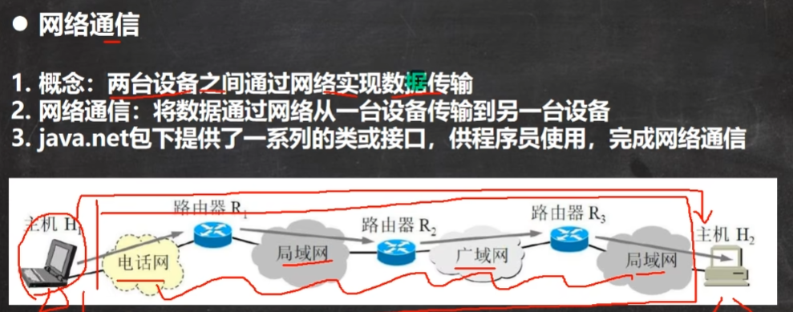

网络概念如下图所示

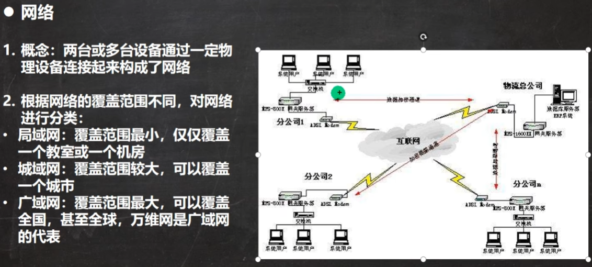

## ip地址

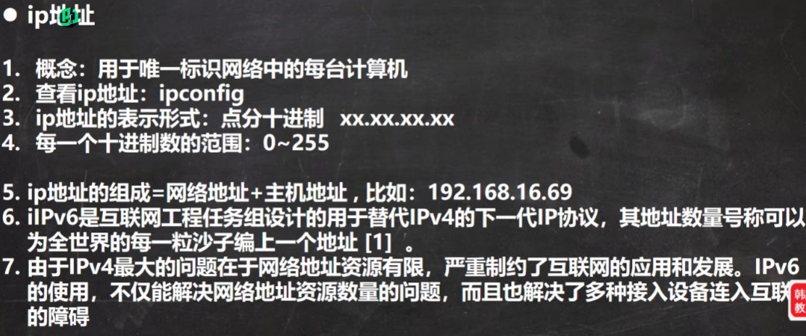

其中IPv4使用4个字节表示IP地址，而IPv6使用16个字节表示地址

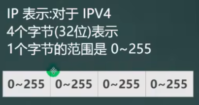

即使是IPv4，也被分为多个类别，供主机号使用的位数随着A,B,C等级而减少，对应的能分配的主机也减少。

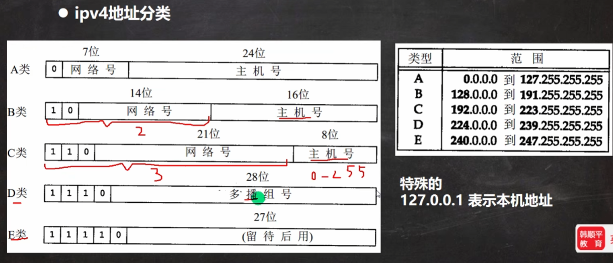

## 域名与端口号

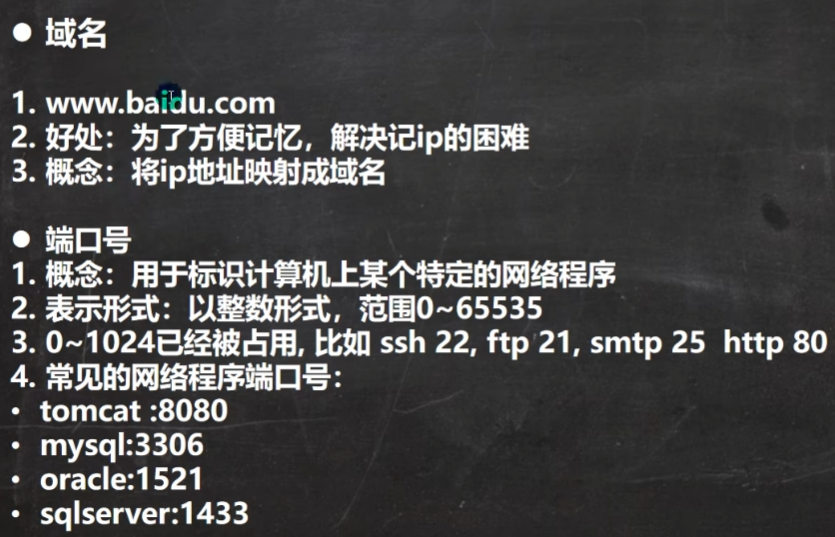

其中，pc与网站服务器的联系情况可以描述为：

**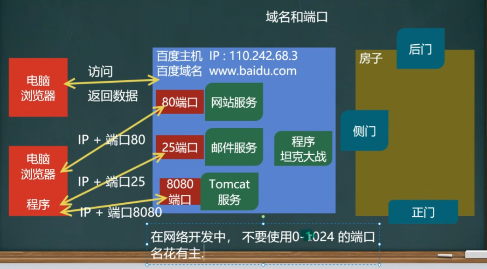**

## 网络通信协议

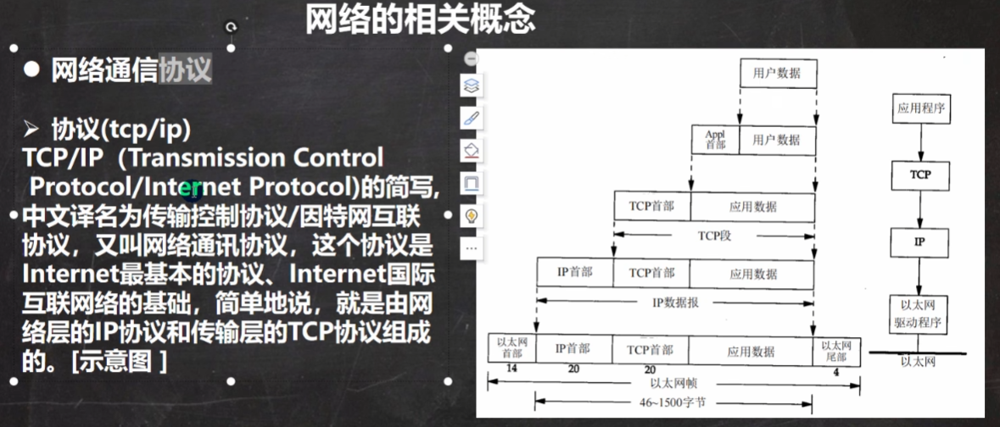

网络协议本质为数据流通需要借助的组织方式，如打包之类？

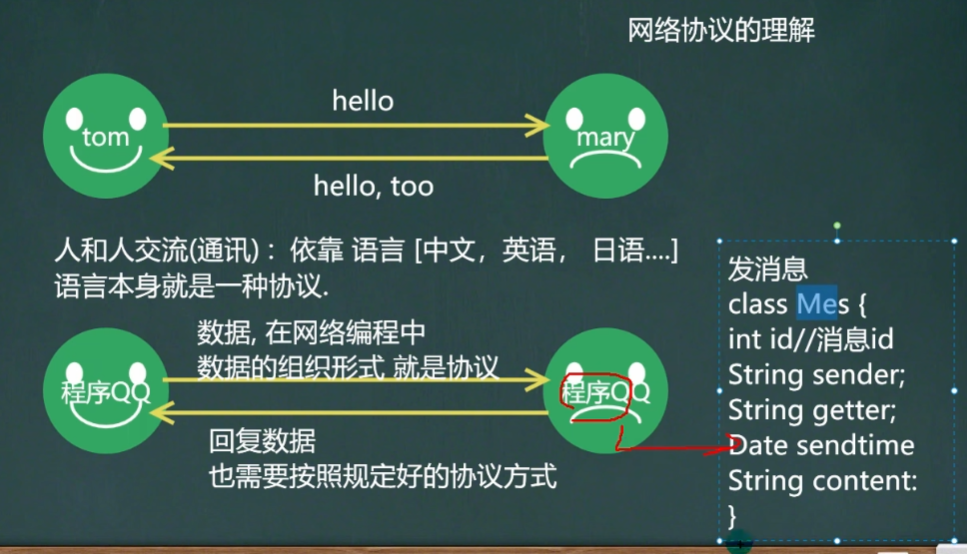

顺便补充下协议相关概念

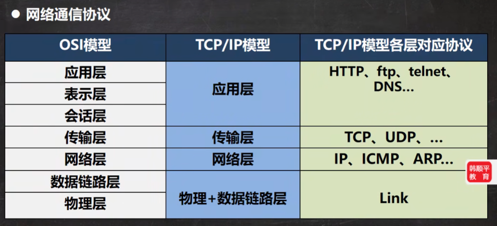

### TCP和UDP

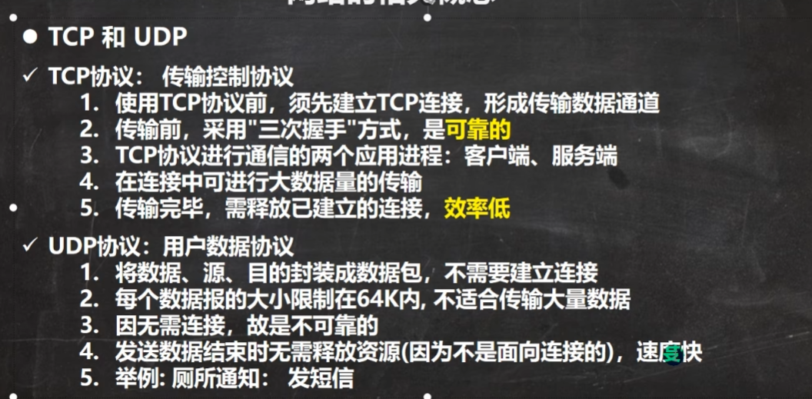

TCP是控制协议，因为其需要建立TCP链接并三次握手，在握手后还需要释放连接。TCP和UDP可以看作是通话通信和短信通信，

## InteAddress类

主要用于获取主机名与域名，以下为InteAddress类的具体使用方法

```java
//1.获取本机InetAddress对象
        InetAddress localHost = InetAddress.getLocalHost();
        System.out.println(localHost);

        //2.根据指定主机名 获取InteAddress
       InetAddress host1 = InetAddress.getByName("LAPTOP-882HDEK6");
        System.out.println(host1);

        //3.根据域名返回InteAddress对象
        InetAddress gets = InetAddress.getByName("www.baidu.com");
        System.out.println(gets);

        //4.通过InetAddress对象，获取对应地址
        String hostAddress = gets.getHostAddress();
        System.out.println(hostAddress);

        //5.通过InetAddress对象，获取对应主机名或者域名
        String hostName = host1.getHostName();
        System.out.println(hostName);
```

## Socket

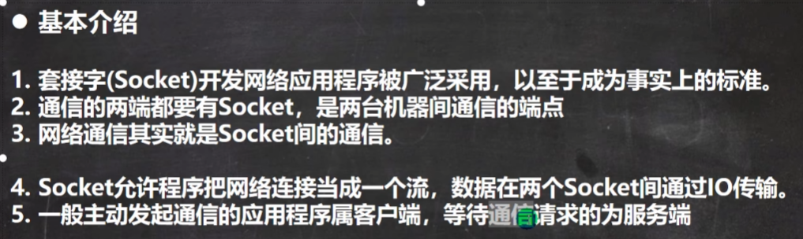

对于Socket的理解大体情况如下：

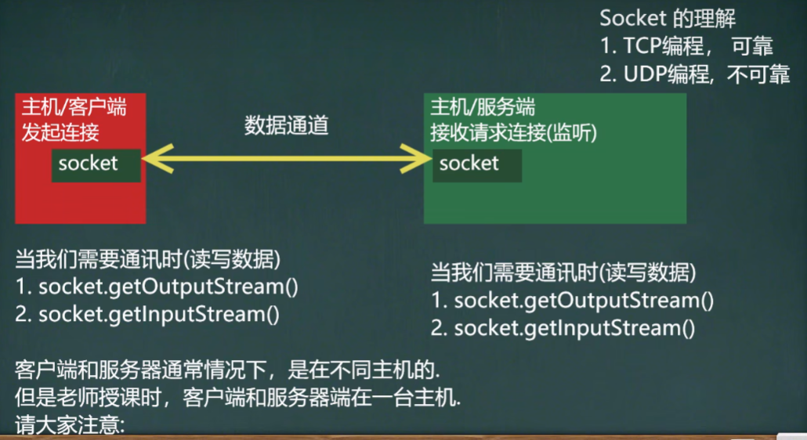

### TCP编程

#### 字符流传输

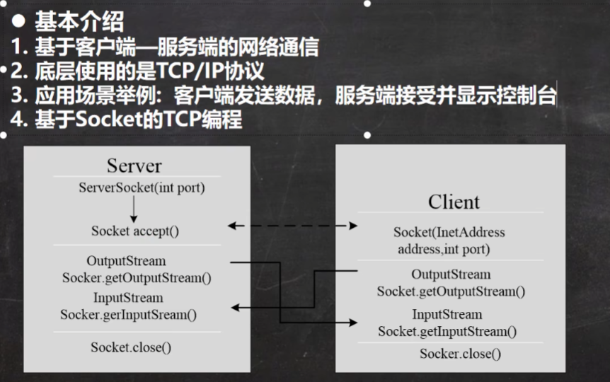

例子，服务器客户端双向传送数据：

服务端

```java
		ServerSocket serverSocket = new ServerSocket(9999);
        System.out.println("服务器正在监听......");
        Socket socket = serverSocket.accept();//只接受这一个流就行了，否则多次调用accept返回结果不同，他是不同的Socket对象
        InputStream inputStream = socket.getInputStream();
        byte[] buf = new byte[1024];
        int readLine = 0;
        while((readLine = inputStream.read(buf)) != -1){
            System.out.println(new String(buf, 0, readLine));
        }
        OutputStream outputStream = socket.getOutputStream();
        outputStream.write("hello Client".getBytes());
        socket.shutdownOutput();//结束标记
        outputStream.close();
        inputStream.close();
        serverSocket.close();
        System.out.println("服务器端退出");
////////////////////////////////////////////////先运行
服务器正在监听......
hello Server
服务器端退出
```

客户端

```java
    Socket socket = new Socket(InetAddress.getLocalHost(), 9999);
        OutputStream outputStream = socket.getOutputStream();
        outputStream.write("hello Server".getBytes());
        socket.shutdownOutput();//结束标记，否则服务端会一直读，一直等

        System.out.println("client正在监听");
        InputStream inputStream = socket.getInputStream();
        byte[] buf = new byte[1024];
        int readLine = 0;
        while((readLine = inputStream.read(buf)) != -1){
            System.out.println(new String(buf, 0, readLine));
        }

        inputStream.close();
        outputStream.close();
        socket.close();
        System.out.println("客户端退出......");
////////////////////////////////////////////////后运行
client正在监听
hello Client
客户端退出......
```

在使用ServerSocket创建服务端和用Socket创建客户端后，通过客户端的socket相关方法以输出流方式于9999端口进行输出。当服务端监听到输出后就会通过输入流获取数据并显示。

#### 字节流传输

使用的是缓冲流，涉及到字符流到字节流的转换，输出停止也不靠shutdown，靠换行和刷新

客户端

```java
  ServerSocket serverSocket = new ServerSocket(9999);
        System.out.println("服务器正在监听......");
        Socket socket = serverSocket.accept();//只接受这一个流就行了，否则多次调用accept返回结果不同，他是不同的Socket对象
        BufferedReader bufferedReader = new BufferedReader(new InputStreamReader(socket.getInputStream()));
        String readLine = null;
        readLine = bufferedReader.readLine();
        System.out.println(readLine);

        BufferedWriter bufferedWriter = new BufferedWriter(new OutputStreamWriter(socket.getOutputStream()));
        bufferedWriter.write("hello Client");
        bufferedWriter.newLine();//起新行才会发送出去
        bufferedWriter.flush();//这两个都要
//或者去掉newLine一行，然后在flush后加上socket.inputshutdown()也行 

        bufferedWriter.close();
        bufferedReader.close();
        serverSocket.close();
        System.out.println("服务器端退出");
```

服务端

```java
Socket socket = new Socket(InetAddress.getLocalHost(), 9999);
        BufferedWriter bufferedWriter = new BufferedWriter(new OutputStreamWriter(socket.getOutputStream()));
        bufferedWriter.write("hello Server");
        bufferedWriter.newLine();//没有这一行无法发送出去，起新的一行才能发出去
        bufferedWriter.flush();//这两行都要

        System.out.println("client正在监听");
        BufferedReader bufferedReader = new BufferedReader(new InputStreamReader(socket.getInputStream()));
        String readLine = null;
        readLine = bufferedReader.readLine();

        bufferedWriter.close();
        bufferedReader.close();
        socket.close();
        System.out.println("客户端退出......");
```

#### netstat指令

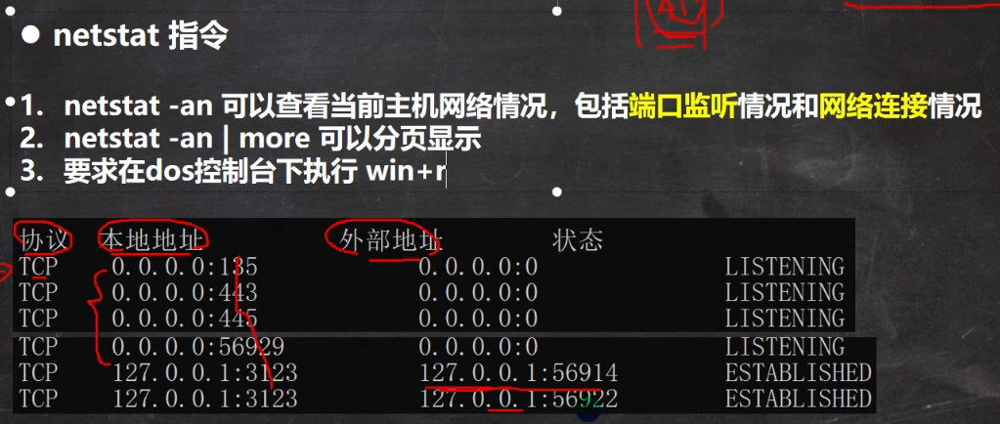

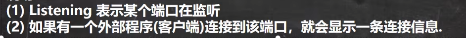

### UDP编程

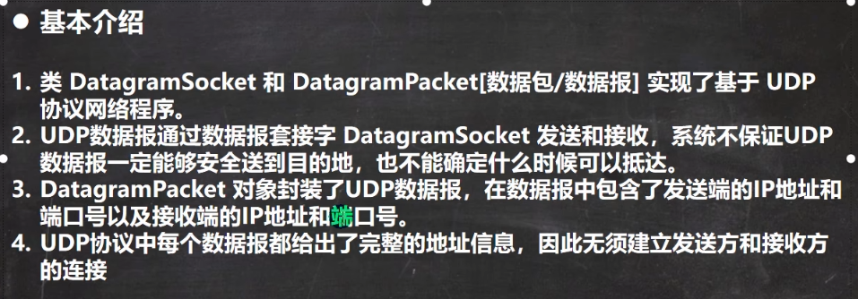

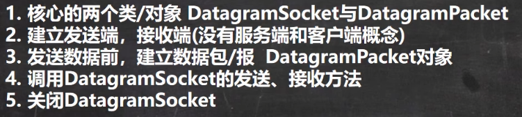

UDP没有服务端和客户端而是使用接收端和发送端。

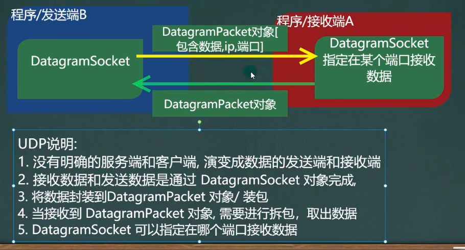

#### 接收端

```java
  //创建一个Socket对象，于9999接收数据
        DatagramSocket socket = new DatagramSocket(9999);

        //构建一个DatagramPacket对象，准备接收数据
        byte[] buf = new byte[1024];
        DatagramPacket packet = new DatagramPacket(buf, buf.length);

        System.out.println("接收端A 等待接收数据......");
        socket.receive(packet);

        //对packet内容进行拆包
        int length = packet.getLength();//实际接受到的长度
        byte[] data = packet.getData();
        String s = new String(data, 0, length);
        System.out.println(s);

        socket.close();
        System.out.println("A端退出");
```

#### 发送端

```java
 DatagramSocket socket = new DatagramSocket(9998);//如果没有数据包到9998端口，系统就一直阻塞等待
        byte[] data = "hello 明天见".getBytes();//将数据打包成Packet对象，packet有data ， data长度，data.length， 主机(IP), 端口，端口与socket自身端口无关
        DatagramPacket packet = new DatagramPacket(data, data.length, InetAddress.getByName("192.168.1.102"), 9999);

        socket.send(packet);

        socket.close();
        System.out.println("B端退出");
```

## 反射

反射由于在接受配置文件时根据文件要求创建相关类，把获取的字符串转成类。配置文件Properity见IO部分的最后一节。

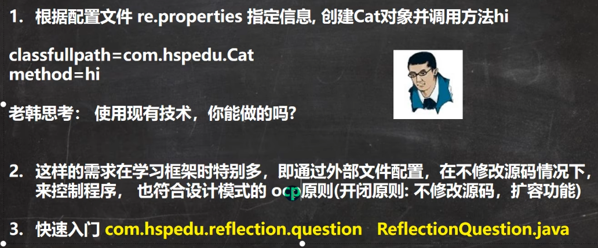

反射能通过配置文件决定调用的对象与方法，涉及到的Class对象很重要。

```java
String filePath = "src\\re.properties";
        Properties properties = new Properties();
        properties.load(new FileInputStream(filePath));
        String classfullpath = properties.getProperty("classfullpath");
        String method = properties.getProperty("method");

        //使用反射机制
        //(1)加载类，返回Class类型对象cls
        Class cls = Class.forName(classfullpath);
        //(2)通过cls 得到加载的类对应的对象实例
        Object o = cls.newInstance();
        //(3)通过cls得到加载的类 的 method "hi"对应的对象
        Method method1 = cls.getMethod(method);
        //（4）通过method调用方法：通过方法对象实现调用方法
        method1.invoke(o);
```

### 机制原理

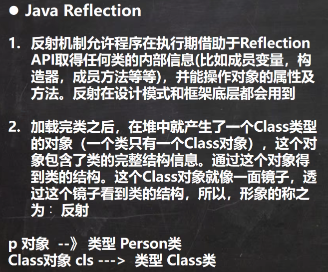

​        反射涉及到的class类对象是处于类加载阶段用到的重要对象，拿到了class类对象，也就能够创建对象、调用方法，操作属性。

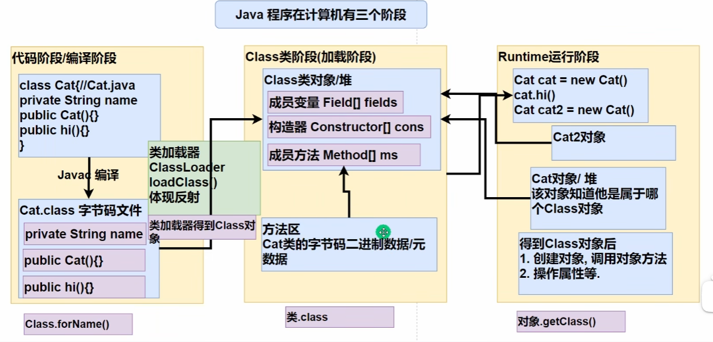

​	该过程涉及到的重要的类分别为：Class类，其对象表示某个类加载阶段在堆中的对象；Method类，代表类的方法；Field，代表类的成员变量；Constructor，代表类的构造方法。

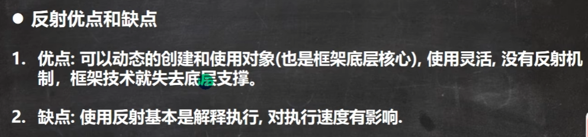

在多次通过反射调用方法时，可以将方法类对象中的访问检查关闭掉。

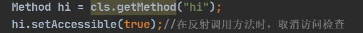

### Class类

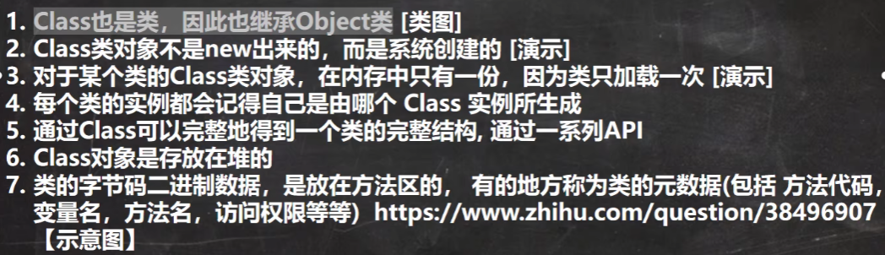

如果该类已经以任何方法加载一次，那么在使用反射时就不会进入loadClass()，使用的Class类对象为同一个。

```java
		Class cls01 = Class.forName("reflection.Cat");
        Class cls02 = Class.forName("reflection.Cat");
        Class cls03 = Class.forName("reflection.Dog");
        System.out.println(cls01.hashCode());
        System.out.println(cls02.hashCode());
        System.out.println(cls03.hashCode());
```

#### 反射涉及方法

+获得Class类对象的多种方法。

```java
//1.在已知类名与路径情况下，通过Class静态类forName方法获取。多用于配置文件，读取类全路径，加载类
Class cls1 = Class.forName("reflection.Car");

//2.已知具体类，直接使用class获取，该方法最可靠。多用于参数传递，如通过反射得到对应构造器对象。
Class cls2 = Cat.class;

//3.一直某个类实例对象，用getClass()获取对应的类对象
Class cls3 = car.getClass();

//4.其他方法
ClassLoader cls4 = car.getClass.getClassLoader();
Class cls5 = cls.loadClass("类的全类名");

//5.基本数据(int,char,boolean,float,double,byte,long,short)按如下方式得到Class类对象
Class<Integer> integerClass = int.class;
Class<Character> characterClass = char.class;
Class<Boolean> booleanClass = boolean.class;

//6.通过基本数据类型对应的包装类所拥有的.TYPE方法获得Class类对象
Class<Integer> type1 = Integer.TYPE;
Class<Character> type2 = Character.TYPE;
```

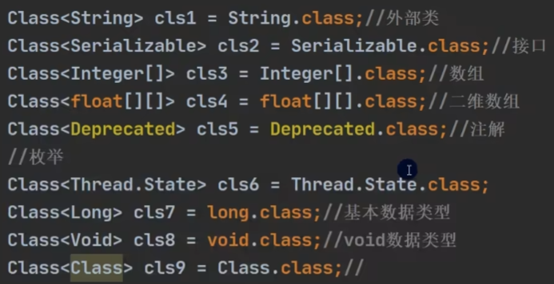

根据类对象获取对象结构的方法：

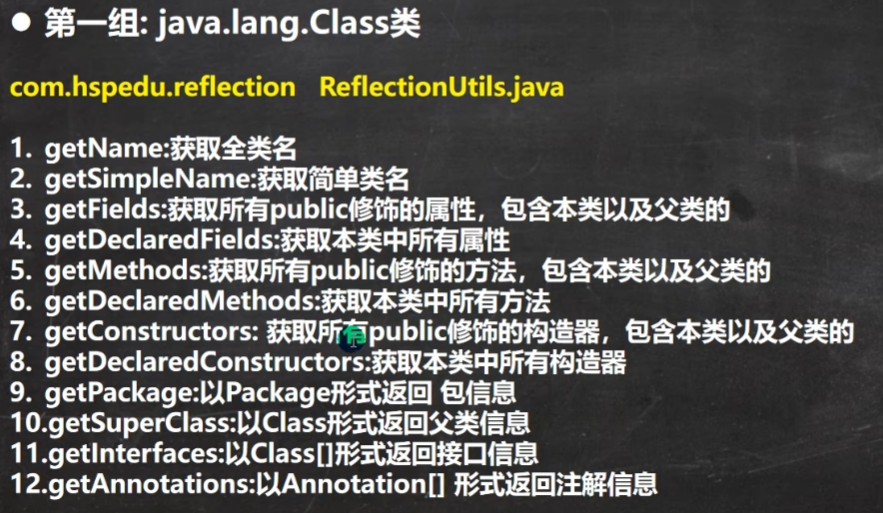

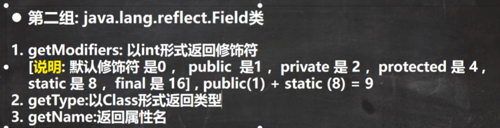

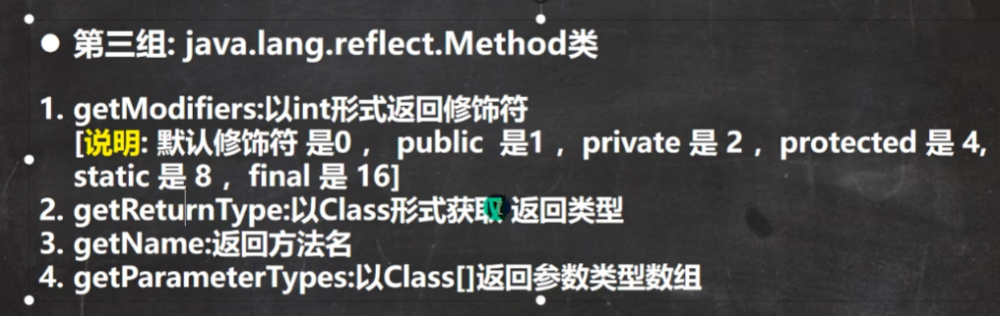

#### 反射创建对象（爆破）

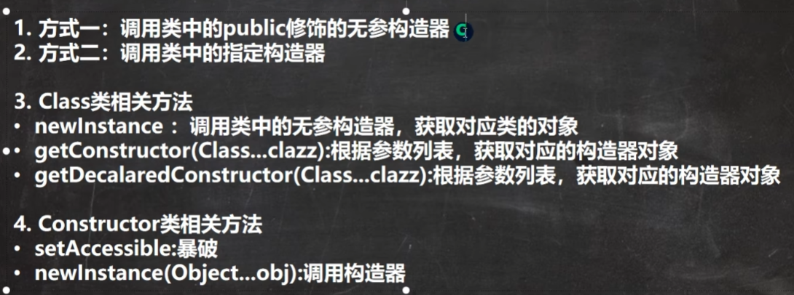

```java
Class cls = Class.forName("reflection.User");
Constructor constructor1 = cls.getDeclaredConstructor(String.class, int.class);
constructor1.setAccessible(true);//让constructor1能够执行爆破，使用私有构造器生成实例
User user2 = (User) constructor1.newInstance("ldx", 15);
System.out.println(user2);
```

#### 反射访问属性

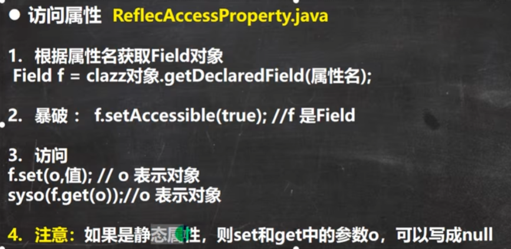

```java
  Class cls = Class.forName("reflection.Student");

        Object o = cls.newInstance();
        Field age = cls.getField("age");//age是pubic
        age.set(o, 86);
        System.out.println(o);
        Field name = cls.getDeclaredField("name");
        name.setAccessible(true);//能爆破
        name.set(o, "hlj");
        name.set(null, "hlj!");//因为name为静态的，所以o可以写成空
        System.out.println(o);
```

下为用例中使用的类：

```java
class Student{//类
    public int age = 10;
    private static String name = "hpx";
    public Student(){//构造器
    }
    @Override
    public String toString() {
        return "Student{" +
                "age=" + age +
                "name=" + name +
                '}';
    }
}
```

#### 反射使用方法

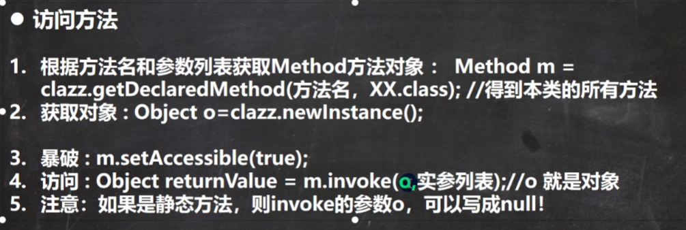

```java
 Class cls = Class.forName("reflection.Boss");
        Constructor constructor = cls.getConstructor(int.class, String.class);//构造器应该都会有Constructor
        Object o = constructor.newInstance(12, "hlj");
        Method hi = cls.getDeclaredMethod("hi", String.class);

        hi.invoke(o, "hpx");

        Method say = cls.getDeclaredMethod("say", int.class, String.class, char.class);//无论是否静态，都能返回
        say.setAccessible(true);
        System.out.println(say.invoke(o, 12, "hlj!" ,'A'));
```

下边是所用的Boss类

```java
class Boss{
    public int age;
    private static String name;

    public Boss(int age, String nm) {
        this.age = age;
        name = nm;
    }

    private static String say(int n , String s, char c){
        return n + " " + s + " " + c;
    }

    public void hi(String s){
        System.out.println("hi" + s);
        System.out.println(name);
    }
}
```

#### 反射使用总结

使用反射必须用到Class类对象，获取到对象后，创建对象，尤其是有参，使用构造器并导入参数类型对应类对象；创建属性对象，用类对象获取，并获取属性所在类对象，随后get、set；创建方法对象，用类对象获取同时传入参数类型类对象，获取属性所在类对象，随后invoke。总之所有情况都要先从类对象中抽出来，再结合所在类对象进行设置（静态可以不结合所在类对象）。

### 类加载

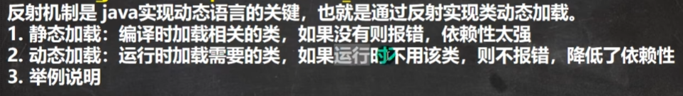

如过用对象类创建对象实例，那么为静态加载，如果没有提前定义该对象类，即使代码不会走到创建实例的那一步，编译仍会报错；用反射则不会，只要程序不跑到反射那一步就不会报错。

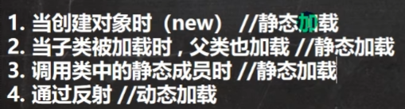

具体过程为

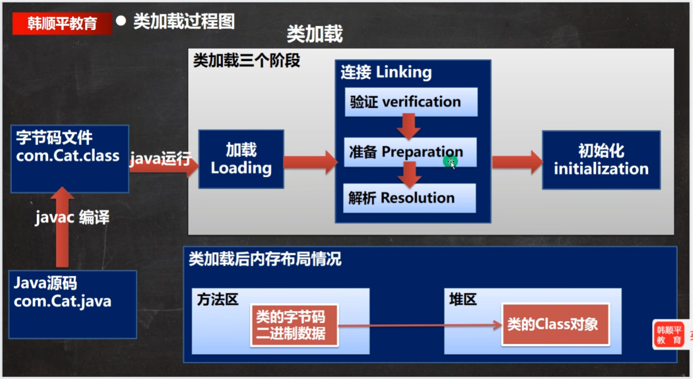

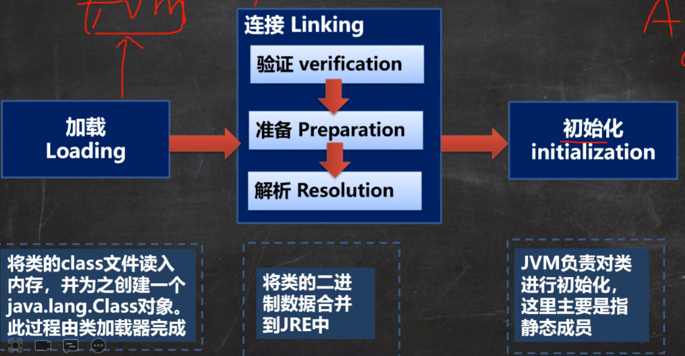

（1）加载阶段

​	JVM在该阶段的主要目的是将字节码从不同的数据源（可能是class文件、也可能是jar包、甚至网络）转化为二进制字节流加载到内存中，并生成一个代表该类的java.lang.Class对象。

（2）连接阶段

​	验证：确保Class字节流中包含的信息符合当前虚拟机的要求，包括：文件格式验证、元数据验证、字节码验证和符号引用验证。该处可以使用-Xverify:none参数关闭大部分的类验证措施，缩短虚拟机类加载的时间。

​	准备：JVM会在该阶段对静态变量分配内存并默认初始化(对应数据类型赋默认值)。这些变量所使用的内存都将在方法区进行分配。

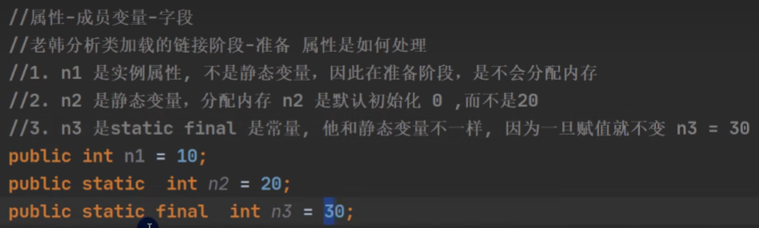

​	解析：虚拟机将常量池内的符号引用替换为直接引用的过程。

（3）初始化阶段

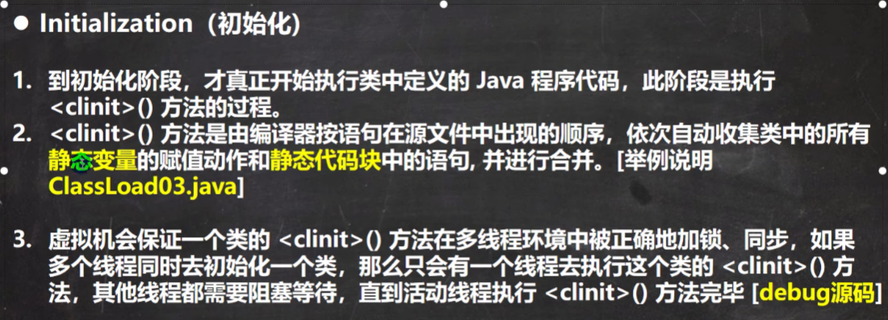

```java
class B{
    static {
        System.out.println("B 静态代码块被执行");
        num = 300;
    }
    static int num = 100;
}
//下边在main里面执行
System.out.println(B.num);
```

该过程即为：1.加载B类，生成B的class对象；2.链接 num = 0；3.初始化阶段： 依次自动收集类中的所有静态变量的复制动作和静态代码块中的语句

```java
clinit(){
    System.out.println("B 静态代码块被执行");
        num = 300;
        num = 100;
}//最终合并结果为num = 100
```

